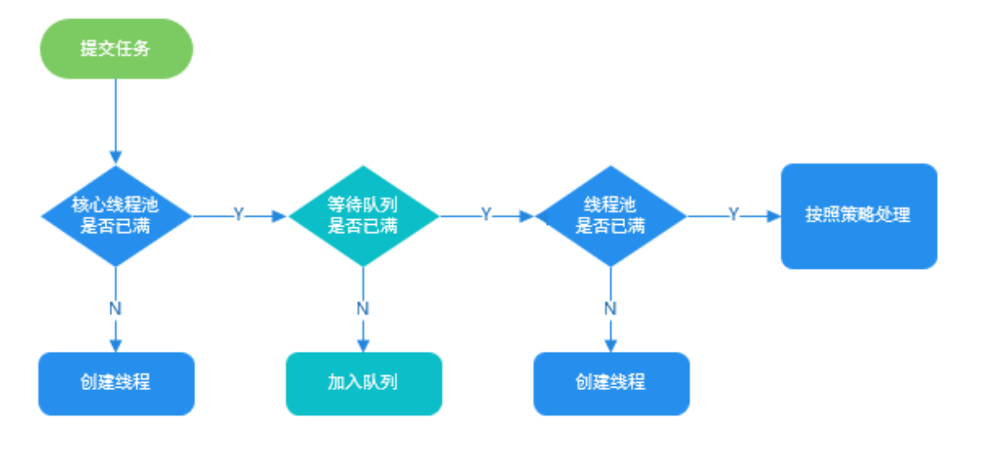

# 1. 悲观锁，乐观锁，synchronized，volatile，CAS
- 悲观锁（Pessimistic Lock）： 
    - 每次获取数据的时候，都会担心数据被修改，所以每次获取数据的时候都会进行加锁，确保在自己使用的过程中数据不会被别人修改，使用完成后进行数据解锁。由于数据进行加锁，期间对该数据进行读写的其他线程都会进行等待。
   
    - 悲观锁比较适合写入操作比较频繁的场景，如果出现大量的读取操作，每次读取的时候都会进行加锁，这样会增加大量的锁的开销，降低了系统的吞吐量。

- 乐观锁（Optimistic Lock）： 
    - 每次获取数据的时候，都不会担心数据被修改，所以每次获取数据的时候都不会进行加锁，但是在更新数据的时候需要判断该数据是否被别人修改过。如果数据被其他线程修改，则不进行数据更新，如果数据没有被其他线程修改，则进行数据更新。由于数据没有进行加锁，期间该数据可以被其他线程进行读写操作。
    
    - 比较适合读取操作比较频繁的场景，如果出现大量的写入操作，数据发生冲突的可能性就会增大，为了保证数据的一致性，应用层需要不断的重新获取数据，这样会增加大量的查询操作，降低了系统的吞吐量。

- CAS
    - 所谓的CAS，一种乐观锁，即compareAndSwap，执行CAS操作的时候，将内存位置的值与预期原值比较，如果相匹配，那么处理器会自动将该位置值更新为新值，否则，处理器不做任何操作。  
            举个例子，内存值V、期望值A、更新值B，当V == A的时候将V更新为B。
    - CAS是原子操作
    - CAS是CPU的一个指令（需要JNI调用Native方法，才能调用CPU的指令）
    - CAS是非阻塞的、轻量级的乐观锁

- Synchronized
    - https://www.jianshu.com/p/d53bf830fa09  
    https://gitee.com/SnailClimb/JavaGuide/blob/master/docs/java/Multithread/synchronized.md
    - 
    
    - synchronized关键字最主要的三种使⽤⽅式
        - 修饰实例⽅法: 作⽤于当前对象实例加锁，进⼊同步代码前要获得当前对象实例的锁
            ```java
            public class SynchronizedDemo2 {
                public synchronized void method() {
                    System.out.println("synchronized ⽅法");
                }
            }
            ```
        - 修饰静态⽅法: 也就是给当前类加锁，会作⽤于类的所有对象实例，因为静态成员不属于任何⼀
        个实例对象，是类成员（static 表明这是该类的⼀个静态资源，不管new了多少个对象，只有
        ⼀份）。所以如果⼀个线程A调⽤⼀个实例对象的⾮静态 synchronized ⽅法，⽽线程B需要调⽤
        这个实例对象所属类的静态 synchronized ⽅法，是允许的，不会发⽣互斥现象， 因为访问静态
        synchronized ⽅法占⽤的锁是当前类的锁，⽽访问⾮静态 synchronized ⽅法占⽤的锁是当前
        实例对象锁。
        
        - 修饰代码块: 指定加锁对象，对给定对象加锁，进⼊同步代码库前要获得给定对象的锁。
            ```java 
            public class SynchronizedDemo {
                public void method() {
                    synchronized (this) {
                        System.out.println("synchronized 代码块");
                    }
                }
            }
            ```
    - synchronized底层实现：synchronized 关键字底层原理属于 JVM 层⾯
        
        - synchronized 同步语句块的情况  
        synchronized 同步语句块的实现使⽤的是 monitorenter 和 monitorexit 指令，其中 monitorenter
        指令指向同步代码块的开始位置， monitorexit 指令则指明同步代码块的结束位置。 当执⾏
        monitorenter 指令时，线程试图获取锁也就是获取 monitor(monitor对象存在于每个Java对象的对象
        头中， synchronized 锁便是通过这种⽅式获取锁的，也是为什么Java中任意对象可以作为锁的原因)
        的持有权。当计数器为0则可以成功获取，获取后将锁计数器设为1也就是加1。相应的在执⾏
        monitorexit 指令后，将锁计数器设为0，表明锁被释放。如果获取对象锁失败，那当前线程就要阻塞
        等待，直到锁被另外⼀个线程释放为⽌。
        
        - synchronized 修饰⽅法的的情况  
        同步方法通过加 ACC_SYNCHRONIZED 标识实现线程的执行权的控制
        
        - synchronized JDK1.6后的优化  
        Java 早期版本中，synchronized 属于重量级锁，效率低下，因为监视器锁（monitor）是依赖于底层的操作系统的 Mutex Lock 来实现的，Java 的线程是映射到操作系统的原生线程之上的。如果要挂起或者唤醒一个线程，都需要操作系统帮忙完成，而操作系统实现线程之间的切换时需要从用户态转换到内核态，这个状态之间的转换需要相对比较长的时间，时间成本相对较高，这也是为什么早期的 synchronized 效率低的原因。庆幸的是在 Java 6 之后 Java 官方对从 JVM 层面对synchronized 较大优化，所以现在的 synchronized 锁效率也优化得很不错了。JDK1.6对锁的实现引入了大量的优化，如自旋锁、适应性自旋锁、锁消除、锁粗化、偏向锁、轻量级锁等技术来减少锁操作的开销。
        
        - synchronized优化后的锁  
        
            - 
            
            - 锁主要存在四中状态，依次是：无锁状态、偏向锁状态、轻量级锁状态、重量级锁状态，他们会随着竞争的激烈而逐渐升级。注意锁可以升级不可降级，这种策略是为了提高获得锁和释放锁的效率。
            
            - 偏向锁：偏向锁的“偏”就是偏心的偏，它的意思是会偏向于第一个获得它的线程，如果在接下来的执行中，该锁没有被其他线程获取，那么持有偏向锁的线程就不需要进行同步！但是对于锁竞争比较激烈的场合，偏向锁就失效了需要注意的是，偏向锁失败后，并不会立即膨胀为重量级锁，而是先升级为轻量级锁。
            
            - 当一个线程访问同步块并获取锁时，会在对象头和栈帧中的锁记录里存储锁偏向的线程ID，以后该线程在进入和退出同步块时不需要进行CAS操作来加锁和解锁，只需简单地测试一下对象头的Mark Word里是否存储着指向当前线程的偏向锁。如果测试成功，表示线程已经获得了锁。如果测试失败，则需要再测试一下Mark Word中偏向锁的标识是否设置成1（表示当前是偏向锁）：如果没有设置，则使用CAS竞争锁；如果设置了，则尝试使用CAS将对象头的偏向锁指向当前线程

            - 偏向锁使用了一种等到竞争出现才释放锁的机制，所以当其他线程尝试竞争偏向锁时，持有偏向锁的线程才会释放锁。
            
            - 轻量级锁：线程首先会通过cas获取锁，失败后通过自旋锁来尝试获取锁，再失败锁就膨胀为重量级锁。所以轻量级锁状态下可能会有自旋锁的参与（cas将对象头的标记指向锁记录指针失败的时候）
            
            - 线程在执行同步块之前，JVM会先在当前线程的栈桢中创建用于存储锁记录的空间，并将对象头中的Mark Word复制到锁记录中，官方称为Displaced Mark Word。然后线程尝试使用CAS将对象头中的Mark Word替换为指向锁记录的指针。如果成功，当前线程获得锁，如果失败，表示其他线程竞争锁，当前线程便尝试使用自旋来获取锁
                
            - 轻量级解锁时，会使用原子的CAS操作将Displaced Mark Word替换回到对象头，如果成功，则表示没有竞争发生。如果失败，表示当前锁存在竞争，锁就会膨胀成重量级锁。下图是两个线程同时争夺锁，导致锁膨胀的流程图。

            - 
    - synchronized的执行过程：
        - 1.检测Mark Word里面是不是当前线程的ID，如果是，表示当前线程处于偏向锁
        - 2.如果不是，则使用CAS将当前线程的ID替换Mard Word，如果成功则表示当前线程获得偏向锁，置偏向标志位1
        - 3.如果失败，则说明发生竞争，撤销偏向锁，进而升级为轻量级锁。
        - 4.当前线程使用CAS将对象头的Mark Word替换为锁记录指针，如果成功，当前线程获得锁
        - 5.如果失败，表示其他线程竞争锁，当前线程便尝试使用自旋来获取锁。
        - 6.如果自旋成功则依然处于轻量级状态。
        - 7.如果自旋失败，则升级为重量级锁。
        
    - 可重入锁，synchronized是可重入锁吗？
        - 通俗来说：当线程请求一个由其它线程持有的对象锁时，该线程会阻塞，而当线程请求由自己持有的对象锁时，如果该锁是重入锁，请求就会成功，否则阻塞
        - 是可重入锁，每个锁关联一个线程持有者和一个计数器。当计数器为0时表示该锁没有被任何线程持有，那么任何线程都都可能获得该锁而调用相应方法。当一个线程请求成功后，JVM会记下持有锁的线程，并将计数器计为1。此时其他线程请求该锁，则必须等待。而该持有锁的线程如果再次请求这个锁，就可以再次拿到这个锁，同时计数器会递增。当线程退出一个synchronized方法/块时，计数器会递减，如果计数器为0则释放该锁。
        - https://zhuanlan.zhihu.com/p/71156910 公平锁，可重入锁，偏向锁啥啥的各种锁。
        
    - synchronized和Lock的区别？
        - 二者都是可重入锁，“可重⼊锁”概念是：⾃⼰可以再次获取⾃⼰的内部锁。⽐如⼀个线程获得了某个对
        象的锁，此时这个对象锁还没有释放，当其再次想要获取这个对象的锁的时候还是可以获取的，如果不
        可锁重⼊的话，就会造成死锁。同⼀个线程每次获取锁，锁的计数器都⾃增1，所以要等到锁的计数器
        下降为0时才能释放锁。
        
        - synchronized 依赖于 JVM ⽽ ReentrantLock 依赖于 API，需要 lock() 和 unlock() ⽅法配合
        try/finally 语句块来完成）
        
        - ReentrantLock ⽐ synchronized 增加了⼀些⾼级功能
            - ReentrantLock提供了⼀种能够中断等待锁的线程的机制，通过lock.lockInterruptibly()来实现这个机制。也就是说正在等待的线程可以选择放弃等待，改为处理其他事情。
            - ReentrantLock可以指定是公平锁还是⾮公平锁。⽽synchronized只能是⾮公平锁。所谓的公平
                锁就是先等待的线程先获得锁。 ReentrantLock默认情况是⾮公平的，可以通过 ReentrantLock
                类的 ReentrantLock(boolean fair) 构造⽅法来制定是否是公平的。
            - synchronized关键字与wait()和notify()/notifyAll()⽅法相结合可以实现等待/通知机制，
            ReentrantLock类当然也可以实现，但是需要借助于Condition接⼝与newCondition() ⽅法。
                    
# 2. volatile如何保证可见性以及防止指令重排序？
- 重排序场景
    - https://my.oschina.net/LucasZhu/blog/1537330


    - 上面的这段代码由于语句1和语句2没有数据依赖性，因此会发生指令重排。do2只要看到flag为true，就执行。因此可能的顺序是：  
（1）语句1先于语句2：语句2->语句3->语句1->语句4。这时候的结果i=1。  
（2）语句2先于语句1：语句2->语句3->语句4->语句1。这时候的结果i=0。

    - 现在我们可以看到在多线程环境下如果发生了指令的重排序，会对结果造成影响。

- volatile是如何保证有序性的？  答：使用了内存屏障
    - 什么是内存屏障  
    内存屏障其实就是一个CPU指令，在硬件层面上来说可以扥为两种：Load Barrier 和 Store Barrier即读屏障和写屏障。主要有两个作用：  
    （1）阻止屏障两侧的指令重排序；  
    （2）强制把写缓冲区/高速缓存中的脏数据等写回主内存，让缓存中相应的数据失效。  
    

- volatile如何保证可见性？
    - volatile主要保证可见性，可见性就是多个线程在同时修改一个变量时，A线程对变量的修改，B线程马上就能知道，有点像数据库里面脏读的那种感觉
底层实现：加入内存屏障，JVM的内存模型，线程有自己的工作内存，然后有主内存，被volatile修饰的变量被读取时，在读取前插入load指令，把主内存中的最新值拉到工作内存中，被写入时，在写入后插入store指令，把工作内存中的最新值刷新到主内存中

- volatile如何保证有序性？
    - 首先一个变量被volatile关键字修饰之后有两个作用：  
    对于写操作：对变量更改完之后，要立刻写回到主存中。  
    对于读操作：对变量读取的时候，要从主存中读，而不是缓存。
    
    - OK，现在针对上面JVM的四种内存屏障，应用到volatile身上。因此volatile也带有了这种效果。其实上面提到的这些内存屏障应用的效果，可以happen-before来总结归纳。
    - 

- 内存屏障分类
    - 内存屏障有三种类型和一种伪类型：
    - lfence：即读屏障(Load Barrier)，在读指令前插入读屏障，可以让高速缓存中的数据失效，重新从主内存加载数据，以保证读取的是最新的数据。
    - sfence：即写屏障(Store Barrier)，在写指令之后插入写屏障，能让写入缓存的最新数据写回到主内存，以保证写入的数据立刻对其他线程可见。
    - mfence，即全能屏障，具备ifence和sfence的能力。
    - Lock前缀：Lock不是一种内存屏障，但是它能完成类似全能型内存屏障的功能。
    
    - 为什么说Lock是一种伪类型的内存屏障，是因为内存屏障具有happen-before的效果，而Lock在一定程度上保证了先后执行的顺序，因此也叫做伪类型。比如，IO操作的指令，当指令不执行时，就具有了mfence的功能。
    
 # 3. threadlocal
 - 让每个人线程独立的拥有一个变量，其他线程修改这个变量，相当于只对本线程起作用。
 
 - 原理是存了一个threadlocalmap，key是当前线程类似于ID的，value就是这个threadlocal的value
 
 # 4. 线程池
- 降低资源的消耗。线程本身是一种资源，创建和销毁线程会有CPU开销；创建的线程也会占用一定的内存。   

- 提高任务执行的响应速度。任务执行时，可以不必等到线程创建完之后再执行。   
- 提高线程的可管理性。线程不能无限制地创建，需要进行统一的分配、调优和监控。
- 

- 为什么要调用start方法而不是run方法？
    - 调⽤ start ⽅法⽅可启动线程并使线程进⼊就绪状态，⽽ run ⽅法只是 thread 的⼀个普通⽅法调⽤，还是在主线程⾥执⾏。

- 线程池一些参数：
    - corePoolSize: 规定线程池有几个线程(worker)在运行。
    - QUEUE_CAPACITY 队列容量
    - maximumPoolSize: 当workQueue满了,不能添加任务的时候，这个参数才会生效。规定线程池最多只能有多少个线程(worker)在执行。

 
 # 5. AQS
 - AQS的核心思想是，如果被请求的共享资源空闲，则将当前请求资源的线程设置为有效的工作线程，并将共享资源设置为锁定状态，如果被请求的共享资源被占用，那么就需要一套线程阻塞等待以及被唤醒时锁分配的机制，这个机制AQS是用CLH队列锁实现的，即将暂时获取不到锁的线程加入到队列中。
CLH（Craig，Landin，and Hagersten）队列是一个虚拟的双向队列，虚拟的双向队列即不存在队列实例，仅存在节点之间的关联关系。

- AQS是将每一条请求共享资源的线程封装成一个CLH锁队列的一个结点（Node），来实现锁的分配。
- 用大白话来说，AQS就是基于CLH队列，用volatile修饰共享变量state，线程通过CAS去改变状态符，成功则获取锁成功，失败则进入等待队列，等待被唤醒。

- **注意：AQS是自旋锁：**在等待唤醒的时候，经常会使用自旋（while(!cas())）的方式，不停地尝试获取锁，直到被其他线程获取成功

- 

- 如图示，AQS维护了一个volatile int state和一个FIFO线程等待队列，多线程争用资源被阻塞的时候就会进入这个队列。state就是共享资源，其访问方式有如下三种：
getState();setState();compareAndSetState();

- AQS 定义了两种资源共享方式：
    - 1.Exclusive：独占，只有一个线程能执行，如ReentrantLock
    - 2.Share：共享，多个线程可以同时执行，如Semaphore、CountDownLatch、ReadWriteLock，CyclicBarrier
    
- AQS中还提供了一个内部类ConditionObject，它实现了Condition接口，可以用于await/signal。采用CLH队列的算法，唤醒当前线程的下一个节点对应的线程，而signalAll唤醒所有线程。    
- ReentrantLock为例，（可重入独占式锁）：state初始化为0，表示未锁定状态，A线程lock()时，会调用tryAcquire()独占锁并将state+1.之后其他线程再想tryAcquire的时候就会失败，直到A线程unlock（）到state=0为止，其他线程才有机会获取该锁。A释放锁之前，自己也是可以重复获取此锁（state累加），这就是可重入的概念。
注意：获取多少次锁就要释放多少次锁，保证state是能回到零态的。

- 以CountDownLatch为例，任务分N个子线程去执行，state就初始化 为N，N个线程并行执行，每个线程执行完之后countDown（）一次，state就会CAS减一。当N子线程全部执行完毕，state=0，会unpark()主调用线程，主调用线程就会从await()函数返回，继续之后的动作。