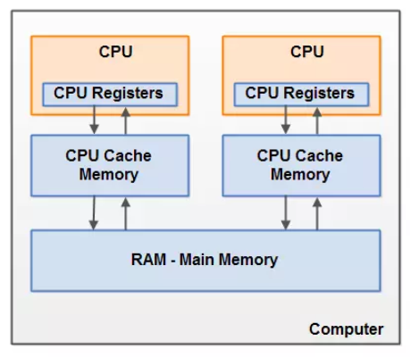
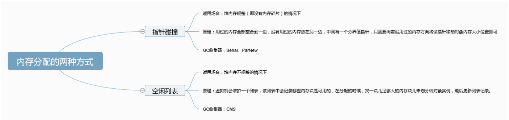

# 1.JMM
https://zhuanlan.zhihu.com/p/29881777  
https://zhuanlan.zhihu.com/p/136623445  
https://www.jianshu.com/p/8a58d8335270


Java内存模型(Java Memory Model，JMM)JMM主要是为了规定了线程和内存之间的一些关系。

jmm中的主内存、工作内存与jvm中的Java堆、栈、方法区等并不是同一个层次的内存划分，这两者基本上是没有关系的，如果两者一定要勉强对应起来，那从变量、主内存、工作内存的定义来看，主内存主要对应于Java堆中的对象实例数据部分，而工作内存则对应于虚拟机栈中的部分区域。从更低层次上说，主内存就直接对应于物理硬件的内存，而为了获取更好的运行速度，虚拟机（甚至是硬件系统本身的优化措施）可能会让工作内存优先存储于寄存器和高速缓存中，因为程序运行时主要访问读写的是工作内存。

JMM即为JAVA 内存模型（java memory model）。因为在不同的硬件生产商和不同的操作系统下，内存的访问逻辑有一定的差异，结果就是当你的代码在某个系统环境下运行良好，并且线程安全，但是换了个系统就出现各种问题。

Java内存模型，就是为了屏蔽系统和硬件的差异，让一套代码在不同平台下能到达相同的访问结果。

# 2. JVM内存区域，GC过程，GC算法等等整理下。

- 为什么要分为新生代和老生代？
    - 对于年轻代的对象，他们的特点是很快就会被回收，所以需要使用一种垃圾回收算法。
    - 而对于老年代而言，里面的大部分对象可能都会长期存活，那么使用新生代的回收算法放在这里就可能并不是那么的合适。需要有着自己的一套回收算法。

- 空间担保机制？
    - 在发生minor gc之前，虚拟机会检测 : 老年代最大可用的连续空间>新生代all对象总空间？
    - 满足，就是安全的。
    - 不满足，虚拟机查看HandlePromotionFailure参数
        - （1）为true，允许担保失败，会继续检测老年代最大可用的连续空间>历次晋升到老年代对象的平均大小。若大于，将尝试进行一次minor gc，若失败，则重新进行一次full gc。
        - （2）为false，则不允许冒险，要进行full gc（对老年代进行gc）。

# 3. 介绍下垃圾回收机制和垃圾回收算法
- Jvm内存主要分为：堆，方法区，线程私有（虚拟机栈，程序计数器）

- 垃圾回收主要作用在堆内存上
- 堆内存主要分为新生代，老年代。

- 新生代一般用标记-复制垃圾回收算法
老年代一般用标记-整理。
根据GC root引用链判断是否该对此对象进行垃圾回收。
- 可作为GC Roots的对象包括下面几种:
    - 虚拟机栈(栈帧中的本地变量表)中引用的对象
    - 本地方法栈(Native方法)中引用的对象
    - 方法区中类静态属性引用的对象
    - 方法区中常量引用的对象。
- 新生对象都放在Eden区，满了触发minor GC，放到From再放到To，这样来回的去复制。
年龄到达15左右，放到老年代中。
老年代满了 触发 Full Gc。

# 4. 强引用，软引用，弱引用，虚引用
- 强引用：必不可少，垃圾回收期绝不会回收它，内存空间不足就抛出异常，也不会去回收它。

- 软引用：可有可无，内存空间足够，就不会去回收它。

- 弱引用：可有可无，生命周期更短，在垃圾回收期扫描它所管辖的内存区域时，一旦发现了弱引用对象，不管内存空间够不够，都会回收掉。

- 虚引用：形同虚设，任何时候都可能被回收掉。
- 在程序设计中⼀般很少使⽤弱引⽤与虚引⽤，使⽤软引⽤的情况᫾多，这是因为软引⽤可以
加速JVM对垃圾内存的回收速度，可以维护系统的运⾏安全，防⽌内存溢出（OutOfMemory）等问题的产⽣。 

# 5. 创建对象的过程，与访问对象
- 创建对象过程？
    - 类加载检查
    
    - 分配内存：
        - 指针碰撞：
            - 适用堆内存规整
            - 原理：用过的内存全整理到一边，没用过放另一边，中间有个分界值指针，只要向着没用过内存的方向去移动对象内存大小位置即可。
        - 空闲列表：
            - 适用内存不规整的情景
            - 原理：虚拟机会维护一个列表，该列表中记录哪些内存块是可用的，在分配的时候，找一块足够大的内存块来划分给对象，最后更新列表。
    
        
    - 初始化零值
    - 设置对象头
    - 执行init方法

- 对象的访问方式？
    - 句柄
    
    - 直接指针

# 6. 熟悉的垃圾回收器
- G1收集器
    - G1 (Garbage-First)是⼀款⾯向服务器的垃圾收集器,主要针对配备多颗处理器及⼤容量内存的机器.以极⾼概率满⾜GC停顿时间要求的同时,还具备⾼吞吐量性能特征.

    - 具有如下特点：
        - 并⾏与并发： G1能充分利⽤CPU、多核环境下的硬件优势，使⽤多个CPU（CPU或者CPU核⼼）来缩短Stop-The-World停顿时间。部分其他收集器原本需要停顿Java线程执⾏的GC动作， G1收集器仍然可以通过并发的⽅式让java程序继续执⾏。
        - 分代收集：虽然G1可以不需要其他收集器配合就能独⽴管理整个GC堆，但是还是保留了分代的概念。
        - 空间整合：与CMS的“标记--清理”算法不同， G1从整体来看是基于“标记整理”算法实现的收集器；从局部上来看是基于“复制”算法实现的。
        
        - 可预测的停顿：这是G1相对于CMS的另⼀个⼤优势，降低停顿时间是G1 和 CMS 共同的关注点，但G1 除了追求低停顿外，还能建⽴可预测的停顿时间模型，能让使⽤者明确指定在⼀个⻓度为M毫秒的时间⽚段内。

# 7. 为什么JVM有GC还可能出现内存泄漏？
- 内存泄漏：对象已经没有被应用程序使用，但是垃圾回收器没办法移除它们，因为还在被引用着。

- 首先这些对象是可达的，其次这些对象是没用的。

- 长生命周期的对象持有短生命周期对象的引用就很可能发生内存泄漏

- ```java
    Vector v = new Vector(10);
    for (int i = 0; i < 100; i++) {
        Object o = new Object();
        v.add(o);
        o = null;
    }
    ```
- 上图就是个例子，仅释放o，但是v还引用着它，所以无法释放。
    - 各种集合 hashmap 上图，
    - 数据库连接，网络连接，不close就一直存在。
    - 单例模式，单例对象在初始化后将在 JVM 的整个生命周期中存在（以静态变量的方式），如果单例对象持有外部的引用，那么这个对象将不能被 JVM 正常回收。

- https://www.jianshu.com/p/54b5da7c6816

# 8. 类加载，双亲委派机制