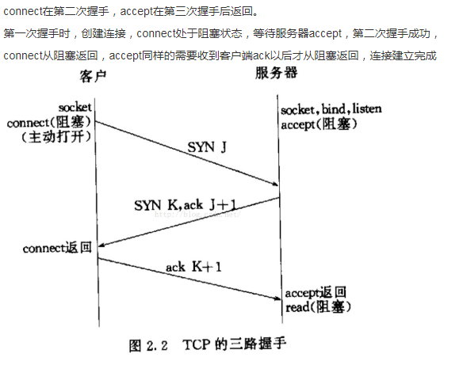

# 1.三次握手，四次挥手常见面试题
   https://juejin.im/post/6844903958624878606

- 1.请画出三次握手和四次挥手的示意图

- 

- 

- 2.为什么连接的时候是三次握手？
    - 如果两次握手，那么服务端返回ack给客户端的消息丢失了，此时服务端认为已经建立了连接，客户端却没收到，所以会忽视服务端发来的任何消息。
    
    - 防止已经失效的连接请求报文又到达了服务端。比如客户端发送的连接报文，在网络中滞留了。然后重新发送了连接，并且建立好了。但过了一会儿这个丢失的连接报文又到了服务端，这样就又建立了一个连接。浪费资源。
- 3.什么是半连接队列？  
    - 服务器第一次收到客户端的 SYN 之后，就会处于 SYN_RCVD 状态，此时双方还没有完全建立其连接，服务器会把此种状态下请求连接放在一个队列里，我们把这种队列称之为半连接队列。

- 4.ISN(Initial Sequence Number)是固定的吗？  
    - 三次握手的其中一个重要功能是客户端和服务端交换 ISN(Initial Sequence Number)，以便让对方知道接下来接收数据的时候如何按序列号组装数据。如果 ISN 是固定的，攻击者很容易猜出后续的确认号，因此 ISN 是动态生成的。
- 5.三次握手过程中可以携带数据吗？  
    -  第一次、第二次握手不可以携带数据  
        为什么这样呢?大家可以想一个问题，假如第一次握手可以携带数据的话，如果有人要恶意攻击服务器，那他每次都在第一次握手中的 SYN 报文中放入大量的数据。因为攻击者根本就不理服务器的接收、发送能力是否正常，然后疯狂着重复发 SYN 报文的话，这会让服务器花费很多时间、内存空间来接收这些报文。  
        也就是说，第一次握手不可以放数据，其中一个简单的原因就是会让服务器更加容易受到攻击了。
    
    -  而对于第三次的话，此时客户端已经处于 ESTABLISHED 状态。对于客户端来说，他已经建立起连接了，并且也已经知道服务器的接收、发送能力是正常的了，所以能携带数据也没啥毛病。

- 6.如果第三次握手丢失了，客户端服务端会如何处理？
    - 服务端没收到ack，隔一段时间会进行重传。如果重发指定次数后，仍然未收到ACK应答，那么一段时间后，Server自动关闭这个连接。
    
    - 客户端发送ack后，到了establish状态，就可以发消息给服务端了，但服务端会返回RST包（RST包用于强制关闭TCP链接），客户端就可以感知到Server的错误。

- 7.SYN攻击是什么？  
    - SYN攻击就是Client在短时间内伪造大量不存在的IP地址，并向Server不断地发送SYN包，Server则回复确认包，并等待Client确认，由于源地址不存在，因此Server需要不断重发直至超时，这些伪造的SYN包将长时间占用半连接队列，导致正常的SYN请求因为队列满而被丢弃，从而引起网络拥塞甚至系统瘫痪。  
    
    - 如何解决泛洪攻击？  
    SYN cookie
    SYN Cookie是对TCP服务器端的三次握手做一些修改，专门用来防范SYN Flood攻击的一种手段。它的原理是，在TCP服务器
    接收到TCP SYN包并返回TCP SYN + ACK包时，不分配一个专门的数据区，而是根据这个SYN包计算出一个cookie值。这个
    cookie作为将要返回的SYN ACK包的初始序列号。当客户端返回一个ACK包时，根据包头信息计算cookie，与返回的确认序列
    号(初始序列号 + 1)进行对比，如果相同，则是一个正常连接，然后，分配资源，建立连接。 

    - DDOS攻击是什么
        - DDOS攻击的全称叫作 distribution deny of service（分布式拒绝服务攻击）。顾名思义，这种攻击的方式是控制分布在全世界各个地方的服务器，发出指令，让这些服务器同时攻击一个目标，使得被攻击的计算机信息系统耗尽网络带宽资源、性能资源，无法正常运行或提供服务
        SYN Flood 就是DDOS攻击的一种实现方式。
        - 解决方案：添加规则和黑名单，增加服务并发性能等

- 8.挥手为什么需要四次？
    - 因为前两次是客户端到服务端的连接断开，但是服务端可能还需要继续发给客户端数据，所以要等后两次挥手才可以服务端到客户端的连接断开。

- 10.TIME_WAIT 和CLOSE_WAIT状态socket过多
    - 如果服务器出了异常，百分之八九十都是下面两种情况：  
    
    - 服务器保持了大量TIME_WAIT状态，这个时候属于服务端主动发起断开连接请求，一般为爬虫服务器。TIME_WAIT要存在2MSL，所以多。
    
    - 服务器保持了大量CLOSE_WAIT状态，简单来说CLOSE_WAIT数目过大是由于被动关闭连接处理不当导致的。  
    - 因为linux分配给一个用户的文件句柄是有限的，而TIME_WAIT和CLOSE_WAIT两种状态如果一直被保持，那么意味着对应数目的通道就一直被占着，而且是“占着茅坑不使劲”，一旦达到句柄数上限，新的请求就无法被处理了，接着就是大量Too Many Open Files异常，Tomcat崩溃。
    
- 11.为什么TIME_WAIT 状态需要保持 2MSL 这么长的时间？  
    - 保证客户端发送的最后一个ACK报文段能够到达服务端:
        这个ACK报文段有可能丢失，使得处于LAST-ACK状态的B收不到对已发送的FIN+ACK报文段的确认，服务端超时重传FIN+ACK报文段，而客户端能在2MSL时间内收到这个重传的FIN+ACK报文段，接着客户端重传一次确认，重新启动2MSL计时器，最后客户端和服务端都进入到CLOSED状态，若客户端在TIME-WAIT状态不等待一段时间，而是发送完ACK报文段后立即释放连接，则无法收到服务端重传的FIN+ACK报文段，所以不会再发送一次确认报文段，则服务端无法正常进入到CLOSED状态。  
    
    - 防止“已失效的连接请求报文段”出现在本连接中。客户端在发送完最后一个ACK报文段后，再经过2MSL，就可以使本连接持续的时间内所产生的所有报文段都从网络中消失，使下一个新的连接中不会出现这种旧的连接请求报文段

- 12.close_wait过多的原因  
    - close_wait 按照正常操作的话应该很短暂的一个状态，接收到客户端的fin包并且回复客户端ack之后，会继续发送fin包告知客户端关闭关闭连接，之后迁移到Last_ACK状态。但是close_wait过多只能说明没有迁移到Last_ACK，也就是服务端是否发送fin包，只有发送fin包才会发生迁移，所以问题定位在是否发送fin包。fin包的底层实现其实就是调用socket的close方法，这里的问题出在没有执行close方法。说明服务端socket忙于读写。  

    - CLOSE_WAIT是被动关闭连接时形成的。根据TCP状态机，服务器端收到客户端发送的FIN，则按照TCP实现发送ACK，因此进入CLOSE_WAIT状态。但如果服务器端不执行close()，就不能由CLOSE_WAIT迁移到LAST_ACK，则系统中会存在很多CLOSE_WAIT状态的连接。此时，可能是系统忙于处理读、写操作，而未将已收到FIN的连接，进行close。此时，recv/read已收到FIN的连接socket，会返回0。
- 13.如果已经建立了连接，但是客户端突然出现故障了怎么办？
    - TCP还设有一个保活计时器，显然，客户端如果出现故障，服务器不能一直等下去，白白浪费资源。服务器每收到一次客户端的请求后都会重新复位这个计时器，时间通常是设置为2小时，若两小时还没有收到客户端的任何数据，服务器就会发送一个探测报文段，以后每隔75秒钟发送一次。若一连发送10个探测报文仍然没反应，服务器就认为客户端出了故障，接着就关闭连接。

- 14.tcp连接所占用资源
    - 一个tcp连接需要：1，socket文件描述符；2，IP地址；3，端口；4，内存  
    TCP连接的四元组：源IP 源端口 目标IP 目标端口，这四元组构成了一个唯一的tcp连接。
    
- 15.TCP建立连接的时候connect()函数和accept()函数分别在三次握手第几次后返回（）
    - 
    
# 2.bio nio select poll epoll
- 阻塞io 就是说 accept 或者 receive的时候，如果客户端没准备好，那就会阻塞住。所以需要 一个客户端对应一个线程去处理。  

- 非阻塞的话，就是说，可以用一个线程去处理这么多的连接。每次都去循环遍历这些文件描述符，如果有一万个链接，那就是一万次系统调用，非常耗时。 
tips： 阻塞的时候不占用CPU，CPU已经就交出去了。 非阻塞比如Whie(1)这个是一直占用CPU的。
https://juejin.im/post/5eb8e318f265da7bbd2f9339

- 多路复用，就是说 会有一个线程，去监控这些文件描述符，当其中有准备好的，就再进行读取就可以了。不用遍历，是事件驱动的。
select 就是 每次都要从用户态把 所有的文件描述符传到内核态，然后内核态再遍历这些文件描述符，把所有准备好的 文件描述符返回给用户态。 用户态再进行读写操作。 注意： 这里是内核态遍历o（n），而非阻塞io是发生了 o（n）次的系统调用。   而epoll是在内核态维护了一个数据结构，每次增加或者删除 文件描述符 只传一次给内核态就可以了！ 并且 内核态不需要每次都遍历所有的文件描述符，基于事件驱动，这些文件描述符 有哪个准备好了，会挂载到另一个链表数据结构上！ 用户进程再去链表中去拿准备好的文件描述符就可以了！！！！

- 简而言之， select 就是每次把fdset（rset， 一个bitmap 1024位）传到内核态。然后内核态进行遍历，看对应的fd是否有事件到达，当没有的时候，就会阻塞住，select会阻塞在那一行，内核态会一直在里面进行判断。让有了一个或者多个事件到达，把对应rset置位并立马返回，这个时候 用户态再去遍历一次 fdset对应的rset是否被置位，若置位了，则进行对应的读写操作。之后，再把fdset对应的rset重新置位回原来的样子，然后再传到内核态。

- poll的话 和select区别就是 少了1024限制，然后不需要再遍历一次 将fdset重新置位了，而是在读处理的时候 直接将reevents置回0了。

- epoll的高效：
epoll的高效就在于，当我们调用epoll_ctl往里塞入百万个句柄时，epoll_wait仍然可以飞快的返回，并有效的将发生事件的句柄给我们用户。这是由于我们在调用epoll_create时，内核除了帮我们在epoll文件系统里建了个file结点，在内核cache里建了个红黑树用于存储以后epoll_ctl传来的socket外，还会再建立一个list链表，用于存储准备就绪的事件，当epoll_wait调用时，仅仅观察这个list链表里有没有数据即可。有数据就返回，没有数据就sleep，等到timeout时间到后即使链表没数据也返回。所以，epoll_wait非常高效。
就绪list链表维护：
那么，这个准备就绪list链表是怎么维护的呢？当我们执行epoll_ctl时，除了把socket放到epoll文件系统里file对象对应的红黑树上之外，还会给内核中断处理程序注册一个回调函数，告诉内核，如果这个句柄的中断到了，就把它放到准备就绪list链表里。所以，当一个socket上有数据到了，内核在把网卡上的数据copy到内核中后就来把socket插入到准备就绪链表里了。
如此，一颗红黑树，一张准备就绪句柄链表（双向链表），少量的内核cache，就帮我们解决了大并发下的socket处理问题。执行epoll_create时，创建了红黑树和就绪链表，执行epoll_ctl时，如果增加socket句柄，则检查在红黑树中是否存在，存在立即返回，不存在则添加到树干上，然后向内核注册回调函数，用于当中断事件来临时向准备就绪链表中插入数据。执行epoll_wait时立刻返回准备就绪链表里的数据即可。

- 

- epoll怎么样触发事件？
    - epoll()模型即支持水平触发，也支持边缘触发，默认是水平触发

- 两种模式LT和ET：
最后看看epoll独有的两种模式LT和ET。无论是LT和ET模式，都适用于以上所说的流程。区别是，LT模式下，只要一个句柄上的事件一次没有处理完，会在以后调用epoll_wait时次次返回这个句柄，而ET模式仅在第一次返回。
这件事怎么做到的呢？当一个socket句柄上有事件时，内核会把该句柄插入上面所说的准备就绪list链表，这时我们调用epoll_wait，会把准备就绪的socket拷贝到用户态内存，然后清空准备就绪list链表，最后，epoll_wait干了件事，就是检查这些socket，如果是LT模式，并且这些socket上确实有未处理的事件时，又把该句柄放回到刚刚清空的准备就绪链表了。所以，LT的句柄，只要它上面还有事件，epoll_wait每次都会返回。而ET模式的句柄，除非有新中断到，即使socket上的事件没有处理完，也是不会次次从epoll_wait返回的。

- LT一个句柄上的事件还没处理完，调用epoll_wait时次次返回这个句柄。 而ET只在第一次的时候返回。

```java
#define MAX_EVENTS 10
int main() {
    struct epoll_event ev, events[MAX_EVENTS];
    int listen_sock, conn_sock, nfds, epollfd;

    /* Code to set up listening socket, 'listen_sock',
     (socket(), bind(), listen()) omitted */

    epollfd = epoll_create1(0);
    if (epollfd == -1) {
        perror("epoll_create1");
        exit(EXIT_FAILURE);
    }
    
    ev.events = EPOLLIN;
    ev.data.fd = listen_sock;
    if (epoll_ctl(epollfd, EPOLL_CTL_ADD, listen_sock, &ev) == -1) {
        perror("epoll_ctl: listen_sock");
        exit(EXIT_FAILURE);
    }
    
    for (;;) {
        // 永久阻塞，直到有事件
        nfds = epoll_wait(epollfd, events, MAX_EVENTS, -1);
        if (nfds == -1) {  // 处理错误
            perror("epoll_wait");
            exit(EXIT_FAILURE);
        }
    
        for (n = 0; n < nfds; ++n) {
            if (events[n].data.fd == listen_sock) {
                conn_sock = accept(listen_sock, (struct sockaddr *) &addr, &addrlen);
                if (conn_sock == -1) {
                    perror("accept");
                    exit(EXIT_FAILURE);
                }
                setnonblocking(conn_sock);
                ev.events = EPOLLIN | EPOLLET;
                ev.data.fd = conn_sock;
                if (epoll_ctl(epollfd, EPOLL_CTL_ADD, conn_sock, &ev) == -1) {
                    perror("epoll_ctl: conn_sock");
                    exit(EXIT_FAILURE);
                }
            } else {
                do_use_fd(events[n].data.fd);
            }
        }
    }
    return 0;
}

```

- epoll数据在内核态和用户态之间是怎么切换的？
```java

    for ( ; ; ) {
        int wait_count;
        // 等待事件
        wait_count = epoll_wait(epfd, event, MAX_EVENT, -1);
 
        for (int i = 0 ; i < wait_count; i++) {
            uint32_t events = event[i].events;
            // IP地址缓存
            char host_buf[NI_MAXHOST];
            // PORT缓存
            char port_buf[NI_MAXSERV];
 
            int __result;
            // 判断epoll是否发生错误
            if ( events & EPOLLERR || events & EPOLLHUP || (! events & EPOLLIN)) {
                printf("Epoll has error\n");
                close (event[i].data.fd);
                continue;
            } else if (listenfd == event[i].data.fd) {
                // listen的 file describe 事件触发， accpet事件
 
                for ( ; ; ) { // 由于采用了边缘触发模式，这里需要使用循环
                    struct sockaddr in_addr = { 0 };
                    socklen_t in_addr_len = sizeof (in_addr);
                    int accp_fd = accept(listenfd, &in_addr, &in_addr_len);
                    if (-1 == accp_fd) {
                        perror("Accept");
                        break;
                    }
                    __result = getnameinfo(&in_addr, sizeof (in_addr),
                                           host_buf, sizeof (host_buf) / sizeof (host_buf[0]),
                                           port_buf, sizeof (port_buf) / sizeof (port_buf[0]),
                                           NI_NUMERICHOST | NI_NUMERICSERV);
 
                    if (! __result) {
                        printf("New connection: host = %s, port = %s\n", host_buf, port_buf);
                    }
 
                    __result = make_socket_non_blocking(accp_fd);
                    if (-1 == __result) {
                        return 0;
                    }
 
                    ev.data.fd = accp_fd;
                    ev.events = EPOLLIN | EPOLLET;
                    // 为新accept的 file describe 设置epoll事件
                    __result = epoll_ctl(epfd, EPOLL_CTL_ADD, accp_fd, &ev);
 
                    if (-1 == __result) {
                        perror("epoll_ctl");
                        return 0;
                    }
                }
                continue;
            } else {
                // 其余事件为 file describe 可以读取
                int done = 0;
                // 因为采用边缘触发，所以这里需要使用循环。如果不使用循环，程序并不能完全读取到缓存区里面的数据。
                for ( ; ;) {
                    ssize_t result_len = 0;
                    char buf[READ_BUF_LEN] = { 0 };
 
                    result_len = read(event[i].data.fd, buf, sizeof (buf) / sizeof (buf[0]));
 
                    if (-1 == result_len) {
                        if (EAGAIN != errno) {
                            perror ("Read data");
                            done = 1;
                        }
                        break;
                    } else if (! result_len) {
                        done = 1;
                        break;
                    }
 
                    write(STDOUT_FILENO, buf, result_len);
                }
                if (done) {
                    printf("Closed connection\n");
                    close (event[i].data.fd);
                }
            }
        }
 
    }
    close (epfd);
    return 0;
}
```
调用read自己读进来。

- epoll怎么判断数据读取完毕
    - TCP和UDP都适用。将socket设成NONBLOCK（使用fcntl函数），然后select到该socket可读之后，使用read/recv来读取数据。当函数返回-1，同时errno是EAGAIN或EWOULDBLOCK的时候，表示数据已经全部读取完毕。

# 3. HTTP1.0 1.1 2.0的区别
## 3.1HTTP1.0 HTTP 1.1主要区别
（1）长连接

HTTP 1.0需要使用keep-alive参数来告知服务器端要建立一个长连接，而HTTP1.1默认支持长连接。

HTTP是基于TCP/IP协议的，创建一个TCP连接是需要经过三次握手的,有一定的开销，如果每次通讯都要重新建立连接的话，对性能有影响。因此最好能维持一个长连接，可以用个长连接来发多个请求。

（2）节约带宽

HTTP 1.1支持只发送header信息(不带任何body信息)，如果服务器认为客户端有权限请求服务器，则返回100，否则返回401。客户端如果接受到100，才开始把请求body发送到服务器。

这样当服务器返回401的时候，客户端就可以不用发送请求body了，节约了带宽。

另外HTTP还支持传送内容的一部分。这样当客户端已经有一部分的资源后，只需要跟服务器请求另外的部分资源即可。这是支持文件断点续传的基础。

（3) HOST域

## 3.2HTTP1.1 HTTP 2.0主要区别
(1)多路复用

HTTP2.0使用了多路复用的技术，做到同一个连接并发处理多个请求，而且并发请求的数量比HTTP1.1大了好几个数量级。

当然HTTP1.1也可以多建立几个TCP连接，来支持处理更多并发的请求，但是创建TCP连接本身也是有开销的。

TCP连接有一个预热和保护的过程，先检查数据是否传送成功，一旦成功过，则慢慢加大传输速度。因此对应瞬时并发的连接，服务器的响应就会变慢。所以最好能使用一个建立好的连接，并且这个连接可以支持瞬时并发的请求。


这个图可以很清楚的看出，1.0是一个请求 就连接 然后 断开连接， 1.1是一个连接 可以对应多个请求，但是请求是有顺序的，第二个请求必须等第一个请求结束才可以发送， 2.0是 client 端就可以在一个链接中并发地发起多个请求，每个请求及该请求的响应不需要等待其他的请求。

(2)数据压缩

(3)服务器推送  
简单来讲就是当用户的浏览器和服务端建立连接后，服务器主动将一些资源推送给浏览器并缓存起来。有了缓存，当浏览器想要访问已缓存的资源的时候就可以直接从缓存中读取了。
https://blog.csdn.net/linsongbin1/article/details/54980801?utm_medium=distribute.pc_relevant.none-task-blog-BlogCommendFromMachineLearnPai2-1.channel_param&depth_1-utm_source=distribute.pc_relevant.none-task-blog-BlogCommendFromMachineLearnPai2-1.channel_param

# 4.各层协议的作用，以及TCP/IP协议的特点

传输层是报文段 网络层是数据报 链路层是数据帧

1.数据链路层  

1.1 作用  
(1) 实现网卡接口的网络驱动，以处理数据在以太网线等物理媒介上的传输  
(2) 网络驱动程序隐藏了不同物理网络的不同电气特性，为上层协议提供一个统一的接口

1.2 协议应用  
ARP和RARP(Reverse Address Resolve Protocol)即逆地址解析协议，该协议实现了IP地址和物理地址(MAC地址)之间的转换。ARP首先会发起一个请求数据包，数据包的首部包含了目标主机的IP地址，然后这个数据包会在链路层进行再次包装，生成以太网数据包，最终由以太网广播给子网内的所有主机，每一台主机都会接收到这个数据包，并取出标头里的IP地址，然后和自己的IP地址进行比较，如果相同就返回自己的MAC地址，如果不同就丢弃该数据包。ARP接收返回消息，以此确定目标机的MAC地址；与此同时，ARP还会将返回的MAC地址与对应的IP地址存入本机ARP缓存中并保留一定时间，下次请求时直接查询ARP缓存以节约资源。

2.网络层  

2.1 作用  
网络有分局域网(LAN, Local Area Network)和广域网(WAN, Wide Area Network)。对于后者通常需要使用众多分级的路由器来连接分散的主机或者LAN，即通讯的两台主机一般不是直接连接，而是通过多个中间节点(路由器)连接的，从而形成网络拓扑连接。  
(1) 网络层的任务之一就是选择这些中间节点，以确定两台主机间的通讯路径。  
(2) 其次网络层对上层协议隐藏了网络拓扑连接的细节，在使得传输层看来通讯双方是直接连接的

2.2 协议应用  
(1) IP协议: IP协议(Internet Protocol)是网络层最核心的协议，它根据数据包的目的IP地址来决定如何投递该数据包。若数据包不可直接发送给目标主机，那么IP协议就为它寻找一个合适的下一跳路由器，并将数据包交付给该路由器去转发，如此循环直至到达目标主机或者发送失败而丢弃该数据包。  
（1）寻址和路由；（根据对方的IP地址，寻找最佳路径传输信息）；  
（2）传递服务：
① 不可靠（IP协议只是尽自己最大努力去传输数据包），可靠性由上层协议提供（TCP协议）； ② 无连接（事先不建立会话），不维护任何关于后续数据报的信息；  
（3）数据包的分片和重组。

(2) ICMP协议: ICMP协议(Internet Control Message Protocol，因特网控制报文协议)是IP协议的补充，用于检测网络的连接状态，如ping应用程序就是ICMP协议的使用。ICMP包发送是不可靠的，所以不能依靠接收ICMP包解决网络问题；ICMP与TCP/UDP不同，它们是传输层协议，虽然都具有类型域和代码域，但是前者和后者不同，ping用到的ICMP协议，不是端口。ICMP协议使用的是IP协议而非使用下层协议提供的服务，所以严格来讲它并非网络层协议，而是网络层程序。

3.传输层

3.1 作用  
传输层的作用是为应用程序提供端对端通讯的”错觉”，即为应用程序隐藏了数据包跳转的细节，负责数据包的收发、链路超时重连等。

3.2 协议应用  
(1) TCP协议: TCP协议(Transmission Control Protocol, 传输控制协议)为应用程序提供可靠的、面向连接的、基于流的服务，具有超时重传、数据确认等方式来确保数据包被正确发送到目的端。因此TCP服务是可靠的，使用TCP协议通讯的双方必须先建立起TCP连接，并在系统内核中为该连接维持一些必要的数据结构，比如连接的状态，读写缓冲区，多个定时器等。当通讯结束时双方必须关闭连接以释放这些内核数据。基于流发送意思是数据是没有长度限制，它可源源不断地从通讯的一端流入另一端。  
(2) UDP协议: UDP协议(User Datagram Protocol, 用户数据报协议)与TCP协议相反，它为应用程序提供的是不可靠的、无连接的基于数据报的服务。
  无连接: 通讯双方不保持一个长久的联系，因此应用程序每次发送数据都要明确指定接收方的地址；
  基于数据报的服务: 这是相对于数据流而言的，每个UDP数据报都有一个长度，接收端必须以该长度为最小单位将其内容一次性读出，否则数据将被截断。
  UDP不具有发送时是被重发功能，所以UDP协议在内核实现中无需为应用程序的数据保存副本，当UDP数据报被成功发送之后，UDP内核缓冲区中该数据报就被丢弃了。  
(3) SCTP协议: SCTP(Stream Control Transmission Protocol, 流控制传输协议)是为了在因特网上传输电话信号而设计的。

4.应用层  
4.1 作用  
前面所述的三层负责处理网络通讯的相关细节，这部分需要稳定高效，因此它们是在操作系统的内核空间中，而应用层是在用户空间实现的，负责处理众多业务逻辑，如文件传输、网络管理。  
4.2 协议应用  
应用层的协议很多，如：  
(1) telne协议: 远程登录协议，它使我们能在本地完成远程任务  
(2) OSPF协议: OSPF协议(Open Shorttest Path First, 开放最短路径优先)是一种动态路由更新协议，用于路由器之间的通讯，以告知对方自身的路由信息  
(3) DNS协议: DNS协议(Domain Name Service, 域名服务)提供机器域名到IP地址的转换。如百度的机器域名是www.baidu.com，对应的IP地址是http://119.75.217.109/。
另外注意，ping是应用程序而非协议，它利用网络层的ICMP协议监测网络连接。
应用层协议可以跳过传输层直接使用网络层提供的服务，比如ping程序和OSPF协议；又可以既使用TCP服务，又可以使用UDP服务，如DNS协议。

# 5.ICMP 报文种类以及作用；和 IP 数据报的关系；Ping 和 Traceroute 的具体原理。
IP协议并不是一个可靠的协议，它不保证数据被送达，那么，自然的，保证数据送达的工作应该由其他的模块来完成。其中一个重要的模块就是ICMP(网络控制报文)协议。
当传送IP数据包发生错误－－比如主机不可达，路由不可达等等，ICMP协议将会把错误信息封包，然后传送回给主机。给主机一个处理错误的机会，这也就是为什么说建立在IP层以上的协议是可能做到安全的原因。ICMP数据包由8bit的错误类型和8bit的代码和16bit的校验和组成。而前 16bit就组成了ICMP所要传递的信息。
ICMP协议大致分为两类，一种是查询报文，一种是差错报文。其中查询报文有以下几种用途:

ping查询  
ping 程序是用来探测主机到主机之间是否可通信，如果不能ping到某台主机，表明不能和这台主机建立连接。ping 使用的是ICMP协议，它发送icmp回送请求消息给目的主机。ICMP协议规定：目的主机必须返回ICMP回送应答消息给源主机。如果源主机在一定时间内收到应答，则认为主机可达。
假定主机A的IP地址是192.168.1.1，主机B的IP地址是192.168.1.2，都在同一子网内，则当你在主机A上运行“Ping 192.168.1.2”后，都发生了些什么呢?
首先，Ping命令会构建一个固定格式的ICMP请求数据包，然后由ICMP协议将这个数据包连同地址“192.168.1.2”一起交给IP层协议（和ICMP一样，实际上是一组后台运行的进程），IP层协议将以地址“192.168.1.2”作为目的地址，本机IP地址作为源地址，加上一些其他的控制信息，构建一个IP数据包，并在一个映射表中查找出IP地址192.168.1.2所对应的物理地址，一并交给数据链路层。其中, 映射表由ARP实现。ARP(Address Resolution Protocol)是地址解析协议,是一种将IP地址转化成物理地址的协议。后者构建一个数据帧，目的地址是IP层传过来的物理地址，源地址则是本机的物理地址，还要附加上一些控制信息，依据以太网的介质访问规则，将它们传送出去。
主机B收到这个数据帧后，先检查它的目的地址，并和本机的物理地址对比，如符合，则接收；否则丢弃。接收后检查该数据帧，将IP数据包从帧中提取出来，交给本机的IP层协议。同样，IP层检查后，将有用的信息提取后交给ICMP协议，后者处理后，马上构建一个ICMP应答包，发送给主机A，其过程和主机A发送ICMP请求包到主机B一模一样。

Traceroute是用来侦测主机到目的主机之间所经路由情况的重要工具  
尽管ping工具也可以进行侦测，但是，因为ip头的限制，ping不能完全的记录下所经过的路由器。Traceroute的原理是非常非常的有意思，它受到目的主机的IP后，首先给目的主机发送一个TTL=1（TTL 指定数据报被路由器丢弃之前允许通过的网段数量。）的UDP数据包，而经过的第一个路由器收到这个数据包以后，就自动把TTL减1，而TTL变为0以后，路由器就把这个包给抛弃了，并同时产生 一个主机不可达的ICMP数据报给主机。主机收到这个数据报以后再发一个TTL=2的UDP数据报给目的主机，然后刺激第二个路由器给主机发ICMP数据报。如此往复直到到达目的主机。这样，traceroute就拿到了所有的路由器ip。从而避开了ip头只能记录有限路由IP的问题。

# 6.UDP 与 TCP 比较，分析上层协议应该使用 UDP 还是 TCP。
- 1.TCP面向连接（如打电话要先拨号建立连接）;UDP是无连接的，即发送数据之前不需要建立连接.  

- 2.TCP提供可靠的服务。也就是说，通过TCP连接传送的数据，无差错，不丢失，不重复，且按序到达;UDP尽最大努力交付，即不保证可靠交付。
Tcp通过校验和，重传控制，序号标识，滑动窗口、确认应答实现可靠传输。如丢包时的重发控制，还可以对次序乱掉的分包进行顺序控制。  
- 3.UDP具有较好的实时性，工作效率比TCP高，适用于对高速传输和实时性有较高的通信或广播通信。  
- 4.每一条TCP连接只能是点到点的;UDP支持一对一，一对多，多对一和多对多的交互通信  
- 5.TCP对系统资源要求较多，UDP对系统资源要求较少。

# 6.滑动窗口与拥塞控制
- 滑动窗口
    - 
    
    - 对于发送端来说，即将要发送的数据包排成一个队列，对于发送者来说，数据包总共分成四类。分别是在窗口前的，已经发送给接收方，并且收到了接收方的答复，我们称之为已发送。在窗口中的，有两种状态，一个是已经发送给接收方，但是接收方还没确认送达，我们称之为已发送未确认，另外一个是可以发送了，但是还没有发送，我们称之为允许发送未发送。最后的是在窗口外面的，我们称之为不可发送，除非窗口滑到此处，否则不会进行发送。
    
    - TCP的滑动窗口协议有什么意义呢？首先当然是可靠性，滑动窗口只有在队列前部的被确认之后，才会往后移动，保证数据包被接收方确认并接收。滑动窗口还可控制接收以及同步数据范围的，通知发送端目前接收的数据范围，用于流量控制
    
    - 滑动窗口实现了TCP流控制。首先明确滑动窗口的范畴：TCP是双工的协议，会话的双方都可以同时接收和发送数据。TCP会话的双方都各自维护一个发送窗口和一个接收窗口。
    - 各自的发送窗口则要求取决于对端通告的接收窗口，要求相同。
    接收方设备要求窗口大小为0时，表明接收方已经接收了全部数据，或者接收方应用程序没有时间读取数据，要求暂停发送。 TCP在传送数据时，第一次接受方窗口大小是由链路带宽决定的，但是接收方在接收到的数据后，返回ack确认报文，同时也告诉了发送方自己的窗口大小，此时发送方第二次发送数据时，会改变自己的窗口大小和接收方一致。
    - 滑动窗口解决的是流量控制的的问题，就是如果接收端和发送端对数据包的处理速度不同，如何让双方达成一致。接收端的缓存传输数据给应用层，但这个过程不一定是即时的，如果发送速度太快，会出现接收端数据overflow，流量控制解决的是这个问题。
        
    - Tpis: 对比滑动窗口和拥塞窗口
    滑动窗口是控制接收以及同步数据范围的，通知发送端目前接收的数据范围，用于流量控制，接收端使用。拥塞窗口是控制发送速率的，避免发的过多，发送端使用。因为tcp是全双工，所以两边都有滑动窗口。
    两个窗口的维护是独立的，滑动窗口主要由接收方反馈缓存情况来维护，拥塞窗口主要由发送方的拥塞控制算法检测出的网络拥塞程度来决定的。
    发送方取拥塞窗口与滑动窗口中的最小值作为发送上限。拥塞窗口是发送方使用的流量控制，而滑动窗口则是接收方使用的流量控制。
    

- 拥塞控制
    - 慢启动（初始窗口很小，指数增长）、
    - 拥塞避免(超过阈值一半加法增大)、造成网络拥塞后，乘法减小，重新慢开始（窗口大小设为1），阈值设为当前窗口大小的一半，
        - 

    - 快重传（发送方，连续收到三个重复确认，执行乘法减小，阈值设为现在窗口大小一半，
    但并不重新慢重传，而是执行快恢复（窗口大小从阈值开始，立即重传对方尚未收到的报文段，并进行拥塞避免，加法增大））
    
        -     
    - 作用：拥塞控制就是为了防止过多的数据注入到网络中，这样可以使网络中的路由器或者链路不至于过载。拥塞控制要做的都有一个前提：就是网络能够承受现有的网络负荷.
    
        - 
    
    - https://blog.csdn.net/niukeming/article/details/80779582 三个重复确认快重传，快恢复。 发送端 1 2 3 5 6  接收端 2 3 4 4 4回复，但是其实 5 6 已经缓存起来了。 

# 7.DNS过程
53端口号。DNS更多情况下使用UDP, 这样DNS服务器负载更低，响应更快。
当一个用户在地址栏输入www.taobao.com时，DNS解析有大致十个过程，如下：  
（1）	浏览器先检查自身缓存中有没有被解析过的这个域名对应的ip地址，如果有，解析结束。同时域名被缓存的时间也可通过TTL属性来设置。  
（2）	如果浏览器缓存中没有（专业点叫还没命中），浏览器会检查操作系统缓存中有没有对应的已解析过的结果。而操作系统也有一个域名解析的过程。在windows中可通过c盘里一个叫hosts的文件来设置，如果你在这里指定了一个域名对应的ip地址，那浏览器会首先使用这个ip地址。  
（3）	如果至此还没有命中域名，才会真正的请求本地域名服务器（LDNS）来解析这个域名，这台服务器一般在你的城市的某个角落，距离你不会很远，并且这台服务器的性能都很好，一般都会缓存域名解析结果，大约80%的域名解析到这里就完成了。  
（4）	如果LDNS仍然没有命中，就直接跳到Root Server 域名服务器请求解析  
（5）	根域名服务器返回给LDNS一个所查询域的主域名服务器（gTLD Server，国际顶尖域名服务器，如.com .cn .org等）地址  
（6）	此时LDNS再发送请求给上一步返回的gTLD  
（7）	接受请求的gTLD查找并返回这个域名对应的Name Server的地址，这个Name Server就是网站注册的域名服务器  
（8）	Name Server根据映射关系表找到目标ip，返回给LDNS  
（9）	LDNS缓存这个域名和对应的ip   
（10）	LDNS把解析的结果返回给用户，用户根据TTL值缓存到本地系统缓存中，域名解析过程至此结束
#### 7.1	浏览器输入一个url至显示主页之后的过程，用到的协议？
DNS解析返回IP：PORT，请求简历TCP连接，通过网络层，链路层，...发送过去。 经过三次握手，简历好TCP连接，之后可通信。
# 8.为什么UDP比TCP快
- UDP比TCP快的地方UDP没有流量控制，拥塞控制，没有握手，没有成功确认，一个数据包发过去就不管。
- UDP实现可靠传输？
    - 只能在应用层实现，确认应答，超时重传，滑动窗口

# 8. UDP为什么丢包以及解决办法？
- https://blog.csdn.net/libaineu2004/article/details/48039599?utm_medium=distribute.pc_relevant.none-task-blog-BlogCommendFromMachineLearnPai2-8.channel_param&depth_1-utm_source=distribute.pc_relevant.none-task-blog-BlogCommendFromMachineLearnPai2-8.channel_param
- 丢包原因
    - 接收端处理时间过长导致丢包：调用recv方法接收端收到数据后，处理数据花了一些时间，处理完后再次调用recv方法，在这二次调用间隔里,发过来的包可能丢失。对于这种情况可以修改接收端，将包接收后存入一个缓冲区，然后迅速返回继续recv。

    - 发送的包巨大丢包：虽然send方法会帮你做大包切割成小包发送的事情，但包太大也不行。例如超过50K的一个udp包，不切割直接通过send方法发送也会导致这个包丢失。这种情况需要切割成小包再逐个send。
    - 发送的包较大，超过接受者缓存导致丢包：包超过mtu size数倍，几个大的udp包可能会超过接收者的缓冲，导致丢包。这种情况可以设置socket接收缓冲。以前遇到过这种问题，我把接收缓冲设置成64K就解决了。
    - 发送的包频率太快：虽然每个包的大小都小于mtu size 但是频率太快，例如40多个mut size的包连续发送中间不sleep，也有可能导致丢包。这种情况也有时可以通过设置socket接收缓冲解决，但有时解决不了。所以在发送频率过快的时候还是考虑sleep一下吧。
# 8. TCP, UDP区别
- TCP有连接，UDP无连接

- TCP基于数据流传输，UDP是数据报传输
- TCP可靠，有三次握手，序列号，确认应答，滑动窗口，超时重传，拥塞控制等机制，保证数据正确性与顺序，UDP不保证

# 9.粘包，拆包及解决办法
- 1、要发送的数据大于TCP发送缓冲区剩余空间大小，将会发生拆包。  

- 2、待发送数据大于MSS（最大报文长度），TCP在传输前将进行拆包。  
- 3、要发送的数据小于TCP发送缓冲区的大小，TCP将多次写入缓冲区的数据一次发送出去，将会发生粘包。  
- 4、接收数据端的应用层没有及时读取接收缓冲区中的数据，将发生粘包。
等等。

- 粘包、拆包解决办法  
    - 通过以上分析，我们清楚了粘包或拆包发生的原因，那么如何解决这个问题呢？解决问题的关键在于如何给每个数据包添加边界信息，常用的方法有如下几个：  
    - 1、发送端给每个数据包添加包首部，首部中应该至少包含数据包的长度，这样接收端在接收到数据后，通过读取包首部的长度字段，便知道每一个数据包的实际长度了。  
    - 2、发送端将每个数据包封装为固定长度（不够的可以通过补0填充），这样接收端每次从接收缓冲区中读取固定长度的数据就自然而然的把每个数据包拆分开来。  
   
    - 3、可以在数据包之间设置边界，如添加特殊符号，这样，接收端通过这个边界就可以将不同的数据包拆分开。等等。

# 10.Socket
- Socket是对TCP/IP协议的封装，Socket本身并不是协议，而是一个调用接口（API），通过Socket，我们才能使用TCP/IP协议。

- 建立Socket连接至少需要一对套接字，其中一个运行于客户端，称为ClientSocket ，另一个运行于服务器端，称为ServerSocket 。
套接字之间的连接过程分为三个步骤：服务器监听，客户端请求，连接确认。

- TCP服务端  
1、创建一个socket，用函数socket()；   
2、设置socket属性，用函数setsockopt(); * 可选   
3、绑定IP地址、端口等信息到socket上，用函数bind();   
4、开启监听，用函数listen()；   
5、接收客户端上来的连接，用函数accept()；   
6、收发数据，用函数send()和recv()，或者read()和write();   
7、关闭网络连接；   
8、关闭监听； 

-  TCP客户端  
1、创建一个socket，用函数socket()  
2、设置socket属性，用函数setsockopt();* 可选   
3、绑定IP地址、端口等信息到socket上，用函数bind();* 可选   
4、设置要连接的对方的IP地址和端口等属性；   
5、连接服务器，用函数connect()；   
6、收发数据，用函数send()和recv()，或者read()和write();   
7、关闭网络连接；

-  UDP服务端  
1、创建一个socket，用函数socket()；   
2、设置socket属性，用函数setsockopt();* 可选   
3、绑定IP地址、端口等信息到socket上，用函数bind();   
4、循环接收数据，用函数recvfrom();   
5、关闭网络连接； 

- UDP客户端：   
1、创建一个socket，用函数socket()；    
2、设置socket属性，用函数setsockopt();* 可选   
3、绑定IP地址、端口等信息到socket上，用函数bind();* 可选   
4、设置对方的IP地址和端口等属性;   
5、发送数据，用函数sendto();   
6、关闭网络连接；


# 11.IO模型对比
- 

- 

- 

- - 

- 异步IO：
当应用程序调用aio_read时，内核一方面去取数据报内容返回，另一方面将程序控制权还给应用进程，应用进程继续处理其他事情，是一种非阻塞的状态。
当内核中有数据报就绪时，由内核将数据报拷贝到应用程序中，返回aio_read中定义好的函数处理程序。


# 12.可靠传输原理，并设计可靠 UDP 协议。
- 校验和
- 确认应答+序列号
- 超时重传
- 握手挥手
- 滑动窗口
- 拥塞控制  慢启动-拥塞避免-快重传-快启动

# 13. HTTP，GET，POST，状态码，请求头
- HTTP协议是用于客户端和服务器端之间的通信，Client客户端请求Server服务端，Server服务端响应给Client客户端。HTTP是基于客户端/服务端的架构模型。

- GET 用于获取资源，而 POST 用于传输实体主体。
- GET 和 POST 的请求都能使用额外的参数，但是 GET 的参数是出现在 URL 中，而 POST 的参数存储在实体主体中。
GET 方法是安全的，而 POST 却不是，因为 POST 的目的是传送实体主体内容，这个内容可能是用户上传的表单数据，上传成功之后，服务器可能把这个数据存储到数据库中，因此状态也就发生了改变。
幂等的 HTTP 方法，同样的请求被执行一次与连续执行多次的效果是一样的，服务器的状态也是一样的。换句话说就是，幂等方法不应该具有副作用（统计用途除外）。所有的安全方法也都是幂等的。在正确实现的条件下，GET，HEAD，PUT 和 DELETE 等方法都是幂等的，而 POST 方法不是。

- 200 - 请求成功  
301 - 资源（网页等）被永久转移到其它URL  
404 - 请求的资源（网页等）不存在  
500 - 内部服务器错误

- 

- 问请求头：回答 post+url,  connection, cookie, host, referer, content-type https://blog.csdn.net/qdmoment/article/details/94635734


# 14. HTTPS
- 通常，HTTP 直接和 TCP 通信。当使用 SSL（Secure Socket Layer） 时，则演变成先和 SSL 通信，再由 SSL 和 TCP 通信了。简言之，所谓 HTTPS，其实就是身披 SSL 协议这层外壳的 HTTP。


# 17. Cookie Session Token
- CSRF(跨站请求伪造)攻击的过程  
1.用户C浏览并登陆信任的站点A  
2.A验证通过，在用户C处产生A的Cookie  
3.用户C在没有登陆的情况下访问攻击站点B  
4.B要求访问第三方的站点A，发出一个请求  
5.根据B在4的请求，浏览器携带2产生的cookie访问站点A  
6.A不知道5中的请求是用户C发出的还是B发出的，由于浏览器会自动带上用户C的Cookie，所以A会个根据C的权限处理5的请求，这样B就达到了模拟用户登录的目的

- Session 是存放在服务器端的，类似于Session结构来存放用户数据，当浏览器 第一次发送请求时，服务器自动生成了一个Session和一个Session ID用来唯一标识这个Session，并将其通过响应发送到浏览器。当浏览器第二次发送请求，会将前一次服务器响应中的Session ID放在请求中一并发送到服务器上，服务器从请求中提取出Session ID，并和保存的所有Session ID进行对比，找到这个用户对应的Session。
- Session是存在服务器端的，用来标识用户的数据结构，第一次访问网站的时候服务器会返回来一个sessionId，这个sessionId就存在本地的cookie里。访问相同的网站，浏览器就会携带上相同的cookie。如果别人通过 cookie拿到了 SessionId 后就可以代替你的身份访问系统了。在我们登录成功获得 token 之后，一般会选择存放在 local storage 中。然后我们在前端通过某些方式会给每个发到后端的请求加上这个 token,这样就不会出现 CSRF 漏洞的问题。因为，即使有个你点击了非法链接发送了请求到服务端，这个非法请求是不会携带 token 的，所以这个请求将是非法的。 可以理解为， csrf是通过我点击链接来攻击的， 但是我点击链接，并没有执行js脚本，请求里并没有带上token

# 18. 实现一个web server
- https://blog.csdn.net/martinwangjun/article/details/77659336?utm_medium=distribute.pc_relevant.none-task-blog-BlogCommendFromMachineLearnPai2-2.channel_param&depth_1-utm_source=distribute.pc_relevant.none-task-blog-BlogCommendFromMachineLearnPai2-2.channel_param
