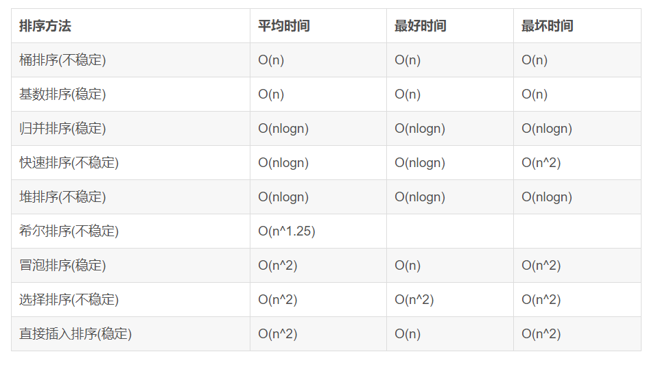

# 1.排序算法

- 冒泡、选择、直接 排序需要两个for循环，每次只关注一个元素，平均时间复杂度为O（n2）O（n2）（一遍找元素O(n)O(n)，一遍找位置O(n)O(n)）
快速、归并、希尔、堆基于二分思想，log以2为底，平均时间复杂度为O(nlogn)O(nlogn)（一遍找元素O(n)O(n)，一遍找位置O(logn)O(logn)）

- （1） 冒泡排序： 两两比较，往后冒泡     相等不交换 稳定
- （2） 选择排序：选择排序从小到大排序：一开始从0~n-1区间上选择一个最小值，将其放在位置0上，然后在1~n-1范围上选取最小值放在位置1上。重复过程直到剩下最后一个元素，数组即为有序。    不稳定（序列5 8 5 2 9，我们知道第一遍选择第1个元素5会和2交换，那么原序列中2个5的相对前后顺序就被破坏了，所以选择排序不是一个稳定的排序算法。）
- （3） 插入排序：代码还不太熟
插入排序就是从第二个元素开始插入，和前面的比较，如果前面的小，不动，如果前面的大，那么前面的元素向后移，直到前面的比它小了，插进去！    稳定！
- （4） 归并排序：代码还不太熟
分治的思想，左面弄有序，右面弄有序，然后merge。左面递归弄有序 右面递归弄有序。
因为交换元素时，可以在相等的情况下做出不移动的限制，所以归并排序是可以稳定的
- （5） 快速排序：代码需要完全掌握
每次都找到一个基准，然后让数组左面的 都小于这个基准，右面的都大于这个基准！！
为什么快速排序不稳定？？
待排序数组:int a[] ={1, 2, 2, 3, 4, 5, 6};
在快速排序的随机选择比较子(即pivot)阶段：
若选择a[2]（即数组中的第二个2）为比较子，，而把大于等于比较子的数均放置在大数数组中，则a[1]（即数组中的第一个2）会到pivot的右边， 那么数组中的两个2非原序（这就是“不稳定”）。
若选择a[1]为比较子，而把小于等于比较子的数均放置在小数数组中，则数组中的两个2顺序也非原序

- （6） 堆排序
堆排序从小到大排序：首先将数组元素建成大小为n的大顶堆，堆顶（数组第一个元素）是所有元素中的最大值，将堆顶元素和数组最后一个元素进行交换，再将除了最后一个数的n-1个元素建立成大顶堆，再将最大元素和数组倒数第二个元素进行交换，重复直至堆大小减为1。

- （7） 希尔排序
希尔排序是插入排序改良的算法，希尔排序步长从大到小调整，第一次循环后面元素逐个和前面元素按间隔步长进行比较并交换，直至步长为1，步长选择是关键

- （8）基数排序
基数排序(Radix Sort)是桶排序的扩展，它的基本思想是：将整数按位数切割成不同的数字，然后按每个位数分别比较。
具体做法是：将所有待比较数值统一为同样的数位长度，数位较短的数前面补零。然后，从最低位开始，依次进行一次排序。这样从最低位排序一直到最高位排序完成以后, 数列就变成一个有序序列。
 
