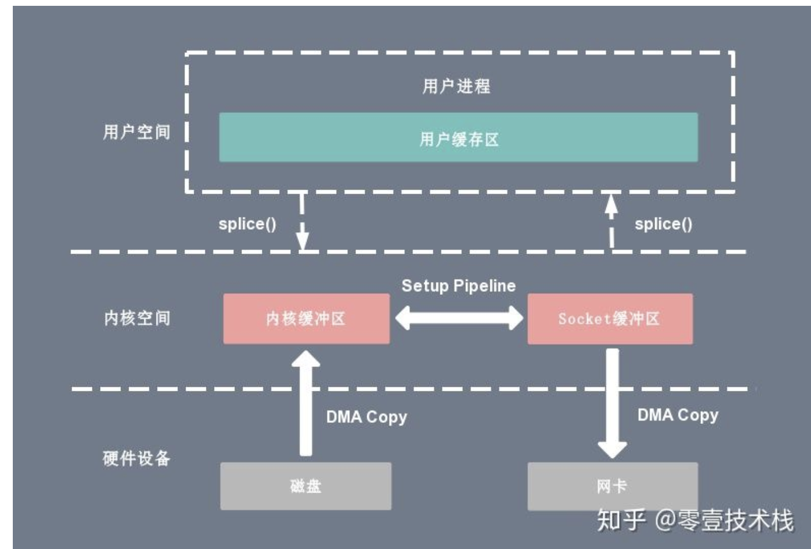

# 1.进程与线程的区别：
- 根本区别：进程是操作系统资源分配的基本单位，而线程是任务调度和执行的基本单位

- 在开销方面：每个进程都有独立的代码和数据空间（程序上下文），程序之间的切换会有较大的开销；线程可以看做轻量级的进程，同一类线程共享代码和数据空间，每个线程都有自己独立的运行栈和程序计数器（PC），线程之间切换的开销小。

- 所处环境：在操作系统中能同时运行多个进程（程序）；而在同一个进程（程序）中有多个线程同时执行（通过CPU调度，在每个时间片中只有一个线程执行）

- 内存分配方面：系统在运行的时候会为每个进程分配不同的内存空间；而对线程而言，除了CPU外，系统不会为线程分配内存（线程所使用的资源来自其所属进程的资源），线程组之间只能共享资源。

- 包含关系：进程至少有一个线程，如果一个进程内有多个线程，则执行过程不是一条线的，而是多条线（线程）共同完成的；线程是进程的一部分，所以线程也被称为轻权进程或者轻量级进程。

# 2.进程状态

- 

- 创建状态：进程在创建时需要申请一个空白PCB(process control block)，进程控制块，向其中填写控制和管理进程的信息，完成资源分配。如果创建工作无法完成，比如资源无法满足，就无法被调度运行，把此时进程所处状态称为创建状态。

- 就绪状态：进程已经准备好，已分配到所需资源，只要分配到CPU就能够立即运行

- 执行——阻塞：正在执行的进程因发生某等待事件而无法执行，则进程由执行状态变为阻塞状态，如进程提出输入/输出请求而变成等待外部设备传输信息的状态，进程申请资源（主存空间或外部设备）得不到满足时变成等待资源状态

- 阻塞——就绪：处于阻塞状态的进程，在其等待的事件已经发生，如输入/输出完成，资源得到满足或错误处理完毕时

# 3.几种进程调度算法
- 时间片轮转调度算法（RR）：给每个进程固定的执行时间，根据进程到达的先后顺序让进程在单位时间片内执行，执行完成后便调度下一个进程执行，时间片轮转调度不考虑进程等待时间和执行时间，属于抢占式调度。优点是兼顾长短作业；缺点是平均等待时间较长，上下文切换较费时。适用于分时系统。

- 先来先服务调度算法（FCFS）：根据进程到达的先后顺序执行进程，不考虑等待时间和执行时间，会产生饥饿现象。属于非抢占式调度，优点是公平，实现简单；缺点是不利于短作业。

- 优先级调度算法（HPF）：在进程等待队列中选择优先级最高的来执行。常被用于批处理系统中，还可用于实时系统中。

- 多级反馈队列调度算法：将时间片轮转与优先级调度相结合，把进程按优先级分成不同的队列，先按优先级调度，优先级相同的，按时间片轮转。优点是兼顾长短作业，有较好的响应时间，可行性强，适用于各种作业环境。

- 高响应比优先调度算法：根据“响应比=（进程执行时间+进程等待时间）/ 进程执行时间”这个公式得到的响应比来进行调度。高响应比优先算法在等待时间相同的情况下，作业执行的时间越短，响应比越高，满足段任务优先，同时响应比会随着等待时间增加而变大，优先级会提高，能够避免饥饿现象。优点是兼顾长短作业，缺点是计算响应比开销大，适用于批处理系统。

# 4.线程实现的方式。
- 继承Thread：由于子类重写父类的run(),当调用start()时，直接找子类的run()方法

- 实现Runnable接口

- 继承Thread：
好处是:直接使用Thread类中的方法，代码简单。  
弊端是：如果已经有了父类，就不能使用这种方法

- 实现Runnable接口：
    - 好处是：即使自己定义的线程类有了父类也没有关系，因为有了父类也可以实现接口，而接口是可以多实现的。  
    - 弊端是：不能直接使用Thread类中的方法，需要先获取到线程对象后，才能得到Thread的方法，代码复杂

# 5.协程
- 是一种用户态的轻量级线程。协程不像线程和进程那样，需要进行系统内核上的上下文切换，协程的上下文切换是在用户态的。

# 6. 进程通信方法的特点以及使用场景。
- 每个进程各自有不同的用户地址空间,任何一个进程的全局变量在另一个进程中都看不到，所以进程之间要交换数据必须通过内核,在内核中开辟一块缓冲区,进程A把数据从用户空间拷到内核缓冲区,进程B再从内核缓冲区把数据读走,内核提供的这种机制称为进程间通信。
进程间通信（IPC，InterProcess Communication）的主要方式包括：管道、FIFO（命名管道）、消息队列、信号量、以及socket。

- 管道：管道是一种半双工的通信方式，数据只能单向流动，而且只能在具有亲缘关系的进程间使用。进程的亲缘关系通常是指父子进程关系。

- FIFO：有名管道也是半双工的通信方式，但是它允许无亲缘关系进程间的通信。

- 消息队列( message queue ) ： 消息队列是，消息的链表，存放在内核中并由消息队列标识符标识。消息队列克服了信号传递信息少、管道只能承载无格式字节流以及缓冲区大小受限等缺点。

- 信号量( semophore ) ： 信号量是一个计数器，可以用来控制多个进程对共享资源的访问。它常作为一种锁机制，防止某进程正在访问共享资源时，其他进程也访问该资源。因此，主要作为进程间以及同一进程内不同线程之间的同步手段。

- 共享内存( shared memory ) ：共享内存就是映射一段能被其他进程所访问的内存，这段共享内存由一个进程创建，但多个进程都可以访问。共享内存是最快的 IPC 方式，它是针对其他进程间通信方式运行效率低而专门设计的。它往往与其他通信机制，如信号两，配合使用，来实现进程间的同步和通信。

- 套接字( socket ) ：套接口也是一种进程间通信机制，与其他通信机制不同的是，它可用于不同机器间的进程通信。  
命名socket – 绑定 – 监听 – 连接服务器 – 相互发送接收数据 – 断开连接


# 7. 常见进程同步问题
- 1、生产者，消费者问题  解决：一个数组，一个生产指针，一个消费指针,
记录型信号量

- 2、读者，写者问题					解决：记录型信号量 
https://blog.csdn.net/u011240016/article/details/52628969

- 3、哲学家吃饭问题     记录型信号量  
https://blog.csdn.net/qq_37647529/article/details/78696033

- Tips.1信号量是什么？多个并发的进程彼此之间围绕着紧俏的资源产生了两种关系，同步或互斥。信号量正式解决资源竞争的最有效途径。比如记录资源的数量，等待资源的进程数，等待资源的进程阻塞队列在哪，当然最重要的是信号量还代表这个资源是互斥的。比如信号量S=3代表资源目前还有3个，没有进程阻塞；S=-2代表资源已经都被占用，且阻塞队列中等待资源的进程有2个。
信号量是操作系统提供给用户使用的一种机制，帮助用户进程协调使用资源，用户编程的时候可以直接调用，不必自己设计。

- Tips2. 线程同步（互斥锁与信号量的作用与区别）
“信号量用在多线程多任务同步的，一个线程完成了某一个动作就通过信号量告诉别的线程，别的线程再进行某些动作（大家都在semtake的时候，就阻塞在哪里）。而互斥锁是用在多线程多任务互斥的，一个线程占用了某一个资源，那么别的线程就无法访问，直到这个线程unlock，其他的线程才开始可以利用这个资源。比如对全局变量的访问，有时要加锁，操作完了，在解锁。有的时候锁和信号量会同时使用的”
也就是说，信号量不一定是锁定某一个资源，而是流程上的概念，比如：有A,B两个线程，B线程要等A线程完成某一任务以后再进行自己下面的步骤，这个任务 并不一定是锁定某一资源，还可以是进行一些计算或者数据处理之类。而线程互斥量则是“锁住某一资源”的概念，在锁定期间内，其他线程无法对被保护的数据进行操作。在有些情况下两者可以互换。

# 8. 线程同步的几种方式
- 线程安全指的是，在堆内存中的数据由于可以被任何线程访问到，在没有限制的情况下存在被意外修改的风险。
针对这种“地广人稀”的情况，专门提出了一种方法，叫CAS（Compare And Swap）。就是在并发很小的情况下，数据被意外修改的概率很低，但是又存在这种可能性，此时就用CAS。
这里的CAS其实就是乐观锁。乐观锁持乐观态度，就是假设我的数据不会被意外修改，如果修改了，就放弃，从头再来。悲观锁持悲观态度，就是假设我的数据一定会被意外修改，那干脆直接加锁得了。

- 1.同步方法
即有synchronized关键字修饰的方法。
由于java的每个对象都有一个内置锁，当用此关键字修饰方法时，
内置锁会保护整个方法。在调用该方法前，需要获得内置锁，否则就处于阻塞状态。  
public synchronized void save(){}  
注： synchronized关键字也可以修饰静态方法，此时如果调用该静态方法，将会锁住整个类.

- 2.同步代码块
即有synchronized关键字修饰的语句块。
被该关键字修饰的语句块会自动被加上内置锁，从而实现同步
```java
            * 用同步方法实现
            public synchronized void save(int money) {
                account += money;
            }

            /**
             * 用同步代码块实现
            public void save1(int money) {
                synchronized (this) {
                    account += money;
                }
            }
        }
```
- 注：同步是一种高开销的操作，因此应该尽量减少同步的内容。 
通常没有必要同步整个方法，使用synchronized代码块同步关键代码即可。 

- 3.使用特殊域变量(volatile)实现线程同步

- 4.使用局部变量实现线程同步

- 如果使用ThreadLocal管理变量，则每一个使用该变量的线程都获得该变量的副本，
副本之间相互独立，这样每一个线程都可以随意修改自己的变量副本，而不会对其他线程产生影响。


# 9. 死锁必要条件、解决死锁策略，能写出和分析死锁的代码，能说明在数据库管理系统或者 Java 中如何解决死锁。
- 概念：多个并发进程因争夺系统资源而产生相互等待的现象。  
本质原因：
1）、系统资源有限。
2）、进程推进顺序不合理。

- 死锁产生的4个必要条件  
1、互斥：某种资源一次只允许一个进程访问，即该资源一旦分配给某个进程，其他进程就不能再访问，直到该进程访问结束。  
2、占有且等待：一个进程本身占有资源（一种或多种），同时还有资源未得到满足，正在等待其他进程释放该资源。  
3、不可抢占：别人已经占有了某项资源，你不能因为自己也需要该资源，就去把别人的资源抢过来。  
4、循环等待：存在一个进程链，使得每个进程都占有下一个进程所需的至少一种资源。
 
- 上面我们提到的这四个条件在死锁时会同时发生。也就是说，只要有一个必要条件不满足，则死锁就可以排除。  
解决死锁的方法分为死锁的预防，避免，检测与恢复三种（注意：死锁的检测与恢复是一个方法）。

- 常用解决死锁的方法：
    - 加锁顺序（线程按照一定的顺序加锁）
    - 加锁时限（线程尝试获取锁的时候加上一定的时限，超过时限则放弃对该锁的请求，并释放自己占有的锁）
    - 死锁检测
        - 当一个线程请求锁失败时，这个线程可以遍历锁的关系图看看是否有死锁发生。
        - 线程A等待线程B，线程B等待线程C，线程C等待线程D，线程D又在等待线程A。线程A为了检测死锁，它需要递进地检测所有被B请求的锁。从线程B所请求的锁开始，线程A找到了线程C，然后又找到了线程D，发现线程D请求的锁被线程A自己持有着。这是它就知道发生了死锁。
        - 检测出死锁后如何解决？
            - 给这些线程设置优先级，让一个（或几个）线程回退，剩下的线程就像没发生死锁一样继续保持着它们需要的锁。


- 银行家算法：

银行家算法是从当前状态出发，逐个按安全序列检查各客户谁能完成其工作，然后假定其完成工作且归还全部贷款，再进而检查下一个能完成工作的客户，相当于寻找到了一个安全的序列......。如果所有客户都能完成工作，则找到一个安全序列，银行家才是安全的。


# 10.虚拟内存的作用，分页系统实现虚拟内存原理。

- 面试这么回答：
    - 介绍下操作系统内存管理？
        - 操作系统内存管理几个方面
            - 内存的创建与回收
            - 逻辑地址寻址到物理地址
            - 扩充物理内存
            - 每个进程有独立的地址空间
        
        - 一般都用虚拟内存来进行操作系统内存管理
            - 虚拟内存是会给每个进程分配独立内存空间，当然实际上是离散的，有些在物理内存中，有些在磁盘中，有些页甚至还没有分配。
            - 当程序逻辑地址去找物理地址的时候，会去页表中去找，页表里有三种状态存在，已分配物理内存，不在物理内存中（在磁盘中），还未分配。
            - 如果逻辑地址对应的状态是已分配物理内存，就可以直接寻址到那块物理地址。如果在磁盘上，则需要触发缺页中断，将物理内存中的一些页删掉，
            将磁盘上的内容加载进内存中。
            - 虚拟内存就解决了物理内存碎片化，以及进程间空间隔离的问题。

- https://blog.csdn.net/qq_29677867/article/details/91038642很全的操作系统内存知识

- 1.虚拟内存定义  
    - 虚拟内存是计算机系统内存管理的一种技术。它使得应用程序认为它拥有连续可用的内存（一个连续完整的地址空间），而实际上，它通常是被分隔成多个物理内存碎片，还有部分暂时存储在外部磁盘存储器上，在需要时进行数据交换。
    

    - 每个进程创建加载的时候，会被分配一个大小为4G的连续的虚拟地址空间，虚拟的意思就是，其实这个地址空间时不存在的，仅仅是每个进程“认为”自己拥有4G的内存，而实际上，它用了多少空间，操作系统就在磁盘上划出多少空间给它，等到进程真正运行的时候，需要某些数据并且数据不在物理内存中，才会触发缺页异常，进行数据拷贝

    - 更准确一点的说，系统将虚拟内存分割为称为虚拟页(Virtual Page,VP)的大小固定的块，每个虚拟页的大小为P = 2^p字节，类似地，物理内存被分割为物理页(Physical Page,PP)，大小也为P字节（物理页也称为页帧(page frame)）。

    - 在任意时刻，虚拟页面都分为互不相交的三种：  
未分配的：系统还未分配（或者创建）的页。未分配的块没有任何数据和它们相关联，因此也就不占用任何磁盘空间  
未缓存的：没有缓存在物理存储器中的已分配页  
缓存的：当前缓存在物理存储器中的已分配页

    - https://zhuanlan.zhihu.com/p/96098896   很好的解释虚拟内存与页表的文章

- 2.什么是页表？  
    - 页表是一种特殊的数据结构，存放着各个虚拟页的状态，是否映射，是否缓存.。进程要知道哪些内存地址上的数据在物理内存上，哪些不在，还有在物理内存上的哪里，这就需要用页表来记录。页表的每一个表项分为两部分，第一部分记录此页是否在物理内存上，第二部分记录物理内存页的地址(如果在的话)。当进程访问某个虚拟地址，就会先去看页表，如果发现对应的数据不在物理内存中，则发生缺页异常。

- 虚拟内存的工作原理
    - 当一个进程试图访问虚拟地址空间中的某个数据时，会经历下面两种情况的过程：
        - CPU想访问某个虚拟内存地址，找到进程对应的页表中的条目，判断有效位， 如果有效位为1，说明在页表条目中的物理内存地址不为空，根据物理内存地址，访问物理内存中的内容，返回  

        - CPU想访问某个虚拟内存地址，找到进程对应的页表中的条目，判断有效位，如果有效位为0，但页表条目中还有地址，这个地址是磁盘空间的地址，这时触发缺页异常，系统把物理内存中的一些数据拷贝到磁盘上，腾出所需的空间，并且更新页表。此时重新执行访问之前虚拟内存的指令，就会发现变成了情况1.

- 总结：  
    - 虚拟内存中连续存储解决了物理内存碎片化资源利用率过低的问题；每个进程只能访问自己独立的用户空间而内核空间是共用的解决了进程间的安全问题；缺页异常和选择牺牲页的算法提高了内存读写的效率

# 11.页面置换算法
- 页面置换算法的原理，特别是 LRU 的实现原理，最好能手写，再说明它在 Redis 等作为缓存置换算法。
- 页面置换算法：地址映射过程中，若在页面中发现所要访问的页面不在内存中，则产生缺页中断。当发生缺页中断时，如果操作系统内存中没有空闲页面，则操作系统必须在内存选择一个页面将其移出内存，以便为即将调入的页面让出空间。而用来选择淘汰哪一页的规则叫做页面置换算法。
LRU实现原理：LRU 的全称是 Least Recently Used，也就是说我们认为最近使用过的数据应该是是「有用的」，很久都没用过的数据应该是无用的，内存满了就优先删那些很久没用过的数据。

- LRU基于局部原理的时间局部性


# 12.比较分页与分段的区别，用户发出逻辑地址到转换为物理地址的过程。
- https://blog.csdn.net/wangrunmin/article/details/7967293  很好的讲解
https://blog.csdn.net/iostream1001001/article/details/77124768

- 对用户而言，分段是对内存的有效使用；而对于计算机而言，分页可以提高内存的使用效率。操作系统需要满足两个方面的需求，所以就采取了段页相结合的方式来管理内存。

- 1.分页与分段  
    - 页是信息的物理单位，分页是为实现离散分配方式，以消减内存的外零头，提高内存的利用率；或者说，分页仅仅是由于系统管理的需要，而不是用户的需要。  
段是信息的逻辑单位，它含有一组其意义相对完整的信息。分段的目的是为了能更好的满足用户的需要。  
    
    - 页的大小固定且由系统确定，把逻辑地址划分为页号和页内地址两部分，是由机器硬件实现的，因而一个系统只能有一种大小的页面。  
    - 段的长度却不固定，决定于用户所编写的程序，通常由编辑程序在对源程序进行编辑时，根据信息的性质来划分。  
    - 分页的作业地址空间是一维的，即单一的线性空间，程序员只须利用一个记忆符，即可表示一地址。  
    - 分段的作业地址空间是二维的，程序员在标识一个地址时，既需给出段名，又需给出段内地址。   
    - 打个比方，比如说你去听课，带了一个纸质笔记本做笔记。笔记本有100张纸，课程有语文、数学、英语三门，对于这个笔记本的使用，为了便于以后复习方便，你可以有两种选择。
        - 第一种是，你从本子的第一张纸开始用，并且事先在本子上做划分：第2张到第30张纸记语文笔记，第31到60张纸记数学笔记，第61到100张纸记英语笔记，最后在第一张纸做个列表，记录着三门笔记各自的范围。这就是分段管理，第一张纸叫段表。
        
        - 第二种是，你从第二张纸开始做笔记，各种课的笔记是连在一起的：第2张纸是数学，第3张是语文，第4张英语……最后呢，你在第一张纸做了一个目录，记录着语文笔记在第3、7、14、15张纸……，数学笔记在第2、6、8、9、11……，英语笔记在第4、5、12……。这就是分页管理，第一张纸叫页表。你要复习哪一门课，就到页表里查寻相关的纸的编号，然后翻到那一页去复习

- 2.用户发出逻辑地址到转换为物理地址的过程  

    - 对于用户而言，当用户发出一个逻辑地址，用户希望访问到特定程序段的内存空间，而对于计算机而言，则希望用户发出的逻辑可以通过MMU转换成页框号和页内偏移量，从而直接去访问真实的内存空间。

    - 为了解决这一问题引入了虚拟内存（就是通过一张段表完成地址映射转换）：简单的说就是用户发出访问程序段的逻辑地址<段号，段内偏移量>，通过对这一逻辑地址的运算将其转换为访问页的虚拟地址<页号，页内偏移量>，再由MMU将其转换为内存的物理地址<页框号，页内偏移量>。通过这种方式，用户访问的就是虚拟内存，经过两次地址映射后，变成真实的物理地址。

    - 段页式寻址示例
        - 
        
        - 逻辑地址<段号，偏移>  ->  虚拟地址<页号，偏移>  ->  物理地址<物理页号，偏移>

- 虚拟内存的实现:  
    - 请求分页存储管理  
    - 请求分段存储管理  
    - 请求段页式存储管理

# 13.上下文切换

- CPU上下文切换，就是先把前一个任务的CPU上下文(也就是CPU寄存器和程序计数器)保存起来，然后加载新任务的上下文，到这些寄存器和程序计数器，最后再跳转到程序计数器所指的新位置，运行新任务。而保存下来的上下文，会存储在系统内核中，并在任务重新调度执行的时候再加载进来。这样就能保证任务原来的状态不受影响，让任务看起来还是连续运行。

- CPU上下文切换，是保证Linux系统正常工作的核心功能之一，一般情况下不需要我们特别关注。
但过多的上下文切换，会把CPU时间消耗在寄存器、内核栈以及虚拟内存等数据的保存和恢复上，从而缩短进程真正运行的时间，导致系统的整体性能大幅下降
https://www.jianshu.com/p/4393a4537eca

# 14.内核态与用户态
- 

- 那内核态到底是什么呢？其实从本质上说就是我们所说的内核，它是一种特殊的软件程序，特殊在哪儿呢？控制计算机的硬件资源，例如协调CPU资源，分配内存资源，并且提供稳定的环境供应用程序运行。

- 用户态就是提供应用程序运行的空间，为了使应用程序访问到内核管理的资源例如CPU，内存，I/O。内核必须提供一组通用的访问接口，这些接口就叫系统调用。
    - 1.系统调用
    - 2.异常：如果当前进程运行在用户态，如果这个时候发生了异常事件，就会触发切换。例如：缺页异常。
    - 3.外设中断：当外设完成用户的请求时，会向CPU发送中断信号。

# 15.零拷贝
- 零拷贝（Zero-copy）技术指在计算机执行操作时，CPU 不需要先将数据从一个内存区域复制到另一个内存区域，从而可以减少上下文切换以及 CPU 的拷贝时间。它的作用是在数据报从网络设备到用户程序空间传递的过程中，减少数据拷贝次数，减少系统调用，实现 CPU 的零参与，彻底消除 CPU 在这方面的负载。实现零拷贝用到的最主要技术是 DMA 数据传输技术和内存区域映射技术。
零拷贝机制可以减少数据在内核缓冲区和用户进程缓冲区之间反复的 I/O 拷贝操作。
零拷贝机制可以减少用户进程地址空间和内核地址空间之间因为上下文切换而带来的 CPU 开销。

1. 传统io ， 一般的文件传输过程
考虑这样一种常用的情形：开发者需要将静态内容（类似图片、数据表、文件）展示给远程的用户。那么这个情形就意味着开发者需要先将静态内容从磁盘中拷贝出来放到一个内存buf中，然后将这个buf通过socket传输给用户，进而用户或者静态内容的展示。
在这个过程中数据文件A的经历了4次复制的过程：
首先，调用read时，数据文件A拷贝到了kernel模式；
之后，CPU控制将kernel模式数据复制到user模式下；
调用write时，先将user模式下的内容复制到到kernel模式下的socket的buffer中；
最后将kernel模式下的socket buffer的数据复制到网卡设备中传送；


上下文切换：当用户程序向内核发起系统调用时，CPU 将用户进程从用户态切换到内核态；当系统调用返回时，CPU 将用户进程从内核态切换回用户态。


CPU拷贝：由 CPU 直接处理数据的传送，数据拷贝时会一直占用 CPU 的资源。


DMA拷贝：由 CPU 向DMA磁盘控制器下达指令，让 DMA 控制器来处理数据的传送，数据传送完毕再把信息反馈给 CPU，从而减轻了 CPU 资源的占有率。

2. mmap + write


3. sendfile
通过 sendfile 系统调用，数据可以直接在内核空间内部进行 I/O 传输，从而省去了数据在用户空间和内核空间之间的来回拷贝。与 mmap 内存映射方式不同的是， sendfile 调用中 I/O 数据对用户空间是完全不可见的。

4. sendfile + DMA gather copy

5. splice



6.为什么共享内存最快？  
- 相比于管道，消息队列，socket等等，用他们进行进程间通信都需要把消息从进程的用户态拷贝到内核态，然后再从内核态拷贝到用户态。而共享内存是不需要进行这种拷贝的，它是有一块内存 两个进程都可以去访问。
原理：首先申请一块物理内存,然后将这块物理内存通过页表映射到需要进行通信的进程的虚拟地址空间中,然后进程可以通过访问虚拟地址从而间接的访问共享物理内存,每一个与共享物理内存建立映射关系的进程都可以实现进程间通信。

- 
-  共享内存和消息队列，FIFO，管道传递消息的区别：
    - 后者，消息队列，FIFO，管道的消息传递方式一般为
        - 1：服务器得到输入
        - 2：通过管道，消息队列写入数据，通常需要从进程拷贝到内核。
        - 3：客户从内核拷贝到进程
      
        - 4：然后再从进程中拷贝到输出文件
    - 上述过程通常要经过4次拷贝，才能完成文件的传递。
    而共享内存只需要
        - 1:从输入文件到共享内存区
        - 2:从共享内存区输出到文件
        - 上述过程不涉及到内核的拷贝，所以花的时间较少。
        
- 就是不涉及到用户态到内核态的拷贝，只要放在共享内存区域，俩个进程就都可以访问了，所以才快。

7. 零拷贝对比

https://zhuanlan.zhihu.com/p/83398714   操作系统内核态用户态 零拷贝 kafka中的零拷贝

# 16.内存管理功能
https://zhuanlan.zhihu.com/p/141602175
- 内存的分配与回收：当作业或进程创建后系统会为他们分配内存空间，当结束后内存空间也会被回收。
- 地址转换：将程序中的逻辑地址转换成内存中的物理地址
- 内存空间的扩充：利用虚拟存储技术，从逻辑上扩充内存
- 存储保护：保证个个作业在自己的内存空间内运行，互不干扰

# 17. linux下文件系统的硬链接与软链接
- https://www.cnblogs.com/xiaochaohuashengmi/archive/2011/10/05/2199534.html


# 18. 磁盘和内存的读写原理？
- https://blog.csdn.net/zhanghongzheng3213/article/details/54141202

# 一些计算组成原理
- 本地代码需要加载进内存才可以运行，内存中存储着构成本地代码的指令和数据。程序运行时，CPU从内存中将指令和数据读出来，然后放在CPU内部的寄存器中进行处理。


# 硬核操作系统
- 文件系统
    - https://mp.weixin.qq.com/s?__biz=MzU2NDg0OTgyMA==&mid=2247485927&idx=1&sn=a05bd80ed7147ed9b66be3807747c450&chksm=fc45f414cb327d02af3b615570270907f3cb9042819bee232ac52ec141d1897790dcdcf7eab1&token=1981249032&lang=zh_CN#rd
    
    
# 操作系统_清华大学(向勇、陈渝)

9.14日 https://www.bilibili.com/video/BV1js411b7vg?p=24  虚拟内存看完了 待做笔记

# 计算机组成原理

https://www.bilibili.com/video/BV1ix41137Eu?p=2  计算机组成原理 建模之后再看
