# 笔记： 
- https://zhuanlan.zhihu.com/p/118673379

# 1-3章. 概论，历史，总线
- 总线的功能是解决不同设备之间的通信问题。可以分为：片内总线、系统总线，其中系统总线可以分为数据总线、地址总线、控制总线。

- 地址总线？
    - cpu通过地址总线来指定存储单元，地址总线能传送多少个不同的信息，cpu就可以对多少个存储单元进行寻址。
- 数据总线？
    - cpu与内存或者其他外部器件之间的数据传送通过数据总线进行，数据总线的宽度决定了cpu和外界的数据传送速度。
    8跟数据总线一次可以传送8个二进制数据。16跟数据总线一次可以传送16个二进制数据（二个字节）。
- 控制总线？
    - 有多少跟控制总线，就意味着cpu对外部器件有多少种控制。控制总线的宽度决定了cpu对外部的控制能力。

- 典型cpu的组成
    - 运算器
        - 负责进行信息处理
    - 控制器
        - 控制各种器件进行工作
    - 寄存器
        - 寄存器进行信息存储
    - 片内总线负责cpu内部各个部件的联系
    - 系统总线负责cpu和主板上各个部件的联系
        

- 计算机的指令一般由操作码和地址码组成，那么计算机指令可以分类为几种类型？
    - 移位操作指令、数据传输指令、控制指令、算术逻辑操作指令。
    - 对计算机指令数据的寻址有哪几种方式？
        - 立即寻址、直接寻址、间接寻址。
    - 计算机的运算器主要由什么组成？控制器呢？

    - 控制器主要由：程序计数器、时序发生器、指令译码器、寄存器、总线组成。

    - 运算器主要由：数据缓冲器、ALU、寄存器、状态字寄存器、总线组成。

    - 请简述计算机指令的执行过程。
        -指令执行过程：取指令-分析指令-执行指令

- 指令和数据
    - 本地代码需要加载进内存才可以运行，内存中存储着构成本地代码的指令和数据。程序运行时，CPU从内存中将指令和数据读出来，然后放在CPU内部的寄存器中进行处理。

# 4. 第四章 存储器
- 存储器分类
    - 主存
        - 随机存储器(RAM)
            - 静态RAM
            - 动态RAM
                - 电容存储信息，信息会消失，所以要不断的刷新
        - 只读存储器(ROM)
    - 辅存
        - 磁盘
        - 磁带
        - 光盘
    - 缓存(cache)
- 按存取方式分类
    - 可分为随机访问存储器和串行访问存储器
    - 随机访问存储器存取时间与物理地址无关，只要给出地址就能进行寻址访问，例如内存
    - 而串行范围存储器，存取时间与物理地址有关，根据地址的不同存取时间会有所差异，需要针对物理地址位置进行一定的调整才能完成数据的读写，例如磁盘，磁带
    
- 存储器的层次结构
    - 寄存器
    - 缓存
    - 主存
    - 磁盘
    - 磁带
- 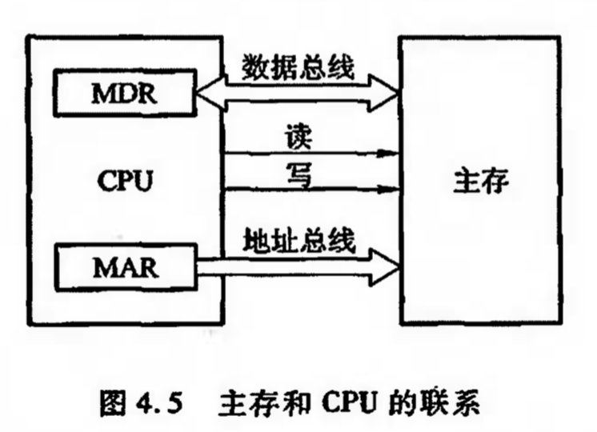

- 主存技术指标
    - 存储容量
    - 存储速度
        - = 存取时间+存取周期
    - 存储器带宽：单位时间存储器存取的信息量-
- 存储芯片的基本结构
    - 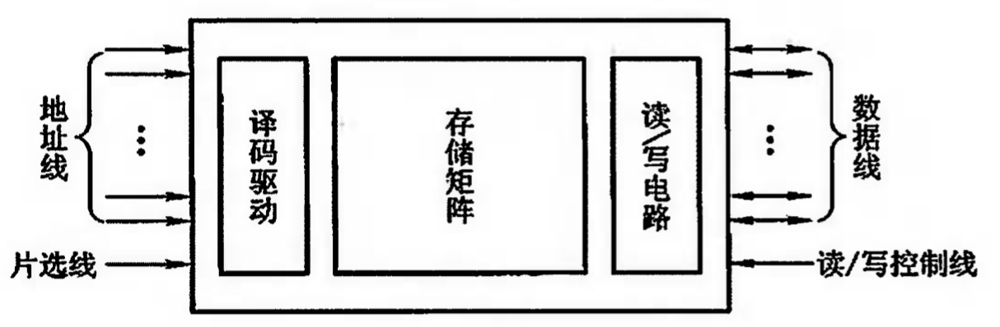
    - 地址线单向，数据线双向
    - 地址线和数据线共同反应了存储芯片的容量，例如地址线为10根，数据线为4根。则芯片容量为2^10*4

- 半导体存储芯片基本结构
    - 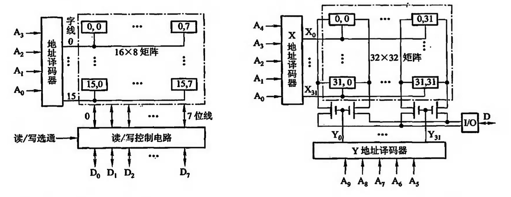
- 随机存储器(RAM)基本结构
    - 静态ram
        - 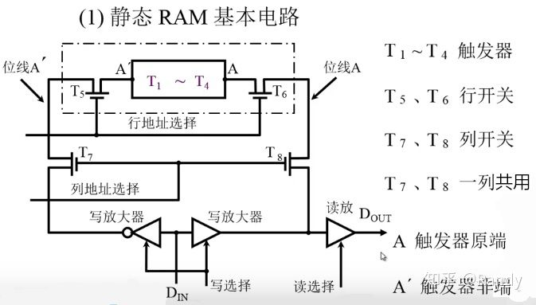
    - 动态ram
        - 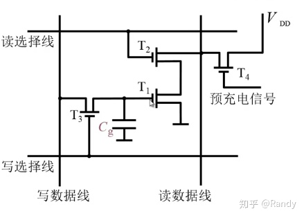
    - 动静态ram比较
        - 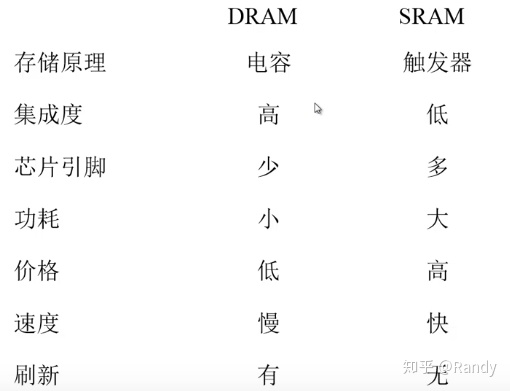
        静态ram贵容量低 一般做cache

- 只读存储器(ROM)
    - 只读存储器中通常保存系统配置，系统文件一类需要长期断电保存，不经常修改的数据

- 存储器与CPU的连接
    - 存储器容量扩展
        - 相比CPU的地址线宽，数据线宽，无法直接使用单块存储芯片来满足
        - 因此我们需要将多个存储芯片连接，扩展地址范围满足CPU地址线宽要求，扩展存储字长适应CPU数据线宽要求，从而构成一个存储(整)体
        - 位扩展（增加存储字长）
        - 字扩展（增加存储地址范围）
        - 字位同时扩展，增加片选位
- 存储器的校验
    - 奇偶校验与分组
        - 利用重叠分组，在检错的同时准确定位出错的位置
            - 汉明码
            - 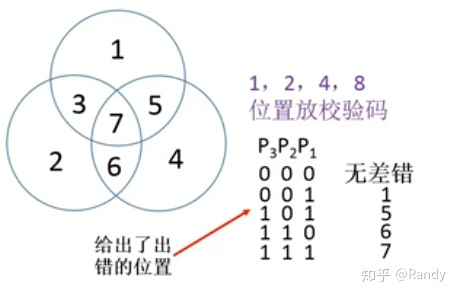

- 主存结构调整
    - 单体多字结构
    - 多体并行结构
- 高性能存储芯片 - cache
    - 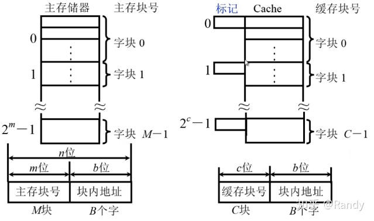
    - 块号 偏移地址
    - cpu cache 主存结构
        - 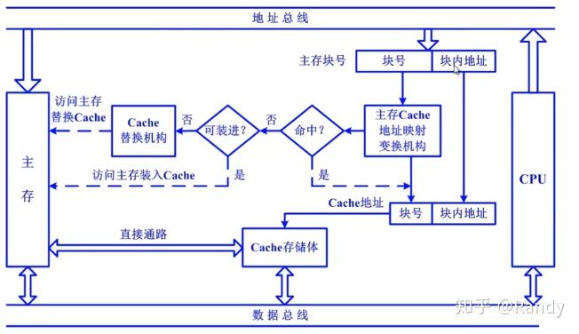
    - 对cache读操作
        - 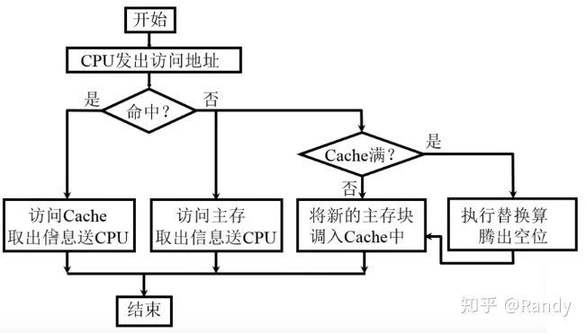
    - 写操作要注意一致性
    - cache-主存映射方法
        - 直接映射
            - 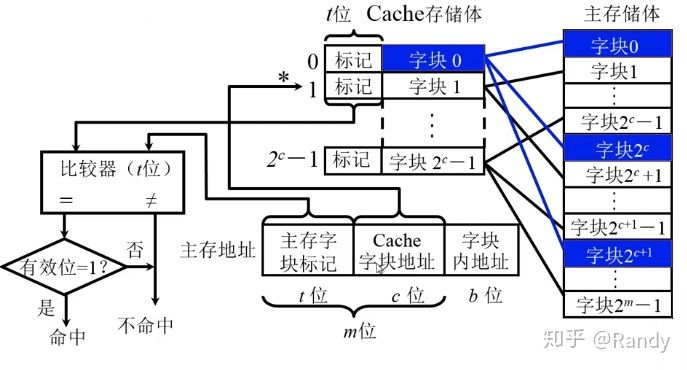
        - 全相联映射
            - 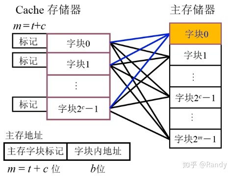
        - 它俩的综合 组相联映射
            - 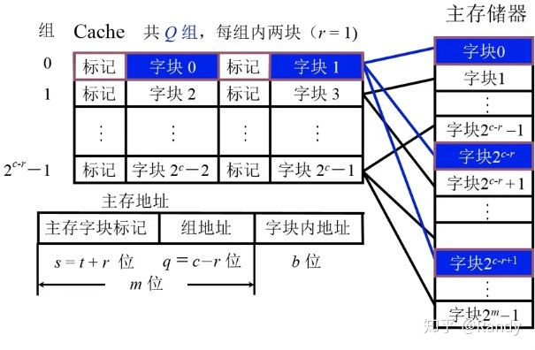
    - cache替换算法 fifo lru
    
    - 时间局部性
        - 当前正在使用的指令或者数据在不久的将来还会被使用到，这些数据应该放到cache里。
    - 空间局部性
        - 当前正在使用一个指令或数据，那么在不久的将来，相邻的指令或者数据也可能会被使用到。

- 辅助存储器
    - 磁表面存储器
        - 记录密度：记录密度描述磁盘表面存储二进制信息的密度，包含道密度和位密度
        - 存储容量：描述磁盘存储二进制信息的容量
        - 平均寻址时间：从给出地址信息到磁盘输出数据的平均时间
            - 平均寻址时间=寻道时间+等待时间
            - 寻道时间是针对移动磁头的磁表面存储器，磁头寻找磁道的平均时间
            - 等待时间是磁头来到指定磁道上方后，等待相应扇区旋转定位的时间

# 第五章 输入输出系统（IO）
- I/O设备是能够被接入到计算机上运行的一切外部设备的总称
- 5.1 概述
    - I/O设备与主机的联系方式
        - CPU对I/O设备的访问指令包括操作码、指令码、设备码
        - 操作码是一个标志，用于标识指令针对I/O设备进行控制
        - 指令码指出了需要进行何种控制操作
        - 设备码给出了I/O设备的编码、地址，或I/O设备中某个寄存器(端口)的地址
    - 编址方式
        - CPU需要访问I/O设备时，需要在设备码部分给出I/O设备的地址，这就涉及到了I/O设备的编址方式
        - 统一编址是将CPU地址总线宽度的一部分直接作为I/O设备的地址
        - 不统一编址/单独编址，对I/O设备的编址与内存地址不连读，独立于内存地址之外
    - 设备选址
        - 在CPU运行指令时，需要对指令地址进行解码，并通过设备选择电路，选中相应的设备进行工作
    - 传送方式
        - 串行和并行
    - 联络方式
        - CPU与I/O接口通常都是异步并行的，这里的联络方式针对I/O接口与I/O设备
        - 立即响应方式
        - 异步工作方式： 主要分串行和并行
        
    - I/O设备与主机的连接方式
        - 通过统一的I/O接口接入到计算机总线中进行连接，有利于工业化的生产，便于增删设备，用户自由扩展
    
    - I/O设备与主机信息传送的控制方式
        - 程序查询方式
            - 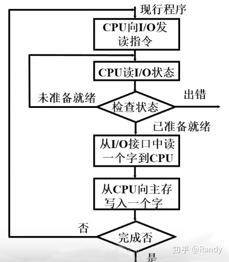
            - cpu需原地踏步等待
        - 程序中断方式
            - 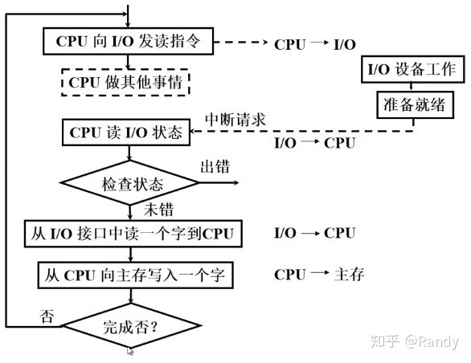
            - 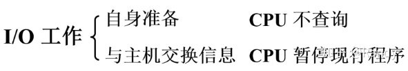
            - 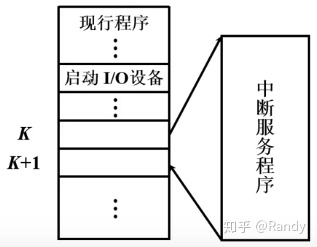
            - 与程序查询方式相比，程序中断方式没有CPU原地踏步等待的现象，一定程度上提高了效率
            - 但程序中断方式需要CPU记录相关的程序断点信息，才能完成中断跳转和转回，一次小数据量的读取，需要大量的指令处理中断操作
            - CPU在程序中断方式中，仍需要作为处理器，对I/O设备传输的数据进行处理（一拖二），并没有被真正的解放

        - DMA方式
            - DMA方式通过DMA处理器来完成对I/O设备传输数据的处理，实现了I/O设备与主存之间的直接联系，从而将CPU真正解放出来
            - 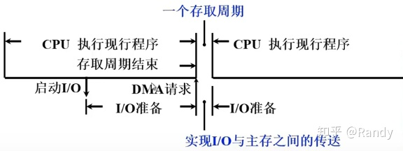
            - 当程序运行过程中出现I/O操作时，CPU向DMA控制器发送启动I/O的信号并继续执行其它工作
            - I/O设备在DMA控制器的控制下完成准备工作，随后DMA控制器向CPU发送DMA请求

            - CPU接到请求后，会让出一个或数个存取周期，系统总线的占用权限（周期挪用），在此期间CPU不能使用系统总线，不能访问内存

            - DMA控制器在挪用的存取周期内，通过系统总线，控制I/O设备与主存完成信息交换

            - 对于现代的CPU，即使让出了数个周期的系统总线权限，无法访问内存，仍能通过预取的指令和数据进行相应的工作（CPU工作可能不受影响）
            - 对比三种方式
            - 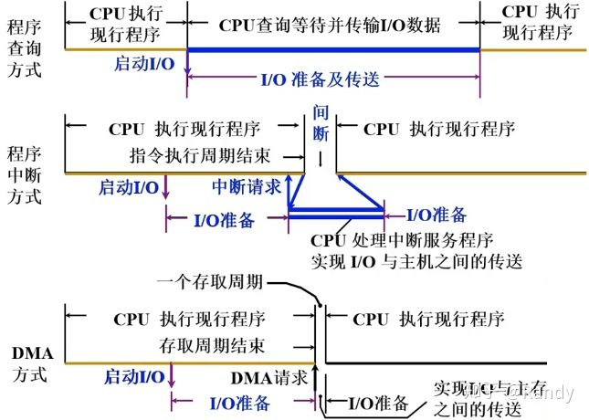

    
- 5.2 IO设备
    - 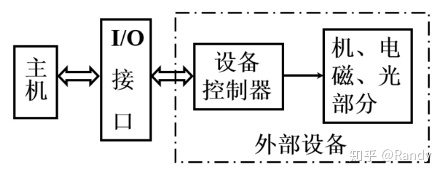

- 5.3 IO接口
    - I/O接口应具有以下功能：

        - 1.选址/设备选择功能，需要通过设备选择电路，对主机设备选择线上传递的I/O设备码/端口码进行判断匹配，控制I/O设备的启用与否

        - 2.命令传送功能，需要命令寄存器、译码器，将主机命令线路发来的控制命令转换并向外部I/O设备的控制器传递命令

        - 3.数据传输功能，需要数据缓冲寄存器，通过数据缓冲实现I/O设备与主机之间的传输速度匹配，主机与I/O之间通常使用并行传输，而I/O接口与设备之间通常使用串行传输，因此还需要实现 串 - 并 格式转换

        - 4.反应设备的状态，需要各种触发器来记录和反应外部I/O设备的工作状态，主机通过I/O接口获取外部I/O设备的工作状态

        - 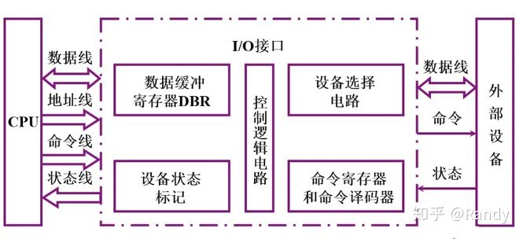
        - io设备与总线的连接电路
        - 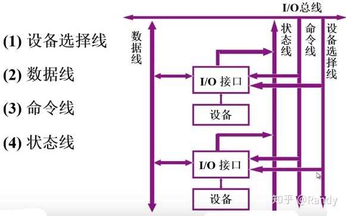
- 5.4 程序查询方式
    - 传输程序流程
        - 由于CPU寄存器容量有限，每单次传输后CPU需要将寄存器中的内容写入到主存中，再进行下一次传输
        - 传输中我们需要设定一个计数器来记录传输的数据量，每单次I/O设备-CPU寄存器-主存数据传输后累加计数器，通过计数器的数值辨别是否已经完成全部的数据传输任务
        - 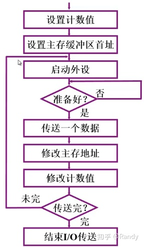
    - 接口电路
        - 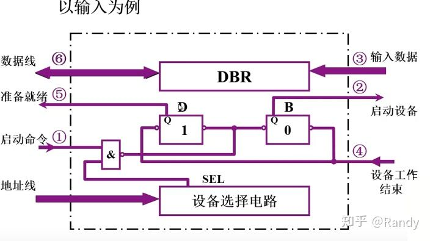
    - 以从I/O设备中读取数据的输入操作为例，电路流程如下：

        - 1.地址线/设备选择线路 上给出I/O设备的地址码/设备码，由I/O接口中的设备选择电路完成比对，输出选择信号并与启动信号过与门。选择设备并获得CPU启动指令的I/O接口，将完成状态触发器D置0，工作状态触发器B置1

        - 2.I/O设备控制器获得工作命令，响应工作状态/设备忙状态，开始准备数据

        - 3.I/O设备准备好数据并传输到DBR数据缓存中，设备通过状态线向接口反馈工作结束信号

        - 4.I/O接口获得设备工作结束信号后，完成状态触发器D置1，工作状态触发器B置0

        - 5.CPU循环查询到完成状态触发器D置1，寻找时机开启数据交换

        - 6.CPU通过数据总线从DBR中读取数据
        
- 5.5 程序中断方式
    - 中断的概念
        - 中断是一个广义的概念，是指CPU在运行程序的过程中，出现了某些特殊事件
        
        - CPU需要对当前程序运行的断点进行记录，并跳转执行中断服务程序
        - 在程序中断控制方式中，CPU需要作为I/O设备向主机传递数据的处理器，所运行的中断服务程序便针对于此
        - 当中断服务程序执行完成后，CPU会根据之前记录的程序断点，返回到原来执行的程序断点，继续向下运行原有程序
    - 中断流程
        - 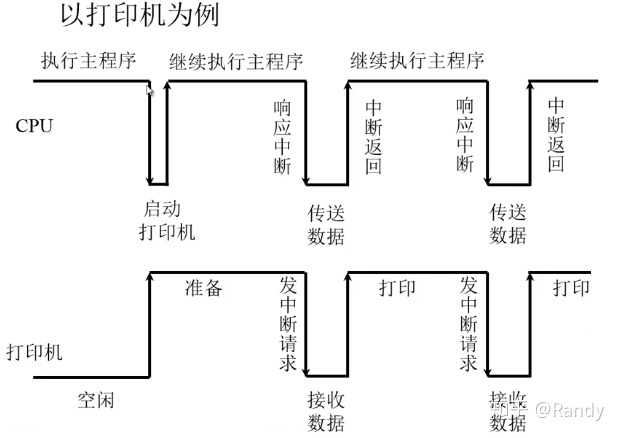
    - 中断接口电路
        - 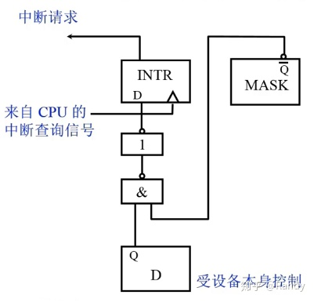
        - 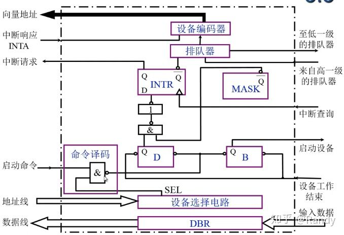

    - 中断向量地址形成部件
        - 中断向量包含了中断服务程序的段地址，偏移地址，从而指向内存中的某一条指令（该指令是中断服务程序的首指令，或跳转到中断服务程序的指令），也包含了执行中断服务程序时的一些状态信息（参数）
    
    - io中断处理过程
        - 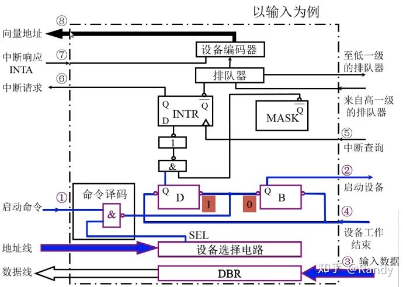
        - 如图以读取操作为例，I/O中断处理过程
        
        - 对于I/O接口通过设备选择线&CPU启动命令，设置状态触发器，I/O设备准备数据，传输到DBR缓存，之后进行中断请求的过程就不再赘述了
        - CPU发送中断查询信号后会将所有I/O接口中的INTR输出信号初始化(置1)，设备向触发器设置中断请求信号，之后使用排队器进行排队，向CPU发送被选中的中断请求信号
        - CPU发送响应中断请求信号INTA给设备编码器，之后获取编码器输出的向量地址
    - 中断服务程序流程
        - 首先CPU需要保护现场，对中断返回之后需要执行的下一条指令位置进行保存（程序断点），此外还要保存程序的运行状态（不能由之后的指令复现的对当前程序执行有用的状态信息），这两步保存操作完成由硬件自动完成，称之为中断隐指令(操作)
        - 如果在中断程序的运行中，需要占用体系结构寄存器，也需要先保存寄存器中的内容，以便程序返回后复现，可以通过压栈的方式存储，也可以写入到内存的某一位置，或是转存入其它寄存器中，这需要编写编写中断服务程序的程序员自行维护
        
        - CPU切入运行中断服务程序，中断服务程序针对不同的I/O设备编写，具有特定的功能
        - 完成中断服务程序后，CPU需要恢复现场，主要针对体系结构寄存器，通过 出栈/读取内存/读取寄存器 的方式复现原有的数据
        - CPU使用中断返回指令，根据程序断点定位下一条需要执行的程序指令位置，并继续运行原有程序
    
    - 单中断多中断对比
        - 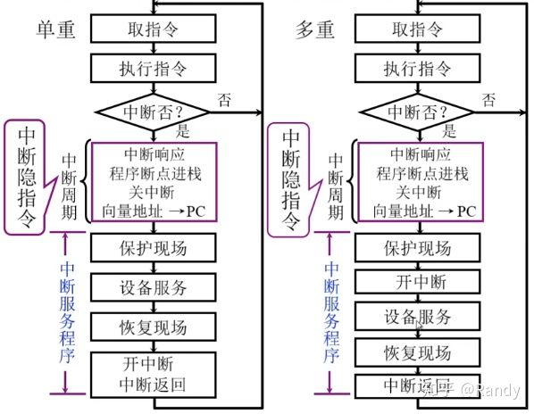
        - 单中断中，只有CPU完成中断服务程序，返回原程序后，才会执行开中断指令，响应其它中断请求
        - 而多中断中，则是提前开中断指令到进入中断服务程序后，在运行中断服务程序时允许更高级别的中断再次插入
        - 程序的断点，体系寄存器的值通过压栈保存，从而借助栈“先进先出”的特性，能够在中断的多重嵌套中，正确的获取当前层的返回信息
    - 主程序与中断服务程序抢占cpu流程图
            - 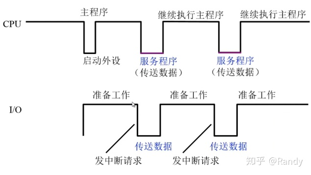
            - 宏观上CPU和I/O并行工作，体现在I/O设备进行准备时，CPU能并行执行主程序的运行
            - 但本质上，当I/O设备与主机真正开始数据交换时，CPU仍需要中断现行程序，运行中断服务程序，作为处理器对I/O设备与主机的数据交换进行服务，并没有被真正的解放
            
- 5.6 DMA方式
    - 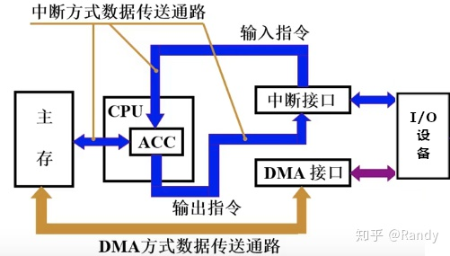
    - DMA与主存交换数据的三种方式
        - 停止CPU访问主存
        - 周期挪用（周期窃取）
        - DMA与CPU交替访问
    - DMA接口的功能与组成
        - DMA接口所具有的功能如下：
        
        - 1.向CPU提出总线占用申请
        - 2.处理总线控制权的转交
        - 3.获得控制权后，管理系统总线，控制数据传输
        - 4.确定传输的首地址和长度，记录传输的字长并累加传输地址，保证传输的有序完成
        - 5.传输结束时，给出操作完成信号移交总线控制权
    - DMA接口电路
        - 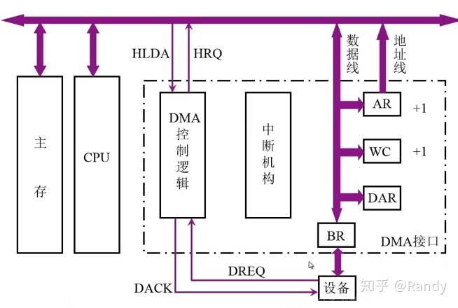
        - AR存储器中存储传输的目标地址，假设按从小到大的地址顺序，每进行一字长的传输就需要对AR存储器中的地址+1
        - WC存储器中保存传输的字长度，通常根据传输数据量先置为负数，并不断累加，直到0即为传输完成
        - BR存储器中缓存外部设备需要传输的数据
        - DAR存储器中保存DMA接口自身的地址，用于设备选择时进行比对，此外DAR存储器中还需要保存外部存储设备的相关地址参数，例如连接外部磁盘时保存磁道号，扇区号
        - AR通过地址线将需要访问的主存地址传输给主存
        - 数据线连接AR WC BR DAR存储器实现数据的输入输出
        - DMA控制逻辑需要接收来自外部设备请求传输的DREQ信号，向设备反馈相应信号DACK，向CPU发出总线占用请求HRQ信号，接收CPU的相应信号HLDA
        - 中断机构在传输过程中，接收来自WC的溢出信号（传输完成），向CPU发出传输中断请求，交还总线占用权，并进行传输后处理
    
    - DMA工作过程
        - DMA传输过程可分为三个阶段：预处理阶段、数据传送阶段、后处理阶段
        - 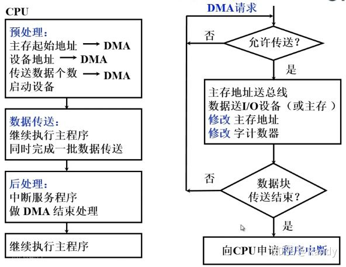
        - 如图预处理阶段由CPU启动I/O设备时，运行相应的指令完成，包括对DMA控制逻辑设置传送方向，对DAR设置设备地址，AR设置主存地址，WC设置传送字数
        - 数据传输过程由DMA控制I/O设备，在挪用的访存周期内完成，期间CPU可继续执行主程序
        - 当数据全部传输完成，DMA接口会发送中断请求，由CPU运行中断服务程序进行后处理

        - 数据传送的过程中，是一个从外部设备不断缓入数据到BR缓存器，再写入主存，或是从主存中不断读出数据到BR再写入外部设备的过程
        - 每次的周期挪用，完成数据传输后，需要根据WC存储器判断是否传输完成，若传输未完成，则需要再次从外设缓入数据到BR准备下一次传输，或从主存中读出数据到BR进行下一次写入，若传输完成则向CPU发送中断请求信号
    - DMA传输流程图
        - 数据从外部设备写入主存
            - 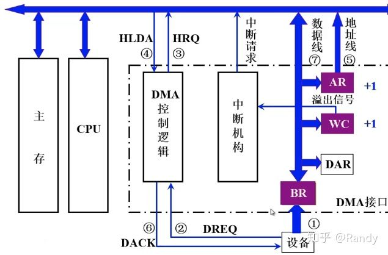
            - 1.CPU进行预处理，启动传输后，外部设备将一定批量的数据缓入BR存储器中
            - 2.达到BR存储器容量上限，或已缓入所有数据，外部设备向DMA控制发出DREQ信号表示准备工作完成，请求传输
            - 3.DMA控制逻辑通过总线向CPU发出HRQ信号申请总线占用申请
            - 4.CPU响应申请，发出HLDA应答信号
            - 5.AR存储器通过地址总线将传输目标地址置入主存，主存准备好写入
            - 6.DMA控制逻辑向设备发出DACK信号，表示开始进行传输
            - 7.通过数据线将BR中缓入的数据写入主存，并在写入完成后对AR地址和WC传输字长+1
            - 8.单次传输已完成，根据WC存储器累加后值判断传输是否完成，若未完成，设备会再次缓入数据到BR中，并再次申请总线占用，传输数据，若完成，中断机构向CPU发出中断请求，CPU运行中断服务程序进行后处理
        - 数据从主存写入外部设备
            - 1.BR存储器将缓存的全部数据传输给外部设备，完成写入
            - 2.BR存储器全部设备写入完成后，设备向DMA控制逻辑发出DREQ信号，表示传输完成
            - 3.DMA控制逻辑通过总线向CPU发出HRQ信号申请总线占用申请
            - 4.CPU响应申请，发出HLDA应答信号
            - 5.AR存储器通过地址总线将传输目标地址置入主存，主存准备好读出
            - 6.DMA控制逻辑向设备发出DACK信号，表示开始进行主存数据读出
            - 7.通过数据线将主存中的数据读出到BR存储器中，并对AR和WC+1
            - 8.单次写入完成，根据WC判断是否已完成写入，是否需要继续循环，或是发出中断请求
            WC存储器是在主存-BR进行数据传输完成后才会+1，之后根据其值判断是否完成数据传输，因此对于主存写入外部设备，最后一次主存-BR似乎读出了多余的不必要数据
            
        - 中断与DMA方式比较
            - 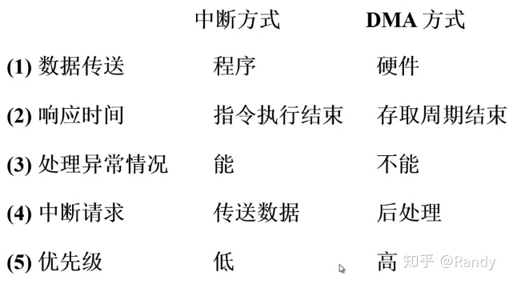
            - 存取周期是两次独立的读/写操作，从第一次开始到第二次开始，之间的最小时间间隔，也分为读周期/写周期

# 第六章 计算机的运算方法
- CPU的一大功能就是完成算术逻辑运算，为此我们需要将一些最基本的数据形式通过硬件表示，让CPU直接识别，并通过硬件组织实现一些最基本的逻辑运算处理
- 在程序的编写中，我们使用的 int float 一类的基础值类型数据就是直接实现在硬件上的数据形式，+/- 运算也是直接对应硬件实现来完成
- 程序中所有复杂的运算处理，都是通过组合硬件实现的基本运算来完成的，为此就需要我们编写机器语代码 汇编代码 上层语言代码来完成

- 6.1 数字表示
    - 无负号数的表示
        - 无符号数即没有正负的数/不需要符号位的数/恒正的数
        - 只需要将数字转换为二进制填入到内存/寄存器中即可
        - 内存/寄存器的长度，将直接影响/反应无符号数的范围，例如保存在8bit长度寄存器中的无符号数范围是0~255（对应8bit二进制的所有状态）
    
    - 有符号数
        - 有符号数需要1bit二进制作为符号位来记录正负号，0为正1为符，其它二进制位作为数字位（同无符号数）
        - 对于有符号数的保存，就需要提出真值和机器数的概念
        - 真值是数据在参与实际运算时所表现的数值，而机器数是一串二进制码
        - 例如8bit二进制：保存真值+5就对应机器数0,0000101
    
    - 小数点的位置约定（定点表示）
        - 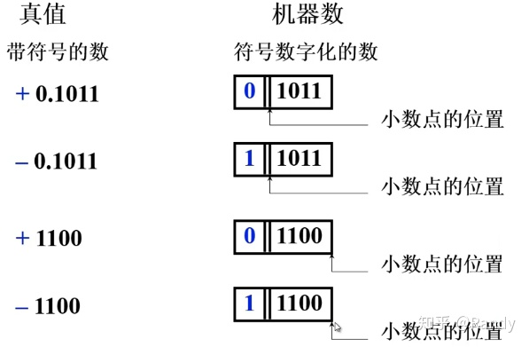
        - 计算机中，对于小数点的位置并没有硬件实现的位置记录，而是通过不同的数据类型约定默认位置的方式，这种方式称之为定点表示
        - 对于小数类型，小数点认为在符号位之后，数据位的最前端，定点表示下，小数均是纯小数
        - 对于整数类型，小数点认为在数据位末端（没有保存小数点后的数据），全部数据位二进制对应转换为一个整数
        
    - 源码表示法
        - 源码表示法即对于数据，保存其直接转为二进制的数据作为数据位，再使用1bit二进制做符号位，从而构成机器数
        - 以寄存器长度5bit的有符号整形源码表示法为例：
            - 对于整形+14
            - 符号位为0（正）
            - 数字14转为二进制对应1110
            - 因此其源码表示法就保存机器数为 0,1110
        - 小数的源码表示
            - 十进制小数转二进制可以通过不断乘2，取越位的方法实现
                - 例如0.8125转二进制小数
    
                - 0.8125*2=1.625 第一位取1
                
                - 0.625*2=1.25 第二位取1
                
                - 0.25*2=0.5 第三位取0
                
                - 0.5*2=1 第四位取1
                
                - 最终结果就是0.1101
                - 由于我们其实只能用 2^（-n）去将小数拼出来/或是拼出接近值，因此定点机中小数的表示受位数的限制，在表示范围内是离散的而不是连续的

            - 对于一个浮点数(整数部分+纯小数部分)，其直接转为二进制，就是将整数部分按照一般的整数-->二进制转换，再将纯小数部分转为二进制小数，连接起来中间加上小数点
            
                - 例如 14.8125 直接转为二进制
                
                - 整数部分14转为二进制为1110
                - 纯小数部分0.8125转为二进制0.1101
                - 因此14.8125转为二进制结果就是1110.1101
            - 源码表示的特点是简单直观，但在运算时存在下面的问题
                - 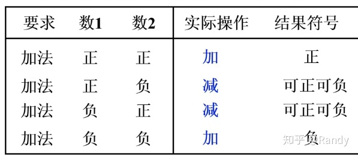
            - 那么有没有一种方法能够统一加法运算呢？

    -  补码表示法
        - 模是计量系统的计数范围上限+1，是计算器恰好产生“溢出”的量值,任何存储/处理范围有限的计数系统都具有模量
        - 例如:
            - 时钟的计量范围是 0~11 模量就是12，记为mod=12
            - 在n位字长下，积累范围就是 0~2^n-1 模量就是2^n
        - 补数
            - 以时钟为例，计量范围0~11 mod=12
                - 如果我们要将时间回拨3h，也就是-3的操作，其效果与将时间后拨9h，也就是+9的操作相同
                - 9就是-3在mod=12下的补数
            - 将负数不断累加n次模量，最终得到的在计数范围内的正数，就是负数在当前模量下的补数
            - 在计算中由于超过模量就要取模映射回范围，因此累加负数的效果就与累加其补数的效果相同
            
            - 例如 4-3=1 同 4+9=13=1
            - 从而借助补数我们就将减法，转换为加法
                - 以4位二进制 mod=16为例
                - 则-1011可以用+0101代替记作
            
            - 而对于正数而言，补数即为其原码本身
            - 可以理解为引入补数就是为了将负-->正/减-->加，而正数本身就是累加操作
        - 知道了计算补数的方法，但对于0101，需要增添一个符号位来区分它究竟是-1011的补数，
        还是+0101本身   
            - 这里我们可以将符号位和数据位看作一体，即4bit数据字长在加上符号位后变为5bit，转而将模量设为2^5=100000来计算补数
                - 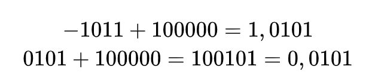
            - 补码表示就是将数据，以n=数据字长+1，2^n为模量计算得到的有符号补数（符号位+数据位）作为机器数记录

        - 纯小数的补码
            - 对于范围在[-1,1]之间的纯小数
            - 我们使用小数点后4bit数据位+1bit符号位
            - 对于正纯小数 +0.1110 其补码相当于它本身的原码 0.1110
            - 而对于负纯小数，由于范围是[-1,1]因此mod=2 可以通过10.0000来计算
                - 真值：-0.1100
                - -0.1100+10.0000=1.0100 即为补码
                - (数值10.0000减去数值0.1100得到补码)
        - 求补码的快速方法
            - 对于正数来说，无论是正整形还是正纯小数，其补码都是其原码
            - 而对于负数来说，我们对负数值，需要加对应模，从而得到负数的有符号补数（补码）
            - 对于 -1010 补码计算： -1010+100000=11111+1-1010=1,0101+1=1,0110对于 -1010 补码计算： -1010+100000=11111+1-1010=1,0101+1=1,0110
            - 我们发现对于中间结果10101，恰好是-1010的原码表示 1,1010 的符号位不变，数据位各位取反（与11111相减相当于各位取反）
            - 那么对于负数的补码，快速计算的方法即为：写出其原码，符号位不变，数值位各位取反再+1
            - 同样的对于一个负数的补码，我们将数值位先-1再各位取反（相当于先各位取反再+1），所得的结果就对应其真值(原码)
            - 补码1,0110 数值位各位取反再+1 结果 1,1010 即真值 -1010 的原码

        - -0的补码
            - 4bit数据位+1bit符号位下
            - 对于+0即0,0000它的补码是它本身 0,0000+100000=0,0000（10,0000高位溢出）
            - 而对于-0即1,0000，有趣的是它的补码也是它本身 1,0000+100000=1,0000 (11,0000高位溢出)

    

            
