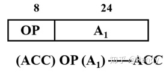
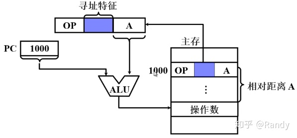
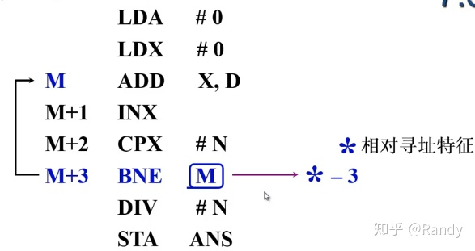
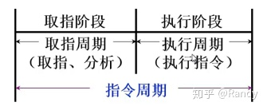
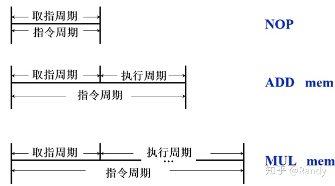
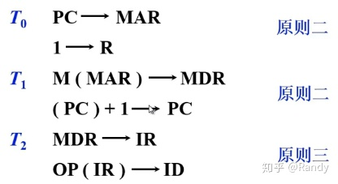
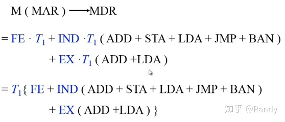

# 笔记： 
- https://zhuanlan.zhihu.com/p/118673379

# 1-3章. 概论，历史，总线
- 总线的功能是解决不同设备之间的通信问题。可以分为：片内总线、系统总线，其中系统总线可以分为数据总线、地址总线、控制总线。

- 地址总线？
    - cpu通过地址总线来指定存储单元，地址总线能传送多少个不同的信息，cpu就可以对多少个存储单元进行寻址。
- 数据总线？
    - cpu与内存或者其他外部器件之间的数据传送通过数据总线进行，数据总线的宽度决定了cpu和外界的数据传送速度。
    8跟数据总线一次可以传送8个二进制数据。16跟数据总线一次可以传送16个二进制数据（二个字节）。
- 控制总线？
    - 有多少跟控制总线，就意味着cpu对外部器件有多少种控制。控制总线的宽度决定了cpu对外部的控制能力。

- 典型cpu的组成
    - 运算器
        - 负责进行信息处理
    - 控制器
        - 控制各种器件进行工作
    - 寄存器
        - 寄存器进行信息存储
    - 片内总线负责cpu内部各个部件的联系
    - 系统总线负责cpu和主板上各个部件的联系
        

- 计算机的指令一般由操作码和地址码组成，那么计算机指令可以分类为几种类型？
    - 移位操作指令、数据传输指令、控制指令、算术逻辑操作指令。
    - 对计算机指令数据的寻址有哪几种方式？
        - 立即寻址、直接寻址、间接寻址。
    - 计算机的运算器主要由什么组成？控制器呢？

    - 控制器主要由：程序计数器、时序发生器、指令译码器、寄存器、总线组成。

    - 运算器主要由：数据缓冲器、ALU、寄存器、状态字寄存器、总线组成。

    - 请简述计算机指令的执行过程。
        -指令执行过程：取指令-分析指令-执行指令

- 指令和数据
    - 本地代码需要加载进内存才可以运行，内存中存储着构成本地代码的指令和数据。程序运行时，CPU从内存中将指令和数据读出来，然后放在CPU内部的寄存器中进行处理。

# 4. 第四章 存储器
- 存储器分类
    - 主存
        - 随机存储器(RAM)
            - 静态RAM
            - 动态RAM
                - 电容存储信息，信息会消失，所以要不断的刷新
        - 只读存储器(ROM)
    - 辅存
        - 磁盘
        - 磁带
        - 光盘
    - 缓存(cache)
- 按存取方式分类
    - 可分为随机访问存储器和串行访问存储器
    - 随机访问存储器存取时间与物理地址无关，只要给出地址就能进行寻址访问，例如内存
    - 而串行范围存储器，存取时间与物理地址有关，根据地址的不同存取时间会有所差异，需要针对物理地址位置进行一定的调整才能完成数据的读写，例如磁盘，磁带
    
- 存储器的层次结构
    - 寄存器
    - 缓存
    - 主存
    - 磁盘
    - 磁带
- 

- 主存技术指标
    - 存储容量
    - 存储速度
        - = 存取时间+存取周期
    - 存储器带宽：单位时间存储器存取的信息量-
- 存储芯片的基本结构
    - 
    - 地址线单向，数据线双向
    - 地址线和数据线共同反应了存储芯片的容量，例如地址线为10根，数据线为4根。则芯片容量为2^10*4

- 半导体存储芯片基本结构
    - 
- 随机存储器(RAM)基本结构
    - 静态ram
        - 
    - 动态ram
        - 
    - 动静态ram比较
        - 
        静态ram贵容量低 一般做cache

- 只读存储器(ROM)
    - 只读存储器中通常保存系统配置，系统文件一类需要长期断电保存，不经常修改的数据

- 存储器与CPU的连接
    - 存储器容量扩展
        - 相比CPU的地址线宽，数据线宽，无法直接使用单块存储芯片来满足
        - 因此我们需要将多个存储芯片连接，扩展地址范围满足CPU地址线宽要求，扩展存储字长适应CPU数据线宽要求，从而构成一个存储(整)体
        - 位扩展（增加存储字长）
        - 字扩展（增加存储地址范围）
        - 字位同时扩展，增加片选位
- 存储器的校验
    - 奇偶校验与分组
        - 利用重叠分组，在检错的同时准确定位出错的位置
            - 汉明码
            - 

- 主存结构调整
    - 单体多字结构
    - 多体并行结构
- 高性能存储芯片 - cache
    - 
    - 块号 偏移地址
    - cpu cache 主存结构
        - 
    - 对cache读操作
        - 
    - 写操作要注意一致性
    - cache-主存映射方法
        - 直接映射
            - 
        - 全相联映射
            - 
        - 它俩的综合 组相联映射
            - 
    - cache替换算法 fifo lru
    
    - 时间局部性
        - 当前正在使用的指令或者数据在不久的将来还会被使用到，这些数据应该放到cache里。
    - 空间局部性
        - 当前正在使用一个指令或数据，那么在不久的将来，相邻的指令或者数据也可能会被使用到。

- 辅助存储器
    - 磁表面存储器
        - 记录密度：记录密度描述磁盘表面存储二进制信息的密度，包含道密度和位密度
        - 存储容量：描述磁盘存储二进制信息的容量
        - 平均寻址时间：从给出地址信息到磁盘输出数据的平均时间
            - 平均寻址时间=寻道时间+等待时间
            - 寻道时间是针对移动磁头的磁表面存储器，磁头寻找磁道的平均时间
            - 等待时间是磁头来到指定磁道上方后，等待相应扇区旋转定位的时间

# 第五章 输入输出系统（IO）
- I/O设备是能够被接入到计算机上运行的一切外部设备的总称
- 5.1 概述
    - I/O设备与主机的联系方式
        - CPU对I/O设备的访问指令包括操作码、指令码、设备码
        - 操作码是一个标志，用于标识指令针对I/O设备进行控制
        - 指令码指出了需要进行何种控制操作
        - 设备码给出了I/O设备的编码、地址，或I/O设备中某个寄存器(端口)的地址
    - 编址方式
        - CPU需要访问I/O设备时，需要在设备码部分给出I/O设备的地址，这就涉及到了I/O设备的编址方式
        - 统一编址是将CPU地址总线宽度的一部分直接作为I/O设备的地址
        - 不统一编址/单独编址，对I/O设备的编址与内存地址不连读，独立于内存地址之外
    - 设备选址
        - 在CPU运行指令时，需要对指令地址进行解码，并通过设备选择电路，选中相应的设备进行工作
    - 传送方式
        - 串行和并行
    - 联络方式
        - CPU与I/O接口通常都是异步并行的，这里的联络方式针对I/O接口与I/O设备
        - 立即响应方式
        - 异步工作方式： 主要分串行和并行
        
    - I/O设备与主机的连接方式
        - 通过统一的I/O接口接入到计算机总线中进行连接，有利于工业化的生产，便于增删设备，用户自由扩展
    
    - I/O设备与主机信息传送的控制方式
        - 程序查询方式
            - 
            - cpu需原地踏步等待
        - 程序中断方式
            - 
            - 
            - 
            - 与程序查询方式相比，程序中断方式没有CPU原地踏步等待的现象，一定程度上提高了效率
            - 但程序中断方式需要CPU记录相关的程序断点信息，才能完成中断跳转和转回，一次小数据量的读取，需要大量的指令处理中断操作
            - CPU在程序中断方式中，仍需要作为处理器，对I/O设备传输的数据进行处理（一拖二），并没有被真正的解放

        - DMA方式
            - DMA方式通过DMA处理器来完成对I/O设备传输数据的处理，实现了I/O设备与主存之间的直接联系，从而将CPU真正解放出来
            - 
            - 当程序运行过程中出现I/O操作时，CPU向DMA控制器发送启动I/O的信号并继续执行其它工作
            - I/O设备在DMA控制器的控制下完成准备工作，随后DMA控制器向CPU发送DMA请求

            - CPU接到请求后，会让出一个或数个存取周期，系统总线的占用权限（周期挪用），在此期间CPU不能使用系统总线，不能访问内存

            - DMA控制器在挪用的存取周期内，通过系统总线，控制I/O设备与主存完成信息交换

            - 对于现代的CPU，即使让出了数个周期的系统总线权限，无法访问内存，仍能通过预取的指令和数据进行相应的工作（CPU工作可能不受影响）
            - 对比三种方式
            - 

    
- 5.2 IO设备
    - 

- 5.3 IO接口
    - I/O接口应具有以下功能：

        - 1.选址/设备选择功能，需要通过设备选择电路，对主机设备选择线上传递的I/O设备码/端口码进行判断匹配，控制I/O设备的启用与否

        - 2.命令传送功能，需要命令寄存器、译码器，将主机命令线路发来的控制命令转换并向外部I/O设备的控制器传递命令

        - 3.数据传输功能，需要数据缓冲寄存器，通过数据缓冲实现I/O设备与主机之间的传输速度匹配，主机与I/O之间通常使用并行传输，而I/O接口与设备之间通常使用串行传输，因此还需要实现 串 - 并 格式转换

        - 4.反应设备的状态，需要各种触发器来记录和反应外部I/O设备的工作状态，主机通过I/O接口获取外部I/O设备的工作状态

        - 
        - io设备与总线的连接电路
        - 
- 5.4 程序查询方式
    - 传输程序流程
        - 由于CPU寄存器容量有限，每单次传输后CPU需要将寄存器中的内容写入到主存中，再进行下一次传输
        - 传输中我们需要设定一个计数器来记录传输的数据量，每单次I/O设备-CPU寄存器-主存数据传输后累加计数器，通过计数器的数值辨别是否已经完成全部的数据传输任务
        - 
    - 接口电路
        - 
    - 以从I/O设备中读取数据的输入操作为例，电路流程如下：

        - 1.地址线/设备选择线路 上给出I/O设备的地址码/设备码，由I/O接口中的设备选择电路完成比对，输出选择信号并与启动信号过与门。选择设备并获得CPU启动指令的I/O接口，将完成状态触发器D置0，工作状态触发器B置1

        - 2.I/O设备控制器获得工作命令，响应工作状态/设备忙状态，开始准备数据

        - 3.I/O设备准备好数据并传输到DBR数据缓存中，设备通过状态线向接口反馈工作结束信号

        - 4.I/O接口获得设备工作结束信号后，完成状态触发器D置1，工作状态触发器B置0

        - 5.CPU循环查询到完成状态触发器D置1，寻找时机开启数据交换

        - 6.CPU通过数据总线从DBR中读取数据
        
- 5.5 程序中断方式
    - 中断的概念
        - 中断是一个广义的概念，是指CPU在运行程序的过程中，出现了某些特殊事件
        
        - CPU需要对当前程序运行的断点进行记录，并跳转执行中断服务程序
        - 在程序中断控制方式中，CPU需要作为I/O设备向主机传递数据的处理器，所运行的中断服务程序便针对于此
        - 当中断服务程序执行完成后，CPU会根据之前记录的程序断点，返回到原来执行的程序断点，继续向下运行原有程序
    - 中断流程
        - 
    - 中断接口电路
        - 
        - 

    - 中断向量地址形成部件
        - 中断向量包含了中断服务程序的段地址，偏移地址，从而指向内存中的某一条指令（该指令是中断服务程序的首指令，或跳转到中断服务程序的指令），也包含了执行中断服务程序时的一些状态信息（参数）
    
    - io中断处理过程
        - 
        - 如图以读取操作为例，I/O中断处理过程
        
        - 对于I/O接口通过设备选择线&CPU启动命令，设置状态触发器，I/O设备准备数据，传输到DBR缓存，之后进行中断请求的过程就不再赘述了
        - CPU发送中断查询信号后会将所有I/O接口中的INTR输出信号初始化(置1)，设备向触发器设置中断请求信号，之后使用排队器进行排队，向CPU发送被选中的中断请求信号
        - CPU发送响应中断请求信号INTA给设备编码器，之后获取编码器输出的向量地址
    - 中断服务程序流程
        - 首先CPU需要保护现场，对中断返回之后需要执行的下一条指令位置进行保存（程序断点），此外还要保存程序的运行状态（不能由之后的指令复现的对当前程序执行有用的状态信息），这两步保存操作完成由硬件自动完成，称之为中断隐指令(操作)
        - 如果在中断程序的运行中，需要占用体系结构寄存器，也需要先保存寄存器中的内容，以便程序返回后复现，可以通过压栈的方式存储，也可以写入到内存的某一位置，或是转存入其它寄存器中，这需要编写编写中断服务程序的程序员自行维护
        
        - CPU切入运行中断服务程序，中断服务程序针对不同的I/O设备编写，具有特定的功能
        - 完成中断服务程序后，CPU需要恢复现场，主要针对体系结构寄存器，通过 出栈/读取内存/读取寄存器 的方式复现原有的数据
        - CPU使用中断返回指令，根据程序断点定位下一条需要执行的程序指令位置，并继续运行原有程序
    
    - 单中断多中断对比
        - 
        - 单中断中，只有CPU完成中断服务程序，返回原程序后，才会执行开中断指令，响应其它中断请求
        - 而多中断中，则是提前开中断指令到进入中断服务程序后，在运行中断服务程序时允许更高级别的中断再次插入
        - 程序的断点，体系寄存器的值通过压栈保存，从而借助栈“先进先出”的特性，能够在中断的多重嵌套中，正确的获取当前层的返回信息
    - 主程序与中断服务程序抢占cpu流程图
            - 
            - 宏观上CPU和I/O并行工作，体现在I/O设备进行准备时，CPU能并行执行主程序的运行
            - 但本质上，当I/O设备与主机真正开始数据交换时，CPU仍需要中断现行程序，运行中断服务程序，作为处理器对I/O设备与主机的数据交换进行服务，并没有被真正的解放
            
- 5.6 DMA方式
    - 
    - DMA与主存交换数据的三种方式
        - 停止CPU访问主存
        - 周期挪用（周期窃取）
        - DMA与CPU交替访问
    - DMA接口的功能与组成
        - DMA接口所具有的功能如下：
        
        - 1.向CPU提出总线占用申请
        - 2.处理总线控制权的转交
        - 3.获得控制权后，管理系统总线，控制数据传输
        - 4.确定传输的首地址和长度，记录传输的字长并累加传输地址，保证传输的有序完成
        - 5.传输结束时，给出操作完成信号移交总线控制权
    - DMA接口电路
        - 
        - AR存储器中存储传输的目标地址，假设按从小到大的地址顺序，每进行一字长的传输就需要对AR存储器中的地址+1
        - WC存储器中保存传输的字长度，通常根据传输数据量先置为负数，并不断累加，直到0即为传输完成
        - BR存储器中缓存外部设备需要传输的数据
        - DAR存储器中保存DMA接口自身的地址，用于设备选择时进行比对，此外DAR存储器中还需要保存外部存储设备的相关地址参数，例如连接外部磁盘时保存磁道号，扇区号
        - AR通过地址线将需要访问的主存地址传输给主存
        - 数据线连接AR WC BR DAR存储器实现数据的输入输出
        - DMA控制逻辑需要接收来自外部设备请求传输的DREQ信号，向设备反馈相应信号DACK，向CPU发出总线占用请求HRQ信号，接收CPU的相应信号HLDA
        - 中断机构在传输过程中，接收来自WC的溢出信号（传输完成），向CPU发出传输中断请求，交还总线占用权，并进行传输后处理
    
    - DMA工作过程
        - DMA传输过程可分为三个阶段：预处理阶段、数据传送阶段、后处理阶段
        - 
        - 如图预处理阶段由CPU启动I/O设备时，运行相应的指令完成，包括对DMA控制逻辑设置传送方向，对DAR设置设备地址，AR设置主存地址，WC设置传送字数
        - 数据传输过程由DMA控制I/O设备，在挪用的访存周期内完成，期间CPU可继续执行主程序
        - 当数据全部传输完成，DMA接口会发送中断请求，由CPU运行中断服务程序进行后处理

        - 数据传送的过程中，是一个从外部设备不断缓入数据到BR缓存器，再写入主存，或是从主存中不断读出数据到BR再写入外部设备的过程
        - 每次的周期挪用，完成数据传输后，需要根据WC存储器判断是否传输完成，若传输未完成，则需要再次从外设缓入数据到BR准备下一次传输，或从主存中读出数据到BR进行下一次写入，若传输完成则向CPU发送中断请求信号
    - DMA传输流程图
        - 数据从外部设备写入主存
            - 
            - 1.CPU进行预处理，启动传输后，外部设备将一定批量的数据缓入BR存储器中
            - 2.达到BR存储器容量上限，或已缓入所有数据，外部设备向DMA控制发出DREQ信号表示准备工作完成，请求传输
            - 3.DMA控制逻辑通过总线向CPU发出HRQ信号申请总线占用申请
            - 4.CPU响应申请，发出HLDA应答信号
            - 5.AR存储器通过地址总线将传输目标地址置入主存，主存准备好写入
            - 6.DMA控制逻辑向设备发出DACK信号，表示开始进行传输
            - 7.通过数据线将BR中缓入的数据写入主存，并在写入完成后对AR地址和WC传输字长+1
            - 8.单次传输已完成，根据WC存储器累加后值判断传输是否完成，若未完成，设备会再次缓入数据到BR中，并再次申请总线占用，传输数据，若完成，中断机构向CPU发出中断请求，CPU运行中断服务程序进行后处理
        - 数据从主存写入外部设备
            - 1.BR存储器将缓存的全部数据传输给外部设备，完成写入
            - 2.BR存储器全部设备写入完成后，设备向DMA控制逻辑发出DREQ信号，表示传输完成
            - 3.DMA控制逻辑通过总线向CPU发出HRQ信号申请总线占用申请
            - 4.CPU响应申请，发出HLDA应答信号
            - 5.AR存储器通过地址总线将传输目标地址置入主存，主存准备好读出
            - 6.DMA控制逻辑向设备发出DACK信号，表示开始进行主存数据读出
            - 7.通过数据线将主存中的数据读出到BR存储器中，并对AR和WC+1
            - 8.单次写入完成，根据WC判断是否已完成写入，是否需要继续循环，或是发出中断请求
            WC存储器是在主存-BR进行数据传输完成后才会+1，之后根据其值判断是否完成数据传输，因此对于主存写入外部设备，最后一次主存-BR似乎读出了多余的不必要数据
            
        - 中断与DMA方式比较
            - 
            - 存取周期是两次独立的读/写操作，从第一次开始到第二次开始，之间的最小时间间隔，也分为读周期/写周期

# 第六章 计算机的运算方法
- CPU的一大功能就是完成算术逻辑运算，为此我们需要将一些最基本的数据形式通过硬件表示，让CPU直接识别，并通过硬件组织实现一些最基本的逻辑运算处理
- 在程序的编写中，我们使用的 int float 一类的基础值类型数据就是直接实现在硬件上的数据形式，+/- 运算也是直接对应硬件实现来完成
- 程序中所有复杂的运算处理，都是通过组合硬件实现的基本运算来完成的，为此就需要我们编写机器语代码 汇编代码 上层语言代码来完成

- 6.1 数字表示
    - 无负号数的表示
        - 无符号数即没有正负的数/不需要符号位的数/恒正的数
        - 只需要将数字转换为二进制填入到内存/寄存器中即可
        - 内存/寄存器的长度，将直接影响/反应无符号数的范围，例如保存在8bit长度寄存器中的无符号数范围是0~255（对应8bit二进制的所有状态）
    
    - 有符号数
        - 有符号数需要1bit二进制作为符号位来记录正负号，0为正1为符，其它二进制位作为数字位（同无符号数）
        - 对于有符号数的保存，就需要提出真值和机器数的概念
        - 真值是数据在参与实际运算时所表现的数值，而机器数是一串二进制码
        - 例如8bit二进制：保存真值+5就对应机器数0,0000101
    
    - 小数点的位置约定（定点表示）
        - 
        - 计算机中，对于小数点的位置并没有硬件实现的位置记录，而是通过不同的数据类型约定默认位置的方式，这种方式称之为定点表示
        - 对于小数类型，小数点认为在符号位之后，数据位的最前端，定点表示下，小数均是纯小数
        - 对于整数类型，小数点认为在数据位末端（没有保存小数点后的数据），全部数据位二进制对应转换为一个整数
        
    - 源码表示法
        - 源码表示法即对于数据，保存其直接转为二进制的数据作为数据位，再使用1bit二进制做符号位，从而构成机器数
        - 以寄存器长度5bit的有符号整形源码表示法为例：
            - 对于整形+14
            - 符号位为0（正）
            - 数字14转为二进制对应1110
            - 因此其源码表示法就保存机器数为 0,1110
        - 小数的源码表示
            - 十进制小数转二进制可以通过不断乘2，取越位的方法实现
                - 例如0.8125转二进制小数
    
                - 0.8125*2=1.625 第一位取1
                
                - 0.625*2=1.25 第二位取1
                
                - 0.25*2=0.5 第三位取0
                
                - 0.5*2=1 第四位取1
                
                - 最终结果就是0.1101
                - 由于我们其实只能用 2^（-n）去将小数拼出来/或是拼出接近值，因此定点机中小数的表示受位数的限制，在表示范围内是离散的而不是连续的

            - 对于一个浮点数(整数部分+纯小数部分)，其直接转为二进制，就是将整数部分按照一般的整数-->二进制转换，再将纯小数部分转为二进制小数，连接起来中间加上小数点
            
                - 例如 14.8125 直接转为二进制
                
                - 整数部分14转为二进制为1110
                - 纯小数部分0.8125转为二进制0.1101
                - 因此14.8125转为二进制结果就是1110.1101
            - 源码表示的特点是简单直观，但在运算时存在下面的问题
                - 
            - 那么有没有一种方法能够统一加法运算呢？

    -  补码表示法
        - 模是计量系统的计数范围上限+1，是计算器恰好产生“溢出”的量值,任何存储/处理范围有限的计数系统都具有模量
        - 例如:
            - 时钟的计量范围是 0~11 模量就是12，记为mod=12
            - 在n位字长下，积累范围就是 0~2^n-1 模量就是2^n
        - 补数
            - 以时钟为例，计量范围0~11 mod=12
                - 如果我们要将时间回拨3h，也就是-3的操作，其效果与将时间后拨9h，也就是+9的操作相同
                - 9就是-3在mod=12下的补数
            - 将负数不断累加n次模量，最终得到的在计数范围内的正数，就是负数在当前模量下的补数
            - 在计算中由于超过模量就要取模映射回范围，因此累加负数的效果就与累加其补数的效果相同
            
            - 例如 4-3=1 同 4+9=13=1
            - 从而借助补数我们就将减法，转换为加法
                - 以4位二进制 mod=16为例
                - 则-1011可以用+0101代替记作
            
            - 而对于正数而言，补数即为其原码本身
            - 可以理解为引入补数就是为了将负-->正/减-->加，而正数本身就是累加操作
        - 知道了计算补数的方法，但对于0101，需要增添一个符号位来区分它究竟是-1011的补数，
        还是+0101本身   
            - 这里我们可以将符号位和数据位看作一体，即4bit数据字长在加上符号位后变为5bit，转而将模量设为2^5=100000来计算补数
                - 
            - 补码表示就是将数据，以n=数据字长+1，2^n为模量计算得到的有符号补数（符号位+数据位）作为机器数记录

        - 纯小数的补码
            - 对于范围在[-1,1]之间的纯小数
            - 我们使用小数点后4bit数据位+1bit符号位
            - 对于正纯小数 +0.1110 其补码相当于它本身的原码 0.1110
            - 而对于负纯小数，由于范围是[-1,1]因此mod=2 可以通过10.0000来计算
                - 真值：-0.1100
                - -0.1100+10.0000=1.0100 即为补码
                - (数值10.0000减去数值0.1100得到补码)
        - 求补码的快速方法
            - 对于正数来说，无论是正整形还是正纯小数，其补码都是其原码
            - 而对于负数来说，我们对负数值，需要加对应模，从而得到负数的有符号补数（补码）
            - 对于 -1010 补码计算： -1010+100000=11111+1-1010=1,0101+1=1,0110对于 -1010 补码计算： -1010+100000=11111+1-1010=1,0101+1=1,0110
            - 我们发现对于中间结果10101，恰好是-1010的原码表示 1,1010 的符号位不变，数据位各位取反（与11111相减相当于各位取反）
            - 那么对于负数的补码，快速计算的方法即为：写出其原码，符号位不变，数值位各位取反再+1
            - 同样的对于一个负数的补码，我们将数值位先-1再各位取反（相当于先各位取反再+1），所得的结果就对应其真值(原码)
            - 补码1,0110 数值位各位取反再+1 结果 1,1010 即真值 -1010 的原码

        - -0的补码
            - 4bit数据位+1bit符号位下
            - 对于+0即0,0000它的补码是它本身 0,0000+100000=0,0000（10,0000高位溢出）
            - 而对于-0即1,0000，有趣的是它的补码也是它本身 1,0000+100000=1,0000 (11,0000高位溢出)

        -  已知x求-x的补码
            - 只需对x的补码连同符号位，各位取反，再加1即可

    - 反码表示
        - 正数的反码与原码一致，负数的反码是符号位不变数据位各位取反
        - “反”就是各位取反（但只针对负数）
        - 对于负数而言，反码可看作原码和补码转换的中间过渡，原码的反码+1就是补码，补码的反码+1就是原码
        - 例如
            - 真值+13
            - 原码与反码相同:0,1101
            - 真值-13
            - 原码:1,1101
            - 反码:1,0010
        - 对于纯小数，反码的表示和转换规则与整形一样
        - 例如
            - 真值+0.8125
            - 原码与反码相同:0.1101
            - 真值-0.625
            - 原码:1.1010
            - 反码:1.0101
        - 已知反码求原码，注意符号位，如果为正反码与原码相同，若为负数据位各位取反即是原码

    - 原码 补码 反码 总结
        - 对于正数而言，原码=补码=反码
        - 对于负数
            - 符号位均为1
            - 数值部分：原码等于其绝对值，反码是原码各位取反，补码是反码+1
        - 对于0
            - ±0 的原码和反码不同，但补码相同
        - 8bit二进制下，真值、原码、补码、反码 表示数据的范围如下表
            - 
            - 计算机中规定，对于有符号整形数据，机器数均采用补码存储，加减法采用补码统一运算

    - 移码
        - 之所以要引入移码，是由于用补码判断真值大小逻辑复杂
        
            - 这里回看一下上面8bit下补码和真值的对应表，我们来理一下用补码判断真值大小的逻辑：
            
            - 如果两数同为正，则二进制补码大的一方的真值大
            
            - 如果两束同为负，则二进制补码大的一方真值大
            
            - 但在一正一负比较时，无论时我们连同符号位一起看，还是只看数据位，都是二进制补码小的一方（为正）真值大，逻辑无法统一
            
            - 因此不得不在最开始加入一个对符号位的判断逻辑，这使得电路实现比较复杂
        - 移码的定义与特点
            - 如果数据位有 n bit，那么移码就是真值加上2^n对应的 n+1 bit 长度的二进制码
                - 如图5bit数据位下，移码有6bit
                - 
                - nbit位长度，n-1bit有符号数据，如果采用其移码判断大小，则无论正负，均是二进制数据大的一方真值大（逻辑统一）
                - 从而数学计算中的0（真值0），补码中的0，和移码中的0，都是统一的，只有唯一的0，原码和反码中，存在±0的不同问题

    - 浮点数的表示
        - 定点数与浮点数
            - 早期计算机在硬件上仅实现了定点数，如果需要存储浮点数，就需要程序员在软件层面实现
            - 一般的做法是通过移动小数点的位置，从而将数据部分一分为二，一部分作为整数的部分，一部分作为小数的部分
            - 但事实上这种做法不仅实现困难，也难以统一标准，并且直接转为二进制计数，小数点前后可能保存过多无用的0，数据存储单元的利用率并不高

        - 浮点采用n进制科学计数法，一般形似可作为
            - 
            - S尾数 j阶码 r基值
            - 基值取2、4、8、16等（一般为2）
            - 
            - 联系上面的公式，将尾数/阶码/基值依次保存在内存中，就构成了浮点数的机器数

        - 浮点表示范围
            - 一个基值为2 尾数1bit符号+n位 阶码1bit符号+m位
            - 
            - 使用二进制科学计数法，因而在范围内，数据是离散的，我们是在使用范围内有限的数据表示无限多的实数（存在近似处理）

            - 尾数的长度将决定离散的精度，如果数据位数过多，值过于精细，在末尾就会发生丢失，计算机会取近似处理，保留有限的数据位数
            
            - 二进制科学计数法本身的离散问题，以及尾数长度的有限，导致了计算机浮点运算的不精确
            - 阶码长度则决定了范围的大小，上溢即所需阶码>最大阶码时将按计算出错处理，下溢即所需阶码<最小阶码则按机器零处理

        - 浮点数的规格化表示
            - 通常我们会采用规格化形式，禁止尾数存0扩充阶位，保证浮点数的精确性

- 6.2 数字运算
    - 定点运算
        - 定点运算是针对于定点数（整型）进行的运算，主要包括位移，加减，乘除
        - 移位运算
            - 以+26为例
            - 
            - 以-26为例，移位操作补码
            - 
        - 算术移位和逻辑移位
            - 算术移位对应有符号数的移位
            - 逻辑移位则对应无符号数的移位
        - 加减运算
            - 当求加法时，只需写出AB的补码，并连同符号位一起累加，溢出在符号位后，就能得到A+B的补码即结果
            - 当求A-B时，只需通过B计算出-B的补码（6.1.5.7），再视为A+(-B)的情况即可
            - 定点加法运算中，整形，纯小数，均适用以上规则，计算时应注意存储字长的统一
        - 溢出判断
            - 对数据位最高有效位的进位和符号位相加后的进位做异或操作
                - 对于正+正，符号位0+0=0进位为0，不溢出则保持符号位为0，数据位最高位不产生进位也是0（异或结果为0），若数据位产生进位1（异或结果为1）则发生了溢出
                - 对于负+负，符号位1+1=0进位为1，为保持符号位为1，必然要接收数据位的进位1（异或结果为1），若溢出则数据位不产生进位，进位为0（异或结果为1）

            - 另一种方法是多位符号位

                - 之前的1bit符号位是通过整形以2的n+1次方为模，纯小数以2为模进行计算
                
                - 在使用k位符号位时，对应整形以2的n+k次方为模，纯小数以2k为模
                - 此时为正，符号位全是0，为负符号位全是1
                
                - 加减时，若未溢出，所有符号位应全部为1或是0
                
                - 当符号位数值有不同时（通过异或判断），必然是数据位产生溢出的影响，此时最高位的符号位代表其真正的符号

        - 乘法运算
            - 移位相加
            - 各位积通过移位相加，从B的末尾开始，每次相加前对累计结果右移1位，之后相加当前产生的位积
            - 
        - 除法运算
            - 
            - 每位递推时，笔算写法在被除数/余数后补0，其实对应除数右移一位

            - 式商1/0比较除数右移后与被除数/余数的大小即可
            
            - 能商1时需要用当前余数低位补0减去右移后的除数
            
            - 上商的位置不断向后递推
            
            - s在除法笔算的过程中，除数不断的被右移，所得余数的位数也在不断增长
            
            一般情况下除法操作无法除尽，因而需要设置运算的位数上限
            - 
            - 

        - 浮点运算
            - 让我们回想一下浮点数的组成，基值+阶码+符号+尾数
            - 对阶
                - 对阶会采用增加阶码，尾数右移，即小阶位向大阶位对齐的方式进行
            - 规格化
                - 计算完成后，我们会在补码的形式下进行规格化（与之前讲到的原码规格化不同），完成规格化后再转为原码保存
                - 补码的规格化判断中，符号位和尾数高位若相同，则未进行规格化
            - 左归
                - 若发现符号位和尾数位高位相同，且不等于-0.5，就需要进行左归，尾数左移1位阶码减1，直到数符和第一位数不同位置
                - 

            - 右规
                - 在左归之前，我们应先判断右规的情况，右规是发现两位符号位不同时（尾数计算溢出），此时固定右规1位，阶码+1，高符号位自复制填补即可

- 6.3 算术逻辑单元
    - 算术逻辑单元即ALU电路，也就是计算机中的运算器，之前介绍的硬件实现定点/浮点的加减乘除运算功能，都被继承在这个电路中实现。ALU再与控制器继承在一起，便构成了CPU

    - ALU电路
        - 
        - ALU的特点是一个组合逻辑电路，在Ai和Bi输入端有信号下，由Ki控制进行的运算逻辑，并产生Fi输出结果
        - 如果输入端信号消失，那么输出端信号也会消失（不具有记忆功能）

    - 进位链设计与优化
        - 全加器的外特性如图
            - 
            - 为了产生每一位的结果，除了当前位上的输入外，我们还需获得前一位的进位数Ci-1
            - 
            - 串行进位链
            - 并行进位链（先行进位/跳跃进位）
                - 思路是不要将上一位完全做成一个结果，而是把构成上一位的数据直接传递给下一位
                - 对比串行和并行，串行进位逻辑/电路实现简单但速度慢，n位会逐渐累计延迟，并行进位逻辑/电路复杂，但速度快，能同时产生进位
            - 单重分组跳跃进位链
                - 结合串行和并行进位，我们将n位全加器的进位链分层若干小组，组内并行链接同时产生进位，组间串行链接进位
            - 双重分组跳跃进位链
                - 双重分组可以看作是单重分组的二重嵌套
                - 先将n位全加器分为若干大组，大组内分为若干小组，每小组中是基础的n位进位链
                - 小组内采用并行链接（同单重分组），大组内各小组也采用并行链接，大组之间采用串行链接

# 第七章 指令系统
- 在1-5章中我们介绍了计算机内部的大致组组成，第6章中我们开始深入CPU内部，介绍了计算机中的数字表示，ALU如何实现各类运算，以及进位链的设计和优化
- 
- 接下来我们将进一步了解CPU内部的组成，终点介绍计算机的指令系统，包括指令规范，控制器CU的设计/工作原理，如何解码运行指令，如何设计指令的排队与中断
- 

- 7.1 机器指令
    - 机器指令是计算机软件的最底层，是完全面向硬件的，能够被计算机硬件（CPU）直接识别和执行的指令
    - 机器指令完由0/1代码构成，并且不同的硬件都有自己的一套指令代码（指令集），指令集直接公开/对应了硬件所实现的各类功能，包括各种逻辑/算术运算，内存的读写
    - 当然机器指令作为沟通计算机硬件和软件的中介，计算机系统/体系结构中对此有更为详细的介绍，这里计组课程中，我们主要学习机器指令的格式特点，以联系机器指令如何被CPU识别和解码执行

    - 7.11 指令格式
        - 指令一般可分为操作码和地址码
        - 操作码
            - 其中操作码不止要指出需要执行的操作，还需要指出操作对象的类型，对于不同对象的同一操作会运行不同的逻辑（怎么做）
            - 例如IBM360中的操作码，一条加法指令还可细分为定点加法，浮点加法，此外一些机器中的操作码还指出了操作数的寻址方式
            - 可分为固定长度操作码和可变长度操作码
            - 扩展操作码
                - 通常有保留码点作为扩展标值，或是使用某一位作为扩展标值
                - 如果指令长度不变，那么我们在扩展操作码长度的同时，地址码长度就需要减少
                - 对于保留码点作为扩展标志的扩展技术，以16bit指令长度4段为例
                
                - 基础操作码占用1段4bit，地址码占3段12bit，如果不进行扩展那么，指令就只有16种，且都是4位操作码12位地址码的指令
                - 这里我们可以保留4位全1的码点作为扩展标记，当第一段出现全1时，代表进行了扩展，同样的如果第二段也出现了全1，即再次扩展，以此类推
                - 如图我们进行了三次扩展，均以全1作为扩展标记
                - 
                - 当然我们也可以不止用全1作为标记，例如除了全1，1110也可是扩展标记（保留码点）
                - 对计算机硬件操作进行指令编码时，通常频繁出现的指令会使用短指令，而出现频率较低的指令会使用长指令
        - 地址码
            - 四地址
                - 
                - 四地址是最长的地址码形式，如图共有4段
                - A1是第一操作数地址
                - A2是第二操作数地址
                - A3是结果需要保存的地址
                - A4是下一条指令的地址地址
                - 该指令执行后会进行4次访存，取出A1和A2执行OP操作，将结果存入A3，并读取下一条指令A4
                - 四地址的寻址范围非常有限，设指令字长32位，操作码8位，那么每条地址长6位，只能进行2^6=64范围的寻址，因此四地址指令并不常见
            - 三地址
                - 
                - 我们可以用程序计数器（Program Counter,PC）来代替A4，每取出一条指令后，PC都会自加1从而指向下一条指令的地址，由此就构成了三地址指令
                - 三地址仍需要4次访存，地址码位长度略有增加，假设同前，地址码长8位，三地址寻址范围为2^8=256
            - 两地址
                - 
                - 我们可以将计算的结果覆盖存入到A1或A2（其中一个操作数）中，从而就不需要A3，形成两地址指令
                - 两地址指令仍需要4次访存，假设同前，地址码长12位，寻址范围来到了2^12=4K
                - 我们也可以将运算结果保存到ACC中，从而访存次数变为3次
                - 当然还有一种情况是其中一个操作数在ACC中，A1是另一个操作数，A2是保存位置，这样访存次数也是3次
            - 一地址
                - 
                - 如果其中一个操作数已经存入了ACC中，只需要取另一个操作数A1，保存位置也是ACC，那么就构成了1地址指令
                - 1地址指令需要两次访存，假设同前，地址码长24位，寻址范围来到2^24=16M
                - 多数常见的计算机指令都是围绕ACC进行的一地址指令，不妨回想一下之前加法/减法的指令实现

            - 零地址
                - 即只有操作码的指令
                - 事实上这样的指令有不少，例如围绕ACC进行取反/左移/右移/判断
                - 对于堆栈型设备，围绕堆栈的指令也可以是零地址的，例如取栈顶两数加和结果入栈

    - 7.12 指令字长
        - 指令字长取决于三方面的因素
            - 
            - 操作码和地址码所需的长度无疑会影响指令字长，而对于可变长度指令来说，操作数的个数亦会影响其长度
    - 7.13 总结指令格式
        - 首先对于一些围绕硬件资源进行的指令操作，操作数/保存位置 可以通过隐含的形式给出
        - 从而在指令长度固定的情况下，可以将更多位长分配给单段地址码，从而扩大指令的寻址范围
        - 不固定指令长度下，这种做法亦可以直接减少指令字长，对于零地址指令可以只有8位操作码
        - 对于围绕寄存器进行的指令，也能直接减少访存次数
        - 如果指令的操作数，保存位置，下一条指令都位于寄存器中，那么执行指令的过程中甚至可以做到不访存
        - 当指令的地址指向寄存器时，由于计算机寄存器数量/容量均有限，只需要很少的位数就能完成编址，从而也可以减少指令的字长，以及访存次数
- 7.2 操作数类型和操作类型
    - 机器字长：CPU一次能处理数据的位数，通常与CPU的寄存器位数有关。 
    - 存储字长：存储器中一个存储单元(存储地址)所存储的二进制代码的位数
    - 7.2.1 操作数类型
        - 操作数类型即计算机需要进行处理的数据类型，主要有以下四种形式
            - 1.地址，例如跳转指令，或下一条需要执行的指令地址，地址可分为绝对地址（无符号数）和相对地址（有符号数）
    
            - 2.数字，包括定点数，浮点数
            
            - 3.字符，以ASCII码形式给出
        
            - 4.逻辑数，进行逻辑运算的数据，通常是一段二进制掩码
    - 7.2.2 数据在存储器中的存放方式
        - 数据在内存当中的布局模式，以存储字长64位，机器字长32位，半字/单子/双字的存储布局为例
        - 从任意位置开始存储
            - 
            - 即有空就塞，这种模式能够充分利用内存空间，但在程序读取时，由于按存储字寻址访问

            - 这种模式下一个数据可能被保存在两个存储字中，导致需要两次读入才能加载完数，中间还需清理无用数据
            
            - 并且CPU读取时只能固定读取64字长的前32位或后32位（地址最小偏移量），因此即便一个单子存储在一个存储字长内，如果它的位置不对齐，那么也需要读取两次

        - 始终从一个存储字的起始位置开始存储
            - 
            - 这种模式下，在寻址后就可以立即进行数据的读取（无需字内移动），是速度最快的一种模式，但浪费了大量的空间
        - 边界对齐法
            - 
            - 对于一个数据，它的存储起始地址编码位置必须整倍于它的位长度
            - 这种方法是前两种方法的一个折中，虽然仍有所浪费，并且寻址后还需字内移址，但能保证可以以最少的次数读取需要的数据，无需清理无用数据
    - 7.2.3 操作类型
        - 数据传送
            - 完成寄存器/存储器之间数据的交换，访存指令是数据传送指令的一类
            - 
        - 算术逻辑操作
            - 包括定点数/浮点数加减乘除，自增自减，求补，与，或，非，异或，取反，位测试，位清楚等等，都是最基本的直接由硬件实现的运算功能
        - 移位操作
            - 包括算术移位，逻辑移位，循环移位（带进位或不带进位）
        - 转移/跳转
            - 无条件跳转JMP，可以让程序立即跳转执行目标地址下的指令
        - 调用和返回
            - 即编程中执行函数/方法的过程，由主程序调用子程序，进程转移至子程序运行，子程序还可调用其它子程序，形成嵌套
            - 当执行return时程序会返回调用的位置，通常结合堆栈一类的数据结构的特性来实现调用的嵌套
            - 
        - 陷阱
            - 陷阱指令时一种底层的直接由硬件实现的异常处理指令
            - 当程序运行时发生意外事故的中断（主要是底层实现的算术逻辑运算异常），例如操作数非封，操作数越界，除数为0，会启用陷阱指令跳转至异常处理程序
        - 输入输出
            - 并不是所有指令集都有输入输出指令，如果I/O端口作为内存编址空间的一部分，那么只需要通过访存指令就可以完成输入输出操作
            - 如果I/O端口有自己独立的编址空间，就需要有输入/输出指令，来明确指令给出的地址针对某个端口
            - 输入输出指令的作用是完成CPU寄存器和I/O端口之间的数据交换

- 7.3 寻址方式
    - 寻址即确定本条指令的操作数地址和下一条要执行的指令地址
    - 7.3.1 指令寻址
        - 指令寻址主要有顺序寻址和跳跃寻址两种方式
            - 多数情况下程序指令都是顺序存储的，通过PC自加1来完成顺序寻址，要注意的是这里的1累加的是1指令字长，从而由当前地址自增为下一条指令的起始地址
            - 跳转寻址则是根据跳转指令，跳转到指定的地址位置，从该位置开始继续顺序向下执行程序指令
            - 
    - 7.3.2 数据寻址
        - 指令中的地址码可以拆分成寻址特征码和形式地址码
        - 
        - 形式地址码是指令中使用的表示地址的代码，形式地址并不一定是真实的内存地址，需要根据寻址特征，进行一定的运算转为真实的内存地址（有效地址），或是通过其它运算操作，从而通过形式地址获取操作数
        
        - 立即寻址/立即数
            - 立即寻址即形式地址A本身就是操作数（立即数），可以通过原码/补码形式给出，可以实定点数/浮点数，亦需要寻址特征码指明立即数的形式
            - 由于指令被执行时已经加载到了寄存器，如果使用的立即数，则无需访存，直接在寄存器内将立即数传输至运算单元的输入（ACC）即可
            - 形式地址A的位数会限制立即数的范围
        - 直接寻址
            - 即形式地址A本身就是真实的内存地址（有效地址），通过形式地址进行访存就能获取操作数
            - 

        - 隐含寻址
            - 即之前提到的，围绕硬件资源（ACC）进行的操作，操作数的位置可以通过隐含的形式给出
            - 这种隐含寻址的寻址特征码，是通过相应的操作码体现
            - 例如一指令加法操作码出现时，就已经表明了只需取一个操作数，另一个操作数就是ACC中的数据
            - 

        - 间接寻址
            - 有效地址由形式地址间接提供，这情况下形式地址也是真实的内存地址，但该地址下内存中的数据并不是操作数，而是操作数的地址（C语言中的指针）
            - 
            - 通过间接寻址，可以扩大寻址范围，形式地址A的范围有限，但对应到内存中的数据字长，可以用更大的空间存储范围更广的地址，并且我们只需更换相应内存地址下的地址数据就可以达到更换操作数的效果，有利于程序的修改，代码的复用
            - 例如，我们将主程序记录的断点位置，存储到内存地址A下，当子程序执行完后，通过间接寻址的JUMP指令，即可返回主程序保存的断点位置，继续执行主程序
            - 
        - 寄存器寻址
            - 即形式地址给出的是寄存器地址（寄存器编号），代表操作数位于该编号下的寄存器中
            - 使用寄存器寻址无需访存，执行速度快，并且由于寄存器个数有限，可缩短指令字长
            - 

        - 寄存器间接寻址
            - 即形式地址给出的寄存器编号，对应的寄存器数据是操作数内存的真实地址
            - 这种情况下仍需要访存来获取操作数，但由于操作数地址在寄存器中便于即时修改，因此这种方式可以很方便的实现循环程序
            - 
        - 基址寻址
            - 采用专用寄存器作为基址寄存器，这种情况下形式地址A就是一个累加值/偏移量，将基值寄存器中的地址累加形式地址A，即可得到操作数的真实内存地址
            - 
            - 采用通用寄存器作为基址寄存器，这种情况下形式地址是两部分，一部分是作为基址寄存器的编号，另一部分是累加值/偏移量
            - 用户可以指定那个通用寄存器作为基址寄存器，但基址寄存器内容仍由操作系统决定
            - 

        - 变址寻址
            - 但与基址寻址不同的是，IX变址寄存器中的内容可以由用户指定，并在程序执行过程中动态修改，变址寻址有利于实现数组的循环处理程序
            - 
            - 

        - 相对寻址
            - 即相对于PC的值，累加形式地址给出的偏移量获得操作数地址
            - 这种方法有利于程序浮动（程序打破顺序存储），广泛应用于转移指令中
            - 但要注意的是相对寻址的偏移量与指令的字长密切相关，并且在现代计算机中，当跳转指令被取出时PC已经发生了自增，因而相对寻址的偏移量需要考虑PC的自增问题
            - 
            - 

        - 堆栈寻址
            - 
            - 以硬堆栈为例，栈顶地址由SP指出，进栈操作SP--，出栈操作SP++
            - 这里的自减1和自加1，对应一个数据单元的字节长

- 7.4 指令格式举例
    - 7.4.1 设计指令格式时的考虑
        - 指令系统应具有向后兼容的特性，即使用早期版本指令系统编写的程序，除大版本更迭，断代外，应能在支持新版本指令系统的硬件上正常运行
        
        - 指令的个数，指令与操作的类型、操作频率的对应
        
        - 操作数据的类型，如何区分数据类型
        
        - 指令格式，字长是否固定，操作码是否扩展，地址码的位数个数、寻址方式，寄存器个数（决定编号长度）
    - 7.4.2 Intel 8086
        - 
- 7.5 RISC与CISC
    - RISC（Reducced Intruction Set Computer）精简指令集计算机，与之相对的CISC（Complex Instruction Set Computer）复杂指令集计算机
    - RISC 只选用使用频率较高的简单指令，和少数频率不高但必要的指令，对于复杂的功能由简单指令组合实现
    - CISC：指令系统庞大复杂，各种指令使用频度相差较大
    - RISC能充分利用VLSI芯片的面积，对于简单程序能提高计算机运算速度，便于芯片的设计制作，提高可靠性，优化编译支持高级语言
    - CISC指令能力强，寻址方式多样，通过微程序控制技术长，有利于指令集的兼容性

# 第八章 CPU的结构和功能
- 本章中我们将在第七章的基础上，介绍CPU的内部组成和功能实现，讲解CPU执行、处理指令的原理和方法，如何应用指令流水技术提高硬件执行指令的速度，以及CPU的中断系统

- 8.1 CPU的结构与功能
    - CPU的控制器和运算器分别具有以下功能
    - 控制器：
        - 从内存单元中读取指令
    
        - 解码指令
        
        - 执行指令，发出各种操作命令，控制相应的部件有序完成指令操作
        
        - 控制程序输入就结果的输出
        
        - 总线管理
        
        - 处理异常情况和特殊请求

    - 运算器：
    
        - 实现指令所对应的算术/逻辑运算

    - CPU的功能可总结为
        - 指令控制：读取解码有序执行指令
        
        - 操作控制：有序的发出各种控制信号控制相应的部件完成质量操作
        
        - 时序控制：指令的有序执行，操作信号的有序发出
        
        - 处理中断：处理异常情况和特殊请求
        
        - 数据加工：完成由硬件实现的基础算术/逻辑运算
    - CPU基本结构框图
        - 
        - 外连控制总线/数据总线/地址总线

        - 其中控制总线为双向，即传输CPU的控制信号，又回传部件的控制反馈
        
        - 数据总线双向，即需要将CPU的运算结构保存到存储器，又需要从存储器中读取操作数
        
        - 地址总线为单向，只由CPU解码指令后发出地址信号，进行外部寻址
        - 指令的控制需要PC控制电路控制指令有序读取、解码、指令，以及IR寄存器保存读入的指令

        - 操作控制和时间控制需要CU时序电路（8.3节将详细介绍）
        
        - 对于RISC，CU可采用硬连线组合逻辑实现，而对于CISC，CU可采用微程序的方式实现
        
        - 数据加工由运算电路和相应的寄存器构成的ALU算术运算单元完成（第六章已详细介绍）
        
        - 此外中断处理需要中断系统来完成（8.4节将详细介绍）

- 8.2 CPU的寄存器
    - 用户可见的寄存器
        - 1.通用寄存器
            - 可通过上层机器语言编程，存放指定信息的寄存器，可以保存操作数/中间结果，可作为某种寻址方式所需的专用寄存器
        
        - 2.数据寄存器
            - 专用于存放操作数的寄存器，用户可读写寄存器中的数据，数据寄存器对于定点/浮点数有针对性的特化，两个数据寄存器可以拼接在一起保存双倍字长的数据（例如乘法运算中的ACC+MQ）

        - 3.地址寄存器
            - 专用于存放地址的寄存器，这类寄存器会连接外部地址总线，向外部发送寻址信号，其位数应满足地址范围，例如8086中的段基址，栈指针寄存器
        - 4.条件码寄存器
            - 存放运算的中间结果，运算的状态信息（例如正、负、零、溢出、进位），这类寄存器会连接逻辑判断电路，作为程序分支的控制依据

        - 控制寄存器
            - CPU操作控制中需要使用到的寄存器，例如从内存中读取命令，数据的传递流程
            - 
            - 其中M是存储体，MAR MDR IR 都是用户不可见的寄存器，而PC是用户可见的寄存器
        - 状态寄存器
            - 条件码寄存器是状态寄存器的一类，是用户可见的
            
            - 在程序中断，保存程序断点的隐指令操作中，保存硬件/软件信息的PSW程序状态字寄存器是另一类状态寄存器
            
            - PSW是由计算机硬件设计者，将大量的，各类硬件/软件信息进行统一集中存储用的寄存器，是用户不可见的
            
            - 通过程序状态字的切换就可交换程序执行现场

- 8.3 指令周期
    - 8.3.1 指令周期的基本概念
        - 指令周期是完成一条指令的全部时间

        - 完成一条指令可分为取指阶段（读取指令，解码分析）和执行阶段（发出控制信号，控制相应部件完成指令操作）
        
        - 针对于运算类指令的执行阶段的操作为：取操作数，运算得到结果，保存结果

        - 
        - 各阶段周期长度，受时序控制，均是最短时钟周期的整数倍
        - 取指周期长度固定，所有指令都具有取值周期

        - 一些指令可能不具有执行周期，例如NOP空指令
        
        - 一些指令取值周期和执行周期等长，例如加法指令
        
        - 一些指令执行阶段可能需要更长的时轴周期，例如乘法指令
        - 
        - 此外对于间接寻址的指令，需要多次访存才能读取操作数，因而可以在取指周期后加入一个间址周期，用于读取/寻找操作数的地址
        - 
            - 间址周期完成多次寻址读取，直到找到操作数的地址，再进入执行周期，读取操作数，完成运算，保存结果

        - 对于指令中断的支持，我们需要在指令周期末尾加入中断周期，来检测是否有中断请求，是否需要相应中断，并保存程序断点
        - 
        - 
        - CPU工作周期的标值
            - 分析指令周期的各阶段，我们不难发现各个阶段都有访存操作
            - 
            - 因此我们需要设置标识，用于标记指令周期的子阶段，以便控制器发出读/写控制命令，完成各阶段中特定寄存器与存储器之间的数据交换
            - 

    - 8.3.2 指令周期的数据流
        - 取指周期数据流
            - 
            - 如图PC中保存了下一条要取的指令地址，PC将地址送入MAR，传输到地址总线上
            
            - 存储器获取地址信号，在CU读取信号控制下，读取相应内存单元中的指令，经数据总线送入MDR中
            
            - MDR再将指令送入IR中进行解码，CU控制PC自加1指向下一条指令地址
        - 间址周期数据流
            - 
            - 如果指令采用了间接寻址，可以加入间址周期来寻访操作数地址

            - 进入间址周期前，由于进行了指令的读取，因此IR和MDR中都有指令的地址码，本例中以MDR将地址码送入MAR（也可由IR送入）
            
            - MAR接受地址码后，将地址信号送入地址总线，存储器接收地址信号再经CU读控制信号，将操作数的地址数据，经地址总线送入MDR中
        - 中断周期数据流
            - 如果检测到了中断请求，并进行中断响应，中断周期内需要进行的操作依次是：保存程序断点，形成中断程序入口地址，关中断（停止中断请求的发送）
            - 
            - 由CU确定程序断点需要保存的地址，将地址填入MAR，经地址总线送入存储器，同时CU发出写操作命令

            - 程序断点就是当前要执行的下一条指令地址，即PC中的数据，因此PC将指令地址送入MDR，经数据总线写入存储单元
            
            - 中断程序的入口地址由CU确定并写入PC中

- 8.3 指令流水
    - 指令流水技术是现代计算机中最常用的提高指令解释速度的方法
    - 对于访存速度的提升，我们可以使用高速芯片，架设多层Cache，对存储芯片交叉编址多体并行访问
    
    - 对于I/O与主机之间的传输速度，从串行，到中断请求，再到DMA I/O处理及，我们不断提升I/O系统的自治能力，解放CPU
    
    - 对于运算器速度的提示，除了使用高速芯片外，还可改进算法，使用快速进位链
    
    - 而对于整机的处理能力提升，除了使用高速器件外，我们可以改进计算机系统结构，开发系统的并行性
    - 8.3.1 系统的并行性
        - 过程级（程序、进程）上的并行是粗粒度的并行，通常使用软件实现

        - 而指令级，指令之间，指令内部（微指令）的细粒度并行，则需要硬件实现
    - 8.3.2 指令流水的基本原理
        - 如图我们给出一个6级指令流水，假设每一段时间都是相同的

        - 各段执行的操作为：FI（取指令）DI（指令译码）CO（间址寻址）FO（取操作数）EI（执行指令）WO（结果写回）
        - 

    - 8.3.3 影响指令流水的因素
        - 1.执行时间>取指时间
            - 这种情况下并行的取指操作已经完成，然而执行部件还未做完上一条指令的操作
            - 对此一个解决方法是加设指令缓冲区，采用指令预取技术
        - 2.条件转移指令/控制相关
            - 对于条件转移指令，必须等待上一条指令运行结果，进行判定才能确定下一条指令的地址，为此便会造成损失
            - 如果发现条件转移指令，比较稳定的方法时全部流水的暂停，转为串行，等待结果，判定转移，为此便会造成时间的损失
            - 如果仍正常进行流水，则一旦运行结果判定发生转移，则并行期间就执行了大量的无效指令，需要大量的清理重置操作，并转移到相应的指令重开并行处理

        - 3.结构相关
            - 流水中，同一周期内，不同指令的执行阶段争用同一 功能部件/资源 产生冲突
            - 如图标为蓝色的部分，FO取操作数、FI取指令、WO写回结果都需访存因而产生冲突
            - 
            - 常见的解决方法是加入停顿/气泡，发生争用时高优先级阶段获得资源低优先级被迫等待，到下一周期再继续执行

            - 针对访存冲突，我们可以将指令存储器和数据存储器分离（哈佛结构），如果取指令访存周期较短，可结合缓存采用指令预取技术，在空闲时读入多条指令到缓存中待用
        - 4.数据相关
            - 不同指令重叠操作，可能改变操作数的读写访问顺序
            - 如图我们可区分出三种读/写相关次序
            - 
            - 在流水并行时，我们需要保证运行结构与串行相同，分析并行阶段次序的重叠嵌套，实际只有RAW在读/写次序改变时，会影响运算结果

    - 8.3.4 流水线性能描述
        - 吞吐量
            - 单位时间内流水线所完成指令/输出结果的数量，吞吐量分为最大吞吐和实际吞吐

        - 加速比
            - m段的流水线速度与等功能的非流水线的速度之比

    - 8.3.5 基于指令流水进一步提升效率的方法
        - 超标量技术
            - 在流水线的基础上，我们可以布置多条流水线，在一个时钟周期内，可以有多条指令进入到不同的流水线中执行

            - 为了布置多体条流水据需要我们配置多个功能部件，并通过编译优化将能够并行执行不发生冲突的指令筛选出来
            
            - 如图我们布置了三条流水，同一周期内可开启三条指令并行执行，从而流水线吞吐量能提升三倍
            - 

        - 超流水技术
            - 我们可以将一个时钟周期/一个流水段再进行细分，从而一个流水内同一个功能部件可多次被使用，也能达到同一周期并发多条指令的效果
            - 在流水线的设计中，我们需要在各阶段间加入锁存器，将上一阶段执行的结果锁存，作为下一流水段执行时的输入数据/控制信号，而超流水技术中，一个周期内的细分段之间不会使用锁存器，因此一个关键的技术是保证处于统一阶段中的不同指令，不发生信号的叠加
            - 
        - 超长指令字技术
            - 由编译程序找到能够并行执行的多条指令，并将多条指令操作组合为一条超长的（可达几百字节）指令字

    - 8.3.6 流水线的结构与设计
        - 指令流水线结构
            - 指令流水的设计是将一个指令周期中，从取指，译码执行到保存结构的一整个过程划分为多个子阶段，通常划分为图中的6阶段，并交由不同的部件进行独立执行
            - 这样的划分子阶段和各阶段由独立的部件独立完成，是构建流水线的基础，此外各阶段之间需要通过锁存器用于保存前一流水段的执行结果，为转交到下一阶段由另一部件执行提供引启/数据输入
            - 
        - 运算流水线
            - 

- 8.4 中断系统
    - 8.4.1 引发中断的因素
        - 1.人为设置的中断，用于程序调试，例如转管指令转入管理程序
        
        - 2.程序性事故，溢出，操作码无法识别，除法非法等
        
        - 3.硬件故障，例如存储器无法写入，磁盘坏道，CPU过热，电源掉电
        
        - 4.I/O设备输入输出处理
        
        - 5.外部事件，例如键盘中断现行程序
    - 8.4.2 中断请求标记
        - 通过INTR触发器来标记中断请求，一个请求源对应一个触发器
        - 多个INTR触发器就组成了中断请求标记寄存器，触发器的每一位都对应一种异常
        - 
        - INTR可分散在各个中断源的接口电路中，也可以集成在CPU的中断系统电路中

    - 8.4.3 中断判优逻辑
        - 中断判优逻辑为解决同一周期内接到多个中断源的中断请求时，如何确定优先级最高的一个并响应
        - 现代计算机中大多数中断判优都是通过硬件排队电路实现的，在系统总线章节中我们已经介绍了链式排队器，中断判优亦可使用这样的硬件电路实现
        - 如图一个简单的判优电路逻辑展示，从INTR1到INTR4优先级降序排列，四个请求源各自提出申请时，只会在优先级最高位上产生1的输出，其余各位均是0
        - 
        - 中断判优也可以通过程序查询的方式实现（软件实现），逻辑框图如下
        - 
    - 8.4.4 确定中断服务程序入口地址
        - 对于需要响应的中断源，我们需要寻找中断服务程序的入口地址
        - 一种方式是通过I/O接口中提到的硬件向量法，对排队器输出解码生成向量地址，我们在向量对应的内存单元中存放一条指向中断服务程序入口的跳转指令，也可以直接存放入口地址数据，取出后送往PC中并开启程序执行
        - 
        - 另一种方法是通过软件查询法，即执行中断识别程序
        - 中断识别程序可以与中断判优程序结合，如下图所示
        - 
            - 如图程序能在判优的同时，确定入口
    - 8.4.5 中断响应
        - 中断响应的条件和时间
            - CPU并不是任何时间都能响应中断请求，CPU中会使用EINT允许中断触发器标记当前是否能接受中断请求
            
            - 对于只允许单中断的系统，CPU会在进入中断服务程序后，硬件关中断，将EINT恒置0
            
            - 在正常执行程序中，指令周期的末尾CPU才会发出查询信号，将INTR输出端置1，所有INTR输出由排队电路判优，决定是否有中断请求，需要响应的最高优先中断请求
        - 中断隐指令
            - 在响应中断时，硬件自动执行一些列操作，包括：
            
            - 1.保护程序断点，将PC中原先下一条将要执行的指令地址写入到存储器某个特定的地址下（单中断），或是通过压栈的方式保存（多中断）
            
            - 2.寻找服务程序入口地址，前面已经详细讲到了
            
            - 3.硬件关中断，将EINT触发器置0，不在接受中断请求，单中断将在从中断服务程序返回前恒置0，而多中断系统会在进入中断服务程序后重置1允许更高优先级中断源再次中断形成嵌套
            
            - 这些操作并不对应上层程序编写中的某条指令，而是由硬件自动完成的
    - 8.4.6 保护现场和恢复现场
        - 对于现场的保护分为两部分
    
        - 程序断点的保存/隐寄存器内容的保存都有中断隐指令自动完成
        
        - 而对于上层可见寄存器的内容，如果中断服务程序中需要使用这些寄存器，则需要由中断服务程序在开始时先保存原因内容
        对于现场的恢复/中断返回由中断服务程序在末尾完成
        中断服务程序的功能如图
        - 

    - 8.4.7 多重中断
        - 多重中断指在中断服务程序执行的过程中，允许响应更高优先级的中断源，从而形成中断服务程序的嵌套
        - 这需要我们在进入中断服务程序后，设置开中断指令，并查询是否有更高优先级别的中断请求
        - 
    - 8.4.8 中断屏蔽技术
        - 可以通过设置中断屏蔽字，屏蔽掉特定的中断源，改变中断响应的优先级，从而提高中断系统设计的灵活性
        - 中断屏蔽触发器
            - 如图是针对单个INTR，设置MASK中断屏蔽触发器的电路
            - 
            - 触发器D是设备完成工作信号，这个信号和MASK非，与操作，输入到INTR触发器的D端
            - 当MASK置1时，INTR D端输入恒为0，导致CPU查询信号不会查询到中断请求
            - 中断屏蔽器也可以结合链式排队电路设置，如图
            - 

            - 同样的当MASK置1时，INTR向排队电路的输入恒为0，相当于无法发出中断请求，不参与排队
        - 屏蔽字
            - 我们将所有INTR对于的屏蔽触发器的设置值综合起来，就形成了屏蔽字，代表了对中断请求寄存器每一位是否设置屏蔽
            - 在多重中断时，中断响应的硬件排队电路形成了原屏蔽字如图所示
            - 
            - 如图1置16中断源优先级降序排列，屏蔽字置1代表不允许发送中断请求，多重中断时默认按照硬件排队电路的响应顺序，比较高低优先级，形成了原屏蔽字
            - 硬件排队电路对应的响应优先级，原屏蔽字是上层机器语言编写者不能改变的
            - 但可以在进入某个中断服务程序后，通过设置新屏蔽字，来改变处理优先级（默认处理优先级等同于响应优先级）
            - 以ABCD四中断源为例，原屏蔽字和新屏蔽字如图
            - 
            - 从原屏蔽字我们可以看出，响应优先级 A>B>C>D 这是固定的
            - 右侧新屏蔽字会在进入到ABCD四个中断服务程序后设置
            - 从而处理优先级就变为了 A>D>C>B
            - 如果我们不设置新屏蔽字，则按响应优先级作为处理优先级，当ABCD同时发送中断请求时处理进程如图
            - 
            - 按表格设置新屏蔽字，当ABCD同时发送中断请求后，形成中断嵌套，处理进程如图
            - 
            - 主程序按照响应优先级先开启A中断服务，并且A屏蔽字设置同原屏蔽字，BCD无法打断
            - 处理完成后返回主程序，按响应优先开启B，B设置新屏蔽字，C处理优先级高，打断B，开启C
            - C再设置新屏蔽字，D处理优先级高，打断C，开启D（此时形成三重嵌套）
            - D处理完成后返回C，C处理完成返回B，B处理完成返回主程序
            
            - 多重中断，加入屏蔽字设置，中断服务程序总进程顺序如图
            - 

    - 8.4.9 程序断点的保护
        - 多重中断中中断隐指令会自动完成程序断点的保存，主要是将PC值保存

        - 可以通过压栈的方式进行存储，通过栈的特性也能很好的适应中断嵌套
        
        - 如果是讲断点存入某个特定的地址，就需要考虑多重中断中，多次写入时如何保证断点的不丢失
        
        - 如图假设进入中断服务程序前A，主程序断点默认保存在0地址，如果要进行再次中断，就需要转存0地址的内容，随后覆盖0地址为A的断点
        
        - 中断服务程序再次中断时都会对0地址进行转存，随后覆盖为自己的断点地址，从而就保证了断点不会因重复写入而丢失
        
        - 每层中断返回前会判断是否被再次中断过，若没有跳转到0地址，若再次中断过，则跳转为转存地址
        - 

# 第九章 控制单元
- 9.1 微操作命令的分析
    - 控制单元CU最主要的功能就是解码指令，并发出控制信号

    - 在第八章中，我们已经了解过，一条指令的执行（指令周期），可分为四个子阶段（取指、间址、执行、中断）

    - 在这四个子阶段中，控制单元需要发出一些列控制信号，控制各个部件进行一些列的微操作，从而执行完一条指令

    - 下面我们就来分析一下这四个子阶段中的微操作命令
        - 取指周期
            - 
            - 首先下一条指令的地址数据经过 PC-->MAR-->地址总线-->存储器(MAR) 的传递

            - 存储器接收地址后，CU通过数据总线发出读命令
            
            - 从而下一条指令的代码经过 存储器(MDR)-->数据总线-->MDR-->IR 读取到CPU中
            
            - 随后CU控制IR将操作码传递给自己，进行操作译码
            
            - PC在CU的控制下自加1指向下一条指令地址
        - 间址周期
            - 
            - 如果使用了间接寻址，则需要在执行周期前进行间址寻访，将地址信息送入到IR中

            - 在CU的控制下：
            
            - 操作数地址经过 IR/MDR-->MAR-->地址总线-->存储器(MAR) 的传递（注意IR和MDR此时都保存了操作数地址，因此可以从其一取出地址送往MAR）
            
            - 存储器接收，CU通过控制总线发出读命令
            
            - 操作数地址数据再经过 存储器(MDR)-->数据总线-->MDR-->IR(Ad)
            
            - 从而最终IR获取到操作数的地址
        - 执行周期
            - 相较于操作较为固定的取指和间址周期，执行周期的操作较为复杂多变
            
            - 不同的指令译码后对应执行周期不同的微操作
            
            - 非访存类指令，一般是对ACC的直接操作，由CU控制完成，例如清0指令就是CU将0写入到ACC的所有位，左移右移取反由CU启用ACC连接的对应电路完成
            
            - 对于访存类指令，这里以RISC一地址指令为例
                - 加法指令（ADD X）
                    - 取出内存中的一个加数与ACC寄存器中的另一个加数相加

                    - 操作数(加数)地址传输 IR/MDR-->MAR-->地址总线-->存储器(MAR)
                    
                    - 随后CU通过数据总线发出读命令
                    
                    - 操作数数据传输 存储器(MDR)-->数据总线-->MDR-->X(ALU)
                    
                    - 之后CU向ALU给出加法指令，将ACC与X相加结果保存在ACC中
                - 存数指令（STA X）
                    - 保存当前ACC中的数据到IR的地址下则：
    
                    - 地址传输 IR-->MAR-->地址总线-->存储器(MAR)
                    
                    - 随后CU通过数据总线发出写命令
                    
                    - 数据传输 ACC-->MDR-->数据总线-->存储器(MDR) 完成写入
                - 取数指令（LOD X）
                    - 将IR给出地址位置的操作数取到ACC中
    
                    - 操作数(加数)地址传输 IR-->MAR-->地址总线-->存储器(MAR)
                    
                    - 随后CU通过数据总线发出读命令
                    
                    - 操作数数据传输 存储器(MDR)-->数据总线-->MDR-->ACC 完成读取
                - 转移指令
                    - 直接转移IR给出的地址码就是转入程序的首地址码

                    - 而间接跳转（类似间址寻址），则执行阶段之前的间址周期会读取对应的地址送入到IR中
                    
                    - 因此转移指令执行时，IR中已经保存好了需要转移到的指令地址
                    
                    - 无条件转移指令 只需将IR给出地址码送入到PC中，随后继续下一个指令周期即可
                    
                    - 条件转移指令则需要根据指令码，启用对应的逻辑判定电路（通常是对ACC进行判定），根据反馈信息，加载对应地址的操作码到PC中，或是不进行跳转，继续执行下一条指令
        - 各类指令的周期分段
            - 一般指令都具有取指和执行阶段
            - 部分使用间接寻址的指令，会在执行阶段前的间址周期完成间接寻址，并将所需的地址送入到IR中
            
            - 
        - 中断周期
            - 这里讨论当需要进入到中断服务程序时，硬件隐指令所对应的微操作

            - 首先要保存程序断点，可以通过压栈或是写入到内存中的“0”地址（特定地址）两种方法
            
            - 对于写入“0”地址，首先CU将特定的地址填入MAR中经地址总线传输给存储器
            
            - 对于压栈保存，我们将SP地址值-1，指向栈顶空位，送入MAR中经地址总线传输给存储器
            
            - CU通过控制总线发出写命令，PC中的程序断点送入MDR中，经数据总线写入到存储器中
            
            - 随后通过硬件向量法，或是执行查询程序，形成中断服务程序地址送入到PC中
            
            - 最后硬件关中断，将EINT触发器置0

- 9.2 控制单元的功能
    - 控制单元的功能即发出各种命令/微指令，控制CPU内部以及整个计算机系统，能够协调稳定正确连续的运行
    - 9.2.1 控制单元的外特性
    - 
    - 控制信号需要在时钟信号的调制下，每个时钟周期内完成相应的操作
    - 一些逻辑判断的结果会作为标值信号输入到CU内部，作为条件命令除法的依据
    
    - 输入信号
        - 1.时钟信号 CU受时钟信号调制，在一个时钟脉冲中发出一个或一组特定的操作命令
    
        - 2.指令寄存器 OP（IR）会将指令的操作码送往CU解码指向
        
        - 3.标志 逻辑判断的结果作为标志信号送往CU
        
        - 4.外来信号 指来自CPU外部计算机系统中的其它信号 例如 INTR中断请求 HRQ总线请求
    - 输出信号
        - 1.CPU内部的各种控制信号
        
            - 包括各种部件之间的数据传输，PC自加1，控制ALU进行算术/逻辑运算，启用ACC的左移右移，取反操作
        
        - 2.送往控制总线的信号
        
            - 用于控制计算机系统中的其它部件，例如存储器读写控制，I/O访问，中断响应，总线响应
    - 9.2.2 控制链路
        - CPU内部不采用总线方式
        - 
        - 采用总线
        - 
            - 对于ALU，ACC和Y寄存器作为输入，Z寄存器作为输出结果，以加法指令为例，取到的加数会从MDR中传入Y，之后ACC与Y向ALU输入，CU发出加法控制信号，ALU将结果输出至Z寄存器，最后Z寄存器在将结果送入ACC
    - 9.2.3 多级时序系统
        - 机器周期/CPU周期
            - 机器周期是指令周期的子阶段（取指、间址、执行）执行的一个基准时间，这些子阶段都需要在一个机器周期内完成各种微操作（前面已经进行了分析）
            - 机器周期的确定，需要考虑每条指令所需的阶段执行步骤所需的时间，电路延迟等等因素，通常以最复杂子阶段（通常具有访存相关操作）的时间为准，若指令字长等同于存储字长，可默认取指周期等于机器周期

        - 时钟周期/时钟节拍
            - 在一个机器周期中我们还需进行各种微操作，从而完成子阶段的任务，这些微操作的执行便受到时钟周期/时钟节拍的调制，保证有序的执行
            - 时种周期是计算机内部最基本的离散时间单元，是控制计算机操作的最小时间单位，每个微操作的执行最少需要一个时钟周期，多则数个时钟周期
            - 一个时钟周期内只进行一套串行操作中唯一的一个操作，所执行的多个微操作必然是不同线路（流水分段）中并行的
            - 通过时轴周期信号我们会生成节拍信号，一个机器周期便是若干个节拍的组合，通过不同的节拍来控制相应的操作信号有序发出和执行
            - 
            - 时钟脉冲CLK是由CPU内部统一发出的，并通过总线发送至整个计算机系统（CPU外部使用的时钟频率称外频，内部的时钟频率称主频，由于电路的延迟，外频要慢于主频）
        - 多级时序系统
            - 一个指令周期包含多个机器周期，一个机器周期包含多个时钟节拍，一个时钟节拍又是通过一个或多个时钟脉冲产生的
            - 

    - 9.2.4 机器速度与主频的关系
        - 主频是1s内所经历的时钟周期/时钟脉冲的次数，或者说是时轴周期的倒数
        - 由于微操作完成受时轴周期的调制，因此主频一定程度上能反应机器速度
        - 但机器速度不仅与主频有关，还与流水模式，机器周期中所含时钟周期数/节拍数，以及指令周期中所含的机器周期数，传输延迟等等因素有关，机器速度与主频并不是线性对应关系
        - 但在其它各方因素相同的情况下，机器的平均执行速度之比，等于时轴周期反比，等于主频之比
    - 9.2.5 控制方式
        - 控制方式即产生微操作命令序列所用的时序控制方式
        - 同步方式
            - 定长机器周期
            - 
            - 不定长机器周期   
            - 中央控制于局部控制相结合
        - 异步控制方式
        - 联合控制方式
        - 人工控制方式

# 第十章 控制单元的设计
- 将分别介绍RISC的组合逻辑和CISC的微程序两种控制单元的设计实现方法

- 10.1 组合逻辑设计
    - 10.1.1 CU外特性
        - 
        - 输入信号：
            - CLK机器主频连接节拍发生器生成的节拍信号输入到CU，
            - IR将指令操作码送入译码器译码，对应的输入线路中只有一条线路为高电平表示所需的指令操作
            - 来自逻辑运算得到的各种标志信号
        - 输出信号：
            - 在节拍信号的调制下，每个节拍内CU会输出一个或多个可以并行执行的控制信号
    - 10.1.2 微操作的节拍/时序的安排
        - 这里采用同步控制的方式，一个机器周期内3个节拍，CPU内部采用非总线连接方式为例
        - 微操作节拍/时序安排的原则
            - 原则一，微操作的先后顺序不得随意修改
            - 原则二，对于不同对象，能够并行执行的不同微操作，尽量安排在一个节拍内完成
            - 原则三，占用时间较短的多个微操作尽量按序组合在一个节拍内完成
        
        - 取指周期微操作节拍安排
            - 
                - T0周期中，PC指令地址值送往MAR上传地址总线与发出读控制命令是可以独立并行的，因而被安排在一个周期

                - T1周期中，存储体内部通过MAR地址信息读取数据传入MDR上传数据总线，以及PC值自加一可以独立并行

                - T2周期中，CPU内部MDR接收到指令信息传入IR，与IR向译码器提交指令操作码这两个操作需要先后完成，但所需时间较短，因而安排在一个周期
        - 间址周期微操作节拍安排
            - 
        - 执行周期微操作节拍安排
            - 执行周期根据指令的不同需要进行特定的操作，而取指和间址则是完全相同的

        - 零地址指令
            - ACC清0（CLA）
                - 
                - 只需将0填入ACC即可
            - ACC按位取反（COM）
                - 启用对应的取反电路
            - 右移操作（SHR）
                - 启用对应的电路右移，向右覆盖符号位写回
            - 循环右移（CSL）
                - 启用对应的电路，向右覆盖，高位置于末位
            - 停机（STG）
                - 将停机标识置0即可

        - 一地址访存操作   
            - 累加X与ACC（ADD X）
                - 
                - T0 IR/MDR将操作数地址送入MAR上传地址总线，CU通过控制总线向存储器发出读命令

                - T1 存储器接收地址数据，将读出的操作数通过数据总线传入MDR
                - T2 CU发出一系列控制命令，将MDR和ACC的数值输入到ALU，并发出加法指令，将结果保存至ACC
            - 保存ACC结果到指定地址（STA X）
                - 
                - T0 IR/MDR将写入地址送入MAR上传地址总线，CU通过控制总线向存储器发出写命令
                
                - T1 ACC将数据送入MDR
                
                - T2 MDR数据上传数据总线，存储器接收地址和写控制命令，将数据写入到指定的存储单元

            - 读取操作数到ACC（LOD X）
                - 
            - 跳转到给定的指令地址（JMP X）
                - 
                - 无论是直接跳转还是间接跳转，执行周期，需要转入的指令地址已经被保存在IR/MDR中
            - 条件跳转（BAN X）
                - 

        - 中断周期微操作节拍安排
            - 这里是指判定需要开启中断服务时，进行的中断隐指令的微操作节拍安排，包括向“0”地址写入程序断点，硬件关中断，生成中断服务程序入口地址
            - 

    - 10.1.3 组合逻辑的设计步骤
        - 取指周期
            - 
            - 如图读取指令的操作是所有指令统一的
            - CLA清0和COM取反无需间址周期，因而在取指周期T2节拍末直接将EX标识置1，直接进入执行周期
            - 而其它指令，需要间接寻址，因而将IND标识置1，进入间址周期

        - 间址周期
            - 
            - 间接寻址的操作是统一的
            - 间址周期末尾，需要根据取到地址的标识码，决定进入执行周期，还是需要再次间接寻址（这里假设都使用了一次间址）
        - 执行周期
            - 
            - 根据表格，我们可以写出每条微操作是否需要执行的逻辑表达式（考虑机器周期标识，节拍标识，指令的不同）
            - 
            - 通过表达式，我们就可以绘制出逻辑电路图，并根据电路图组合元器件，连接线路进行实现
            - 
            - 组合逻辑的设计，思路清晰，运行速度快，但需要对于每条指令写出逻辑表达式、实现逻辑电路，在指令较多时，电路庞杂，调试修改困难
            - 通过组合逻辑设计实现控制器的方法，常用于RISC指令集计算机，或是整形运算单元

- 10.2 微程序设计
    - 通过组合逻辑设计实现控制器，每一个微操作控制信号都需要单独的电路设计，导致电路庞杂，并且不利于修改和扩展，对此1951年英国剑桥大学Wilkes教授提出了微程序设计的思想
    - 控制器的工作就是根据不同的指令操作码，在相应的机器周期，相应的节拍下发出控制信号，组合逻辑是通过硬连逻辑电路的方式实现这一特性
    - 微程序设计的思路则是将控制器所需发出的所有控制信号线路，按位排列起来形成“操作控制字”，通过二进制的0代表低电平，1代表高电平，从而将不同命令不同周期不同节拍下对应控制信号，以一串二进制代码（微指令）的形式保存在存储元件中（ROM），在相应的时机，控制器会根据指令的操作码，获取微指令代码，并根据0/1发出相应的控制信号

    - 一个机器周期内，不同节拍下需要按先后次序运行的多条微指令构成了一个微程序，控制器的每个机器周期都是在运行相应的微程序，通过取指、间址、执行阶段相应的微程序运行实现每条指令的运行，进而实现整个程序的运行
        - 
        - 微指令在ROM中有序保存，读取时有序运行，一个机器周期内的所有微指令构成一个微程序，取指、间址周期微程序可通用，不同的指令需要编写特定的执行周期微程序
        - 
        - 每条微指令操作控制部分对应CU需要发出的控制信号，顺序控制指向下一条微指令地址
    - 微程序控制单元的基本框图
        - 
        - 指令操作码进入微地址形成部件，会产生执行阶段对应的微程序首地址，以及是否需要间址周期等其它信息，送入顺序逻辑单元
        - 顺序逻辑单元，根据标志信息（逻辑标志，机器周期标志），时钟频率/节拍，以及微地址形成信号，产生当前需要执行的微指令地址，送入CMAR寄存器

        - CMAR地址译码后，从控制存储器（ROM）中读出相应的微指令代码，包括操作控制码和下一条指令代码

        - CU按照操作控制码发出相应的控制信号，下地址送入顺序逻辑中，参与生成下一条微指令地址

        - 取指周期末指令的下地址是终止符，是否进入某个微指令对应的执行周期微程序，或是进入间址周期，需要微地址形成部件给出
        - 而执行周期/中断周期末指令的下地址，均是取指周期的首地址，用于开启下一个指令周期

    - 10.2.1 微指令操作控制的编码方式
        - 直接编码
            - 
            - 每一位1/0代表是否发出一个控制信号/微操作命令,这种方式操作控制码与输出信号高低电平直接对应，因而执行速度最快
        - 字段直接编码方式/显式编码
            - 
        - 字段间接编码方式/隐式编码
            - 
        - 混合编码
    - 10.2.2 微指令格式
        - 水平型微指令
            - 即使用直接编码、显式编码、隐式编码，与一次性需要发出的控制型号直接相关，能执行多个并行操作
            - 水平型微指令并行操作能力强，灵活性强，指令较长无需译码或简单译码，执行速度快，微程序结构短
        - 垂直型微指令
            - 即采用类似机器指令操作码的方式，需要复杂的译码操作，执行速度慢，但指令的功能更强，指令字长短，微程序结构长
    - 10.2.3 微指令序列地址的形成
        - 1.微指令码的下地址字段指出下一条指令的地址
        - 2.由于指令码顺序存储，多数情况下可使用增量计数器在首地址上不断加1得到，从而可省略下地址字段
        - 3.根据机器指令的操作码，经过微地址形成部件译码得到执行阶段对应微程序的首地址
        - 4.分支转移时，给出转移方式（判定的标志条件），及满足条件时的转入地址
        - 5.测试网络，另一种条件转移的方法
        - 6.由硬件产生微程序入口地址，（开机后）第一条微指令的地址由专门的硬件产生
            - 

    - 10.2.4 静态微程序设计和动态微程序设计
        - 静态微程序即固定的，无需改变的，一次设计完成，写入ROM
        - 而动态微程序可通过改变微指令/微程序，从而改变机器指令，有利于仿真/测试，采用EPROM存储微程序
    - 10.2.5 毫微程序设计
        - （就是套娃）即再用一套毫微指令/毫微程序来解析执行复杂的微指令
        - 毫微指令与微指令的关系，相当于微指令与机器指令的关系

    

            
