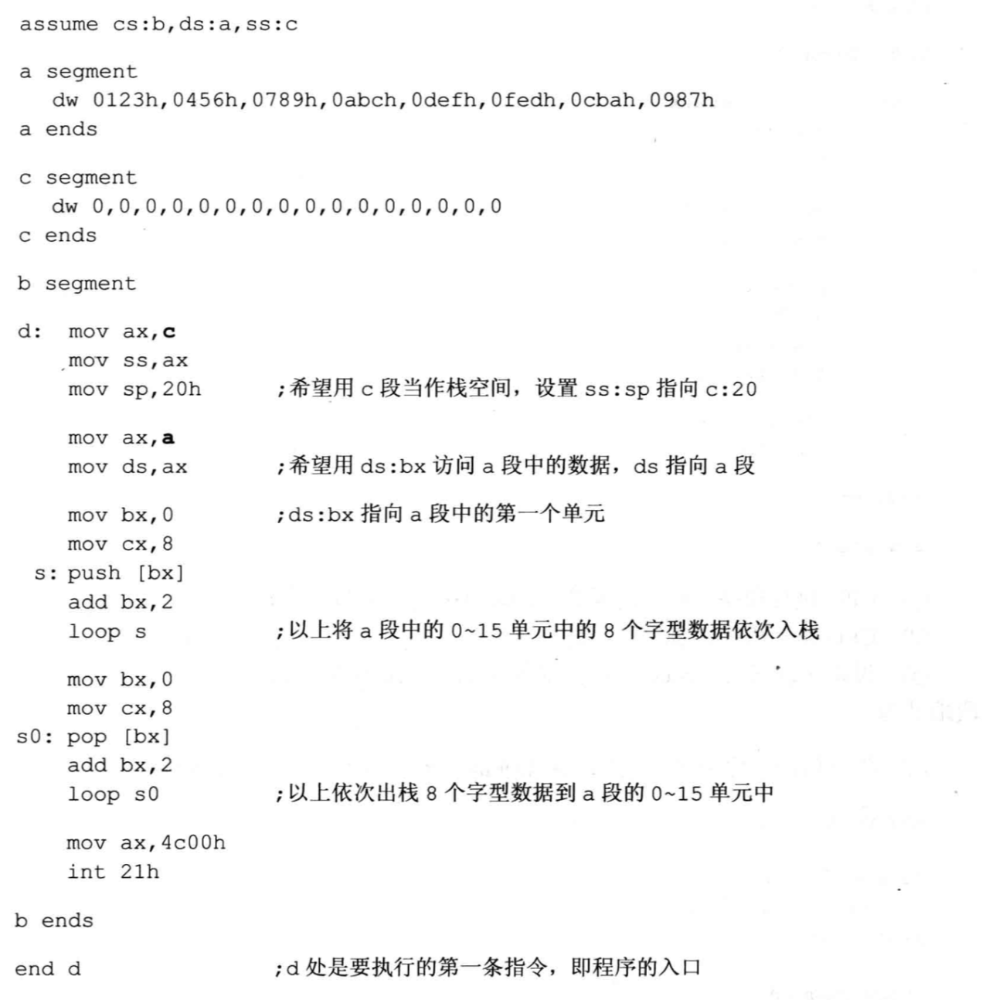

# 1. 笔记
https://zhuanlan.zhihu.com/c_1235568790944612352

# 1. 第一章 基础知识
- 总线主要的功能和分类？
    - 总线的功能是解决不同设备之间的通信问题。可以分为：片内总线、系统总线，其中系统总线可以分为数据总线、地址总线、控制总线。
    - 地址总线？
        - cpu通过地址总线来指定存储单元，地址总线能传送多少个不同的信息，cpu就可以对多少个存储单元进行寻址。
    - 数据总线？
        - cpu与内存或者其他外部器件之间的数据传送通过数据总线进行，数据总线的宽度决定了cpu和外界的数据传送速度。
        8跟数据总线一次可以传送8个二进制数据。16跟数据总线一次可以传送16个二进制数据（二个字节）。
    - 控制总线？
        - 有多少跟控制总线，就意味着cpu对外部器件有多少种控制。控制总线的宽度决定了cpu对外部的控制能力。

# 2. 第二章 寄存器
- 当cpu要访问内存的时候，由段寄存器提供内存单元的段地址。 8086CPU有4个段寄存器，CS来存放指令的段地址。
- CS存放指令段地址，IP存放指令偏移地址。任意时刻，CPU将CS：IP指向的内容当作指令执行。

# 3. 第三章 寄存器（内存访问）
- 数据地址
    - 字在内存中存储的时候，要用两个地址连续的内存单元来存放，字的低位字节单元存放在低地址内存中，
    高位字节存放在高地址内存中。
    - 用mov ax, [0]。 用mov指令时，可以在mov指令中只给出单元的偏移地址，段地址默认在DS寄存器中。

- 栈地址
    - 在SS，SP中存放栈顶的段地址和偏移地址
    - push的时候，先SP=SP-2，然后再向SS：SP指向的字单元送入数据。
    - pop的时候，先从SS：SP指向的字单元中读取数据 然后再SP=SP+2
    - 任意时刻，SS：SP指向栈顶元素
    - 8086CPU只负责记录栈顶，栈空间的大小我们自己管理。
    
- 段的综述：
    - 对于数据段，将其段地址放入DS中，用mov add sub等访问内存单元时，CPU就将我们定义的数据段的内容当作数据来访问。
    - 对于代码段，将其段地址放入CS中，将段中的第一条指令的偏移地址放在IP中，这样CPU就将执行我们定义的代码段中的指令。
    - 对于栈段，将其段地址放入SS中，栈顶元素偏移地址放在SP中，这样push pop的时候，就将我们定义的栈段当作栈空间来使用。
    
    - 一段内存，即可以是代码的存储空间，又可以是数据存储空间，还可以是栈空间，取决于CPU中寄存器的设置。即CS，IP，DS，SS，SP的值。
    
# 4. 第四章 第一个程序
- 操作系统的外壳
    - 系统的shell，commond也就是shell，我们输入cd ls等命令的时候，
    这些命令由commond执行。我们执行.exe文件的时候，commond将这个文件加载进内存，然后设置寄存器
    cs，ip指向程序的入口。然后cpu运行程序，程序运行结束后，返回到commond中。

- 汇编程序从写到执行的过程
    - 编程汇编程序 -》 编译 -》 链接 -》 1.exe
    
# 5. 第五章 [BX]和loop指令

# 6. 第六章 包含多个段的程序
- 如何找到程序的入口？
    - 若要cpu按照我们的安排行事，我们在源程序中用end start来说明了程序的入口就是start。
    这个入口将被写进可执行文件的描述信息，可执行文件被加载进内存之后，cpu的cs:ip就指向了这个入口。
    从而开始执行程序的第一条指令。
    
- cpu如何访问栈空间？
    - mov ax,stack mov ss,ax mov sp,20H 
    设置ss指向stack，设置ss:sp指向stack:20，cpu执行这些指令后，就把stack段当作栈空间来用。
    
- cpu如何访问data段数据，就用ds指向data段，其他寄存器（[bx]）来存放偏移地址。
- 总之，cpu如何处理我们定义段中段内容，是当做指令执行，当作数据访问，还是当作栈空间，完全是
靠程序中具体的汇编指令，和汇编指令对CS:IP SS:SP 和DS寄存器的设置来决定的。

- 

# 7. 更灵活的定位内存地址的方法

- ASC码，就是一种编码方案，一套规则，数字字母等等都有一个ASC码值。

- [bx+idata]来表示一个内存单元，比如可以来表示数组，inc bx就可以啦。数组在内存中是连续存储的。

- si di是8086cpu中和bx功能相近的寄存器。si di不能够分成两个8位寄存器来使用。

- [bx+di+idata]来更灵活的表示内存单元，用两个变量，一个常量来表示地址了。

- 程序中经常要暂存的数据，但是寄存器又不够用，就需要暂存到内存中。而固定一段地址去存，
又比较麻烦，这时就可以用栈来暂存这些数据了。

# 8. 数据处理的两个基本问题
- 绝大部分机器指令都是进行数据处理的指令，处理大致可以分为3类，读书，写入，运算。在机器指令
这一层面，并不关心数据的值是多少，而关心在指令执行的前一时刻，它将要处理的数据所在的位置。

- 在汇编指令中用3个概念来表达位置：
    - 立即数（idata）
        - 执行前在cpu的指令缓冲器中
        - mov ax,1
    - 寄存器
        - 要处理的数据在寄存器中
        - mov ax,bx
    - 段地址(SA)和偏移地址(EA)
        - 指令要处理的数据在内存中
        - mov ax,[bx+8]
- 这样产生了很多种寻址方式
    - 直接寻址 idata
    - 寄存器间接寻址 [bx]
    - 寄存器相对寻址 [bx+idata]
    - 基址变址寻址 [bx+si]
    - 相对基址变址寻址 [bx+si+idata]
- 指令要处理的数据有多长？
    - mov word ptr [bx], 2
    - mov byte ptr ds:[0], 1
    - 指明了是字节长还是字长 1byte or 2byte
- 其实提供这么多寻址方式，只是方便了我们在编程的时候，为结构化数据的处理提供了方便。

# 9. 程序转移指令
- 可以修改IP，或同时修改CS和IP的指令统称为转移指令。概括的讲，转移指令就是可以控制CPU执行内存中某处代码的指令。
- 8086CPU的转移指令有以下几类
    - 只修改IP时，称为段内转移，比如：jmp ax
    - 同时修改cs和ip时，称为段间转移 比如：jmp 1000：0
    - 由于转移指令对ip对修改范围不同，段内转移又分为：短转移和近转移
- 8086cpu的转移指令分为以下几类
    - 无条件转移 jmp
    - 条件转移指令
    - 循环指令
    - 过程
    - 中断
- offset操作符 功能是取得标号的偏移地址
- jmp short 标号   实现的是段内短转移
- cpu在执行jmp指令短时候 并不需要转移短目的地址 而是转移的位移
- jcxz为有条件转移指令 cx=0才执行 否则什么也不做
- loop指令 cx=cx-1 若cx！=0 才转移