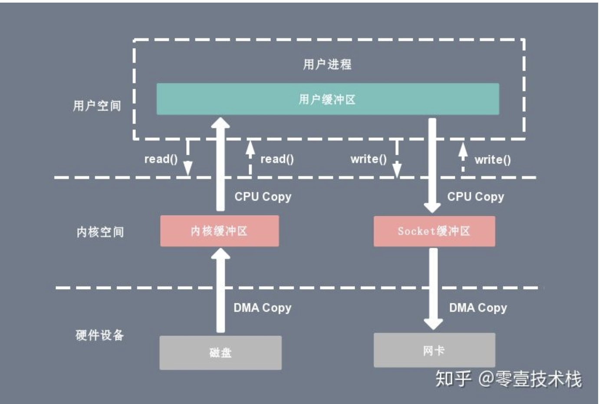
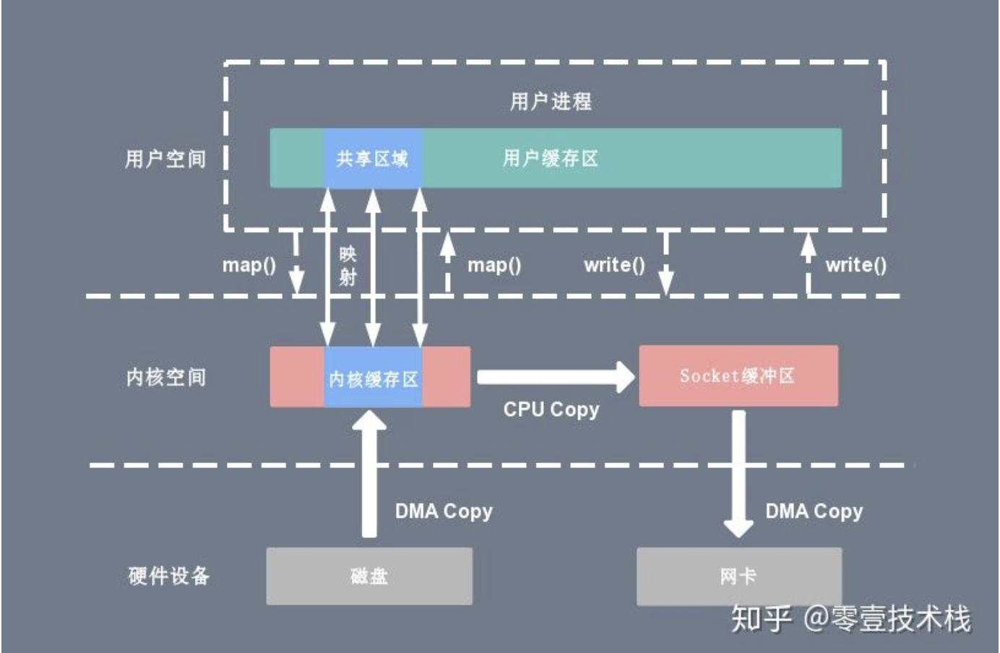
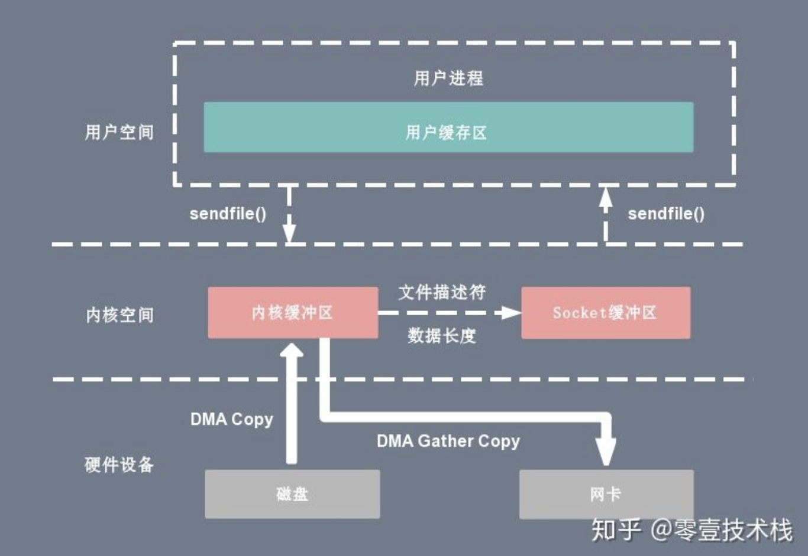

#1.内核态与用户态
那内核态到底是什么呢？其实从本质上说就是我们所说的内核，它是一种特殊的软件程序，特殊在哪儿呢？控制计算机的硬件资源，例如协调CPU资源，分配内存资源，并且提供稳定的环境供应用程序运行。
用户态就是提供应用程序运行的空间，为了使应用程序访问到内核管理的资源例如CPU，内存，I/O。内核必须提供一组通用的访问接口，这些接口就叫系统调用。
1. 系统调用
2. 异常：如果当前进程运行在用户态，如果这个时候发生了异常事件，就会触发切换。例如：缺页异常。
3. 外设中断：当外设完成用户的请求时，会向CPU发送中断信号。

# 2.零拷贝
零拷贝（Zero-copy）技术指在计算机执行操作时，CPU 不需要先将数据从一个内存区域复制到另一个内存区域，从而可以减少上下文切换以及 CPU 的拷贝时间。它的作用是在数据报从网络设备到用户程序空间传递的过程中，减少数据拷贝次数，减少系统调用，实现 CPU 的零参与，彻底消除 CPU 在这方面的负载。实现零拷贝用到的最主要技术是 DMA 数据传输技术和内存区域映射技术。
零拷贝机制可以减少数据在内核缓冲区和用户进程缓冲区之间反复的 I/O 拷贝操作。
零拷贝机制可以减少用户进程地址空间和内核地址空间之间因为上下文切换而带来的 CPU 开销。
#### 1. 传统io ， 一般的文件传输过程
考虑这样一种常用的情形：开发者需要将静态内容（类似图片、数据表、文件）展示给远程的用户。那么这个情形就意味着开发者需要先将静态内容从磁盘中拷贝出来放到一个内存buf中，然后将这个buf通过socket传输给用户，进而用户或者静态内容的展示。
在这个过程中数据文件A的经历了4次复制的过程：
首先，调用read时，数据文件A拷贝到了kernel模式；
之后，CPU控制将kernel模式数据复制到user模式下；
调用write时，先将user模式下的内容复制到到kernel模式下的socket的buffer中；
最后将kernel模式下的socket buffer的数据复制到网卡设备中传送；

上下文切换：当用户程序向内核发起系统调用时，CPU 将用户进程从用户态切换到内核态；当系统调用返回时，CPU 将用户进程从内核态切换回用户态。

CPU拷贝：由 CPU 直接处理数据的传送，数据拷贝时会一直占用 CPU 的资源。

DMA拷贝：由 CPU 向DMA磁盘控制器下达指令，让 DMA 控制器来处理数据的传送，数据传送完毕再把信息反馈给 CPU，从而减轻了 CPU 资源的占有率。

#### 2. mmap + write

#### 3. sendfile
通过 sendfile 系统调用，数据可以直接在内核空间内部进行 I/O 传输，从而省去了数据在用户空间和内核空间之间的来回拷贝。与 mmap 内存映射方式不同的是， sendfile 调用中 I/O 数据对用户空间是完全不可见的。

#### 4. sendfile + DMA gather copy

#### 5. splice
