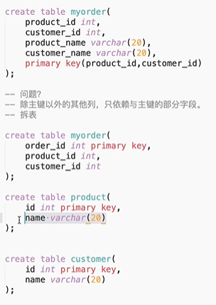
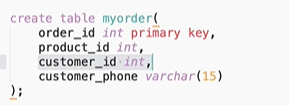
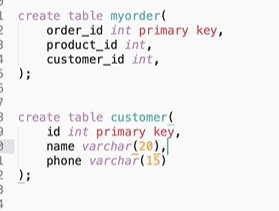
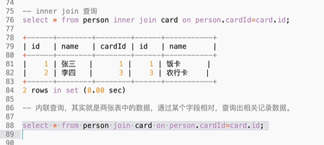
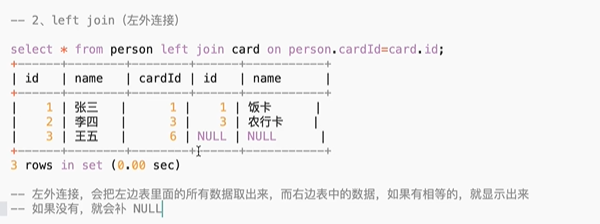
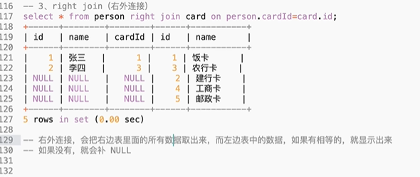

# 1.事务特性 ACID
- 原子性（Atomicity）：
原子性是指事务是一个不可分割的工作单位，事务中的操作要么都发生，要么都不发生。

- 一致性（Consistency）：
事务前后数据的完整性必须保持一致。如A给B转账，不论转账的事务操作是否成功，其两者的存款总额不变

- 隔离性（Isolation）：
事务的隔离性是多个用户并发访问数据库时，数据库为每一个用户开启的事务，不能被其他事务的操作数据所干扰，多个并发事务之间要相互隔离。

- 持久性（Durability）：
持久性是指一个事务一旦被提交，它对数据库中数据的改变就是永久性的，接下来即使数据库发生故障也不应该对其有任何影响

# 2.事务隔离级别
- Read-uncommited 读未提交的：a事务对数据进行操作，在操作的过程中，事务没有提交，但是b能看到a操作的结果。
这就会出现脏读： 一个事务读到了另一个事务没有提交的数据，这就叫脏读。
例子：小明给淘宝店转了1000块，未提交，淘宝店一查看，看到钱到了就发货了，这时候小明rollback

- Read-commited 读已提交的： 造成问题 不可重复读
指在一个事务内多次读同一数据。在这个事务还没有结束时，另一个事务
也访问该数据。那么，在第一个事务中的两次读数据之间，由于第二个事务的修改导致第一个事务两次读取的
数据可能不太一样。这就发生了在一个事务内两次读到的数据是不一样的情况，因此称为不可重复读.
例子：事务 A 多次读取同一数据，事务 B 在事务A多次读取的过程中，对数据作了更新并提交，导致事务A多次读取同一数据时，结果 不一致。

- Repeated-read 可重复读：造成问题 幻读
事务a和事务b同时操作，事务a提交的数据，也不能被事务b读到，就可以造成幻读。
系统管理员A将数据库中所有学生的成绩从具体分数改为ABCDE等级，但是系统管理员B就在这个时候插入了一条具体分数的记录，当系统管理员A改结束后发现还有一条记录没有改过来，就好像发生了幻觉一样，这就叫幻读。
例子：小王读发现有5条数据，这时候，小明往里面插入了一条数据，小王再插入id为6的数据，报错了。

- serializable串行化
当user表被一个事务操作的时候，其他事务里面的写操作，是不可以执行的，进入排队状态，直到王尼玛这面的事务结束之后，张全蛋这个写入操作才会执行。效率很差。

# 3.三大范式

- 第一范式： 数据库中的所有字段都是不可分割的原子值。
例子： address ‘中国四川省成都市武侯区大道100号‘ 这不是第一范式
       Country ‘中国’ province’四川’ city’成都‘ details’武侯区大道100号’ 这是第一范式

- 第二范式： 必须是满足第一范式的前提下，第二范式要求 除主键外的每一列都必须完全依赖于主键
如果要出现不完全依赖，只能发生在联合主键的情况下。

- 第三范式必须先满足第二范式，除开主键列的其他列之间不能有传递依赖关系。
  
比如这个里的 customer_id和customer_phone就有依赖关系了
  

# 4. mysql主从同步机制

### 4.1主从延迟
- 当主库master的TPS并发较高时，master节点并发产生的修改操作，而slave节点的sql线程是单线程处理同步数据，延迟自然而然就产生了。
主节点执行一个很大的事务（更新千万行语句，执行很长时间的事务）。mysql的主从复制，从节点只有在主节点的大事务执行完毕才会复制，因为只有事务执行完毕后才会写入到主节点的binlog日志中。所以大事务会造成从节点的复制延迟。
不过造成主从延迟的原因还可能使主从服务器跨机房，网络稳定性等等原因。

- 解决方法：将大事务拆分为小事务，分批更新数据。减少slave的数量，不要超过5个。

- 主从延迟，主库写了，从库读不到。可以使用全同步更新，主库更新完，从库全更新完，再返回。也可半同步更新（接受到一个从的ack）。默认为异步更新。
### 4.2 主从复制机制
- MySQL主从复制涉及到三个线程，一个运行在主节点（log dump thread），其余两个(I/O thread, SQL thread)运行在从节点，如下图所示:
  

# 5. innodb和mylsam区别
1. mylsam只支持表锁，innodb支持行锁，表锁
2. mylsam不支持事务与外键，innodb支持
3. mylsam不支持mvcc，innodb有
4. mylsam b+树为非聚簇索引， innodb为聚簇索引
5. InnoDB不保存表的具体行数，执行select count(*) from table时需要全表扫描。而MyISAM用一个变量保存了整个表的行数，执行上述语句时只需要读出该变量即可，速度很快.
那么为什么InnoDB没有了这个变量呢？
因为InnoDB的事务特性，在同一时刻表中的行数对于不同的事务而言是不一样的，因此count统计会计算对于当前事务而言可以统计到的行数，而不是将总行数储存起来方便快速查询。

# 6. 为什么innodb要选自增类型做主键
- 自增ID可以保证每次插入时B+索引是从右边扩展的，可以避免B+树和频繁合并和分裂（对比使用UUID）。如果使用字符串主键和随机主键，会使得数据随机插入，效率比较差。

# 7.数据库锁机制，在数据库管理中如何解决死锁
- 从数据库系统角度分为三种：排他锁、共享锁、更新锁。  
从程序员角度分为两种：一种是悲观锁，一种乐观锁。  

- 乐观锁：  
乐观锁不是数据库自带的，需要我们自己去实现。乐观锁是指操作数据库时(更新操作)，想法很乐观，认为这次的操作不会导致冲突，在操作数据时，并不进行任何其他的特殊处理（也就是不加锁），而在进行更新后，再去判断是否有冲突了。
通常实现是这样的：在表中的数据进行操作时(更新)，先给数据表加一个版本(version)字段，每操作一次，将那条记录的版本号加1。也就是先查询出那条记录，获取出version字段,如果要对那条记录进行操作(更新),则先判断此刻version的值是否与刚刚查询出来时的version的值相等，如果相等，则说明这段期间，没有其他程序对其进行操作，则可以执行更新，将version字段的值加1；如果更新时发现此刻的version值与刚刚获取出来的version的值不相等，则说明这段期间已经有其他程序对其进行操作了，则不进行更新操作。
乐观锁只是在更新数据那一刻锁表，其他事件不锁表。

- 悲观锁：  数据库默认就是悲观锁  
与乐观锁相对应的就是悲观锁了。悲观锁就是在操作数据时，认为此操作会出现数据冲突，所以在进行每次操作时都要通过获取锁才能进行对相同数据的操作，这点跟java中的synchronized很相似，所以悲观锁需要耗费较多的时间。另外与乐观锁相对应的，悲观锁是由数据库自己实现了的，要用的时候，我们直接调用数据库的相关语句就可以了。
说到这里，由悲观锁涉及到的另外两个锁概念就出来了，它们就是共享锁与排它锁。共享锁和排它锁是悲观锁的不同的实现，它俩都属于悲观锁的范畴。

- 共享(S)锁：多个事务可封锁一个共享页；任何事务都不能修改该页； 通常是该页被读取完毕，S锁立即被释放。  

- 排它(X)锁：仅允许一个事务封锁此页；其他任何事务必须等到X锁被释放才能对该页进行访问；X锁一直到事务结束才能被释放
在数据库中有两种基本的锁类型：排它锁和共享锁。当数据对象被加上排它锁时，其他的事务不能对它读取和修改。加了共享锁的数据对象可以被其他事务读取，但不能修改。数据库利用这两种基本的锁类型来对数据库的事务进行并发控制。  

- 更新（U)锁：更新锁在修改操作的初始化阶段用来锁定可能要被修改的资源，这样可以避免使用共享锁造成的死锁现象。因为使用共享锁时，修改数据的操作分为两步，首先获得一个共享锁，读取数据，然后将共享锁升级为排它锁，然后再执行修改操作。这样如果同时有两个或多个事务同时对一个事务申请了共享锁，在修改数据的时候，这些事务都要将共享锁升级为排它锁。这时，这些事务都不会释放共享锁而是一直等待对方释放，这样就造成了死锁。如果一个数据在修改前直接申请更新锁，在数据修改的时候再升级为排它锁，就可以避免死锁。1. 用来预定要对此页施加X锁，它允许其他事务读，但不允许再施加U锁或X锁；
2.当被读取的页要被更新时，则升级为X锁；
3.U锁一直到事务结束时才能被释放。

- 解决数据库死锁：  
1.乐观锁进行控制（其实就是没有加锁）  
2.使用悲观锁进行控制。悲观锁大多数情况下依靠数据库的锁机制实现，如Oracle的Select … for update语句，以保证操作最大程度的独占性。但随之而来的就是数据库性能的大量开销，特别是对长事务而言，这样的开销往往无法承受。如一个金融系统， 当某个操作员读取用户的数据，并在读出的用户数据的基础上进行修改时（如更改用户账户余额），如果采用悲观锁机制，也就意味着整个操作过程中（从操作员读 出数据、开始修改直至提交修改结果的全过程，甚至还包括操作员中途去煮咖啡的时间），数据库记录始终处于加锁状态，可以想见，如果面对成百上千个并发，这 样的情况将导致灾难性的后果。所以，采用悲观锁进行控制时一定要考虑清楚。

https://www.php.cn/mysql-tutorials-457330.html 数据库死锁产生条件与处理
https://blog.csdn.net/qq_16681169/article/details/74784193 数据库死锁处理

# 8.内连接，左连接，右连接。
  
  
  