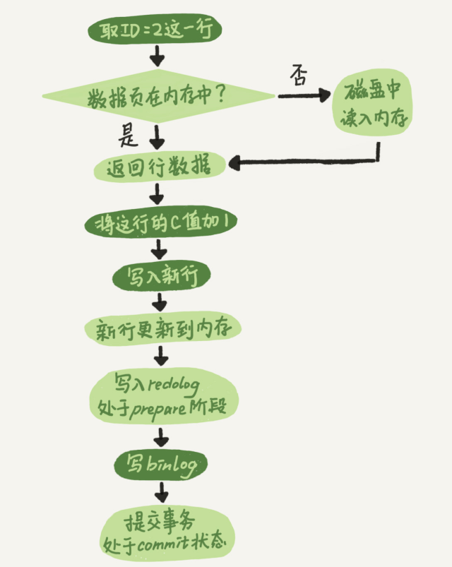

# 1.事务特性 ACID
- 原子性（Atomicity）：
原子性是指事务是一个不可分割的工作单位，事务中的操作要么都发生，要么都不发生。

- 一致性（Consistency）：
事务前后数据的完整性必须保持一致。如A给B转账，不论转账的事务操作是否成功，其两者的存款总额不变

- 隔离性（Isolation）：
事务的隔离性是多个用户并发访问数据库时，数据库为每一个用户开启的事务，不能被其他事务的操作数据所干扰，多个并发事务之间要相互隔离。

- 持久性（Durability）：
持久性是指一个事务一旦被提交，它对数据库中数据的改变就是永久性的，接下来即使数据库发生故障也不应该对其有任何影响

# 2. innodb如何保证事务，事务的实现？
- https://www.cnblogs.com/whgk/p/11066798.html mysql日志系统

- 事务的原子性是通过 undo log 来实现的 （回滚日志）

- 事务的持久性性是通过 redo log 来实现的

- 事务的隔离性是通过 (读写锁+MVCC)来实现的
- 而事务的终极大 boss 一致性是通过原子性，持久性，隔离性来实现的！！！

- （1）原子性 
    - 1.每条数据变更(insert/update/delete)操作都伴随一条undo log的生成,并且回滚日志必须先于数据持久化到磁盘上
    
    - 2.所谓的回滚就是根据回滚日志做逆向操作，比如delete的逆向操作为insert，insert的逆向操作为delete，update的逆向为update等。

- (2) 持久性 
    - 先了解一下MySQL的数据存储机制，MySQL的表数据是存放在磁盘上的，因此想要存取的时候都要经历磁盘IO,然而即使是使用SSD磁盘IO也是非常消耗性能的。 为此，为了提升性能InnoDB提供了缓冲池(Buffer Pool)，Buffer Pool中包含了磁盘数据页的映射，可以当做缓存来使用：
    
    - 读数据：会首先从缓冲池中读取，如果缓冲池中没有，则从磁盘读取在放入缓冲池；
    - 写数据：会首先写入缓冲池，缓冲池中的数据会定期同步到磁盘中；
上面这种缓冲池的措施虽然在性能方面带来了质的飞跃，但是它也带来了新的问题，当MySQL系统宕机，断电的时候可能会丢数据！！！
因为我们的数据已经提交了，但此时是在缓冲池里头，还没来得及在磁盘持久化，所以我们急需一种机制需要存一下已提交事务的数据，为恢复数据使用。
于是 redo log就派上用场了。更新内存，写redo log，innodb会在适当的时候再更新到磁盘中。 写redo log比写磁盘要块，因为写磁盘，你要找到那条记录，然后再更改或者删除新增啥的，
但是写redo log只要记下操作就好了，然后等不忙的时候，再去持久化到磁盘中。

    - redolog是innodb独有，binlog是mysql的。redo log是物理日志，记录了在某个数据页上做了什么修改，binlog是逻辑日志，记录了语句。
    redolog循环写，空间固定。binlog追加写，写完会切换到下一个。
    
    - binlog做数据恢复，备份。redo log做持久化。防止提交的事务还未持久化到磁盘。
    
    -   
    
- （3）隔离性 
    - 读未提交
    - 读已提交
    - 可重复读
    - 序列化

# 2.事务隔离级别
- Read-uncommited 读未提交的：a事务对数据进行操作，在操作的过程中，事务没有提交，但是b能看到a操作的结果。
这就会出现脏读： 一个事务读到了另一个事务没有提交的数据，这就叫脏读。
例子：小明给淘宝店转了1000块，未提交，淘宝店一查看，看到钱到了就发货了，这时候小明rollback

- Read-commited 读已提交的： 造成问题 不可重复读
指在一个事务内多次读同一数据。在这个事务还没有结束时，另一个事务
也访问该数据。那么，在第一个事务中的两次读数据之间，由于第二个事务的修改导致第一个事务两次读取的
数据可能不太一样。这就发生了在一个事务内两次读到的数据是不一样的情况，因此称为不可重复读.
例子：事务 A 多次读取同一数据，事务 B 在事务A多次读取的过程中，对数据作了更新并提交，导致事务A多次读取同一数据时，结果 不一致。

- Repeated-read 可重复读：造成问题 幻读
事务a和事务b同时操作，事务a提交的数据，也不能被事务b读到，就可以造成幻读。
系统管理员A将数据库中所有学生的成绩从具体分数改为ABCDE等级，但是系统管理员B就在这个时候插入了一条具体分数的记录，当系统管理员A改结束后发现还有一条记录没有改过来，就好像发生了幻觉一样，这就叫幻读。
例子：小王读发现有5条数据，这时候，小明往里面插入了一条数据，小王再插入id为6的数据，报错了。

- serializable串行化
当user表被一个事务操作的时候，其他事务里面的写操作，是不可以执行的，进入排队状态，直到王尼玛这面的事务结束之后，张全蛋这个写入操作才会执行。效率很差。

# 2. 四种隔离级别实现方式
- 读未提交
    - 读不加锁，写加共享锁
- 读已提交
    - 普通读是快照读，用mvcc，加锁的select update, delete加记录锁
- 可重复读
    - 普通读 mvcc
    - 加锁select, update, delete，会用到 next-key
    
- 序列化
    - 读加共享锁 写加排他锁
# 3.三大范式
- 为什么要有三范式？
    - 规范数据库的设计，减少信息拢余
- 第一范式： 数据库中的所有字段都是不可分割的原子值。
例子： address ‘中国四川省成都市武侯区大道100号‘ 这不是第一范式
       Country ‘中国’ province’四川’ city’成都‘ details’武侯区大道100号’ 这是第一范式

- 第二范式： 必须是满足第一范式的前提下，第二范式要求 除主键外的每一列都必须完全依赖于主键
如果要出现不完全依赖，只能发生在联合主键的情况下。

- 第三范式必须先满足第二范式，除开主键列的其他列之间不能有传递依赖关系。
  
比如这个里的 customer_id和customer_phone就有依赖关系了
  

# 4. mysql主从同步机制

### 4.1主从延迟
- 当主库master的TPS并发较高时，master节点并发产生的修改操作，而slave节点的sql线程是单线程处理同步数据，延迟自然而然就产生了。
主节点执行一个很大的事务（更新千万行语句，执行很长时间的事务）。mysql的主从复制，从节点只有在主节点的大事务执行完毕才会复制，因为只有事务执行完毕后才会写入到主节点的binlog日志中。所以大事务会造成从节点的复制延迟。
不过造成主从延迟的原因还可能使主从服务器跨机房，网络稳定性等等原因。

- 解决方法：将大事务拆分为小事务，分批更新数据。减少slave的数量，不要超过5个。

- 主从延迟，主库写了，从库读不到。可以使用全同步更新，主库更新完，从库全更新完，再返回。也可半同步更新（接受到一个从的ack）。默认为异步更新。
### 4.2 主从复制机制
- MySQL主从复制涉及到三个线程，一个运行在主节点（log dump thread），其余两个(I/O thread, SQL thread)运行在从节点，如下图所示:
  

# 5. innodb和mylsam区别
1. mylsam只支持表锁，innodb支持行锁，表锁
2. mylsam不支持事务与外键，innodb支持
3. mylsam不支持mvcc，innodb有
4. mylsam b+树为非聚簇索引， innodb为聚簇索引
5. InnoDB不保存表的具体行数，执行select count(*) from table时需要全表扫描。而MyISAM用一个变量保存了整个表的行数，执行上述语句时只需要读出该变量即可，速度很快.
那么为什么InnoDB没有了这个变量呢？
因为InnoDB的事务特性，在同一时刻表中的行数对于不同的事务而言是不一样的，因此count统计会计算对于当前事务而言可以统计到的行数，而不是将总行数储存起来方便快速查询。

# 6. 为什么innodb要选自增类型做主键
- 自增ID可以保证每次插入时B+索引是从右边扩展的，可以避免B+树和频繁合并和分裂（对比使用UUID）。如果使用字符串主键和随机主键，会使得数据随机插入，效率比较差。

# 7.数据库锁机制，在数据库管理中如何解决死锁
- 从数据库系统角度分为三种：排他锁、共享锁、更新锁。  
从程序员角度分为两种：一种是悲观锁，一种乐观锁。  

- 乐观锁：  
乐观锁不是数据库自带的，需要我们自己去实现。乐观锁是指操作数据库时(更新操作)，想法很乐观，认为这次的操作不会导致冲突，在操作数据时，并不进行任何其他的特殊处理（也就是不加锁），而在进行更新后，再去判断是否有冲突了。
通常实现是这样的：在表中的数据进行操作时(更新)，先给数据表加一个版本(version)字段，每操作一次，将那条记录的版本号加1。也就是先查询出那条记录，获取出version字段,如果要对那条记录进行操作(更新),则先判断此刻version的值是否与刚刚查询出来时的version的值相等，如果相等，则说明这段期间，没有其他程序对其进行操作，则可以执行更新，将version字段的值加1；如果更新时发现此刻的version值与刚刚获取出来的version的值不相等，则说明这段期间已经有其他程序对其进行操作了，则不进行更新操作。
乐观锁只是在更新数据那一刻锁表，其他事件不锁表。

- 悲观锁：  数据库默认就是悲观锁  
与乐观锁相对应的就是悲观锁了。悲观锁就是在操作数据时，认为此操作会出现数据冲突，所以在进行每次操作时都要通过获取锁才能进行对相同数据的操作，这点跟java中的synchronized很相似，所以悲观锁需要耗费较多的时间。另外与乐观锁相对应的，悲观锁是由数据库自己实现了的，要用的时候，我们直接调用数据库的相关语句就可以了。
说到这里，由悲观锁涉及到的另外两个锁概念就出来了，它们就是共享锁与排它锁。共享锁和排它锁是悲观锁的不同的实现，它俩都属于悲观锁的范畴。

- 共享(S)锁：多个事务可封锁一个共享页；任何事务都不能修改该页； 通常是该页被读取完毕，S锁立即被释放。  

- 排它(X)锁：仅允许一个事务封锁此页；其他任何事务必须等到X锁被释放才能对该页进行访问；X锁一直到事务结束才能被释放
在数据库中有两种基本的锁类型：排它锁和共享锁。当数据对象被加上排它锁时，其他的事务不能对它读取和修改。加了共享锁的数据对象可以被其他事务读取，但不能修改。数据库利用这两种基本的锁类型来对数据库的事务进行并发控制。  

- 更新（U)锁：更新锁在修改操作的初始化阶段用来锁定可能要被修改的资源，这样可以避免使用共享锁造成的死锁现象。因为使用共享锁时，修改数据的操作分为两步，首先获得一个共享锁，读取数据，然后将共享锁升级为排它锁，然后再执行修改操作。这样如果同时有两个或多个事务同时对一个事务申请了共享锁，在修改数据的时候，这些事务都要将共享锁升级为排它锁。这时，这些事务都不会释放共享锁而是一直等待对方释放，这样就造成了死锁。如果一个数据在修改前直接申请更新锁，在数据修改的时候再升级为排它锁，就可以避免死锁。1. 用来预定要对此页施加X锁，它允许其他事务读，但不允许再施加U锁或X锁；
2.当被读取的页要被更新时，则升级为X锁；
3.U锁一直到事务结束时才能被释放。

- 解决数据库死锁：  
1.乐观锁进行控制（其实就是没有加锁）  
2.使用悲观锁进行控制。悲观锁大多数情况下依靠数据库的锁机制实现，如Oracle的Select … for update语句，以保证操作最大程度的独占性。但随之而来的就是数据库性能的大量开销，特别是对长事务而言，这样的开销往往无法承受。如一个金融系统， 当某个操作员读取用户的数据，并在读出的用户数据的基础上进行修改时（如更改用户账户余额），如果采用悲观锁机制，也就意味着整个操作过程中（从操作员读 出数据、开始修改直至提交修改结果的全过程，甚至还包括操作员中途去煮咖啡的时间），数据库记录始终处于加锁状态，可以想见，如果面对成百上千个并发，这 样的情况将导致灾难性的后果。所以，采用悲观锁进行控制时一定要考虑清楚。

https://www.php.cn/mysql-tutorials-457330.html 数据库死锁产生条件与处理
https://blog.csdn.net/qq_16681169/article/details/74784193 数据库死锁处理

# 8.内连接，左连接，右连接。
  
  
  

# 9. 当前读，快照读，mvcc
- 当前读:
　　select...lock in share mode (共享读锁)
　　select...for update
　　update , delete , insert
- 当前读, 读取的是最新版本, 并且对读取的记录加锁, 阻塞其他事务同时改动相同记录，避免出现安全问题。加next-key
- 我们一般修改数据啊，都是会用到next-key间隙锁的。
- 快照读： 单纯的select操作，用mvcc

- MVCC
    - InnoDB的MVCC,是通过在每行记录后面保存两个隐藏的列来实现的,这两个列，分别保存了这个行的创建时间，一个保存的是行的删除时间。这里存储的并不是实际的时间值,而是系统版本号(可以理解为事务的ID)，每开始一个新的事务，系统版本号就会自动递增，事务开始时刻的系统版本号会作为事务的ID
    - InnoDB会根据以下两个条件检查每行记录:
    - a.InnoDB只会查找版本早于当前事务版本的数据行(也就是,行的系统版本号小于或等于事务的系统版本号)，这样可以确保事务读取的行，要么是在事务开始前已经存在的，要么是事务自身插入或者修改过的.
    - b.行的删除版本要么未定义,要么大于当前事务版本号,这可以确保事务读取到的行，在事务开始之前未被删除.
    只有a,b同时满足的记录，才能返回作为查询结果.
    补充：
    1.MVCC手段只适用于Msyql隔离级别中的读已提交（Read committed）和可重复读（Repeatable Read）.
    2.Read uncimmitted由于存在脏读，即能读到未提交事务的数据行，所以不适用MVCC.
    原因是MVCC的创建版本和删除版本只要在事务提交后才会产生。

# 10. sql怎么优化，慢查询优化
- 面试回答：
    - 看下是不是没加索引，导致了全表扫描。
    - 索引不能建立太多，维护也需要代价，增删可能要改变b+树结构的。
    - 注意最左前缀原则，注意要在区分度大的字段上加索引。
    - 不要在where语句上进行表达式判断。

- 1.对查询进行优化，要尽量避免全表扫描，首先应考虑在 where 及 order by 涉及的列上建立索引。

- 2.应尽量避免在 where 子句中对字段进行 null 值判断，否则将导致引擎放弃使用索引而进行全表扫描，如：
select id from t where num is null
- 3.应尽量避免在 where 子句中使用 or 来连接条件，如果一个字段有索引，一个字段没有索引，将导致引擎放弃使用索引而进行全表扫描，如：
select id from t where num=10 or Name = 'admin'

- 4.不要建立太多的索引，索引的维护也是需要代价的。比如存储，增删的b+树结构变化啊等等。
- 5.联合索引注意最左前缀原则
- 6.要在区分度高的字段上建立索引，不要在区分度不高的字段上建立索引，比如性别。‘
- 7.in 和 not in 也要慎用，否则会导致全表扫描，如：select id from t where num in(1,2,3)
对于连续的数值，能用 between 就不要用 in 了：
select id from t where num between 1 and 3
- 8.应尽量避免在 where 子句中对字段进行表达式操作，这将导致引擎放弃使用索引而进行全表扫描。如：
select id from t where num/2 = 100
应改为:
select id from t where num = 100*2
- 9.使用自增型字段作为主键。
- https://blog.csdn.net/zhushuai1221/article/details/51740846?depth_1-utm_source=distribute.pc_relevant.none-task&utm_source=distribute.pc_relevant.none-task

# 11. 一个sql执行很慢的原因
- 1、大多数情况下很正常，偶尔很慢，则有如下原因
    - (1)、数据库在刷新脏页，例如 redo log 写满了需要同步到磁盘。

    - (2)、执行的时候，遇到锁，如表锁、行锁。

- 2、这条 SQL 语句一直执行的很慢，则有如下原因。

    - (1)、没有用上索引：例如该字段没有索引；由于对字段进行运算、函数操作导致无法用索引。

    - (2)、数据库选错了索引。
    
# 12. 为什么要先写redo log然后再写磁盘，不是多此一举吗？
- 事务日志可以帮助提高事务的效率。使用事务日志，存储引擎在修改表数据的时候，只需要修改其内存拷贝，再把该
修改持久到硬盘上的事务日志中，而不用每次都将修改的数据本身持久化到磁盘。事务日志采用的是追加的方式，
因为写日志的操作是磁盘上的一小块区域的顺序IO，而不像随机IO需要在磁盘的多个地方移动磁头，所以采用事务日志的方式要快的多。
事务日志持久之后，内存中被修改的数据可以在后台慢慢的刷回磁盘。这也就是预写式日志（write-ahead logging）,修改数据需要写两次磁盘。

- 如果数据的修改已经记录到事务日志并持久化，但数据本身还没有写回磁盘，此时系统崩溃，存储引擎在重启时能自动恢复这部分修改的数据。

