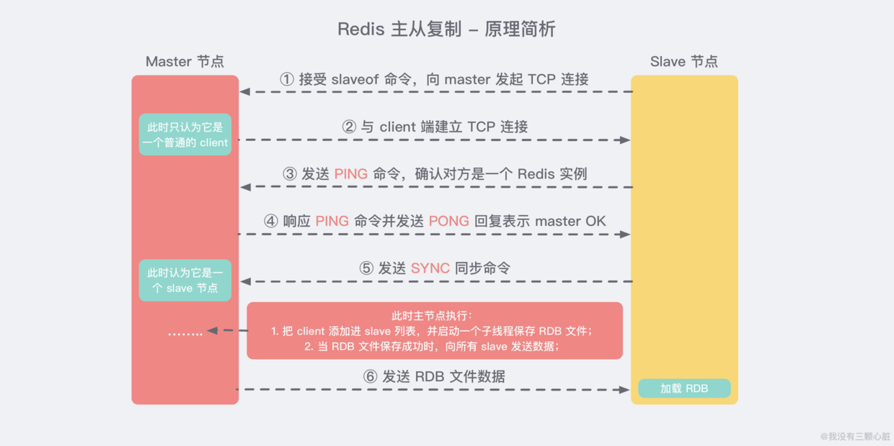
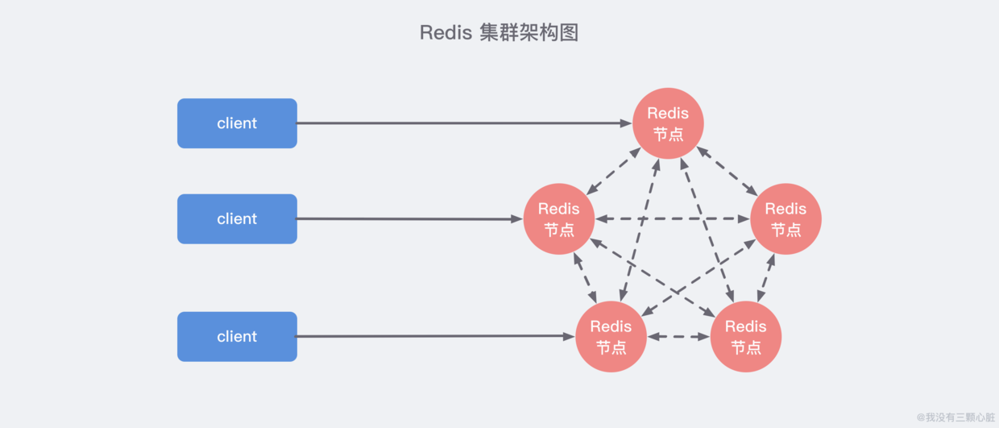

# 1. redis为什么快
- 基于内存
- 单线程，避免了上下文切换
- 多路io复用

# 2. 持久化机制
- RDB
- AOF

# 2. redis过期删除策略，以及淘汰策略。
- 删除策略
    - 定期删除： redis默认是每隔 100ms 就随机抽取⼀些设置了过期时间的key，检查其是否过期，
    如果过期就删除。注意这⾥是随机抽取的。为什么要随机呢？你想⼀想假如 redis 存了⼏⼗万
    个 key ，每隔100ms就遍历所有的设置过期时间的 key 的话，就会给 CPU 带来很⼤的负载！
    - 惰性删除 ：定期删除可能会导致很多过期 key 到了时间并没有被删除掉。所以就有了惰性删
    除。假如你的过期 key，靠定期删除没有被删除掉，还停留在内存⾥，那只能你去查的时候，它过期了，才会删除掉。然后执行这个key不存在的操作。

- 内存淘汰策略
    - 删除策略，可能有很多key没被删除，导致内存快满了，就需要进行内存淘汰策略了。
    - volatile-LRU 从设置过期时间的数据集中挑选最近最少使用的数据淘汰。
    - allkeys-lru 从数据集中任意选择数据淘汰（最常用）
    
    
# 3. redis分布式锁，解锁的注意事项。

- 首先，为了确保分布式锁可用，我们至少要确保锁的实现同时满足以下四个条件：
    1. 互斥性。在任意时刻，只有一个客户端能持有锁。
    2. 不会发生死锁。即使有一个客户端在持有锁的期间崩溃而没有主动解锁，也能保证后续其他客户端能加锁。
    3. 具有容错性。只要大部分的Redis节点正常运行，客户端就可以加锁和解锁。
    4. 解铃还须系铃人。加锁和解锁必须是同一个客户端，客户端自己不能把别人加的锁给解了。  
    比较好的实现：
https://blog.csdn.net/kongmin_123/article/details/82080962?utm_medium=distribute.pc_relevant.none-task-blog-BlogCommendFromMachineLearnPai2-4.channel_param&depth_1-utm_source=distribute.pc_relevant.none-task-blog-BlogCommendFromMachineLearnPai2-4.channel_param

- 用redis实现分布式锁
    -  set 和 expire 保证原子性。  
    
    - 用线程ID唯一标识来删除锁：可以在加锁的时候把当前的线程ID当做value，并在删除之前验证key对应的value是不是自己线程的ID。这样做又隐含了一个新的问题，判断和释放锁是两个独立操作，不是原子性的。
要想实现验证和删除过程的原子性，可以使用Lua脚本来实现。这样就能保证验证和删除过程的正确性了。

    - redis分布式锁的key可以分段来加，提高并发。
# 4. redis主从复制，哨兵，集群。
- 面试这样回答：
    - 主从，redis从节点请求与主节点建立tcp连接，主从三次握手建立tcp连接，从节点发送ping命令，主节点回答pong命令，从节点发送SYNC同步命令，主节点启线程保存RDB文件，发送给slave节点。
    
    - 生产环境一般都用cluster集群，客户端set get key的时候，会根据key算出一个hash值，然后和集群总槽数取余得到在这个环上的位置。
    各个机器可根据ip或者机器名算出hash得到在这个环上的位置。key在环上顺时针遇到第一个节点，就是要用的redis节点。
    带虚拟节点的一致性哈希，在上线或者下线节点的对这个集群的影响最小。
    
    - cluster中每个节点，也都需要有从节点，保证高可用性。这里集群中每个节点互相通信，当半数以上标记一个节点b fail挂掉了，通知b的从节点故障转移。
    b节点的从节点们，offset最大的从节点进行选举，发起投票，拿到一半以上票数升级为主节点。
        - 我觉得 跟 raft算法找出从节点升级为主节点 应该差不多。
        - 分布式保证CAP原则，一致性，可用性，分区容错性。

- redis主从过程

- redis哨兵

    - 上图 展示了一个典型的哨兵架构图，它由两部分组成，哨兵节点和数据节点：
    - 哨兵节点： 哨兵系统由一个或多个哨兵节点组成，哨兵节点是特殊的 Redis 节点，不存储数据；
    - 数据节点： 主节点和从节点都是数据节点；
    
    - 在复制的基础上，哨兵实现了自动化的故障恢复 功能，下方是官方对于哨兵功能的描述：
        - 监控（Monitoring）： 哨兵会不断地检查主节点和从节点是否运作正常。

        - 自动故障转移（Automatic failover）： 当 主节点 不能正常工作时，哨兵会开始 自动故障转移操作，它会将失效主节点的其中一个 从节点升级为新的主节点，并让其他从节点改为复制新的主节点。

        - 配置提供者（Configuration provider）： 客户端在初始化时，通过连接哨兵来获得当前 Redis 服务的主节点地址。

        - 通知（Notification）： 哨兵可以将故障转移的结果发送给客户端。
        - 其中，监控和自动故障转移功能，使得哨兵可以及时发现主节点故障并完成转移。而配置提供者和通知功能，则需要在与客户端的交互中才能体现。
        - 简单来说 Sentinel 使用以下规则来选择新的主服务器：
            - 在失效主服务器属下的从服务器当中， 那些被标记为主观下线、已断线、或者最后一次回复 PING 命令的时间大于五秒钟的从服务器都会被 淘汰。  
在失效主服务器属下的从服务器当中， 那些与失效主服务器连接断开的时长超过 down-after 选项指定的时长十倍的从服务器都会被 淘汰。  
在 经历了以上两轮淘汰之后 剩下来的从服务器中， 我们选出 复制偏移量（replication offset）最大 的那个 从服务器 作为新的主服务器；如果复制偏移量不可用，或者从服务器的复制偏移量相同，那么 带有最小运行 ID 的那个从服务器成为新的主服务器。

- redis集群
    - https://github.com/Snailclimb/JavaGuide/blob/master/docs/database/Redis/redis-collection/Redis(9)%E2%80%94%E2%80%94%E9%9B%86%E7%BE%A4%E5%85%A5%E9%97%A8%E5%AE%9E%E8%B7%B5%E6%95%99%E7%A8%8B.md

    - 
    
    - Redis 集群中内置了 16384 个哈希槽。当客户端连接到 Redis 集群之后，会同时得到一份关于这个 集群的配置信息，当客户端具体对某一个 key 值进行操作时，会计算出它的一个 Hash 值，然后把结果对 16384 求余数，这样每个 key 都会对应一个编号在 0-16383 之间的哈希槽，Redis 会根据节点数量 大致均等 的将哈希槽映射到不同的节点。
    - 数据分区，提高了内存，并发，
    - 高可用：自动故障转移，任一节点故障仍可对外提供服务。
    - 这里每个主节点 也都要有一个或者多个从节点。例如集群有ABC三个主节点, 如果这3个节点都没有加入从节点，如果B挂掉了，我们就无法访问整个集群了。
- 集群数据分区方案 

    - 方案一：哈希值 % 节点数
        - 哈希取余分区思路非常简单：计算 key 的 hash 值，然后对节点数量进行取余，从而决定数据映射到哪个节点上。

        - 不过该方案最大的问题是，当新增或删减节点时，节点数量发生变化，系统中所有的数据都需要 重新计算映射关系，引发大规模数据迁移。

    - 方案二：一致性哈希分区
        - 一致性哈希算法将 整个哈希值空间 组织成一个虚拟的圆环，范围是 [0 , 2^32-1]，对于缓存集群内的每个存储服务器节点计算 Hash 值，可以用服务器的 IP 或 主机名计算得到哈希值，计算得到的哈希值就是服务节点在 Hash 环上的位置。对于每一个数据，根据 key 计算 hash 值，确数据在环上的位置，然后从此位置沿顺时针行走，找到的第一台服务器就是其应该映射到的服务器：
与哈希取余分区相比，一致性哈希分区将 增减节点的影响限制在相邻节点。以上图为例，如果在 node1 和 node2 之间增加 node5，则只有 node2 中的一部分数据会迁移到 node5；如果去掉 node2，则原 node2 中的数据只会迁移到 node4 中，只有 node4 会受影响。

        - 一致性哈希分区的主要问题在于，当 节点数量较少 时，增加或删减节点，对单个节点的影响可能很大，造成数据的严重不平衡。还是以上图为例，如果去掉 node2，node4 中的数据由总数据的 1/4 左右变为 1/2 左右，与其他节点相比负载过高。

    - 方案三：带有虚拟节点的一致性哈希分区

        - 非常明显，把这个环上的槽点弄的密集一点，那这样，宕机几个节点，就分配到其他节点比较均衡。

        - 该方案在 一致性哈希分区的基础上，引入了 虚拟节点 的概念。Redis 集群使用的便是该方案，其中的虚拟节点称为 槽（slot）。槽是介于数据和实际节点之间的虚拟概念，每个实际节点包含一定数量的槽，每个槽包含哈希值在一定范围内的数据。

        - 在使用了槽的一致性哈希分区中，槽是数据管理和迁移的基本单位。槽 解耦 了 数据和实际节点 之间的关系，增加或删除节点对系统的影响很小。仍以上图为例，系统中有 4 个实际节点，假设为其分配 16 个槽(0-15)；

        - 槽 0-3 位于 node1；4-7 位于 node2；以此类推....如果此时删除 node2，只需要将槽 4-7 重新分配即可，例如槽 4-5 分配给 node1，槽 6 分配给 node3，槽 7 分配给 node4；可以看出删除 node2 后，数据在其他节点的分布仍然较为均衡。
        - 同理新增节点，也要对受到影响的节点进行rehash
        - 

