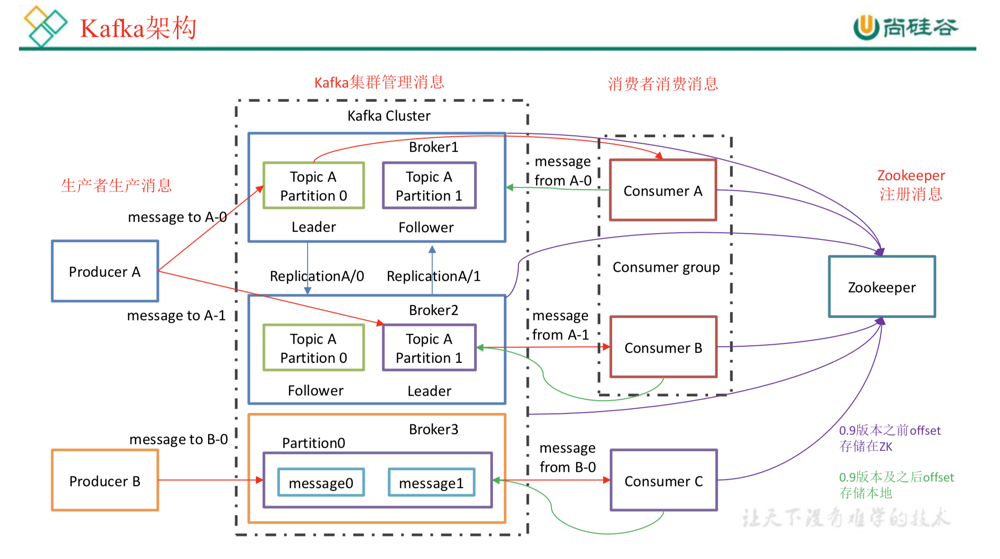
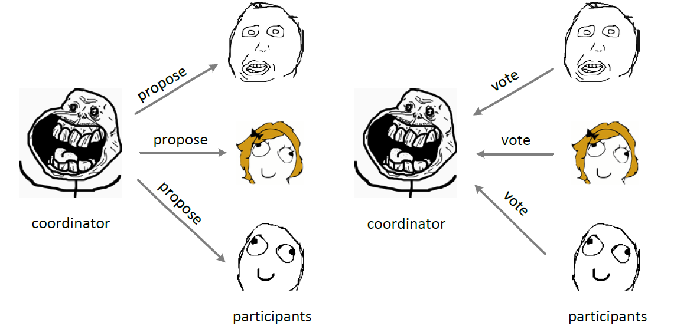
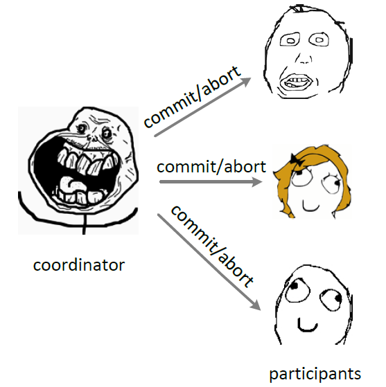

# 1. kafka简介

1)Producer :消息生产者，就是向 kafka broker 发消息的客户端;  
2)Consumer :消息消费者，向 kafka broker 取消息的客户端;  
3)Consumer Group (CG):消费者组，由多个 consumer 组成。消费者组内每个消费者负责消费不同分区的数据，一个分区只能由一个组内消费者消费;消费者组之间互不影响。所有的消费者都属于某个消费者组，即消费者组是逻辑上的一个订阅者。  
4)Broker :一台 kafka 服务器就是一个 broker。一个集群由多个 broker 组成。一个 broker 可以容纳多个 topic。  
5)Topic :可以理解为一个队列，生产者和消费者面向的都是一个 topic;   
6)Partition:为了实现扩展性，一个非常大的 topic 可以分布到多个 broker(即服务器)上， 一个 topic 可以分为多个 partition，每个 partition 是一个有序的队列; kafka 只保证按一个 partition 中的消息的顺序，不保证一个 topic 的整体（多个 partition 间）的顺序。  
7)Replica:副本，为保证集群中的某个节点发生故障时，该节点上的 partition 数据不丢失，且 kafka 仍然能够继续工作，kafka 提供了副本机制，一个 topic 的每个分区都有若干个副本， 一个 leader 和若干个 follower。  
8)leader:每个分区多个副本的“主”，生产者发送数据的对象，以及消费者消费数据的对 象都是 leader。  
9)follower:每个分区多个副本中的“从”，实时从 leader 中同步数据，保持和 leader 数据 的同步。leader 发生故障时，某个 follower 会成为新的 follower。  
10）Offset：kafka 的存储文件都是按照 offset.kafka 来命名，用 offset 做名字的好处是方便查找。例如你想找位于 2049 的位置，只要找到 2048.kafka 的文件即可。当然 the first offset 就是 00000000000.kafka。

https://www.iteblog.com/archives/2605.html kafka面试题

- 1.1 kafka如何保证消息不丢失，不重复消费？
    - 生产者消息丢失
        - 加回调函数
        - 加retries，设置重试间隔
    - 消费者消息丢失
        - 取消自动提交offset，消息完成后手动提交offset
    - kafka弄丢了消息
        - 分区 多副本，设置acks=all，配置 acks = all 代表则所有副本都要接收到该消息之后该消息才算真正成功被发送。
        
- 1.2 如何保证消息不重复消费
    - 比如某个数据要写库，你先根据主键查一下，如果数据有了，就别插入了，update一下好吧
    - 写redis，那没问题了，反正每次都是set，天然幂等性
    - 对于消息，我们可以建个表（专门存储消息消费记录）
        - 生产者，发送消息前判断库中是否有记录（有记录说明已发送），没有记录，先入库，状态为待消费，然后发送消息并把主键id带上。
        - 消费者，接收消息，通过主键ID查询记录表，判断消息状态是否已消费。若没消费过，则处理消息，处理完后，更新消息记录的状态为已消费。
     
- 首先要考虑这么几个问题：
    - 消息丢失是什么造成的，从生产端和消费端两个角度来考虑
    - 消息重复是什么造成的，从生产端和消费端两个角度来考虑
    - 如何保证消息有序
    - 如果保证消息不重不漏，损失的是什么
    
    - 消费端重复消费：很容易解决，建立去重表
    - 消费端丢失数据：也容易解决，关闭自动提交offset，处理完之后受到移位
    - 生产端重复发送：这个不重要，消费端消费之前从去重表中判重就可以
    - 生产端丢失数据：这个是最麻烦的情况 

- kafka快的原因？
    - 总的来说Kafka快的原因：
    - 1、partition顺序读写，充分利用磁盘特性，这是基础；
    - 2、Producer生产的数据持久化到broker，采用mmap文件映射，实现顺序的快速写入；
    - 3、Customer从broker读取数据，采用sendfile，将磁盘文件读到OS内核缓冲区后，直接转到socket buffer进行网络发送。
    - https://zhuanlan.zhihu.com/p/78335525
    - https://zhuanlan.zhihu.com/p/147054382

# 3. 一致性算法 raft
http://thesecretlivesofdata.com/raft/  
raft算法动画演示  
一致性算法 2pc 3pc paxos raft zab  
Raft将系统中的角色分为领导者（Leader）、跟从者（Follower）和候选人（Candidate）：  
Leader：接受客户端请求，并向Follower同步请求日志，当日志同步到大多数节点上后告诉Follower提交日志。  
Follower：接受并持久化Leader同步的日志，在Leader告之日志可以提交之后，提交日志。  
Candidate：Leader选举过程中的临时角色。  
https://zhuanlan.zhihu.com/p/66441389

# 4. 2pc, 3pc， tcc
- 
- 

- 

- 2pc 就是 propose commit 然后 do commit 或者 abort
- 3pc 就是 can canmmit, prepare commit do commit
- 2pc 在数据库层面做的， tcc是业务层面的

# 5. zookeeper
- 一致有头数据树。 
ZooKeeper 是一个典型的分布式数据一致性解决方案，分布式应用程序可以基于 ZooKeeper 实现诸如数据发布/订阅、负载均衡、命名服务、分布式协调/通知、集群管理、Master 选举、分布式锁和分布式队列等功能。
Zookeeper 一个最常用的使用场景就是用于担任服务生产者和服务消费者的注册中心。 服务生产者将自己提供的服务注册到Zookeeper中心，服务的消费者在进行服务调用的时候先到Zookeeper中查找服务，获取到服务生产者的详细信息之后，再去调用服务生产者的内容与数据。