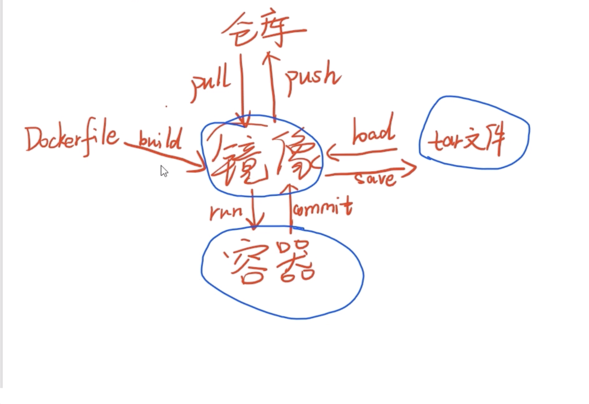

# 1. kafka简介

1)Producer :消息生产者，就是向 kafka broker 发消息的客户端;  
2)Consumer :消息消费者，向 kafka broker 取消息的客户端;  
3)Consumer Group (CG):消费者组，由多个 consumer 组成。消费者组内每个消费者负责消费不同分区的数据，一个分区只能由一个组内消费者消费;消费者组之间互不影响。所有的消费者都属于某个消费者组，即消费者组是逻辑上的一个订阅者。  
4)Broker :一台 kafka 服务器就是一个 broker。一个集群由多个 broker 组成。一个 broker 可以容纳多个 topic。  
5)Topic :可以理解为一个队列，生产者和消费者面向的都是一个 topic;   
6)Partition:为了实现扩展性，一个非常大的 topic 可以分布到多个 broker(即服务器)上， 一个 topic 可以分为多个 partition，每个 partition 是一个有序的队列; kafka 只保证按一个 partition 中的消息的顺序，不保证一个 topic 的整体（多个 partition 间）的顺序。  
7)Replica:副本，为保证集群中的某个节点发生故障时，该节点上的 partition 数据不丢失，且 kafka 仍然能够继续工作，kafka 提供了副本机制，一个 topic 的每个分区都有若干个副本， 一个 leader 和若干个 follower。  
8)leader:每个分区多个副本的“主”，生产者发送数据的对象，以及消费者消费数据的对 象都是 leader。  
9)follower:每个分区多个副本中的“从”，实时从 leader 中同步数据，保持和 leader 数据 的同步。leader 发生故障时，某个 follower 会成为新的 follower。  
10）Offset：kafka 的存储文件都是按照 offset.kafka 来命名，用 offset 做名字的好处是方便查找。例如你想找位于 2049 的位置，只要找到 2048.kafka 的文件即可。当然 the first offset 就是 00000000000.kafka。

https://www.iteblog.com/archives/2605.html kafka面试题

# 2. docker简介

我所理解的docker-compose是编排容器的。例如，你有一个php镜像，一个mysql镜像，一个nginx镜像。如果没有docker-compose，那么每次启动的时候，你需要敲各个容器的启动参数，环境变量，容器命名，指定不同容器的链接参数等等一系列的操作，相当繁琐。而用了docker-composer之后，你就可以把这些命令一次性写在docker-composer.yml文件中，以后每次启动这一整个环境（含3个容器）的时候，你只要敲一个docker-composer up命令就ok了。
而dockerfile的作用是从无到有的构建镜像。

# 3. 一致性算法 raft
http://thesecretlivesofdata.com/raft/  
raft算法动画演示  
一致性算法 2pc 3pc paxos raft zab  
Raft将系统中的角色分为领导者（Leader）、跟从者（Follower）和候选人（Candidate）：  
Leader：接受客户端请求，并向Follower同步请求日志，当日志同步到大多数节点上后告诉Follower提交日志。  
Follower：接受并持久化Leader同步的日志，在Leader告之日志可以提交之后，提交日志。  
Candidate：Leader选举过程中的临时角色。  
https://zhuanlan.zhihu.com/p/66441389

# 4. 2pc, 3pc， tcc
- 
- 

- 

- 2pc 就是 propose commit 然后 do commit 或者 abort
- 3pc 就是 can canmmit, prepare commit do commit
- 2pc 在数据库层面做的， tcc是业务层面的