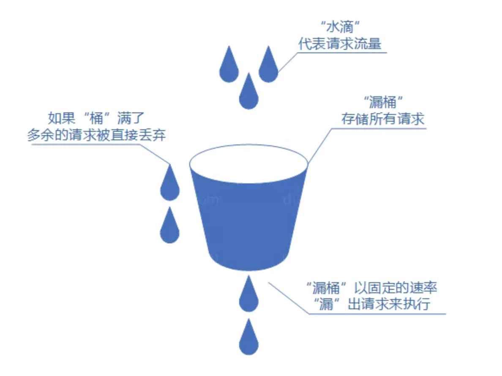
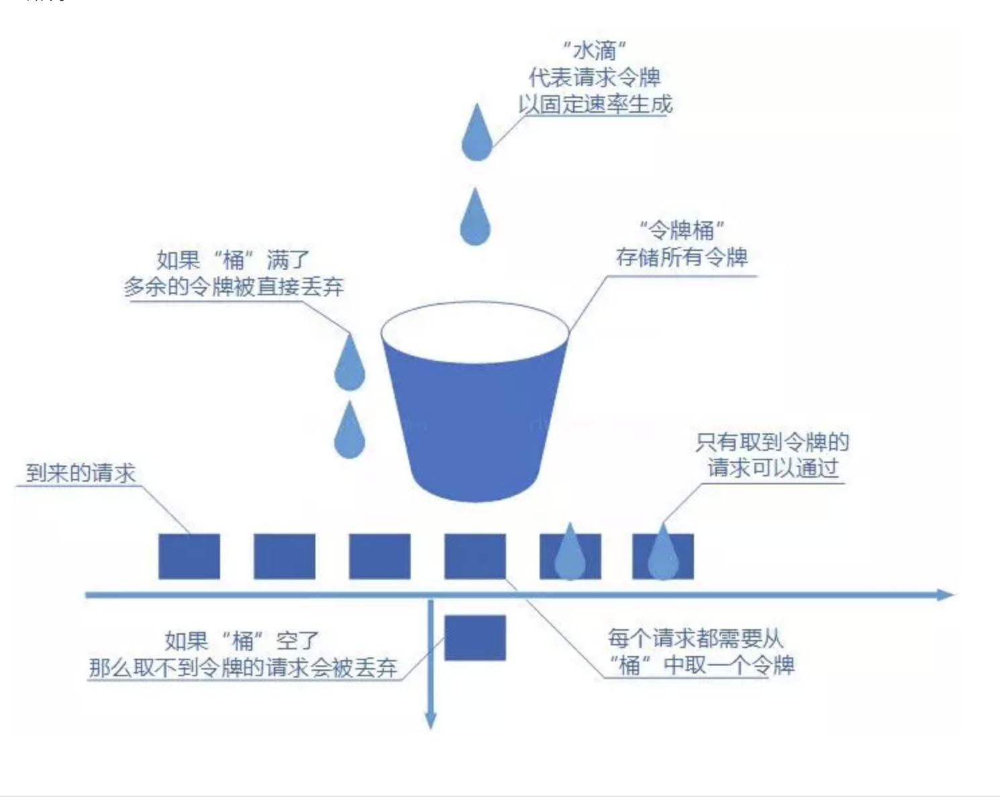
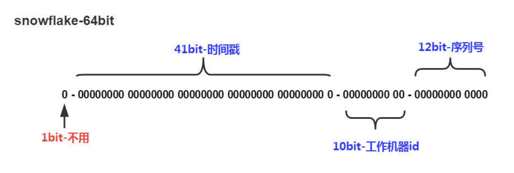
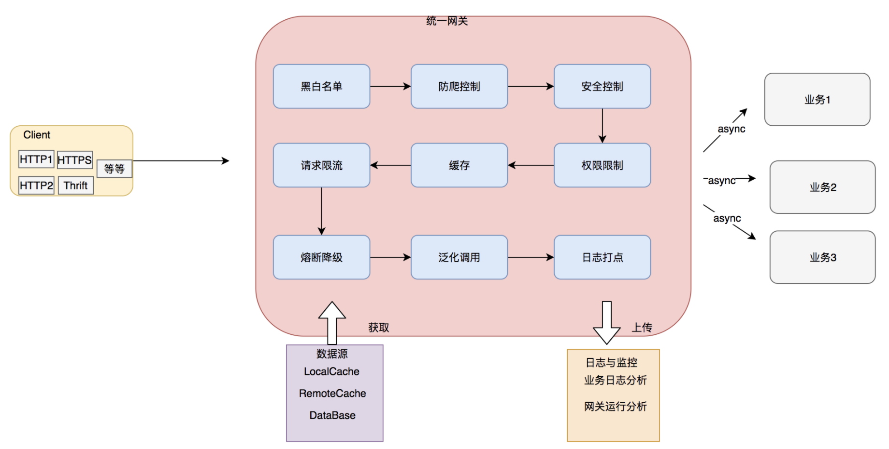
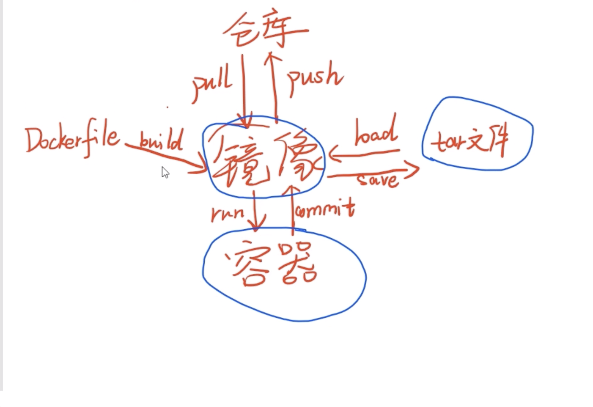

- 分布式 分散压力 。   微服务 分散能力
# 1. RPC HTTP
- 本质上，两者是可读性和效率之间的抉择，通用性和易用性之间的抉择。  http的restful架构可读性好，但是在调用服务过程中需要封装参数，效率低。 RPC要求在调用方中放置被调用的方法的接口。调用方只要调用了这些接口，就相当于调用了被调用方的实际方法，十分易用。于是，调用方可以像调用内部接口一样调用远程的方法，而不用封装参数名和参数值等操作。 RPC就是让一个应用调用另一个应用中方法的一种实现。
# 2. RPC原理
- RPC = socket + 序列化 + 服务寻址
    - 服务寻址 实现方式：服务注册中心
    - 序列化和反序列化
        - 客户端怎么把参数值传给远程的函数呢?在本地调用中，我们只需要把参数压到栈里，然后让函数自己去栈里读就行。但是在远程过程调用时，客户端跟服务端是不同的进程，不能通过内存来传递参数。
        - 这时候就需要客户端把参数先转成一个字节流，传给服务端后，再把字节流转成自己能读取的格式。只有二进制数据才能在网络中传输。
        - 序列化和反序列化的定义是：
        - 将对象转换成二进制流的过程叫做序列化
        - 将二进制流转换成对象的过程叫做反序列化
        - 这个过程叫序列化和反序列化。同理，从服务端返回的值也需要序列化反序列化的过程。
    - 网络传输
        - 远程调用往往用在网络上，客户端和服务端是通过网络连接的。 TCP, UDP, HTTP都可以
        - 所有的数据都需要通过网络传输，因此就需要有一个网络传输层。网络传输层需要把 Call ID 和序列化后的参数字节流传给服务端，然后再把序列化后的调用结果传回客户端
        - 基于 TCP 协议的 RPC 调用： 建立socket连接，通过socket发送数据。
        - 基于 HTTP 协议的 RPC 调用：其大致流程为：由服务的调用者向服务的提供者发送请求，这种请求的方式可能是 GET、POST、PUT、DELETE 等中的一种，服务的提供者可能会根据不同的请求方式做出不同的处理，或者某个方法只允许某种请求方式。而调用的具体方法则是根据 URL 进行方法调用，而方法所需要的参数可能是对服务调用方传输过去的 XML 数据或者 JSON 数据解析后的结果。
        - 两种方法对比：

- 在一个典型 RPC 的使用场景中，包含了服务发现、负载、容错、网络传输、序列化等组件，其中“RPC 协议”就指明了程序如何进行网络传输和序列化。

- RPC核心功能  
客户端、客户端 Stub、网络传输模块、服务端 Stub、服务端等。

- 下面分别介绍核心 RPC 框架的重要组成：  
客户端(Client)：服务调用方。  
客户端存根(Client Stub)：存放服务端地址信息，将客户端的请求参数数据信息打包成网络消息，再通过网络传输发送给服务端。  
服务端存根(Server Stub)：接收客户端发送过来的请求消息并进行解包，然后再调用本地服务进行处理。  
服务端(Server)：服务的真正提供者。  
Network Service：底层传输，可以是 TCP 或 HTTP。

- 一次 RPC 调用流程如下：  
服务消费者(Client 客户端)通过本地调用的方式调用服务。  
客户端存根(Client Stub)接收到调用请求后负责将方法、入参等信息序列化(组装)成能够进行网络传输的消息体。  
客户端存根(Client Stub)找到远程的服务地址，并且将消息通过网络发送给服务端。  
服务端存根(Server Stub)收到消息后进行解码(反序列化操作)。  
服务端存根(Server Stub)根据解码结果调用本地的服务进行相关处理  
服务端(Server)本地服务业务处理。  
处理结果返回给服务端存根(Server Stub)。  
服务端存根(Server Stub)序列化结果。  
服务端存根(Server Stub)将结果通过网络发送至消费方。  
客户端存根(Client Stub)接收到消息，并进行解码(反序列化)。  
服务消费方得到最终结果。

# 3. 限流算法
- 

- 

- 漏桶算法与令牌桶算法的区别在于，漏桶算法能够强行限制数据的传输速率，令牌桶算法能够在限制数据的平均传输速率的同时还允许某种程度的突发传输。

# 4. 分布式ID
- 雪花算法 slowflake

- 

# 5. 网关
- 微服务下一个系统被拆分为多个服务，但是像 安全认证，流量控制，日志，监控等功能是每个服务都需要的，没有网关的话，我们就需要在每个服务中单独实现，这使得我们做了很多重复的事情并且没有一个全局的视图来统一管理这些功能。
综上：一般情况下，网关一般都会提供请求转发、安全认证（身份/权限认证）、流量控制、负载均衡、容灾、日志、监控这些功能。上面介绍了这么多功能实际上网关主要做了一件事情：请求过滤 。权限校验、流量控制这些都可以通过过滤器实现，请求转也是通过过滤器实现的。
API网关可以看做系统与外界联通的入口，我们可以在网关进行处理一些非业务逻辑的逻辑，比如权限验证，监控，缓存，请求路由等等。

- 

# 6. es

- 反向索引又叫倒排索引，是根据文章内容中的关键字建立索引。
- 搜索引擎原理就是建立反向索引。
- Elasticsearch 在 Lucene 的基础上进行封装，实现了分布式搜索引擎。
- Elasticsearch 中的索引、类型和文档的概念比较重要，类似于 MySQL 中的数据库、表和行。
- Elasticsearch 也是 Master-slave 架构，也实现了数据的分片和备份。
- Elasticsearch 一个典型应用就是 ELK 日志分析系统。

# 7. 序列化，反序列化
- 互联网的产生带来了机器间通讯的需求，而互联通讯的双方需要采用约定的协议，序列化和反序列化属于通讯协议的一部分。通讯协议往往采用分层模型，不同模型每层的功能定义以及颗粒度不同，例如：TCP/IP协议是一个四层协议，而OSI模型却是七层协议模型。在OSI七层协议模型中展现层（Presentation Layer）的主要功能是把应用层的对象转换成一段连续的二进制串，或者反过来，把二进制串转换成应用层的对象--这两个功能就是序列化和反序列化。
一般而言，TCP/IP协议的应用层对应与OSI七层协议模型的应用层，展示层和会话层，所以序列化协议属于TCP/IP协议应用层的一部分。protobuf thrift json啥都 都是序列化协议。
我们单方面的只把对象转成字节数组还不行，因为没有规则的字节数组我们是没办法把对象的本来面目还原回来的，所以我们必须在把对象转成字节数组的时候就制定一种规则（序列化），那么我们从IO流里面读出数据的时候再以这种规则把对象还原回来（反序列化）。凡是需要进行“跨平台存储”和”网络传输”的数据，都需要进行序列化。 rpc很重要的一步就是序列化哟。

# 8. docker简介

我所理解的docker-compose是编排容器的。例如，你有一个php镜像，一个mysql镜像，一个nginx镜像。如果没有docker-compose，那么每次启动的时候，你需要敲各个容器的启动参数，环境变量，容器命名，指定不同容器的链接参数等等一系列的操作，相当繁琐。而用了docker-composer之后，你就可以把这些命令一次性写在docker-composer.yml文件中，以后每次启动这一整个环境（含3个容器）的时候，你只要敲一个docker-composer up命令就ok了。
而dockerfile的作用是从无到有的构建镜像。
