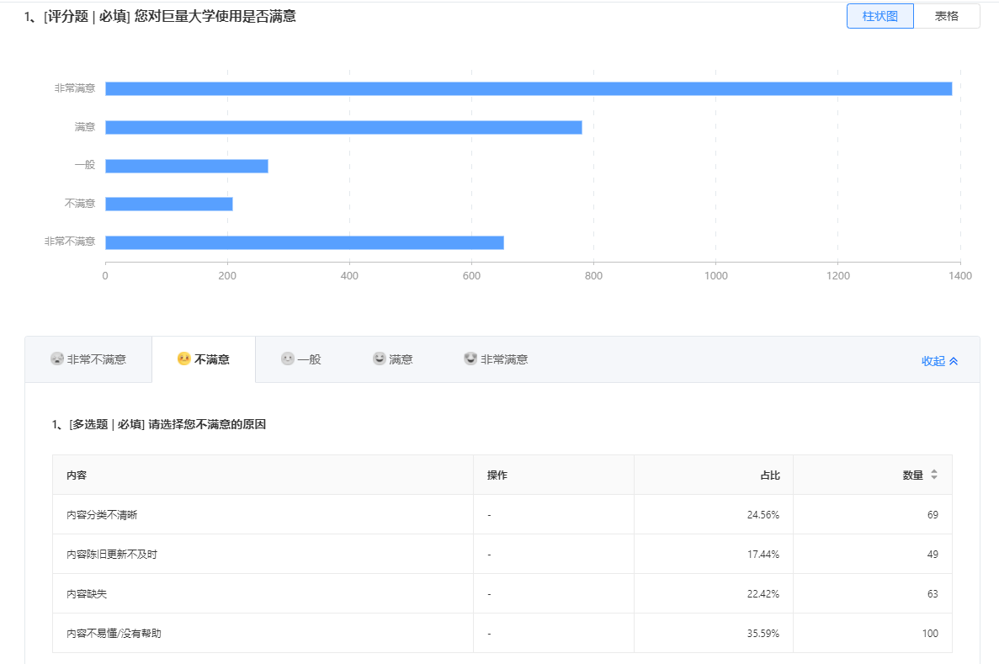
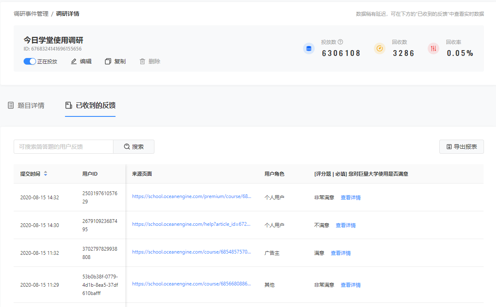

# 1. feelgood
- feelgood是一个体验评估平台，可以使用调研模板进行问题配置。收集平台用户对平台的使用体验，同时查看可视化的结果，从而提升产品质量。

- 我在项目中主要负责后端开发。项目架构为请求先打到负载均衡层，负载均衡层转发请求到服务实例上。
每个实例由 nginx+uwsgi+flask 组成。 nginx负责静态请求的处理，以及转发静态请求给uwsgi，uwsgi的worker来处理请求，flask只是一个web框架。
存储层用的是mysql.用到了redis缓存，hive做聚合运算，es来做搜索，kafka来异步写入es。

- 主要的功能是，收集到平台用户对平台的使用体验，以及上传平台用户使用平台时的一些数据，到feelgood做一个可视化的展示。
redis里存比如hive聚合运算后的数据，平台用户的一些信息 key为user_web_id value为停留时长，referer-url等等，以及平台对应的调研事件等常被读的信息。
会设置过期时间，防止占用过多内存。

- hive里算的是平台各个调研事件的满意个数，不满意个数，以及选择的分别对应的原因的个数，投放数，回收数等等。

- es存平台的调研事件的提交的答案，可以快速搜索提交内容。

- kafka作为一个异步插入es的中间件。有服务去监听kafka的topic，去写入es索引中。

# 2. 项目难点，印象深刻的功能开发
- 印象深刻：比较印象深刻的是

    - 业务场景：频控，让平台的调研事件根据不同权重比例去下放到用户侧。当时他们想的方案是hive聚合运算后，算出各个平台已经投放的次数占比，
    然后再和设置的占比比较来实现问卷下发。这样就会有一个小时多的延迟，因为hive是延迟的。
        - 这是第一个需求，我想到这个需求基本上和负载均衡的实现的效果一样，没必要去拿hive里的数据算，redis来实时的计算各个调研事件的权重。
        当然要满足很多很多的业务条件，比如单个调研事件的显示需求，分组的显示需求，等等等。
        - 考虑到高并发的场景，尝试加了分布式锁。key为平台的ID。最后没有加，考虑到是要追求长期时间的权重满足，加了锁反而可能会造成阻塞。
    
    - es去加了scroll查询
        - 当时没有接触过es，遇到了一个场景是 数据量多了以后，查看的时候，翻页，比如超过300页之后，数据页没有变化。
        - 排查原因是 from+size的查询，会有一个数量限制，不能超过10000条。因为es查询的时候，
        比如有一个index它有5个shard，现在要读取1000到1010之间的这10条数据，es内部会在每个shard上读取1010条数据，然后返回给计算节点，这里有朋友可能问为啥不是10条数据而是1010条呢？这是因为某个shard上的10条数据，可能还没有另一个shard上top10之后的数据相似度高，所以必须全部返回，然后在计算节点上，重新对5050条数据进行全局排序，最后在选取top 10出来，这里面排序是非常耗时的。
        所以from+size不能超过一定数量。
        - 用游标查询，游标查询每次查询可以基于上一次查询的页上接着查。查完放到redis里。启定时任务去scroll查询。
        
    - mysql主从延迟严重，场景是，每次上传report接口都会写入mysql里，导致mysql压力过大，接了个kafka变成异步写。
    
    - redis计数器限流