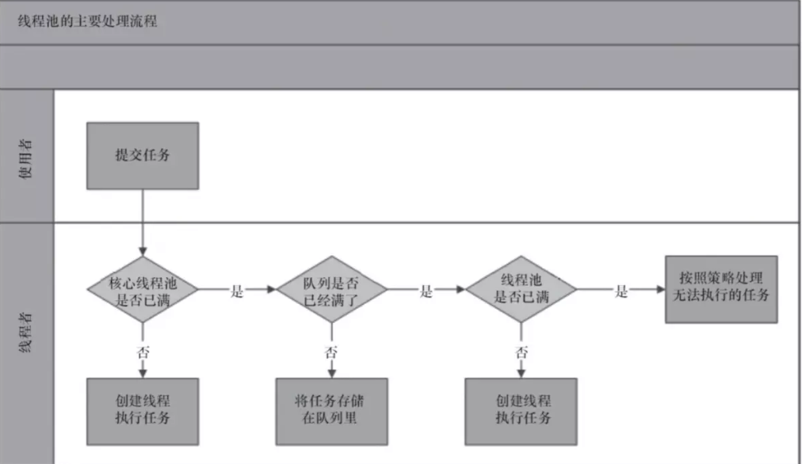

# 1. cookie和sesion
Session 的主要作用就是通过服务端记录用户的状态。 典型的场景是购物车，当你要添加商品到购物车的时候，系统不知道是哪个用户操作的，因为 HTTP 协议是无状态的。服务端给特定的用户创建特定的 Session 之后就可以标识这个用户并且跟踪这个用户了。

Cookie 数据保存在客户端(浏览器端)，Session 数据保存在服务器端。相对来说 Session 安全性更高。如果使用 Cookie 的一些敏感信息不要写入 Cookie 中，最好能将 Cookie 信息加密然后使用到的时候再去服务器端解密。

那么，如何使用Session进行身份验证？

很多时候我们都是通过 SessionID 来实现特定的用户，SessionID 一般会选择存放在 Redis 中。举个例子：用户成功登陆系统，然后返回给客户端具有 SessionID 的 Cookie，当用户向后端发起请求的时候会把 SessionID 带上，这样后端就知道你的身份状态了。

用户向服务器发送用户名和密码用于登陆系统。  
服务器验证通过后，服务器为用户创建一个 Session，并将 Session信息存储 起来。  
服务器向用户返回一个 SessionID，写入用户的 Cookie。  
当用户保持登录状态时，Cookie 将与每个后续请求一起被发送出去。  
服务器可以将存储在 Cookie 上的 Session ID 与存储在内存中或者数据库中的 Session 信息进行比较，以验证用户的身份，返回给用户客户端响应信息的时候会附带用户当前的状态。

分布式session：  
客户端发送一个请求，经过负载均衡后该请求会被分配到服务器中的其中一个，由于不同服务器含有不同的web服务器(例如Tomcat)，不同的web服务器中并不能发现之前web服务器保存的session信息，就会再次生成一个JSESSIONID，之前的状态就会丢失  
解决方案：session绑定，ip-hash 或者 基于redis存储session

# 2. java线程池
降低资源的消耗。线程本身是一种资源，创建和销毁线程会有CPU开销；创建的线程也会占用一定的内存。   
提高任务执行的响应速度。任务执行时，可以不必等到线程创建完之后再执行。   
提高线程的可管理性。线程不能无限制地创建，需要进行统一的分配、调优和监控。

# 3.影响一个Http服务最大连接数的因素是什么
文件句柄限制:  
执行 ulimit -n 输出 1024，说明对于一个进程而言最多只能打开1024个文件，所以你要采用此默认配置最多也就可以并发上千个TCP连接。
临时修改：ulimit -n 1000000，但是这种临时修改只对当前登录用户目前的使用环境有效，永久修改：编辑/etc/rc.local，在其后添加如下内容：ulimit -SHn 1000000

端口范围限制：客户端端口范围限制。 四元组，服务端实际只使用了bind时这一个端口，说明端口号65535并不是并发量的限制。因此server端tcp连接4元组中只有remote ip（也就是client ip）和remote port（客户端port）是可变的，
因此最大tcp连接为：客户端ip数×客户端port数，对IPV4，不考虑ip地址分类等因素，最大tcp连接数约为：2的32次方（ip数）×2的16次方（port数），也就是server端单机最大tcp连接数约为2的48次方。

# 4.什么是线程安全，线程安全与线程同步。
当多个线程访问某个方法时，不管你通过怎样的调用方式或者说这些线程如何交替的执行，我们在主程序中不需要去做任何的同步，这个类的结果行为都是我们设想的正确行为，那么我们就可以说这个类时线程安全的。
比如 100个线程 i++ 如果不加锁啥的 就是线程不安全的。

线程同步：多个线程操作一个资源的情况下，导致资源数据前后不一致。这样就需要协调线程的调度，即线程同步。 解决多个线程使用共通资源的方法是：线程操作资源时独占资源，其他线程不能访问资源。使用锁可以保证在某一代码段上只有一条线程访问共用资源。

(1)使用synchronized关键字  修饰方法，修饰代码块，修饰类
(2)使用特殊域变量(volatile)

### 4.1 Java多线程---顺序打印ABC打印10次的实现-三种实现
一、基于Semaphore
二、基于Synchronized
三、基于ReentrantLock
https://www.jianshu.com/p/b036dda3f5c8

# 美团 8.10 1面
### 1.InnoDB一棵b+树可以存储多少数据？
一、InnoDB一棵B+树可以存放多少行数据？(约2千万)

我们都知道计算机在存储数据的时候，有最小存储单元，这就好比我们今天进行现金的流通最小单位是一毛。在计算机中磁盘存储数据最小单元是扇区，一个扇区的大小是512字节，而文件系统（例如XFS/EXT4）他的最小单元是块，一个块的大小是4k，而对于我们的InnoDB存储引擎也有自己的最小储存单元——页（Page），一个页的大小是16K。

这里我们先假设B+树高为2，即存在一个根节点和若干个叶子节点，那么这棵B+树的存放总记录数为：根节点指针数*单个叶子节点记录行数。

上文我们已经说明单个叶子节点（页）中的记录数=16K（一页16KB）/1K（假设一行1KB）=16。（这里假设一行记录的数据大小为1k）。

 

那么现在我们需要计算出非叶子节点能存放多少指针？

其实这也很好算，我们假设主键ID为bigint类型，长度为8字节，而指针大小在InnoDB源码中设置为6字节，这样一共14字节，我们一个页中能存放多少这样的单元，其实就代表有多少指针，即16KB（16*1024=16384 byte）16384/14=1170（索引个数）。那么可以算出一棵高度为2的B+树，能存放1170*16=18720条这样的数据记录。

 

根据同样的原理我们可以算出一个高度为3的B+树可以存放：1170（索引个数）*1170（索引个数）*16（每页行数）=21902400（2千万）条这样的记录。

所以在InnoDB中B+树高度一般为1-3层，它就能满足千万级的数据存储。在查找数据时一次页的查找代表一次IO，所以通过主键索引查询通常只需要1-3次IO操作即可查找到数据。
### 2.linux内核之扇区,页,块的理解

操作系统必须以页为单位管理内存.

块:文件系统最小寻址单元,又称为文件块和io块

扇区:块设备中最小寻址单元是扇区,扇区这一术语在内核中重要是因为所有设备的io必须以扇区为单位操作

### 3. redis分布式锁，解锁的注意事项。

### 4. redis主从复制，哨兵，集群。
redis主从过程

redis哨兵

上图 展示了一个典型的哨兵架构图，它由两部分组成，哨兵节点和数据节点：

哨兵节点： 哨兵系统由一个或多个哨兵节点组成，哨兵节点是特殊的 Redis 节点，不存储数据；
数据节点： 主节点和从节点都是数据节点；
在复制的基础上，哨兵实现了 自动化的故障恢复 功能，下方是官方对于哨兵功能的描述：

监控（Monitoring）： 哨兵会不断地检查主节点和从节点是否运作正常。

自动故障转移（Automatic failover）： 当 主节点 不能正常工作时，哨兵会开始 自动故障转移操作，它会将失效主节点的其中一个 从节点升级为新的主节点，并让其他从节点改为复制新的主节点。

配置提供者（Configuration provider）： 客户端在初始化时，通过连接哨兵来获得当前 Redis 服务的主节点地址。

通知（Notification）： 哨兵可以将故障转移的结果发送给客户端。
其中，监控和自动故障转移功能，使得哨兵可以及时发现主节点故障并完成转移。而配置提供者和通知功能，则需要在与客户端的交互中才能体现。

简单来说 Sentinel 使用以下规则来选择新的主服务器：

在失效主服务器属下的从服务器当中， 那些被标记为主观下线、已断线、或者最后一次回复 PING 命令的时间大于五秒钟的从服务器都会被 淘汰。  
在失效主服务器属下的从服务器当中， 那些与失效主服务器连接断开的时长超过 down-after 选项指定的时长十倍的从服务器都会被 淘汰。  
在 经历了以上两轮淘汰之后 剩下来的从服务器中， 我们选出 复制偏移量（replication offset）最大 的那个 从服务器 作为新的主服务器；如果复制偏移量不可用，或者从服务器的复制偏移量相同，那么 带有最小运行 ID 的那个从服务器成为新的主服务器。
redis集群

集群数据分区方案 

方案一：哈希值 % 节点数
哈希取余分区思路非常简单：计算 key 的 hash 值，然后对节点数量进行取余，从而决定数据映射到哪个节点上。

不过该方案最大的问题是，当新增或删减节点时，节点数量发生变化，系统中所有的数据都需要 重新计算映射关系，引发大规模数据迁移。

方案二：一致性哈希分区
一致性哈希算法将 整个哈希值空间 组织成一个虚拟的圆环，范围是 [0 , 232-1]，对于每一个数据，根据 key 计算 hash 值，确数据在环上的位置，然后从此位置沿顺时针行走，找到的第一台服务器就是其应该映射到的服务器：
与哈希取余分区相比，一致性哈希分区将 增减节点的影响限制在相邻节点。以上图为例，如果在 node1 和 node2 之间增加 node5，则只有 node2 中的一部分数据会迁移到 node5；如果去掉 node2，则原 node2 中的数据只会迁移到 node4 中，只有 node4 会受影响。

一致性哈希分区的主要问题在于，当 节点数量较少 时，增加或删减节点，对单个节点的影响可能很大，造成数据的严重不平衡。还是以上图为例，如果去掉 node2，node4 中的数据由总数据的 1/4 左右变为 1/2 左右，与其他节点相比负载过高。

方案三：带有虚拟节点的一致性哈希分区

非常明显，把这个环上的槽点弄的密集一点，那这样，宕机几个节点，就分配到其他节点比较均衡。

该方案在 一致性哈希分区的基础上，引入了 虚拟节点 的概念。Redis 集群使用的便是该方案，其中的虚拟节点称为 槽（slot）。槽是介于数据和实际节点之间的虚拟概念，每个实际节点包含一定数量的槽，每个槽包含哈希值在一定范围内的数据。

在使用了槽的一致性哈希分区中，槽是数据管理和迁移的基本单位。槽 解耦 了 数据和实际节点 之间的关系，增加或删除节点对系统的影响很小。仍以上图为例，系统中有 4 个实际节点，假设为其分配 16 个槽(0-15)；

槽 0-3 位于 node1；4-7 位于 node2；以此类推....
如果此时删除 node2，只需要将槽 4-7 重新分配即可，例如槽 4-5 分配给 node1，槽 6 分配给 node3，槽 7 分配给 node4；可以看出删除 node2 后，数据在其他节点的分布仍然较为均衡。

https://github.com/Snailclimb/JavaGuide/blob/master/docs/database/Redis/redis-collection/Redis(9)%E2%80%94%E2%80%94%E9%9B%86%E7%BE%A4%E5%85%A5%E9%97%A8%E5%AE%9E%E8%B7%B5%E6%95%99%E7%A8%8B.md
### 5. 写个伪代码：如何把请求的url映射到Controller层方法上

### 6. epoll的两种模式 -- 水平和边沿

### 7. hashmap中如何判断两个对象相同。
先判断hashcode相同不，不相同肯定不是一个。相同的话，再判断equals。
不同对象可能会有相同的hashcode，哈希冲突。 如何判断是究竟是两个逻辑相等的对象重复写入，还是两个逻辑不等的对象出现了哈希冲突呢？
所以，要判断一下，equals相同不。

### 8.线程池有哪些参数，执行流程是怎样的？有哪些常用 BlockingQueue，区别是什么？拒绝策略有哪些？shutdown() 和 shutdownNow() 有什么区别？

### 9. synchronized 和 ReentrantLock 区别？ReentrantLock 实现原理，AQS 原理，CountdownLatch 和 Semaphore 的作用？