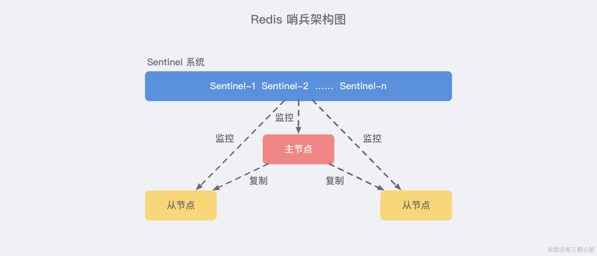
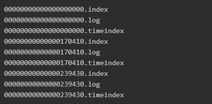

# 1. cookie和sesion
Session 的主要作用就是通过服务端记录用户的状态。 典型的场景是购物车，当你要添加商品到购物车的时候，系统不知道是哪个用户操作的，因为 HTTP 协议是无状态的。服务端给特定的用户创建特定的 Session 之后就可以标识这个用户并且跟踪这个用户了。

Cookie 数据保存在客户端(浏览器端)，Session 数据保存在服务器端。相对来说 Session 安全性更高。如果使用 Cookie 的一些敏感信息不要写入 Cookie 中，最好能将 Cookie 信息加密然后使用到的时候再去服务器端解密。

那么，如何使用Session进行身份验证？

很多时候我们都是通过 SessionID 来实现特定的用户，SessionID 一般会选择存放在 Redis 中。举个例子：用户成功登陆系统，然后返回给客户端具有 SessionID 的 Cookie，当用户向后端发起请求的时候会把 SessionID 带上，这样后端就知道你的身份状态了。

用户向服务器发送用户名和密码用于登陆系统。  
服务器验证通过后，服务器为用户创建一个 Session，并将 Session信息存储 起来。  
服务器向用户返回一个 SessionID，写入用户的 Cookie。  
当用户保持登录状态时，Cookie 将与每个后续请求一起被发送出去。  
服务器可以将存储在 Cookie 上的 Session ID 与存储在内存中或者数据库中的 Session 信息进行比较，以验证用户的身份，返回给用户客户端响应信息的时候会附带用户当前的状态。

分布式session：  
客户端发送一个请求，经过负载均衡后该请求会被分配到服务器中的其中一个，由于不同服务器含有不同的web服务器(例如Tomcat)，不同的web服务器中并不能发现之前web服务器保存的session信息，就会再次生成一个JSESSIONID，之前的状态就会丢失  
解决方案：session绑定，ip-hash 或者 基于redis存储session

# 2. java线程池
- 降低资源的消耗。线程本身是一种资源，创建和销毁线程会有CPU开销；创建的线程也会占用一定的内存。   

- 提高任务执行的响应速度。任务执行时，可以不必等到线程创建完之后再执行。   
- 提高线程的可管理性。线程不能无限制地创建，需要进行统一的分配、调优和监控。
- 

- 为什么要调用start方法而不是run方法？
    - 调⽤ start ⽅法⽅可启动线程并使线程进⼊就绪状态，⽽ run ⽅法只是 thread 的⼀个普通⽅法调⽤，还是在主线程⾥执⾏。

- 线程池一些参数：
    - corePoolSize: 规定线程池有几个线程(worker)在运行。
    - QUEUE_CAPACITY 队列容量
    - maximumPoolSize: 当workQueue满了,不能添加任务的时候，这个参数才会生效。规定线程池最多只能有多少个线程(worker)在执行。
# 3.影响一个Http服务最大连接数的因素是什么
文件句柄限制:  
执行 ulimit -n 输出 1024，说明对于一个进程而言最多只能打开1024个文件，所以你要采用此默认配置最多也就可以并发上千个TCP连接。
临时修改：ulimit -n 1000000，但是这种临时修改只对当前登录用户目前的使用环境有效，永久修改：编辑/etc/rc.local，在其后添加如下内容：ulimit -SHn 1000000

端口范围限制：客户端端口范围限制。 四元组，服务端实际只使用了bind时这一个端口，说明端口号65535并不是并发量的限制。因此server端tcp连接4元组中只有remote ip（也就是client ip）和remote port（客户端port）是可变的，
因此最大tcp连接为：客户端ip数×客户端port数，对IPV4，不考虑ip地址分类等因素，最大tcp连接数约为：2的32次方（ip数）×2的16次方（port数），也就是server端单机最大tcp连接数约为2的48次方。

# 4.什么是线程安全，线程安全与线程同步。
当多个线程访问某个方法时，不管你通过怎样的调用方式或者说这些线程如何交替的执行，我们在主程序中不需要去做任何的同步，这个类的结果行为都是我们设想的正确行为，那么我们就可以说这个类时线程安全的。
比如 100个线程 i++ 如果不加锁啥的 就是线程不安全的。

线程同步：多个线程操作一个资源的情况下，导致资源数据前后不一致。这样就需要协调线程的调度，即线程同步。 解决多个线程使用共通资源的方法是：线程操作资源时独占资源，其他线程不能访问资源。使用锁可以保证在某一代码段上只有一条线程访问共用资源。

(1)使用synchronized关键字  修饰方法，修饰代码块，修饰类
(2)使用特殊域变量(volatile)

### 4.1 Java多线程---顺序打印ABC打印10次的实现-三种实现
一、基于Semaphore
二、基于Synchronized
三、基于ReentrantLock
https://www.jianshu.com/p/b036dda3f5c8


# 美团 8.10 1面
### 1.InnoDB一棵b+树可以存储多少数据？
一、InnoDB一棵B+树可以存放多少行数据？(约2千万)

我们都知道计算机在存储数据的时候，有最小存储单元，这就好比我们今天进行现金的流通最小单位是一毛。在计算机中磁盘存储数据最小单元是扇区，一个扇区的大小是512字节，而文件系统（例如XFS/EXT4）他的最小单元是块，一个块的大小是4k，而对于我们的InnoDB存储引擎也有自己的最小储存单元——页（Page），一个页的大小是16K。

这里我们先假设B+树高为2，即存在一个根节点和若干个叶子节点，那么这棵B+树的存放总记录数为：根节点指针数*单个叶子节点记录行数。

上文我们已经说明单个叶子节点（页）中的记录数=16K（一页16KB）/1K（假设一行1KB）=16。（这里假设一行记录的数据大小为1k）。

 

那么现在我们需要计算出非叶子节点能存放多少指针？

其实这也很好算，我们假设主键ID为bigint类型，长度为8字节，而指针大小在InnoDB源码中设置为6字节，这样一共14字节，我们一个页中能存放多少这样的单元，其实就代表有多少指针，即16KB（16*1024=16384 byte）16384/14=1170（索引个数）。那么可以算出一棵高度为2的B+树，能存放1170 * 16=18720条这样的数据记录。

 

根据同样的原理我们可以算出一个高度为3的B+树可以存放：1170（索引个数）*1170（索引个数）*16（每页行数）=21902400（2千万）条这样的记录。

所以在InnoDB中B+树高度一般为1-3层，它就能满足千万级的数据存储。在查找数据时一次页的查找代表一次IO，所以通过主键索引查询通常只需要1-3次IO操作即可查找到数据。
### 2.linux内核之扇区,页,块的理解

页：操作系统必须以页为单位管理内存. 一般4k

块:文件系统最小寻址单元,又称为文件块和io块  一般4k

扇区:块设备中最小寻址单元是扇区,扇区这一术语在内核中重要是因为所有设备的io必须以扇区为单位操作


### 3. redis分布式锁，解锁的注意事项。

首先，为了确保分布式锁可用，我们至少要确保锁的实现同时满足以下四个条件：

1. 互斥性。在任意时刻，只有一个客户端能持有锁。
2. 不会发生死锁。即使有一个客户端在持有锁的期间崩溃而没有主动解锁，也能保证后续其他客户端能加锁。
3. 具有容错性。只要大部分的Redis节点正常运行，客户端就可以加锁和解锁。
4. 解铃还须系铃人。加锁和解锁必须是同一个客户端，客户端自己不能把别人加的锁给解了。

比较好的实现：
https://blog.csdn.net/kongmin_123/article/details/82080962?utm_medium=distribute.pc_relevant.none-task-blog-BlogCommendFromMachineLearnPai2-4.channel_param&depth_1-utm_source=distribute.pc_relevant.none-task-blog-BlogCommendFromMachineLearnPai2-4.channel_param
1. set 和 expire 保证原子性。
2. 可以在加锁的时候把当前的线程ID当做value，并在删除之前验证key对应的value是不是自己线程的ID。这样做又隐含了一个新的问题，判断和释放锁是两个独立操作，不是原子性的。
要想实现验证和删除过程的原子性，可以使用Lua脚本来实现。这样就能保证验证和删除过程的正确性了。


redis分布式锁的key可以分段来加，提高并发。
### 4. redis主从复制，哨兵，集群。
redis主从过程

redis哨兵

上图 展示了一个典型的哨兵架构图，它由两部分组成，哨兵节点和数据节点：

哨兵节点： 哨兵系统由一个或多个哨兵节点组成，哨兵节点是特殊的 Redis 节点，不存储数据；
数据节点： 主节点和从节点都是数据节点；
在复制的基础上，哨兵实现了 自动化的故障恢复 功能，下方是官方对于哨兵功能的描述：

监控（Monitoring）： 哨兵会不断地检查主节点和从节点是否运作正常。

自动故障转移（Automatic failover）： 当 主节点 不能正常工作时，哨兵会开始 自动故障转移操作，它会将失效主节点的其中一个 从节点升级为新的主节点，并让其他从节点改为复制新的主节点。

配置提供者（Configuration provider）： 客户端在初始化时，通过连接哨兵来获得当前 Redis 服务的主节点地址。

通知（Notification）： 哨兵可以将故障转移的结果发送给客户端。
其中，监控和自动故障转移功能，使得哨兵可以及时发现主节点故障并完成转移。而配置提供者和通知功能，则需要在与客户端的交互中才能体现。

简单来说 Sentinel 使用以下规则来选择新的主服务器：

在失效主服务器属下的从服务器当中， 那些被标记为主观下线、已断线、或者最后一次回复 PING 命令的时间大于五秒钟的从服务器都会被 淘汰。  
在失效主服务器属下的从服务器当中， 那些与失效主服务器连接断开的时长超过 down-after 选项指定的时长十倍的从服务器都会被 淘汰。  
在 经历了以上两轮淘汰之后 剩下来的从服务器中， 我们选出 复制偏移量（replication offset）最大 的那个 从服务器 作为新的主服务器；如果复制偏移量不可用，或者从服务器的复制偏移量相同，那么 带有最小运行 ID 的那个从服务器成为新的主服务器。
redis集群


集群数据分区方案 

方案一：哈希值 % 节点数
哈希取余分区思路非常简单：计算 key 的 hash 值，然后对节点数量进行取余，从而决定数据映射到哪个节点上。

不过该方案最大的问题是，当新增或删减节点时，节点数量发生变化，系统中所有的数据都需要 重新计算映射关系，引发大规模数据迁移。

方案二：一致性哈希分区
一致性哈希算法将 整个哈希值空间 组织成一个虚拟的圆环，范围是 [0 , 232-1]，对于每一个数据，根据 key 计算 hash 值，确数据在环上的位置，然后从此位置沿顺时针行走，找到的第一台服务器就是其应该映射到的服务器：
与哈希取余分区相比，一致性哈希分区将 增减节点的影响限制在相邻节点。以上图为例，如果在 node1 和 node2 之间增加 node5，则只有 node2 中的一部分数据会迁移到 node5；如果去掉 node2，则原 node2 中的数据只会迁移到 node4 中，只有 node4 会受影响。

一致性哈希分区的主要问题在于，当 节点数量较少 时，增加或删减节点，对单个节点的影响可能很大，造成数据的严重不平衡。还是以上图为例，如果去掉 node2，node4 中的数据由总数据的 1/4 左右变为 1/2 左右，与其他节点相比负载过高。

方案三：带有虚拟节点的一致性哈希分区

非常明显，把这个环上的槽点弄的密集一点，那这样，宕机几个节点，就分配到其他节点比较均衡。

该方案在 一致性哈希分区的基础上，引入了 虚拟节点 的概念。Redis 集群使用的便是该方案，其中的虚拟节点称为 槽（slot）。槽是介于数据和实际节点之间的虚拟概念，每个实际节点包含一定数量的槽，每个槽包含哈希值在一定范围内的数据。

在使用了槽的一致性哈希分区中，槽是数据管理和迁移的基本单位。槽 解耦 了 数据和实际节点 之间的关系，增加或删除节点对系统的影响很小。仍以上图为例，系统中有 4 个实际节点，假设为其分配 16 个槽(0-15)；

槽 0-3 位于 node1；4-7 位于 node2；以此类推....
如果此时删除 node2，只需要将槽 4-7 重新分配即可，例如槽 4-5 分配给 node1，槽 6 分配给 node3，槽 7 分配给 node4；可以看出删除 node2 后，数据在其他节点的分布仍然较为均衡。

https://github.com/Snailclimb/JavaGuide/blob/master/docs/database/Redis/redis-collection/Redis(9)%E2%80%94%E2%80%94%E9%9B%86%E7%BE%A4%E5%85%A5%E9%97%A8%E5%AE%9E%E8%B7%B5%E6%95%99%E7%A8%8B.md
### 5. 写个伪代码：如何把请求的url映射到Controller层方法上

### 6. epoll的两种模式 -- 水平和边沿

LT:level trigger, 水平触发模式  ET:edge trigger, 边缘触发模式相同点

两种模式LT和ET：最后看看epoll独有的两种模式LT和ET。无论是LT和ET模式，都适用于以上所说的流程。区别是，LT模式下，只要一个句柄上的事件一次没有处理完，会在以后调用epoll_wait时次次返回这个句柄，而ET模式仅在第一次返回。
这件事怎么做到的呢？当一个socket句柄上有事件时，内核会把该句柄插入上面所说的准备就绪list链表，这时我们调用epoll_wait，会把准备就绪的socket拷贝到用户态内存，然后清空准备就绪list链表，最后，epoll_wait干了件事，就是检查这些socket，如果是LT模式，并且这些socket上确实有未处理的事件时，又把该句柄放回到刚刚清空的准备就绪链表了。所以，LT的句柄，只要它上面还有事件，epoll_wait每次都会返回。而ET模式的句柄，除非有新中断到，即使socket上的事件没有处理完，也是不会次次从epoll_wait返回的。


### 7. hashmap中如何判断两个对象相同。
先判断hashcode相同不，不相同肯定不是一个。相同的话，再判断equals。
不同对象可能会有相同的hashcode，哈希冲突。 如何判断是究竟是两个逻辑相等的对象重复写入，还是两个逻辑不等的对象出现了哈希冲突呢？
所以，要判断一下，equals相同不。

### 8.线程池有哪些参数，执行流程是怎样的？有哪些常用 BlockingQueue，区别是什么？拒绝策略有哪些？shutdown() 和 shutdownNow() 有什么区别？

### 9. synchronized 和 ReentrantLock 区别？ReentrantLock 实现原理，AQS 原理，CountdownLatch 和 Semaphore 的作用？

### 10. 说一说在浏览器中输入一个url后，直到浏览器显示页面的过程中发生了什么？

# 2. 腾讯音乐人1面 8.15晚7.30
- 不会的问题，慢慢来，别着急，别慌，稳点！

- 1.数据结构里面的树全介绍一遍，二叉树出来的背景，以及可以解决的问题。
Java里的集合啊，mysql的索引啊。
    - 树- 搜索树，平衡树，红黑树（也是一种平衡树），b树，b+树。 （红黑树，AVL树都是有序的）， LSM Tree
    - 平衡树： AVL的每一次插入结点操作最多只需要旋转1次(单旋转或双旋转)，删除之后必须检查从删除结点开始到根结点路径上的所有结点的平衡因子。因此删除的代价稍微要大一些。每一次删除操作最多需要O(logN)次旋转
    
    - 红黑树： 最长路径不超过最短路径的两倍就可以，每个红节点下面跟个黑节点，每条链路上黑节点个数必须相同。插入最多两次旋转，删除最多三次旋转。
    - AVL树和红黑树区别？
        - AVL树是高度平衡的，每插入和删除很大概率就需要进行左旋右旋操作来恢复平衡。
        - 红黑树不是高度平衡的，每次插入和删除要rebalance的概率比AVL树低。 而且变色操作很简单快速。
    - b树，b+树： B+树更适合文件系统的磁盘存储结构，减少磁盘io次数，每个树节点可以存很多索引，通过2-3次的磁盘io就可以找到所查找的数据。
    - b+树相对于b树有一些自己的优势，可以归结为下面几点。
        - 单一节点存储的元素更多（一个节点为innodb定义的一页，16k），使得查询的IO次数更少，所以也就使得它更适合做为数据库MySQL的底层数据结构了。
        
        - 所有的查询都要查找到叶子节点，查询性能是稳定的，而B树，每个节点都可以查找到数据，所以不稳定。
        - 所有的叶子节点形成了一个有序链表，更加便于查找
        - https://blog.csdn.net/zl1zl2zl3/article/details/88321108
        
    - LSM Tree
        - https://blog.csdn.net/mingyuezh/article/details/80839868
        - 面试回答：
            - 比如说 随机插入数据，或者随机读取数据， b+树随机磁盘io浪费资源。
            而lsm树可以顺序写入内存中，然后刷到磁盘上，写效率很高。读的时候，依靠内存命中率，内存读不到，去各个小树找，各个小树有序，
            不断的合并这些小树。
        - lsm tree牺牲部分读性能，而大幅度提高写性能。 读多写少b+树，因为大量写大量随机io要分裂树节点。 写多lsm tree，内存中写，非常块。
        - 原理是把一颗大树拆分成N棵小树， 它首先写入到内存中（内存没有寻道速度的问题，随机写的性能得到大幅提升），在内存中构建一颗有序小树，随着小树越来越大，内存的小树会flush到磁盘上。当读时，由于不知道数据在哪棵小树上，因此必须遍历所有的小树，但在每颗小树内部数据是有序的。

        - 以上就是LSM树最本质的原理，有了原理，再看具体的技术就很简单了。
            - 1）首先说说为什么要有WAL（Write Ahead Log），很简单，因为数据是先写到内存中，如果断电，内存中的数据会丢失，因此为了保护内存中的数据，需要在磁盘上先记录logfile，当内存中的数据flush到磁盘上时，就可以抛弃相应的Logfile。
            - 2）什么是memstore, storefile？很简单，上面说过，LSM树就是一堆小树，在内存中的小树即memstore，每次flush，内存中的memstore变成磁盘上一个新的storefile。
            - 3）为什么会有compact？很简单，随着小树越来越多，读的性能会越来越差，因此需要在适当的时候，对磁盘中的小树进行merge，多棵小树变成一颗大树。
- 2.Treemap是什么实现的？  --红黑树，所以添加，删除，查找效率都比HashMap低，但是key有序。
- 3.其他能够实现红黑树特性的数据结构？ -- 跳表
    - Skip List主要思想是将链表与二分查找相结合，以空间换时间
    
    - 跳表和红黑树的区别？
        - 跳表实现简单
        
        - 进行范围查找效率高（最下层有链表），而红黑树等还要用中序遍历去查找其他节点。
        - 红黑树的插入删除，需要rebalance，而跳表只需要修改相邻节点的指针。
    - 跳表有什么缺点？
        - 虽然每个节点占用的空间要小一些，skiplist每个节点包含的指针数目平均为1/(1-p)，具体取决于参数p的大小。但是要向上抽取节点建多层索引，占内存更多一些。  
    - 占的空间多一些，为什么呢？ 空间换时间
    - 跳表怎么去找一些节点往上层抽，抽的节点，有什么讲究？比如要是抽的节点都排在一起，肯定不合理。
        - Skip List还有一个明显的特征，即它是一个不准确的概率性结构，这是因为Skip List在决定是否将节点冗余复制到上一层的时候（而在到达或超过顶层时，需要构建新的顶层）依赖于一个概率函数，举个栗子，我们使用一个最简单的概率函数：丢硬币，即概率P为0.5，那么依赖于该概率函数实现的Skip List会不断地"丢硬币"，如果硬币为正面就将节点复制到上一层，直到硬币为反。
        - 抛硬币算法，随机决定插入的新节点是否向上提拔，每向上提拔一层的概率是50%。
    - 具体的一些算法，redis里面sort set看一下怎么抽的节点。
        - sorted set 也是抛硬币决定是不是向上抽的。
- 4.Java的项目，秒杀系统，大概讲一下？
    - 核心思路是通过缓存，异步，限流来保证系统的高并发和高可用。
    
    - 库存放到redis里缓存，用分布式锁防止超卖。
    - redis减库存后，将用户信息，订单信息，放到消息队列中做削峰，异步。
    - 前端限流，后端限流redis计数器做限流。

- 5.Synchronized 偏向锁，轻量级锁，讲一下？
    - https://blog.csdn.net/zqz_zqz/article/details/70233767
    - 先看markword里的锁标志是不是为偏向锁标志，是的话，检查对象markword里是否存着当前线程ID，如果是的话，就执行同步代码。不是的话，尝试用CAS将markword里的线程ID改为当前线程ID。
    如果成功，将markword里的线程ID改为当前线程ID，执行同步代码。如果失败，表示有竞争，到达全局安全点后，已获得偏向锁的线程被挂起，升级为轻量级锁，阻塞在安全点的线程继续往下执行同步代码。
    - 偏向锁适用于只有一个线程在执行同步块，无锁竞争的情况下使用。一旦有竞争就升级为轻量级锁。
    
    - 轻量级锁：代码进入同步块之前，如果对象头里是无锁状态，虚拟机会在当前线程的栈帧中创建一个锁记录（Lock record）的空间，
    用于存储markword的拷贝，之后虚拟机使用CAS操作将对象的markword更新为指向Lock record的指针，并将Lock record里的owner指向对象头的mark word。
    如果成功，表示该线程拥有了该对象的锁，将对象头的锁标志位设置为00，表示该对象处于轻量级锁状态。
    如果失败，虚拟机会检查对象头是不是指向当前线程的线程的栈帧，如果是表示当前线程已经拥有了这个对象的锁，可以执行同步代码块了。
    否则说明多个线程竞争锁，要升级为重量级锁。锁标志位改为10.Mark word里存的就是指向重量级锁的指针。后面等待锁的线程要进入阻塞状态。
    当前线程尝试使用自旋来获得锁。
    
    - 由轻量锁切换到重量锁，是发生在轻量锁释放锁的期间，之前在获取锁的时候它拷贝了锁对象头的markword，在释放锁的时候如果它发现在它持有锁的期间有其他线程来尝试获取锁了，并且该线程对markword做了修改，两者比对发现不一致，则切换到重量锁。
        - 
        - 
    - synchronized的执行过程：
        - 1.检测Mark Word里面是不是当前线程的ID，如果是，表示当前线程处于偏向锁
        - 2.如果不是，则使用CAS将当前线程的ID替换Mard Word，如果成功则表示当前线程获得偏向锁，置偏向标志位1
        - 3.如果失败，则说明发生竞争，撤销偏向锁，进而升级为轻量级锁。
        - 4.当前线程使用CAS将对象头的Mark Word替换为锁记录指针，如果成功，当前线程获得锁
        - 5.如果失败，表示其他线程竞争锁，当前线程便尝试使用自旋来获取锁。
        - 6.如果自旋成功则依然处于轻量级状态。
        - 7.如果自旋失败，则升级为重量级锁。


- 6.Linux相关
    - 查看数据库与服务建立的连接？
        - netstat -nat | grep 数据库ip
    
    - grep里有很多参数知道哪些？
        - grep -A2 就是查关键字的后两行，after意思
        - grep -B2 查关键字的前两行
        - grep -C2 前后都看
        - grep -a就是需要排除这个关键字的结果。
        - grep -c就是统计error日志的出现次数。
    - sed和awt了解吗？？？
- 7.有去了解过一些框架吗？springboot啊？了解吗？
- 8.看过设计模式或者软件源码吗？
- 9.TCP为什么四次挥手，3次握手？
- 10.2MSL一般是多少，linux里面一般是多少，这个东西可以调吗？
    - https://blog.csdn.net/xiaofei0859/article/details/6044694
   
    - 这个生存时间是由源主机设置初始值但不是存的具体时间，而是存储了一个ip数据报可以经过的最大路由数，每经过一个处理他的路由器此值就减1，当此值为0则数据报将被丢弃，同时发送ICMP报文通知源主机。RFC 793中规定MSL为2分钟，实际应用中常用的是30秒，1分钟和2分钟等。
    - 为什么是2倍呢？
    - close-wait是什么情况下出现的？
- 11.tcp里面滑动窗口用来干嘛的？
    
    - 滑动窗口的窗口大小是怎么确定的？
- 12.tcp为什么会出现拆包粘包的问题？
    - 业内如何处理粘包，拆包？
    - 头部放入包的大小？
    - 末尾加特殊标示，有什么缺点？
- 13.看过java里的io吗？
    - 讲一下多路复用的原理？
- 14.想去快速知道腾讯员工里面重名的有多少？用sql来写？
    - select name from student group_by name haven  count(*)>1 这个就可以 了解下 haven
- 15.前中后序遍历，不用递归，怎么做？ 可以用for循环+栈
- 16.es相关
    - Es里的路由节点和数据节点的区别？
    - 为什么用ES？
    - Es分布式的，查一条数据，数据可能在不同的节点上，es如何处理。
    - 归并排序，对所有分片读到 查询节点的 5000 10，做归并排序查询。

# 3. 美团二面 8.18
1.	算法题：
数组里找到第m小的元素，并打印出来
在n个数字里随机的选出m个数，这m个数字不可以重复。任何一个数字只能选中1次。1 2 3 4 5 里面数字1只能选1次。
一段文本中，输入一个文本串，输出最长重复子串。 后缀树？前缀树？
2．两个进程，c语言对地址进行赋值，是逻辑地址吧？  是的
3. 进程内存隔离吗？ 不同进程内存隔离，为什么又有共享内存呢？怎么做到既可以隔离又可以共享？
   - 虚拟内存让进程认为自己独有一段连续的空间，页表将俩块逻辑地址映射到同一块物理地址，就共享内存了。
4. Mmu是什么？
    - CPU访问地址是向MMU发送地址，然后从MMU获得数据，虚拟地址经过MMU转化为物理地址，从而访问外部内存里的数据。
    - MMU就是将逻辑地址查页表，然后返回物理地址。
5. 内存映射 段式，页式？
    - 共享内存可以通过mmap()映射普通文件机制实现
6. TCP协议，可靠，是说发了一个之后，接收端一定能收到吗？会有收不到的情况吗？
    - 可靠，指 发送发的 一定和接收端接受的一样。按序，完整的收到。
    - 收不到 就超时重传
7. 可能是什么原因没有收到第一次发的数据包呢？
    - 丢包
    - 接收方由于缓存溢出，导致无法再处理到来的数据包了，直接丢弃从而造成丢包
    - 网络拥塞导致数据包丢包
    - 数据包被检测到损坏了，被接收方丢弃造成了丢包
8. 丢包可能会在哪个地方丢？怎么丢？为什么会丢包？
    - 网络链接阻塞
    - 路由器设备性能
    https://blog.csdn.net/duandianR/article/details/77513506
9. ip层为啥会丢包？
    - 不可靠呀
10． 路由器那块是不是可能也会丢？
    - 会
11. 路由器为什么会丢？
    - 网络设备cpu或者内存满了，来不及出来，丢
12. 可靠表现在哪些方面？
13. 拥塞控制怎么保证可靠性？
14. select * from student where age>18 and score=90 order by ip
(score, age) 这个索引， 那这个语句会用到索引吗？

# 4. 腾讯二面  8.18
1. LSM树和b+树的区别？
    - 比如说 随机插入数据，或者随机读取数据， b+树随机磁盘io浪费资源。
    而lsm树可以顺序写入内存中，然后刷到磁盘上，写效率很高。读的时候，依靠内存命中率，内存读不到，去各个小树找，各个小树有序，
    不断的合并这些小树。
2. 介绍下秒杀系统，哪里最难
    - 秒杀接口，要限流，缓存，异步
3. 秒杀场景Redis和mysql数据同步
    - 这种业务场景，不需要数据一致，都在redis里操作
4. Redis挂了怎么办
    - 主从，集群，高可用
5. 异步一般通过什么方式来实现？
6. 多线程，进程内的线程，如何传递消息？  有数据了，通过对方去拿数据？
    - 全局变量 wait notify
    
- wait notify 底层？

7. 多个线程能够在某一个时刻可以同时触发。
    - CyclicBarrier （适用在多线程相互等待，直到到达一个屏障点。
    - CountDownLatch 实现，CountDownLatch可以理解为一个计数器，直到计数器为0了，等待的线程才执行。
    - https://www.jianshu.com/p/892aa4af8b8e
8. Zset的业务场景，
    - 游戏排名、微博热点话题
9. Kafka的分区选多少个分区？
    - kafka分区过多的缺点？
    - https://www.cnblogs.com/chong-zuo3322/p/13523525.html
    - 文件句柄开销大
        - 每个分区在底层文件系统都有属于自己的一个目录。该目录下通常会有两个文件： base_offset.log和base_offset.index。Kafak的controller和ReplicaManager会为每个broker都保存这两个文件句柄(file handler)。很明显，如果分区数越多，所需要保持打开状态的文件句柄数也就越多，最终可能会突破你的ulimit -n的限制。
    
    - 降低高可用性
        - Kafka通过副本(replica)机制来保证高可用。具体做法就是为每个分区保存若干个副本(replica_factor指定副本数)。每个副本保存在不同的broker上。

10. Kafka如何高可用，保证机器挂了数据不会丢失。
    - Kafka通过副本(replica)机制来保证高可用。具体做法就是为每个分区保存若干个副本(replica_factor指定副本数)。每个副本保存在不同的broker上。期中的一个副本充当leader 副本，负责处理producer和consumer请求。其他副本充当follower角色，由Kafka controller负责保证与leader的同步。如果leader所在的broker挂掉了，contorller会检测到然后在zookeeper的帮助下重选出新的leader
11. Kafka怎么保证，写的数据能够到replica里？
    - Follower在收到该消息并写入其Log后，向Leader发送ACK。一旦Leader收到了ISR中的所有Replica的ACK，该消息就被认为已经commit了，Leader将增加HW并且向Producer发送ACK。

12. oauth2单点登陆？

12. 平时通过什么学习新知识？

13. 平时学习工作中接触到一个新的概念，通过什么方式去上手学习。

14.	有没有看过一些源码？

15.	有去阅读过一些技术介绍的书吗？

16.	举个例子，最近看的书？

17.	对以后的职业规划？


# 5. 腾讯科恩实验室 2.25
- 索引为什么不多用？
   - 在表上建立的每个索引都会增加存储开销，索引对于插入、删除、更新操作，会导致b+树结构的变化，也会增加处理上的开销。
- git撤回命令 ？
    - git checkout切换分支 git merge, git pull, git push, git reset撤回提交
- docker compose。 5 自我介绍 慢点说 别着急。 
- jwt的优点？
    - jwt是一个字符串，（json web token） 发起http请求时 将它放入headers或者url中。这样可以保证传递的数据被篡改时能被我们发现，保证安全性。jwt由三部分组成 header+payload+signature
- 单点登陆
    - 在多个应用系统中，只需要登录一次，就可以访问其他相互信任的应用系统。
    - 
- restful是啥啊？ 
    - RESTful是一种架构的规范与约束、原则，符合这种规范的架构就是RESTful架构。get|post  project /
- socket服务端和客户端通信过程
- get post区别 
    - （1) 参数位置  url/ 实体 （2) get幂等操作， 不改变状态。， post上传数据可能存到数据库中 改变了状态。
- 主键和索引？
    - 主键一定是唯一性索引，唯一性索引并不一定就是主键。  一个表中可以有多个唯一性索引，但只能有一个主键。 主键列不允许空值，而唯一性索引列允许空值。 索引可以提高查询的速度。 
主键和索引都是键，不过主键是逻辑键，索引是物理键，意思就是主键不实际存在，而索引实际存在在数据库中
- 什么是联合索引 最左前缀原则 多个单列索引和联合索引？
    - 两个或更多个列上的索引被称作联合索引，联合索引又叫复合索引。对于复合索引:Mysql从左到右的使用索引中的字段，一个查询可以只使用索引中的一部份，但只能是最左侧部分。例如索引是key index (a,b,c). 可以支持a | a,b| a,b,c 3种组合进行查找，但不支持 b,c进行查找 
如果您知道姓，电话簿将非常有用；如果您知道姓和名，电话簿则更为有用，但如果您只知道名不姓，电话簿将没有用处。
所以说创建复合索引时，应该仔细考虑列的顺序。对索引中的所有列执行搜索或仅对前几列执行搜索时，复合索引非常有用；仅对后面的任意列执行搜索时，复合索引则没有用处。
多个单列索引在多条件查询时优化器会选择最优索引策略，可能只用一个索引，也可能将多个索引全用上！ 但多个单列索引底层会建立多个B+索引树，比较占用空间，也会浪费一定搜索效率，故如果只有多条件联合查询时最好建联合索引！
联合索引本质：
当创建**(a,b,c)联合索引时，相当于创建了(a)单列索引**，(a,b)联合索引以及**(a,b,c)联合索引**

- 主键 外键？
    - 外键用于与另一张表的关联。是能确定另一张表记录的字段，用于保持数据的一致性。
    - 用外键能够最大程度的保持数据的一致性和完整性。
    - 不用外键时数据管理简单，操作方便，性能高（导入导出等操作，在insert, update, delete 数据的时候更快）eg:在海量的数据库中想都不要去想外键，试想，一个程序每天要insert数百万条记录，当存在外键约束的时候，每次要去扫描此记录是否合格，一般还不止一个字段有外键，这样扫描的数量是成级数的增长！我的一个程序入库在3个小时做完，如果加上外键，需要28个小时！

- 乐观锁 悲观锁 及其应用场景?
    - 读用乐观锁，写用悲观锁。
    - 乐观锁
乐观锁不是数据库自带的，需要我们自己去实现。乐观锁是指操作数据库时(更新操作)，想法很乐观，认为这次的操作不会导致冲突，在操作数据时，并不进行任何其他的特殊处理（也就是不加锁），而在进行更新后，再去判断是否有冲突了。
通常实现是这样的：在表中的数据进行操作时(更新)，先给数据表加一个版本(version)字段，每操作一次，将那条记录的版本号加1。也就是先查询出那条记录，获取出version字段,如果要对那条记录进行操作(更新),则先判断此刻version的值是否与刚刚查询出来时的version的值相等，如果相等，则说明这段期间，没有其他程序对其进行操作，则可以执行更新，将version字段的值加1；如果更新时发现此刻的version值与刚刚获取出来的version的值不相等，则说明这段期间已经有其他程序对其进行操作了，则不进行更新操作。
乐观锁只是在更新数据那一刻锁表，其他事件不锁表。
    - 悲观锁
数据库默认就是悲观锁
与乐观锁相对应的就是悲观锁了。悲观锁就是在操作数据时，认为此操作会出现数据冲突，所以在进行每次操作时都要通过获取锁才能进行对相同数据的操作，这点跟java中的synchronized很相似，所以悲观锁需要耗费较多的时间。另外与乐观锁相对应的，悲观锁是由数据库自己实现了的，要用的时候，我们直接调用数据库的相关语句就可以了。
说到这里，由悲观锁涉及到的另外两个锁概念就出来了，它们就是共享锁与排它锁。共享锁和排它锁是悲观锁的不同的实现，它俩都属于悲观锁的范畴。
 
 # 6. 腾讯科恩实验室二面
- static
    - 给变量加上static关键字后，此变量变为全局变量，JVM在加载时会直接将此变量加载到方法区里而不是堆里
static修饰成员方法最大的作用，就是可以使用"类名.方法名"的方式操作方法，避免了先要new出对象的繁琐和资源消耗
- 深浅复制 
    - 深浅拷贝 对于 数字和字符串 没区别，都是那一块地址。
    - 直接复制 = 列表字典数组 还是一个地址
    - 浅拷贝 copy 第一层改变，字典中的第二层没有变
    - 深拷贝 不论多少层都变了。
- b+数缺点
    - B+树最大的性能问题在于会产生大量的随机IO，主要存在以下两种情况：
        - 主键不是有序递增的，导致每次插入数据产生大量的数据迁移和空间碎片；
        - 即使主键是有序递增的，大量写请求的分布仍是随机的；比如更新id=1，更新id=1000000，这样的随机io。用LSM树就可解决。
- 介绍b+树 
- 如何解决脏读  
- 事务 
- 如何设计数据库表
- 数据隔离级别 各个级别都解决了什么问题 
- 各种隔离级别解决什么问题
    - mysql数据库定义了四种隔离级别：
    serializable：可避免脏读、不可重复读、幻读情况的发生。
    repeatable read：可以避免脏读、不可重复读情况的发生。
    read committed：可以避免脏读情况发生。
    read uncommitted：最低级别，都会发生。

    - 如何解决这些问题：
    脏读：写加排他锁，提交后再释放锁。
    不可重复读，可读加共享锁，写加排他锁，都是事务结束后再释放锁。
    幻读，可以读加间隙锁，锁定检索范围为只读。
    
    - 序列换：执行当前事务时，不允许其他事务执行。使得 事务串行执行。
    可重复读：幻读      两次查询不一样，两次查询之间别人插入了数据，好像幻觉一样。
    读已提交： 不可重复读     两次查询结果不一样，再两次查询之间 别的事务修改了数据
    读未提交： 脏读        读到了别人没提交的数据
- 事务
数据库事务是指作为单个逻辑工作单元执行的一系列操作（SQL语句）。这些操作要么全部执行，要么全部不执行
事务特性 有四种   原子性 一致性 隔离性 持久性
启动 begin 或 start transacion   提交 commit
- mvc模式
模型（Model）：程序员编写程序应有的功能（实现算法等等）、数据库专家进行数据管理和数据库设计(可以实现具体的功能)；
控制器（Controller）：负责转发请求，对请求进行处理；
视图（View）：界面设计人员进行图形界面设计。

# 7. 字节跳动1面  2.27日
1. http可以用udp实现吗
可以 但一般都用tcp 因为可靠，但也可以在udp基础上加一个可靠传输机制
2. tcp udp区别 
3. io多路复用啥意思 
    - 如果一个I/O流进来，我们就开启一个进程处理这个I/O流。那么假设现在有一百万个I/O流进来，
    那我们就需要开启一百万个进程一一对应处理这些I/O流（——这就是传统意义下的多进程并发处理）。
    思考一下，一百万个进程，你的CPU占有率会多高，这个实现方式及其的不合理。
    所以人们提出了I/O多路复用这个模型，一个线程，通过记录I/O流的状态来同时管理多个I/O，
    可以提高服务器的吞吐能力。就像下面这张图的前半部分一样，中间的那条线就是我们的单个线程，
    它通过记录传入的每一个I/O流的状态来同时管理多个IO。
    我的理解，就是一个线程，不断的去遍历 io这个文件描述符的集合，如果有消息来了，就处理，没有就阻塞。
4. redis zset底层 
    - zset key是score value才是值，查找都是根据score范围找的。根据score找是logn 根据value找，那就是n
    - 
    https://www.jianshu.com/p/c2841d65df4c 死磕跳表
    zset 底层 是跳表
    跳表具有如下性质：
    (1) 由很多层结构组成
    (2) 每一层都是一个有序的链表
    (3) 最底层(Level 1)的链表包含所有元素
    (4) 如果一个元素出现在 Level i 的链表中，则它在 Level i 之下的链表也都会出现。
    (5) 每个节点包含两个指针，一个指向同一链表中的下一个元素，一个指向下面一层的元素。
    - 4.1 skiplist与平衡树、哈希表的比较
skiplist和各种平衡树（如AVL、红黑树等）的元素是有序排列的，而哈希表不是有序的。
因此，在哈希表上只能做单个key的查找，不适宜做范围查找。所谓范围查找，指的是查找那些大小在指定的两个值之间的所有节点。
在做范围查找的时候，平衡树比skiplist操作要复杂。在平衡树上，我们找到指定范围的小值之后，
还需要以中序遍历的顺序继续寻找其它不超过大值的节点。如果不对平衡树进行一定的改造，
这里的中序遍历并不容易实现。而在skiplist上进行范围查找就非常简单，只需要在找到小值之后，
对第1层链表进行若干步的遍历就可以实现。
平衡树的插入和删除操作可能引发子树的调整，逻辑复杂，而skiplist的插入和删除只需要修改相邻节点的指针，操作简单又快速。
从内存占用上来说，skiplist比平衡树更灵活一些。一般来说，平衡树每个节点包含2个指针（分别指向左右子树），
而skiplist每个节点包含的指针数目平均为1/(1-p)，具体取决于参数p的大小。如果像Redis里的实现一样，取p=1/4，那么平均每个节点包含1.33个指针，比平衡树更有优势。
查找单个key，skiplist和平衡树的时间复杂度都为O(log n)，大体相当；而哈希表在保持较低的哈希值冲突概率的前提下，查找时间复杂度接近O(1)，性能更高一些。所以我们平常使用的各种Map或dictionary结构，大都是基于哈希表实现的。
从算法实现难度上来比较，skiplist比平衡树要简单得多。
实际上，Redis中sorted set的实现是这样的：
当数据较少时，sorted set是由一个ziplist来实现的。
当数据多的时候，sorted set是由一个dict + 一个skiplist来实现的。简单来讲，dict用来查询数据到分数的对应关系，而skiplist用来根据分数查询数据（可能是范围查找）。
ziplist就是由很多数据项组成的一大块连续内存。由于sorted set的每一项元素都由数据和score组成，因此，当使用zadd命令插入一个(数据, score)对的时候，底层在相应的ziplist上就插入两个数据项：数据在前，score在后。
ziplist的主要优点是节省内存，但它上面的查找操作只能按顺序查找（可以正序也可以倒序）。因此，sorted set的各个查询操作，就是在ziplist上从前向后（或从后向前）一步步查找，每一步前进两个数据项，跨域一个(数据, score)对。
5. 三次握手 四次挥手 
6. 进程通信方式 进程需要同步吗？ 会不会有线程同步问题？ 
7. mysql底层 
8. mysql优化 
9. flask的middleware 
10. 字典底层结构 
11. 如何解决幻读 
    - 当查询的索引含有唯一属性时，InnoDB会对Next-Key Lock进行优化，将其降级为Record Lock，即仅锁住索引本身，而不是范围。
关键点在于对查询范围进行加锁，在另一个事务执行插入操作时是不被运行的，从而避免了幻读。
select * from table where id>3 锁住的就是id=3这条记录以及id>3这个区间范围，锁住索引记录之间的范围，避免范围间插入记录，以避免产生幻影行记录。
    
    - 解决幻读又有多版本并发控制（MVCC）（快照读/一致性读）和next-key 锁 （当前读）
普通的 select 就是快照读。
select * from T where number = 1;
原理：将历史数据存一份快照，所以其他事务增加与删除数据，对于当前事务来说是不可见的。
next-key锁包含两部分
记录锁（行锁）
间隙锁
记录锁是加在索引上的锁，间隙锁是加在索引之间的。
select * from T where number = 1 for update;
select * from T where number = 1 lock in share mode;
　　1、数据库的两种读，每种读读的数据版本不一样，所以也称为MVCC，即多版本并发控制
　　　　a) 快照读 
　　　　　　select * from where xxx 这种形式的都是快照读。
　　　　b) 当前读
　　　　　　update , insert ,delete ,select xx from xx for update , in share mode 都是当前读
　　　　　　当前读会等待，不会返回数据的历史版本
12. 联合索引
联合索引是什么
对多个字段同时建立的索引(有顺序，ABC，ACB是完全不同的两种联合索引。)
为什么要用
以联合索引(a,b,c)为例
建立这样的索引相当于建立了索引a、ab、abc三个索引。一个索引顶三个索引当然是好事，毕竟每多一个索引，都会增加写操作的开销和磁盘空间的开销。
覆盖(动词)索引。同样的有联合索引（a,b,c），如果有如下的sql: select a,b,c from table where a=xxx and b = xxx。那么MySQL可以直接通过遍历索引取得数据，而无需读表，这减少了很多的随机io操作。减少io操作，特别的随机io其实是dba主要的优化策略。所以，在真正的实际应用中，覆盖索引是主要的提升性能的优化手段之一
索引列越多，通过索引筛选出的数据越少。有1000W条数据的表，有如下sql:select * from table where a = 1 and b =2 and c = 3,假设每个条件可以筛选出10%的数据，如果只有单值索引，那么通过该索引能筛选出1000W*10%=100w 条数据，然后再回表从100w条数据中找到符合b=2 and c= 3的数据，然后再排序，再分页；如果是复合索引，通过索引筛选出1000w *10% *10% *10%=1w，然后再排序、分页，哪个更高效，一眼便知
13. 聚簇索引、非聚簇索引、覆盖索引
    - 
    - 1 聚簇索引：clustered index 其实数据存储结构，索引和记录（全部）内容保存同一个结构中。“聚簇”就是索引和记录紧密在一起，分开就不是聚簇索引了，所以一张表只能有唯一的聚簇索引。附带问，能有多少二级索引呢？为什么？
    2 非聚簇索引：secondary index ，叶子节点保存了主键值，要定位记录还要再查一遍聚簇索引。
    3 覆盖索引：覆盖索引是指索引的叶子节点已包含所有要查询的列，因此不需要访问表数据（回表~~有学个名词，查询聚簇索引）
    （1）InnoDB的主键采用聚簇索引存储，使用的是B+Tree作为索引结构，但是叶子节点存储的是索引值和数据本身（注意和MyISAM的不同）。
    （2）InnoDB的二级索引不使用聚蔟索引，叶子节点存储的是KEY字段加主键值。因此，通过二级索引查询首先查到是主键值，然后InnoDB再根据查到的主键值通过主键索引找到相应的数据块。
    先通过普通索引定位到主键值id=5；
    在通过聚集索引定位到行记录；
    （3）MyISAM的主键索引和二级索引叶子节点存放的都是列值与行号的组合，叶子节点中保存的是数据的物理地址
    （4）MyISAM引擎使用B+Tree作为索引结构，叶节点的data域存放的是数据记录的地址
14. 如何解决脏读
写时候加互斥锁 写完释放
15. 为什么性别字段不适合简历索引
假如你要从表的100万行数据中取几个数据，那么利用索引迅速定位，访问索引的这IO开销就非常值了。但如果你是从100万行数据中取50万行数据，就比如性别字段，那你相对需要访问50万次索引，再访问50万次表，加起来的开销并不会比直接对表进行一次完整扫描小。

16. mysql锁
https://blog.csdn.net/zcl_love_wx/article/details/83305645

17. 事务日志
    - Innodb主要是通过事务日志实现ACID特性
事务日志包括：重做日志redo和回滚日志undo
Redo记录的是已经全部完成的事务，就是执行了commit的事务，记录文件是ib_logfile0 ib_logfile1
Undo记录的是已部分完成并且写入硬盘的未完成的事务，默认情况下回滚日志是记录下表空间中的（共享表空间或者独享表空间）
一般情况下，mysql在崩溃之后，重启服务，innodb通过回滚日志undo将所有已完成并写入磁盘的未完成事务进行rollback，然后redo中的事务全部重新执行一遍即可恢复数据
    - 事务日志可以帮助提高事务的效率。使用事务日志，存储引擎在修改表的数据时只需要修改其内存拷贝，再把该修改行为记录到持久在硬盘上的事务日志中，而不用每次都将修改的数据本身持久到磁盘。事务日志采用的是追加的方式，因此写日志的操作是磁盘上一小块区域内的顺序I/O，而不像随机I/O需要在磁盘的多个地方移动磁头，所以采用事务日志的方式相对来说要快得多。事务日志持久以后，内存中被修改的数据在后台可以慢慢地刷回到磁盘。目前大多数存储引擎都是这样实现的，我们通常称之为预写式日志（Write-Ahead Logging），修改数据需要写两次磁盘。
如果数据的修改已经记录到事务日志并持久化，但数据本身还没有写回磁盘，此时系统崩溃，存储引擎在重启时能够自动恢复这部分修改的数据。
InnoDB的MVCC,是通过在每行记录后面保存两个隐藏的列来实现的,这两个列，分别保存了这个行的创建时间，一个保存的是行的删除时间。这里存储的并不是实际的时间值,而是系统版本号(可以理解为事务的ID)，每开始一个新的事务，系统版本号就会自动递增，事务开始时刻的系统版本号会作为事务的ID
InnoDB会根据以下两个条件检查每行记录:
a.InnoDB只会查找版本早于当前事务版本的数据行(也就是,行的系统版本号小于或等于事务的系统版本号)，这样可以确保事务读取的行，要么是在事务开始前已经存在的，要么是事务自身插入或者修改过的.
b.行的删除版本要么未定义,要么大于当前事务版本号,这可以确保事务读取到的行，在事务开始之前未被删除.
只有a,b同时满足的记录，才能返回作为查询结果.
补充：
1.MVCC手段只适用于Msyql隔离级别中的读已提交（Read committed）和可重复读（Repeatable Read）.
2.Read uncimmitted由于存在脏读，即能读到未提交事务的数据行，所以不适用MVCC.
原因是MVCC的创建版本和删除版本只要在事务提交后才会产生。
3.串行化由于是会对所涉及到的表加锁，并非行锁，自然也就不存在行的版本控制问题。
4.通过以上总结，可知，MVCC主要作用于事务性的，有行锁控制的数据库模型。
https://blog.csdn.net/whoamiyang/article/details/51901888?depth_1-utm_source=distribute.pc_relevant.none-task&utm_source=distribute.pc_relevant.none-task

# 8. 字节二面 3.1日
1. redis多消费者多生产者如何注意 
当缓冲区已满时，生产者线程停止执行，放弃锁，使自己处于等状态，让其他线程执行；
当缓冲区已空时，消费者线程停止执行，放弃锁，使自己处于等状态，让其他线程执行。
当生产者向缓冲区放入一个产品时，向其他等待的线程发出可执行的通知，同时放弃锁，使自己处于等待状态；
当消费者从缓冲区取出一个产品时，向其他等待的线程发出可执行的通知，同时放弃锁，使自己处于等待状态。
redis 可以用 set delete key
java里可以加锁 对消费者加锁
2. mvvc实现 
3. 乐观锁悲观锁 
4. 持久化 
5. 数据库的日志
6. MyISAM与InnoDB 的区别
    - 
    1. InnoDB支持事务，MyISAM不支持，对于InnoDB每一条SQL语言都默认封装成事务，自动提交，这样会影响速度，所以最好把多条SQL语言放在begin和commit之间，组成一个事务； 
    2. InnoDB支持外键，而MyISAM不支持。对一个包含外键的InnoDB表转为MYISAM会失败； 
    3. InnoDB是聚集索引，使用B+Tree作为索引结构，数据文件是和（主键）索引绑在一起的（表数据文件本身就是按B+Tree组织的一个索引结构），必须要有主键，通过主键索引效率很高。但是辅助索引需要两次查询，先查询到主键，然后再通过主键查询到数据。因此，主键不应该过大，因为主键太大，其他索引也都会很大
     MyISAM是非聚集索引，也是使用B+Tree作为索引结构，索引和数据文件是分离的，索引保存的是数据文件的指针。主键索引和辅助索引是独立的。
           也就是说：InnoDB的B+树主键索引的叶子节点就是数据文件，辅助索引的叶子节点是主键的值；而MyISAM的B+树主键索引和辅助索引的叶子节点都是数据文件的地址指针
    4.  InnoDB不保存表的具体行数，执行select count(*) from table时需要全表扫描。而MyISAM用一个变量保存了整个表的行数，执行上述语句时只需要读出该变量即可，速度很快（注意不能加有任何WHERE条件）；
    7. InnoDB支持表、行(默认)级锁，而MyISAM支持表级锁
           InnoDB的行锁是实现在索引上的，而不是锁在物理行记录上。潜台词是，如果访问没有命中索引，也无法使用行锁，将要退化为表锁。
        1. 是否要支持事务，如果要请选择innodb，如果不需要可以考虑MyISAM；
        2. 如果表中绝大多数都只是读查询，可以考虑MyISAM，如果既有读也有写，请使用InnoDB。
7. InnoDB为什么推荐使用自增ID作为主键？
答：自增ID可以保证每次插入时B+索引是从右边扩展的，可以避免B+树和频繁合并和分裂（对比使用UUID）。如果使用字符串主键和随机主键，会使得数据随机插入，效率比较差。
8. 为什么MyISAM会比Innodb的查询速度快?
    - INNODB在做SELECT的时候，要维护的东西比MYISAM引擎多很多:
    1）数据块，INNODB要缓存，MYISAM只缓存索引块，  这中间还有换进换出的减少；
    2）innodb寻址要映射到块，再到行，MYISAM记录的直接是文件的OFFSET，定位比INNODB要快
    3）INNODB还需要维护MVCC一致；虽然你的场景没有，但他还是需要去检查和维护
    MVCC (Multi-Version Concurrency Control)多版本并发控制
10.	是否需要建立索引
11.	Innodb如何保证事务，事务的实现
12.	Mysql性能优化
https://zhuanlan.zhihu.com/p/48385127

# shopee新加坡 1面 2020 0827 晚5.30
- TCP和HTTP的区别
    - 　TPC/IP协议是传输层协议，主要解决数据如何在网络中传输，而HTTP是应用层协议，主要解决如何包装数据。关于TCP/IP和HTTP协议的关系，网络有一段比较容易理解的介绍：“我们在传输数据时，可以只使用（传输层）TCP/IP协议，但是那样的话，如果没有应用层，便无法识别数据内容，如果想要使传输的数据有意义，则必须使用到应用层协议，应用层协议有很多，比如HTTP、FTP、TELNET等，也可以自己定义应用层协议。
    也可以自定义协议，比如自己在TCP基础上，做一个RPC，加上序列化就可以了，可以保证双方能够识别数据内容。
- HTTP是无状态的吗？
    - 无状态，指服务器不保留与客户交易时的任何状态，也就是说上一次的请求对这一次没有影响。
    
- 十进制和二进制的转换
    - https://zhuanlan.zhihu.com/p/75291280
    - 十进制转2进制，除2取余。
    - 1.首先用2整除一个十进制整数，得到一个商和余数
    - 2.然后再用2去除得到的商，又会得到一个商和余数
    - 3.重复操作，一直到商为小于1时为止
    - 4.然后将得到的所有余数全部排列起来，再将它反过来（逆序排列），切记一定要反过来！
    - 
    
- 十进制转换为任意进制
    - https://blog.csdn.net/qunqunstyle99/article/details/83311183
    - 方法：这个数对基数依次取余，将余数倒序输出，在倒序输出余数之前正序输出最后一次的商。
    - 将十进制转成八进制
        - 579 / 8 = 72　．．．３
        - 72 / 8 =9　．．．0
        - 9 / 8 =1　．．．１
 
- 非关系型数据库和关系型数据库？
    - 非关系型数据库的优势：
        - 性能：NOSQL是基于键值对的，可以想象成表中的主键和值的对应关系，而且不需要经过SQL层的解析，所以性能非常高。
        - 可扩展性：同样也是因为基于键值对，数据之间没有耦合性，所以非常容易水平扩展。
    - 关系型数据库的优势：
        - 复杂查询：可以用SQL语句方便的在一个表以及多个表之间做非常复杂的数据查询。
        存储一些关系模型，一对多，多对多这种，比如一个老师对应多个学生。。。
        - 事务支持：使得对于安全性能很高的数据访问要求得以实现。
    - 其他：
        - 1.对于这两类数据库，对方的优势就是自己的弱势，反之亦然。
        - 2.NOSQL数据库慢慢开始具备SQL数据库的一些复杂查询功能，比如MongoDB。
        - 3.对于事务的支持也可以用一些系统级的原子操作来实现例如乐观锁之类的方法来曲线救国，比如Redis set nx.

1.	一个公司一天会生成1000w订单，随着时间增长，数据量非常大，数据库存储问题，你会从哪几个方面来考虑呢？
2.	为什么选择关系型数据库而不选择非关系型数据库？
3.	关系型和非关系型主要区别在哪里？
4.	Redis存储结构
5.	HTTP和TCP的区别？
6.	TCP为什么是可靠的？
7.	多线程编程中如何避免死锁？
8.	2进制转7进制
9.	两个有序数组找中位数

# shopee新加坡2面 9.4日 10.30
1. 
   1 1 0 1
    
   0 0 1 1
    
   0 1 0 1

    找出找个二维数组中所有的矩形， 比如2*2的二维数组
    
    1 1
    
    1 1
    这里存在9个矩形

2. 消息队列在系统中的作用
    - 削锋 异步 解耦
3. kafka的相关问题
    - kafka返回对象future 然后再操作？
    - kafka如何实现 发布订阅？ kafka如何实现多个消费者去消费一条消息？
    - kafka被一个消费者消费后就不存在了吗？
    - offset指的是什么？
    - 
    - 在partition中如何通过offset查找message？
        - 
        - 
        - .index索引文件存储大量的元数据，.log数据文件存储大量的消息，索引文件中的元数据指向对应数据文件中message的物理偏移地址(也就是实际的偏移地址，因为会涉及到segment文件清理)。其中以.index索引文件中的元数据[3, 348]为例，在.log数据文件表示第3个消息，即在全局partition中offset为170410+3=170413，该消息的物理偏移地址为348。
    
    - 为什么kafka使用磁盘而不是内存?
        - 磁盘缓存由Linux系统维护，减少了程序员的不少工作。
        - 磁盘顺序读写速度超过内存随机读写。
        - JVM的GC效率低，内存占用大。使用磁盘可以避免这一问题。
        
        - 系统冷启动后，磁盘缓存依然可用。
    - 因为硬盘是机械结构，每次读写都会寻址->写入，其中寻址是一个“机械动作”，它是最耗时的。所以硬盘最讨厌随机I/O，最喜欢顺序I/O。为了提高读写硬盘的速度，Kafka就是使用顺序I/O。
4. 操作系统里读写锁的作用以及工作原理？怎么实现的？
5. tcp最大连接数目？
    - https://www.cnblogs.com/shengs/p/10140678.html
6. http多路复用和pipelining的区别？
    - https://blog.csdn.net/sd19871122/article/details/106908140

# shopee3面 9.14日
1. 狂问项目
2. 项目技术上比较复杂的场景？
3. 为什么用kafka？
4. 微服务在项目中如何体现的？设计到到系统用到了多少微服务？微服务之间通信用什么协议？
5. 秒杀系统场景哪儿比较难？
6. 短连接生成器？  怎么做？？？   出现哈希冲突了怎么办？
7. 数据不一致问题如何解决？

# shopee hr面 9.18日
1. 怎么知道shopee的，为什么想来shopee？
2. 在国外交流的体验？
3. 两段经历学到了什么，有什么感受。
4. 自己有哪些需要提高和需要进步的地方？
    - 完成需求的时候，考虑扩展性，让其他人很快的接手。。。
5. 期望的薪资

# 滴滴1-3面 9.1日
滴滴1面
1.	什么是分布式锁，为什么要用分布式锁？
2.	Redis分布式锁怎么做？分布式锁具体有哪些参数？超时时间怎么设置合理？
3.	什么是微服务架构？
4.	为什么要有微服务？为什么要进行功能拆分？
5.	说一说秒杀架构？
6.	怎么防超卖? 怎么进行分段？
7.	Innodb和mylsam的区别？
8.	什么是事务？
9.	为什么要有事务？
10.	覆盖索引了解吗？
11.	为什么要产生回表？
12.	Ngnix进程模型是什么？
13.	Nginx为什么性能高？
14.	什么是epoll?
15.	什么是面向对象？
16.	为什么要设计面向对象这种概念？
17.	我为什么要用多态？面向过程不好用吗？那为什么要有面向对象？
18.	有哪些常见进程间通信？
19.	什么是信号量？
20.	算法：两个单链表，每个节点都是数字，求和。

滴滴2面
1. 长连接，短连接区别？
2. 长连接的好处？、
3. 长连接的缺点？
占用资源？哪些资源？网络，操作系统，数据包区别？
4. http2协议？
5. 多路复用会同时处理多个请求吗？
6. java相对于python的优势和特点？
7. java动态代理了解吗？
    - 就是AOP，装饰器，加日志，事务，权限控制等通用功能。
8. 哈夫曼树解决了什么问题？
9. A，B文件都有亿级别的url，找两个文件存在的共同的url。
10. 写一个限流器，每秒只介绍1000个请求。

滴滴3面
1.	项目详情
2.	介绍下微服务架构？
3.	查 Access.log 中，统计出来访问量在top10的接口，有哪些，分别是多少？
4.	汇总url_list, 并行打点，排序维护一个大根堆，并行去做。
5.	多去了解，秒杀系统架构。应用层。 去了解底层原理第二层。日志系统怎么做的？互联网全貌了解一下。


# 腾讯三面 9.1日
1.	Redis mysql 缓存一致性问题
2.	如何保证强一致性？
3.	先删缓存还是先删数据库啊？？？
4.	服务发现怎么做到的啊？？？服务发现的原理？
https://blog.csdn.net/weixin_44801979/article/details/90550579?utm_medium=distribute.pc_relevant.none-task-blog-BlogCommendFromMachineLearnPai2-2.channel_param&depth_1-utm_source=distribute.pc_relevant.none-task-blog-BlogCommendFromMachineLearnPai2-2.channel_param
zk做注册中心原理
5.	数据库的四种隔离级别？
6.	别慌，就慢慢说，他们有啥刁的。
7.	有了MVVC为什么还需要next-key？
8.	B+树在内存的模型
https://blog.csdn.net/cyl937/article/details/53585007
9． B+树有什么问题？
10. 叶子节点的分裂是怎么回事？删除结构怎么调整？
11. 当前服务器有多少网络连接？
12. tcp的三次握手 四次挥手
13. 四次挥手的状态
14. 服务架构要拓宽下知识面了。


# 京东1-2面 9.2 9.3
1. java有几种引用类型？
2. 重载和重写的区别？
3. java的锁 Synchnized
4. JVM内存模型，String s = new String("abc") 在jvm的区域如何分配？
5. JVM垃圾回收，怎么判定某些对象需要回收？
6. 哪些对象可以做为gc root？
7. 线程池的几种参数？
8. 一个对象占多大内存？如何计算？
9. 设计模式有了解吗？ 单例，策略，工厂
10. 类加载器有了解吗？
11. new ArrayList的默认长度？
12. HashMap的红黑树 节点数量到多少会回退成链表？
13. 索引越多越好吗？

1. 计数器 token限流器 漏斗的区别
2. 写一个令牌桶算法， 一个令牌生产一个令牌消费
3. ABC三个线程顺序打印，如何控制顺序？
    - 信号量  和 Reetranlock？
4. ThreadLocal会导致内存泄漏吗？
5. Java弱引用 软引用 ThreadLocal map里用的是什么引用？
6. HashMap  new一个HashMap(100)， 放100个元素的时候会不会扩容？
7. 数组里元素无序，找出一个数，找个数不在找个数组里，并且是最小的正整数。

# 腾讯tem1面
1. 红黑树和有序数组查找的区别？ 在内存中存储的区别？
    - 查找差不多，log2n， 插入的话有序数组是O（n），红黑树还是logn
    - 链式存储结构的存储空间在逻辑上是连续的，但是在物理上是离散的；而顺序存储结构的存储空间在逻辑上是连续的，在物理上也是连续的。
    - https://blog.csdn.net/junruitian/article/details/54092040
2. 什么是页表？ 进程地址空间怎么回事？ 
3. 读磁盘的过程？ 从磁盘读进来在内存中怎么存储？
4. 看端口？看网络连接？看磁盘io？
    - netstat -ant ,  iostat
5. 命令行启动程序  如何找到main函数的？
6. 操作系统的内存，代码段  放在哪里？ 数据啥的都放在操作系统内存哪里？
    - https://blog.csdn.net/yoxiyehei_wzx/article/details/51260143
    - 什么是代码区、常量区、静态区（全局区）、堆区、栈区？
    - https://blog.csdn.net/u014470361/article/details/79297601  
    - 类加载和方法区?
        - https://www.jianshu.com/p/4797c3373a29       
7. 为什么常量池中有 还要在堆中 new一个 abc？
    - 那为什么要有常量池呢？因为它可以节省时间和空间，当需要一个对象的时候，可以直接从常量池中获取，而不需要重新创建，这样也就节省了时间和空间。
8. java在方法里创建了一个100M的对象，局部变量，可以吗？
    - 局部变量，不可以，栈溢出。 但是java里面，其实创建的对象都是在堆里，局部变量只是那个堆对象的引用。
    - 所以一半java栈溢出，都是递归搞的。 堆溢出，可能是对象太大了。
8. 加上static的变量和方法放在内存的哪里了？
    - 方法区包含所有的class和static变量。
    - 方法区中包含的都是在整个程序中永远唯一的元素，如class，static变量。
8. 处理粘包？
8. redis集群问题？
9. time-wait出现在哪个语句后？
10. 单例模式双重校验锁，判断一次为none可以吗？为什么要判断两次？
    ```java 
            if (uniqueInstance == null) {
                //类对象加锁
                synchronized (MySingleton.class) {
                    if (uniqueInstance == null) {
                        uniqueInstance = new MySingleton();
                    }
                }
            }
    ```
11. 快排非递归写法
12. 100本书 每人一次只能拿一到5本，怎么保证你拿到最后一本，你先拿。

# 腾讯csig 1-2面 9.15日
1. 项目 你做了啥？？？
2. redis mysql数据一致性如何做到？
3. scroll查询，怎么关联的？怎么根据前一个查询结果查询下一个？
4. java泛形了解吗？
5. String StringBuffer StringBuilder的区别？
6. java实例化一个java对象 实例化的过程是怎么样的？
7. java jvm内存区域？
8. 执行一个java程序，调用不同方法，执行过程中，这些内存区域会有什么变化呢？
9. java的垃圾回收机制？ gc root都有哪些？
10. 了解的数据结构，树，堆，数组，链表。
11. http包的结构？网络通讯的步骤？
12. 对外提供服务，如何做安全性的防范？
13. 怎么衡量不同公司的offer呢？

二面
1. 你在项目中遇到的难点？
2. nginx的反向代理？ 以及轮训算法？
3. 了解哪些锁？java中的悲观锁和乐观锁？
4. 自旋锁知道吗？
5. 面向对象了解吗？
6. 抽象类主要用来做什么？
7. redis mysql数据不一致问题？
    - https://www.cnblogs.com/rude3knife/p/13612870.html
8. coding 逆序对

三面 9.23号
1. 
```python
    for i in range(100):
       for i in range(100000000):
           print()
    for i in range(100000000):
       for i in range(100):
           print()
    # 这两个哪个快？
```

2. 自己的职业规划是怎么样呢？
3. 为什么没有去走本专业呢？而是转互联网了呢？
4. 对做的项目的整个架构理解
5. kafka组件的了解程度？
6. kafka的架构？
7. kafka落磁盘，为什么快？
8. 为什么kafka能实现没有用户态到内核态的转换呢？
9. 如果生产者过剩，把磁盘写满了，这种情况如何容灾？
10. 这俩段经历对我来说的挑战以及成长？
11. epoll select
12. 为什么map要用红黑树作为数据结构呢？
13. 二分查找为什么是logn复杂度。

四面 9.28日
1. 有了头条的offer为什么还考虑腾讯的机会？
2. 详细介绍一个项目？
3. 项目的挑战？
4. 希望工作有什么样的挑战，提高哪种能力。
5. shopee 美团 字节 有满足期望的工作的嘛？
6. 有没有用过一些云产品？
7. linux看cpu使用情况？ 除了top还有没有其他的？
8. 先写mysql再写redis，写redis失败了

hr面 10.10日
1. 自我介绍
2. 为什么两端经历都是做后台方向？
3. 有没有做过的印象深刻的项目，详细讲一下？
4. 做这个项目碰到的困难和问题是什么？
5. 通过什么样的办法，来快速上手这个项目？
6. 遇到线上问题怎么解决的？
7. 俩段经历的区别？
8. 通过一些什么其他途径或者渠道来帮助你去学习计算机的知识？
9. 对于未来的职业规划？

米哈游 1面9.24日
1. java里抽象类和接口有什么区别？
2. java里的反射？
3. 列举一些排序算法，说一下时间复杂度啥啥的？
4. 红黑树和AVL树？
5. 在无向图里找俩点最短路径， 介绍floyed和迪杰克思拉算法。
6. 如何区分大端和小端？
7. 进程和线程的区别？ 协程？
8. 协程相对于线程的优势？
9. 阻塞和非阻塞的区别？
10. 操作系统的栈内存和堆内存的区别？
11. tcp和udp的区别，应用场景？
12. dns为什么用udp？ dns的过程？
13. 索引为啥用b+树？
14. 什么是事务，事务的特性？
15. sql中的触发器知道嘛？
16. 想在数据库里删除， drop delete truncate，有什么区别？
17. 有用过什么设计模式嘛？
18. 什么是单例模式？
19. 用单例模式的好处？

