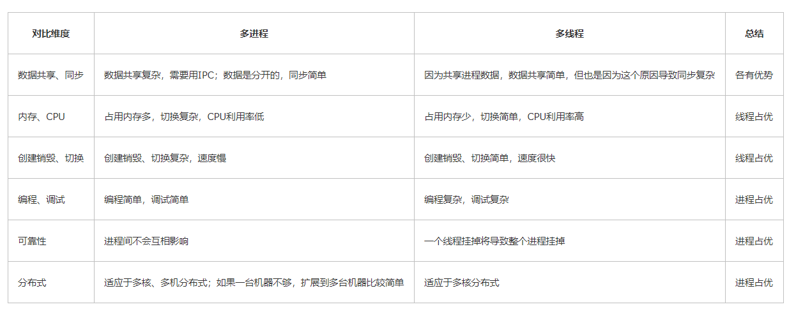
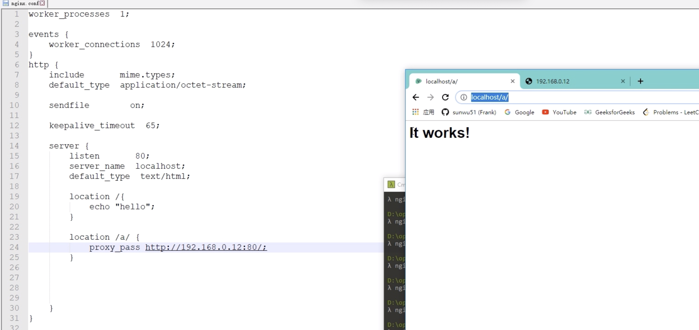
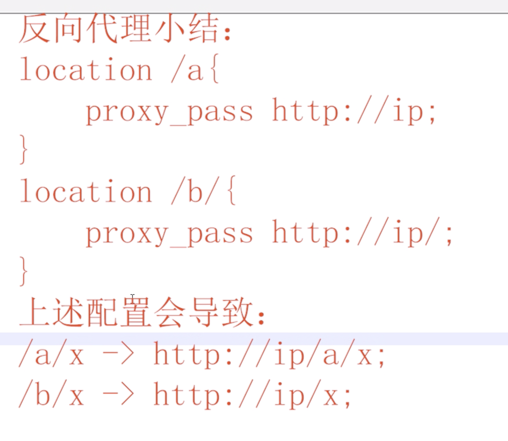
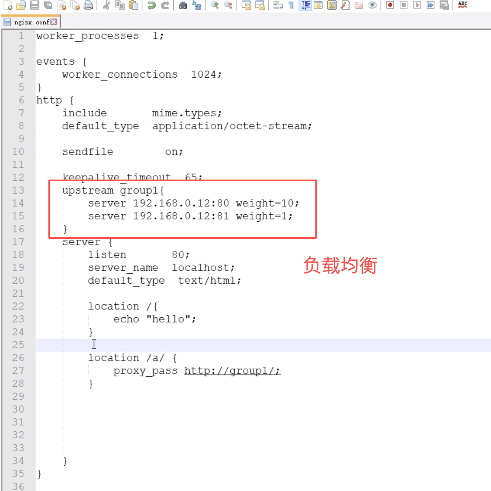
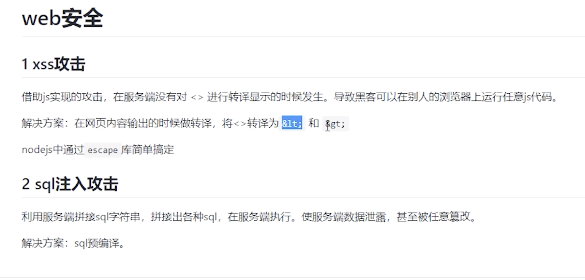

- 线程数设置和CPU数的关系?
    - 如果是CPU密集型应用，则线程池大小设置为N+1

    - 如果是IO密集型应用，则线程池大小设置为2N+1（因为io读数据或者缓存的时候，线程等待，此时如果多开线程，能有效提高cpu利用率）

    - 线程等待时间所占比例越高，需要越多线程。线程CPU时间所占比例越高，需要越少线程。

- 协程可以利用多核吗？
    - 1.协程的切换开销更小，属于程序级别的切换，操作系统完全感知不到，因而更加轻量级 　
    - 2.单线程内就可以实现并发的效果，最大限度地利用cpu
　  
    - 1.协程的本质是单线程下，无法利用多核，可以是一个程序开启多个进程，每个进程内开启多个线程，每个线程内开启协程
　　
- 为什么内存比磁盘块？
    - 存储原理完全不同，内存（随机存储器）依靠电脉冲 配合CPU的直接寻址寄存器 机械硬盘需要机械指针寻找需要的盘面和扇区

- 计算密集型？
    - 计算密集型任务的特点是要进行大量的计算，消耗CPU资源，比如计算圆周率、对视频进行高清解码等等，全靠CPU的运算能力。这种计算密集型任务虽然也可以用多任务完成，但是任务越多，花在任务切换的时间就越多，CPU执行任务的效率就越低，所以，要最高效地利用CPU，计算密集型任务同时进行的数量应当等于CPU的核心数。

- io密集型？
    - IO密集型，涉及到网络、磁盘IO的任务都是IO密集型任务，这类任务的特点是CPU消耗很少，任务的大部分时间都在等待IO操作完成（因为IO的速度远远低于CPU和内存的速度）。对于IO密集型任务，任务越多，CPU效率越高，但也有一个限度。常见的大部分任务都是IO密集型任务，比如Web应用。

- 多进程和多线程的应用场景?
- 
    - 1）需要频繁创建销毁的优先用线程
    - 2）需要进行大量计算的优先使用线程
        - 大量计算，当然就是要耗费很多CPU，切换频繁了，这种情况下线程是最合适的。
    - 3）强相关用线程，弱相关用进程
    - 4) 不同任务间需要大量共享数据或频繁通信时用线程
- CPU密集型任务适合多进程还是多线程？
    - 线程

- 为什么1G文件传输比1000个1M文件传输的块？
    - ===============如果“传输”指网络传输===============无论采用FTP协议、HTTP协议或是软件自定义协议传输文件,都是基于TCP,TCP协议可以用一条……咳咳,两条水管来比喻,其中一条水管一面只管灌水,一面接收水。水的流量可以很大,但水在管里流动有一定的速度,所以水从一边传到另一边有时间差。而传送大量小文件时的情况就比较复杂,要看传输文件的协议是怎么规定的,对于常见的FTP和HTTP传送大量文件时都很低效,这就像用水管每次只传一杯水,接水的一方确认收到后,再给出指令传送下一杯水,刚才说了水传输是有延时的,于是大部分时间都浪费在这种延时上,水管的流量没被充分利用。要解决这样的问题很简单,将大量文件打包成一个文件一起发送,这也是下载服务常规做法,你下载的软件安装包都是一个文件,双击运行后才解包成多个文件。===============如果“传输”指一台机内拷贝、读写文件==============机械硬盘对盘面一段连续区间的读写速度非常高,但如果在一个地方读写完后又换去别的地方读写就会造成寻道:磁头移动到下一个读写位置。系统读写单个文件一般都可以连续读写,而访问大量文件就需要频繁寻道,因为不同文件在硬盘上一般不会放在一起的。单次寻道的时间很短,大约是10毫秒级别,人一般不会察觉,但如果太频繁了就非常明显。例如一个1G大小的文件,现代硬盘可以在20秒内完成访问,但如果将1G分成10万个10k的文件,那就造成至少10万次寻道,每次寻道10毫秒,那就消耗了1000秒时间来寻道。实际应用中还复杂得多,寻道次数可能是2倍以上。即使固态硬盘没有寻道过程,对大量文件的访问仍然有一定的性能影响。例如对1G的文件读入内存,只需要简单一组CPU指令就可以让硬盘连续工作并把数据直接写入内存,而如果访问大量文件,操作系统发送一条传送指令后等待硬盘完成,再根据结果又执行下一条指令,大部分时间都浪费在指令延时上。如果用网络传输的文件非常多,或者网络的速度非常快,寻道延时造成的影响也会很显著。
    
- 介绍下操作系统内存管理
    - 操作系统内存管理几个方面
        - 内存的创建与回收
        - 逻辑地址寻址到物理地址
        - 扩充物理内存
        - 每个进程有独立的地址空间
    
    - 一般都用虚拟内存来进行操作系统内存管理
        - 虚拟内存是会给每个进程分配独立内存空间，当然实际上是离散的，有些在物理内存中，有些在磁盘中，有些甚至还没有分配。
        - 当程序逻辑地址去找物理地址的时候，会去页表中去找，页表里有三种状态存在，已分配物理内存，不在物理内存中（在磁盘中），还未分配。
        - 如果逻辑地址对应的状态是已分配物理内存，就可以直接寻址到那块物理地址。如果在磁盘上，则需要触发缺页中断，将物理内存中的一些页删掉，
        将磁盘上的内容加载进内存中。

- ping协议是什么？ icmp属于哪一层的协议？
    - Linux ping命令用于检测主机。
    - 执行ping指令会使用ICMP传输协议，发出要求回应的信息，若远端主机的网络功能没有问题，就会回应该信息，因而得知该主机运作正常。
    
    - icmp是网络层协议
    - ping本身在应用层，使用icmp协议，和传输层没有关系。
    
- 内存分配算法？
    - 最佳适应算法（Best Fit)：从全部空闲区中找出能满足作业要求的、且大小最小的空闲分区，这种方法能使碎片尽量小。

- id是auto_increment的，多个事务同时插入数据，为什么能保证id不被重复分配呢？
    主键索引创建的时候已经是唯一性索引了
    

- TCP，UDP能否使用同一个端口？
    - 由于TCP/IP传输层的两个协议TCP和UDP是完全独立的两个软件模块，因此各自的端口号也相互独立，如TCP有一个255号端口，UDP也可以有一个255号端口，二者并不冲突。 

- 单机限流，分布式限流？？？

- synchronized和lock（ReentrantLock）区别，lock的过程，在没获取到锁的时候是什么状态？？
    - lock的时候，如果锁被占用则一直等待

- https://www.nowcoder.com/discuss/483320 秒杀问题记录

- rand5生成rand7
    - num=5*（rand5-1）+rand5-1

    if(num<21)
    
    print num%7+1;
    
    其中5*（rand5-1）生成等概率的数0,5,10,15,20，而后面的rand5-1生成等概率的0,1,2,3,4
    
    这样两个数相加，就可以得到等概率的0-24.
    
    这个时候取0-20就可以等概率的区分，rand7的每个数字在这其中出现了3次，概率相等。

- https://www.cnblogs.com/cangqinglang/p/13201388.html 很全的输入url后怎么到服务端的

- websocket
    - 其实就是主动推送啦  比如有个主播开播了，就可以用websocket主动推送给订阅的客户呀。
    它也是一种协议
    http中请记住 Request = Response ， 在HTTP中永远是这样，也就是说一个request只能有一个response。而且这个response也是被动的，不能主动发起。
    而websocket是可以主动去发起消息的。
    ajax轮询 的原理非常简单，让浏览器隔个几秒就发送一次请求，询问服务器是否有新信息。
    long poll 其实原理跟 ajax轮询 差不多，都是采用轮询的方式，不过采取的是阻塞模型（一直打电话，没收到就不挂电话），也就是说，客户端发起连接后，如果没消息，就一直不返回Response给客户端。直到有消息才返回，返回完之后，客户端再次建立连接，周而复始。
    
    - http long poll，或者ajax轮询不都可以实现实时信息传递么。
    ajax轮询 需要服务器有很快的处理速度和资源。（速度）
    long poll 需要有很高的并发，也就是说同时接待客户的能力。（场地大小）
    Websocket只需要一次HTTP握手，所以说整个通讯过程是建立在一次连接/状态中，也就避免了HTTP的非状态性，服务端会一直知道你的信息，直到你关闭请求，这样就解决了接线员要反复解析HTTP协议，还要查看identity info的信息。
    同时由客户主动询问，转换为服务器（推送）有信息的时候就发送（当然客户端还是等主动发送信息过来的。。），没有信息的时候就交给接线员（Nginx），不需要占用本身速度就慢的客服（Handler）了
    https://www.zhihu.com/question/20215561
    
- nginx
    - 
    
    - 
    
    - 
    
- xss攻击和sql攻击

    - 
    
- 为什么线程切换会导致用户态和内核态的切换？
    - 因为线程的调度是在内核态运行的，而线程中的代码是在用户态运行
    
- Redis的过期时间怎么实现的?
    - 在redis的数据库中，redisDb结构中的expires字典中保存了数据库中所有键的过期时间，所以叫过期字典。
    - 过期字典的key是一个指针，指向键空间的某个键对象（就是数据库键）
    - 过期字典的value是一个long类型的整数，这个整数保存了键所指向的数据库键的过期时间，一个毫秒精度的UNIX时间戳
    - 判断key是否存在于过期字典中
    - 通过过期字典拿到key的过期时间，判断当前UNIX时间戳是否大于key时间
    
- Cache和Buffer的区别
    - Cache：缓存区，是高速缓存，是位于CPU和主内存之间的容量较小但速度很快的存储器，因为CPU的速度远远高于主内存的速度，CPU从内存中读取数据需等待很长的时间，而  Cache保存着CPU刚用过的数据或循环使用的部分数据，这时从Cache中读取数据会更快，减少了CPU等待的时间，提高了系统的性能。
    - Cache并不是缓存文件的，而是缓存块的(块是I/O读写最小的单元)；Cache一般会用在I/O请求上，如果多个进程要访问某个文件，可以把此文件读入Cache中，这样下一个进程获取CPU控制权并访问此文件直接从Cache读取，提高系统性能。
    - Buffer：缓冲区，用于存储速度不同步的设备或优先级不同的设备之间传输数据；通过buffer可以减少进程间通信需要等待的时间，当存储速度快的设备与存储速度慢的设备进行通信时，存储慢的数据先把数据存放到buffer，达到一定程度存储快的设备再读取buffer的数据，在此期间存储快的设备CPU可以干其他的事情。
    - Buffer：一般是用在写入磁盘的，例如：某个进程要求多个字段被读入，当所有要求的字段被读入之前已经读入的字段会先放到buffer中。

- 死锁会导致cpu占用高吗？
    - 一般死锁 不会，只是阻塞在那，并不占用cpu
 
- 什么情况会导致cpu占用过高？
    - 除了计算密集型之外，while死循环
    
- String a = new String("abc")到得产生了几个对象  
    - https://blog.csdn.net/Mypromise_TFS/article/details/81504137
    - 1个或者俩个，如果常量池中没有，则在常量池中创建一个此对象，然后堆中再创建一个这个对象。
    
- mysql查询是怎么执行的？
    - https://mp.weixin.qq.com/s?__biz=Mzg2OTA0Njk0OA==&mid=2247485097&idx=1&sn=84c89da477b1338bdf3e9fcd65514ac1&chksm=cea24962f9d5c074d8d3ff1ab04ee8f0d6486e3d015cfd783503685986485c11738ccb542ba7&token=79317275&lang=zh_CN%23rd
    
    - SQL 等执行过程分为两类，一类对于查询等过程如下：权限校验---》查询缓存---》分析器---》优化器---》权限校验---》执行器---》引擎
    - 对于更新等语句执行流程如下：分析器----》权限校验----》执行器---》引擎---redo log prepare---》binlog---》redo log commit
    
- 数据库连接池
    - 不使用连接池，每次执行一次sql都需要 tcp三次握手，mysql认证的三次握手，执行sql，mysql的关闭，tcp四次挥手。
    使用连接池，第一次访问需要创建连接，但之后的访问，都是复用之前的连接。
    
- ping是TCP还是UDP
    - ping应该是属于osi七层模型中的应用层。
ping命令使用的tcp报文还是udp报文呢？
        - 答：ping命令使用的是ICMP报文，ICMP报文封装在ip包里。ICMP协议也是tcp/ip协议族中的一个子协议，所以从这一层来看，icmp报文和tcp报文，udp报文是同一个级别。所以ping命令使用的报文既不是tcp报文也不是udp报文。
    - 但是ICMP 跟TCP和UDP没有归属关系，ICMP位于传输层之下，属网络层。用的IP报头。
        - TCP/UDP 在第四层：传输层
        - IP/ICMP 在第三层：网络层

- 接受数据包的流程？
    - 网卡收到数据包。
    - 将数据包从网卡硬件缓存转移到服务器内存中。
    - 通知内核处理。
    - 经过TCP/IP协议逐层处理。
    - 应用程序通过read()从socket buffer读取数据。
    
- 怎么压缩数字？比如一个整型int值 占四个字节 ，怎么进行压缩变成少于四个字节。
    - zigzag https://blog.csdn.net/zgwangbo/article/details/51590186

- 不同进程可不可以使用同一个端口？
    - 不可以，比如我们socket编程的时候，起俩进程bind一个端口就说端口已占用。

    - ps：如果进程先绑定一个端口号，然后在fork一个子进程，这样的话就可以是实现多个进程绑定一个端口号，但是两个不同的进程绑定同一个端口号是不可以的
    
- tcp udp可以bind同一个端口吗？
    - 可以
    - 由于TCP/IP传输层的两个协议TCP和UDP是完全独立的两个软件模块，因此各自的端口号也相互独立，如TCP有一个255号端口，UDP也可以有一个255号端口
    - https://www.jianshu.com/p/df9e55e94f95
    
- socket, 端口，进程的关系？
    - https://www.jianshu.com/p/ed39c81d081b
    
    - 一个socket就是一个连接，tcp或者udp
    - 每个socket连接，都是需要指定端口的 4元组 唯一标识了一个连接
    - 一个进程可以有多个socket
    - netstat -aon|findstr 80 找到占用80端口的连接
    - tasklist|findstr 16176 找到 pid为16176的进程

- 内核是如何将数据包转发至 socket 的呢？
    - 网络数据首先到达网卡，然后进入内核，由网络协议栈去处理，那么内核是如何进行数据分发的呢？它怎么知道该如何把数据交给特定的用户进程呢？
    这时，就需要 socket 发挥作用了！
    socket 中存储了特定的四元组： 源ip+port，目的ip+port；
        - 1> bind 到特定 ip 和 port 的socket 对应 [src ip, src port) <=> (*, *)] ；
        - 2> connect 到特定目的ip+port 的 socket 对应 [src ip, src port) <=> (dst ip,  dst port)]；
        - 3> accept 返回了的 socket 对应  [src ip, src port) <=> (dst ip,  dst port)]；
    - 那么内核根据数据包的四元组信息，就可以锁定特定的socket了。并可，系统中所有 socket 中的四元组信息，必定唯一，不可能重复！
    - socket 的本质是一种资源，它包含了端到端的四元组信息，用来标识数据包的归属。因此，尽管 tcp 协议的端口号只有 65535 个，但是进程可拥有的 socket 数据却不限于此（受限于进程最大文件描述符数据）；

- 进程，socket的一些linux命令
    - https://www.cnblogs.com/allenblogs/archive/2011/05/19/2051117.html
    
- 影响一个http连接数的最大因素是什么？
    - 文件句柄 socket连接数
- 一台服务器如何辨认一个请求是谁发送的？
    - cookie session
    
- 写个SQL，统计全中国重名最多的十个名字？

- wait notify原理

- 僵尸进程与孤儿进程
    - 即子进程先于父进程退出后，子进程的PCB需要其父进程释放，但是父进程并没有释放子进程的PCB，这样的子进程就称为僵尸进程，僵尸进程实际上是一个已经死掉的进程。
    - 一个父进程退出，而它的一个或多个子进程还在运行，那么那些子进程将成为孤儿进程。孤儿进程将被init进程(进程号为1)所收养，并由init进程对它们完成状态收集工作。
    
- 内核态切换到用户态
    - 内核态程序执行完毕时如果要从内核态返回用户态，可以通过执行指令iret来完成，指令iret会将先前压栈的进入内核态前的cs,eip,eflags,ss,esp信息从栈里弹出，加载到各个对应的寄存器中，重新开始执行用户态的程序，这个过程不再详述。

- epoll为什么用红黑树？
    - 对搜索效率要求高，并且频繁的插入删除，红黑树就很好。
    - 为什么不用哈希，数量一大，哈希冲突
    
- 两个进程打开同一个文件，一个进程会一行一行的读，另一个进程将文件truncate或者清空，那么第一个进程能否感知到？
    - 互不影响的，两个进程有不同的文件表，每个进程有自己文件的当前位置。
    
- 程序在cpu中的执行过程？
    - https://blog.csdn.net/hunter___/article/details/82906540
    - 程序编译好后，存于某个地方（外存），
    当程序被要求运行时，做的事情如下：
   
        - 1.把可执行程序相关数据代码等加载到内存的相应段？
    
        - 2.等待cpu调度到此程序，也即是获取cpu的使用权
    
        - 3.运行balabala...
        
- cpu L1， L2， L3缓存
    - https://blog.csdn.net/myxmu/article/details/17021975

- 内存碎片如何解决？
    - 分页分段来解决内存碎片
    
    - https://blog.csdn.net/csdn_kou/article/details/82891141
    - 内存碎片通常分为内部碎片和外部碎片：
        - 1.内部碎片是由于采用固定大小的内存分区，当一个进程不能完全使用分给它的固定内存区域时就产生了内部碎片，通常内部碎片难以完全避免；
        - 2.外部碎片是由于某些未分配的连续内存区域太小，以至于不能满足任意进程的内存分配请求，从而不能被进程利用的内存区域。
        
        - 现在普遍采用的段页式内存分配方式就是将进程的内存区域分为不同的段，然后将每一段由多个固定大小的页组成。通过页表机制，使段内的页可以不必连续处于同一内存区域，从而减少了外部碎片，然而同一页内仍然可能存在少量的内部碎片，只是一页的内存空间本就较小，从而使可能存在的内部碎片也较少。

- 为什么程序不读入内存就无法运行？
    - 因为负责解析和运行程序内容的cpu是通过程序计数器来指定内存地址从而读出程序指令的。
    
- 为什么cpu切换线程会耗费资源
    - 第一：
        - 因为CPU运行状态分为用户态和内核态。
        - 线程切换状态会使CPU运行状态从用户态转换到内核态。
    - 第二：
        - 每个线程在运行时的指令是被放在CPU的寄存器中的，如果切换内存状态，需要先把本线程的代码和变量写入内存。这样经常切换会耗费时间。